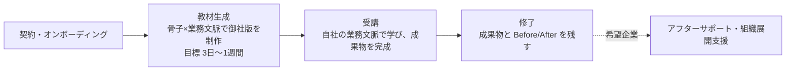

<!-- {{TOPIC}}: Claude Code（業務活用・toB 研修） -->

# Claude Code 業務活用カリキュラム（コンセプト）

> AI の進化に焦りを感じているビジネスパーソンが、Claude Code を使って自らの業務課題を「思考 → 仕様化 → 実行 → 仕組み化」の型で委任できるようになり、PC・ブラウザで行うあらゆる業務アウトプットを最短時間・最高品質で出せるようになる toB 研修カリキュラム。

この CLAUDE.md と OUTLINE.md が、事業全体の方向性の正となる。誰に（WHO）、なぜ（WHY）、なぜ私たちか（WHY US）、何を（WHAT）、どうやって（HOW）の問いで事業を定義する。

## ターゲット（WHO）

**受講者（主対象）**: AI の進化に焦りを感じ、会社または自分の生産性に課題を感じている非エンジニアのビジネスパーソン。

- 焦りの根には、AI に取り残される不安と、自分の職がなくなるかもしれないという不安がある
- Claude Code や Codex のすごさは見聞きしているが、活用方法も対象業務も分かっていない
- チャット AI（ChatGPT 等）は触った経験があるが、業務の成果物を出す道具にはできていない
- 入口は「話題の AI を学べば業務に何となく活用できそう」という期待。体系を学びたいのではなく、まず目先の業務を効率化してすごさを体感したい
- 自発的な受講だけでなく、会社に言われて受講する人も混ざる

**決裁者（買い手）**: 研修の投資判断をする経営者・人事。受講者とは別人格。

- 人手不足の中で生産性を上げる必要があり、AI 活用で取り残される焦りがある。根には、会社が競争に生き残れないかもしれないという不安がある
- 過去の研修・ツール導入が「使ってみた」で終わった経験から、投資が現場で使われ続けるか、削減時間などの数値で説明できるかを重視する
- 助成金の活用を前提に投資判断することが多い

### 職種別プロファイル

対象は **PC・ブラウザで完結する業務**（現場・製造ライン・物流実務・店頭接客などの非PC業務は対象外。同じ会社でも本社管理部門は対象）。職種は4グループで捉える。同一職種でも業界（SES・受託／士業事務所／不動産／製造（本社）／小売・EC／人材／広告・制作／医療・介護（事務）／SaaS・IT など）で痛みの濃淡が変わるため、教材と成果指標は業界文脈で具体化する。

| グループ | 職種 | 代表的な業務アウトプット |
|---|---|---|
| 経営・事業責任者 | 経営者／役員、事業部長、経営企画、事業開発、新規事業 | 意思決定資料、事業計画、投資判断資料、欲しい業務ツールの自作 |
| 顧客接点 | フィールド営業、インサイドセールス、営業企画／セールスオペ、カスタマーサクセス、カスタマーサポート | 提案書、商談・テレアポ準備、顧客分析、FAQ・回答文、オンボーディング資料 |
| 企画・分析 | マーケター（広告／コンテンツ）、広報・PR、商品企画、データアナリスト、リサーチャー、EC運営・販促 | 市場調査、記事・コンテンツ、データ分析レポート、プレスリリース、商品ページ |
| コーポレート | 人事（労務）、採用、経理・財務、法務・コンプラ、総務、情シス／社内SE | 規程・文書、求人票・スカウト文、月次集計・レポート、契約レビュー、社内ナレッジ、定型業務の自動化 |

情シス・社内SE は「コードを書く」前提を置かず、内製・AI 推進の旗振り役として含める（全社展開の鍵）。士業・専門職（会計・税理士・法律・社労士・不動産・医療事務）は職種ではなく業界軸として扱い、4グループに当てはめて題材を差し替える。職種別の成果指標は提供価値（WHAT）＞成果指標を参照。

### 前提知識

- **PC スキル**: 基本操作（タイピング・ファイル管理・ブラウザ）。ターミナルは未経験でよい
- **AI 経験**: チャット AI の利用経験（仕事で数回使った程度で可）
- **開発知識**: 不要。プログラミング経験・コードリーディングは前提としない

## 課題（WHY）

Claude Code の登場で、資料作成からアプリ開発までの実作業を AI に任せられるようになった。しかし、その任せ方を学べる場は整っていない。

- **既存の AI 研修は浅い**: 多くがプロンプト技法まで、扱ってもコンテキストまでで止まり、ハーネス（AI が確実に働ける環境の設計）に踏み込まない。AI にたたき台を出させるところまでで、リリースできる状態への仕上げや保守・運用は教えない。目先のテクニックに留まるため、研修直後は満足でも数ヶ月で使われなくなる（操作説明止まり・フォロー不在の定着失敗が業界に共通する）
- **既存の AI 研修は画一**: 全受講者共通のカリキュラムだけでは、「まず自分の業務を楽にしたい」というターゲットのオーダーに応えられず、「自分の業務では使えない」で終わる

## 差別化（WHY US）

国内に Claude Code を扱う研修は複数あるが、差別化の柱は次の 4 つ。課題（WHY）の「浅い」に①②が、「画一」に③④が答える。

1. **ハーネスまで扱う**: AI 活用技術の進化「プロンプト → コンテキスト → ハーネス」（2026年時点）の 3 階層を一気通貫で教え、他のどの AI 研修よりも質の高いカリキュラムを提供する。扱うのは目先のテクニックではなく、修了後も持続的に活用し続けられる知見
2. **たたき台で終わらせない**: AI が出すのは 7〜8 割のたたき台まで。そこからリリースできる状態に仕上げる力と、完成後の保守・運用まで回す力を教える
3. **完全オーダーメイド**: 全受講者共通の教材は作らない。受講企業ごとに、業務文脈を反映した教材を骨子から生成する
4. **完全アフターサポート**: 質問対応に留まらず、受講企業ごとに具体的な成果指標を定め、その達成までを支える

## 提供価値（WHAT）

導入する企業が得る価値（ベネフィット）と、それを数字で約束する成果指標で定義する。商品の機能は差別化（WHY US）とカリキュラム（HOW）で示すため、ここでは価値と約束に絞る。受講者個人が修了時にできることは カリキュラム（HOW）＞ 修了時にできること で扱う。

### ベネフィット

- **機能的ベネフィット**: 実利を3つの形で生む（いずれも成果指標で実測でき、投資対効果が数字で見える）。
    - 生産性: 同じ人員で成果の量とスピードが上がる
    - コスト: 外注していた記事・ツール・分析を社内で回せて委託費が下がる
    - 属人化の解消: やり方が仕組み（Skill・CLAUDE.md）として資産化し、退職・異動で止まらず新人も早く立ち上がる
- **情緒的ベネフィット**: AI への不安が手応えに変わる。
    - 焦りの解消: AI に乗り遅れるのではという焦りがなくなる
    - 手応え: 社員が現場で実際に使いこなし、成果が出ているのを確認できる

### 成果指標（ベネフィットを数字で約束する）

成果指標とは、決裁者ベネフィットを数字で言い換えたもの。アフターサポートは、この達成を約束する（差別化④）。受講企業ごとに、次の5分類から対象業務・期間・前提を切って定める（曖昧に約束すると伴走が青天井になるため、責任範囲としてスコープを限定する）。

| 分類 | 指標の例 | 測定単位 |
|---|---|---|
| 時間 | タスク所要時間 Before/After、リードタイム | 時間・分 |
| 量 | 月次産出数（提案書・記事）、処理件数（架電・問い合わせ） | 件・本／月 |
| 品質 | 手戻り回数、受注率、返信率、誤り率 | ％・回 |
| 金額 | 人件費換算の削減、外注費削減、一人あたり売上 | 円 |
| 能力・展開 | 内製ツールの稼働数、AI 活用者比率、再利用 Skill／CLAUDE.md 数 | 件・％ |

**測定**: 研修冒頭で基準タスクを1つ定め、Before を実測 → 修了時に After を実測する（自己申告とツールログで補完）。基準タスクの Before/After 実測は、そのまま最初の数社の事例（社会的証明）資産になる。

職種別の成果指標は、業務ごとの Before/After で具体化する（数値は型を示す例。実値は基準タスクの実測で各社ごとに確定する。職種は WHO 参照）。深掘りの進んだ自社の営業は業務単位で示し、それ以外の職種は代表業務の例を挙げる（深掘りは受注時に各社文脈で）。

**営業①: カウンセラー（スクール・インバウンド/カウンセリング型）**　ツール HubSpot。リーダーはメンバー育成も担う。現状は仮説で、本人ヒアリングで確定する。リードの個人情報を扱うため、AI に渡す範囲と HubSpot 連携の安全設計が前提（セキュリティ項目と整合）。

| 代表業務 | Before | After（Claude Code 委任） | 成果指標（例） |
|---|---|---|---|
| 予約後の事前準備（リード理解） | フォーム回答・属性を見て手で当たりをつける | 回答・履歴から人物像・想定不安・想定問答を要約した当たりシートを生成 | 準備時間／カウンセリング→申込率 |
| 想定問答の用意 | よくある不安・反論への返しを都度用意 | コース別・属性別の想定問答集を Skill 化し出力 | 準備時間／新人の立ち上がり |
| 記録・追客 | 会話メモを HubSpot に手入力、フォロー文を個別作成 | メモ → 構造化記録に整形、個別フォロー文のたたき台 | 記録・フォロー時間／追客カバー率 |
| メンバーへのフィードバック（リーダー業務） | 記録・録画を確認し手でまとめる | 記録・文字起こしを分析し構造化フィードバック案を生成 | 作成時間／カバー人数／メンバー成約率 |

**営業②: エージェント営業（フリーランス・アウトバウンド/テレアポ型）**　ツール スプレッドシート。最大の山は **リストアップ**。

| 代表業務 | Before | After（Claude Code 委任） | 成果指標（例） |
|---|---|---|---|
| 企業リストアップ（最重要） | 言語・技術で企業を手で探しスプシに1社ずつ | 条件を渡し Web 調査で候補を収集・拡充しスプシ形式で出力 | リストアップ ○社/h／件数/日 |
| リスト精査・優先度付け | 各社を個別に調べ当たりをつける | 攻めどころ（技術・採用シグナル）を要約し優先度付け | 精査時間／アポ獲得率 |
| 架電準備 | 企業ごとにトークを都度考える | 企業情報からフック・トークの当たりを生成 | 準備時間／架電数/日 |
| 記録・追客 | 結果をスプシに記録、再アプローチを手で | ログ整形、再アプローチ文のたたき台 | 記録時間／再アプローチ率 |

**マーケター（コンテンツ／SEO記事制作）**　自社 COACHTECH Lab の実運用（`estra-inc/lab-articles`）。Claude Code のサブエージェント3ロール（Planner／Generator／Evaluator）＋ MCP（Ahrefs・SerpAPI・BigQuery 等）＋ skills・hooks・rules でパイプライン化。差別化①「ハーネスまで扱う」と Claude Code 製の自己実証の実例。

| 代表業務 | Before | After（Claude Code 委任） | 成果指標（例） |
|---|---|---|---|
| 上流調査（KW採掘・競合・検索意図） | 手で KW を探し、上位記事を読んで要点化 | /harvest-keywords が Ahrefs で上位KWを抽出・スコアし台帳化、competitor-analyst（SerpAPI）が SERP・PAA・競合構成・ギャップ・独自論点を digest に集約 | 調査時間／候補KW数 |
| 設計（仕様・ペルソナ・構成） | 経験で構成を組む | spec-writer が主張・ペルソナ・CV 動線を spec.md（SSoT）に、outline-writer が構成を生成 | 設計時間 |
| 執筆（ドラフト→改稿） | ゼロから手作業で数日 | article-writer がブランド・文体・禁則ルールでドラフト→改稿、人は確認 | 1本 16h→6h／月間本数 |
| 多観点レビュー（品質ゲート） | 自分で見直す（属人・抜け） | SEO／LLMO／ファクト／CV の4サブエージェントが並列レビュー＋ skills・hooks で検証、review-log に記録 | 手戻り／公開後品質 |
| 効果測定 | 記事と CV の接続が曖昧 | BigQuery（GA4／Search Console）で計測 | 本体サイトへの問い合わせ・無料カウンセリング数 |

その他の職種（代表業務の例）:

| 職種 | 代表業務 | Before | After | 成果指標（例） |
|---|---|---|---|---|
| CS・サポート | FAQ・問い合わせ対応 | 過去対応を探して個別に返信文を作成 | ナレッジから回答案を自動生成、人は確認 | 1件 12分→4分 |
| 経理 | 月次の定型集計・レポート | 手作業で集計・整形（数時間） | 手順を Skill 化し定型実行 | 月次 6h→1.5h／自作ツール稼働 1件 |
| 採用 | 求人票・スカウト文作成 | テンプレを都度書き換え | 要件から複数案を生成、人は選定・調整 | 1件 60分→15分 |
| 経営企画 | 意思決定資料・市場調査 | 資料を集めて手で要約・作図 | 調査と要約を委任、人は論点判断 | 1本 8h→3h |
| 管理（SES 等） | 日程調整・メール対応 | 個別にカレンダーを確認して候補出し | カレンダー MCP 連携で候補3つを自動提示 | 1件 10分→2分 |

骨子では、痛みの大きさ・頻度、数字化のしやすさ、決裁者への近さから優先職種（営業／マーケ・コンテンツ／経理・人事の定型／経営企画／CS・サポート）を先に深掘りし、残りは枠を置いて受注時に各社文脈で埋める。

## カリキュラム（HOW）

カリキュラムを、サービス設計（商品・体験）とコンテンツ設計（教材の中身）の 2 層で定義する。

### サービス設計

本カリキュラムは AI 研修事業のメインサービス。教材単体ではなく、受講体験の全体を設計する。教材は受講企業ごとの完全オーダーメイドとする。

#### 商品構成

- **オーダーメイド教材**: 受講企業ごとに、骨子（スキル体系・学習順序・題材ライブラリ）と受講企業の業務文脈から完全オーダーメイドで生成する。売り切り型
- **アフターサポート**: 受講企業ごとに定めた成果指標の達成までを支える（質問対応・月次レビュー等）。デフォルトで付帯する

#### 体験フロー



### コンテンツ設計

コンテンツは受講企業ごとの完全オーダーメイドとし、その生成元になる骨子（スキル体系・学習順序・題材ライブラリ）をここで定義する。骨子の詳細設計は `OUTLINE.md` が担う。

**階層構造**: 3層（Part > Chapter > Section）。

#### 修了時にできること

「AI にうまく聞く」から「AI に仕事を任せ、検証する」への転換を、次の 4 つの行動で定義する。

1. **思考**: 業務の課題を、論点・構造・事実と解釈の規律で見極め、Claude Code で解ける形に翻訳できる
2. **仕様化**: 完成条件を AI との壁打ちで仕様に固め、検証可能な単位に分割できる
3. **実行**: Claude Code で業務アウトプットを作り、出力を検証し、Git/GitHub で成果物を管理できる
4. **仕組み化**: プロンプト・コンテキスト・ハーネスを設計し、一度やった仕事を再現可能な仕組みとしてチームに展開できる

#### スキル体系（学ぶこと）

5つのジャンルで定義する。ツール操作とプロンプト技法で止まらず、思考から仕組み化までを一気通貫で扱う。

| ジャンル | 中分類（学ぶこと） |
|---|---|
| ビジネス思考 | 思考法（論点・仮説・構造化・事実と解釈）／ロジカルライティング／心構え |
| 業務の仕様化 | 業務理解・可視化／要求整理・課題設定／完成条件と計画／SDD（仕様駆動開発） |
| IT・Web の基礎知識 | IT・AI の常識（セキュリティ含む）／Web アプリケーションの基礎（構成・データの持ち方・認証と権限・API 連携・公開と運用）／LLM の得意・不得意 |
| Claude Code 実践 | 基本操作と安全な実行（セットアップ含む）／成果物管理（Git・GitHub）／検証と調査 |
| 仕組み化 | プロンプト／コンテキスト／ハーネス／品質・評価・コスト（ガバナンス含む） |

- 仕組み化の中分類は AI 活用技術の 3 階層（差別化を参照）に対応する。ハーネスには Skills・hooks・MCP・サブエージェント・並列運用などの Claude Code 拡張機能群を含む
- SDD は、開発で生まれた方法論を業務全般の委任に使える形に汎化して教える
- Web アプリケーションの基礎は、社内ツールの自作・運用に必要な主要概念を一通り扱う（コードを書く・読むことは前提としない）

#### 学習順序と研修総量

- 学習順序（Part 構成）はスキル体系とは別軸とし、学習効果が最大になる配置を骨子として OUTLINE.md で設計する
- 骨子の冒頭には、セットアップと最初の成功体験（すごさと、思い通りにならない壁の両方）を置く入門 Part を想定する
- 思わず次を試したくなる面白さを、学習体験の設計原則とする。夢中で使えていることが、使いこなしと定着を支える
- 研修総量は、最短の時間で最高の満足度に到達することを方針とする。下限は助成金要件の 10 時間、上限の目安は 100 時間（超えると満足度が下がるとみる）。ゴールから逆算し、執筆を通じて確定する

#### 技術スタック

- **Claude Code**: 最新版。Windows・Mac 両対応（手順は両 OS を併記し、初出で示して以降は差分のみ）
- **Claude 契約**: 個人プラン Pro 以上でよい。教材本文は契約形態に依存しない書き方とし、セットアップ章でのみ分岐する
- **Git / GitHub**: 成果物のバージョン管理・レビュー・公開。非エンジニアにも必修
- **補助ツール**: Claude.ai（ブラウザ/アプリ。Claude Code との使い分けを解説）、Codex 等の他エージェント（比較・視野出しに留める）

CLAUDE.md は事業の哲学を、`OUTLINE.md` はカリキュラムの具体的な設計を定義する。執筆上の判断（題材の選択・構成のアレンジ・外部調査）は OUTLINE.md の設計に従いつつ、臨機応変に行う。

## 制作と運用（MAP）

執筆ルールは `.claude/rules/writing.md` を参照。

### 教材の形式と制作

- 各セクションは文章・画像・動画で構成する。動画は Remotion によるプログラム生成
- 教材と動画は Claude Code のパイプラインで制作し、その事実を「教える働き方の実証」として訴求に使う
- 受講は新規構築する LMS 上で行う。教材リポジトリが正、LMS は配信面

### 参考資料

- **技術面の正**: Anthropic 公式ドキュメント（https://code.claude.com/docs/ ）。機能・手順・ベストプラクティスは必ず公式で裏取りする
- **ビジネス・思考系の資産**: `docs/` の学習項目体系。思考法・要求整理・IT/Web 基礎・心構え等の学習項目定義を参照元として再利用する（本カリキュラムへの対応表は `docs/TRIAGE.md`）
- **概念の参照**: プロンプト → コンテキスト → ハーネスの進化整理（ハーネスエンジニアリング関連の公開記事）、SDD（仕様駆動開発）の方法論

### Skills

| Skill | 用途 |
|---|---|
| `/setup` | 初期設定（CLAUDE.md・OUTLINE.md・writing.md の作成） |
| `/write` | 執筆（任意の階層単位） |
| `/review` | レビュー（品質・整合性チェック） |
| `/check-updates` | 公式ドキュメントとの鮮度チェック |
| `/illustrate` | Gemini による教材概念図の生成・挿入 |
| `/animate` | Remotion による Section 解説動画の生成・挿入 |
| `/github-pages` | MkDocs Material + GitHub Actions で教材を GitHub Pages に公開 |

各 Skill は対象案件を第1引数 `<client>` で指定し、`clients/<client>/` 配下を対象に動作する（パスは「フォルダ構造・命名規則」の `<client>` 規約に従う）。`/setup` は引数なしで骨子・事業設計、`<client>` 指定で案件への特化生成。

### フォルダ構造・命名規則

```
project-root/                # 事業モノレポ
├── CLAUDE.md                # 事業の哲学（WHO/WHY/WHY US/WHAT/HOW/MAP）
├── OUTLINE.md               # 骨子（マスターカリキュラム）
├── library/                 # 題材ライブラリ（職種×業界の題材・再利用 Skill/CLAUDE.md 断片・事例）＝生成の INPUT
├── .claude/
│   ├── rules/writing.md     # 執筆ルール（全案件共通）
│   ├── skills/              # Skill 定義（全案件共通）
│   └── settings.json
├── clients/                 # 受講企業ごとの教材インスタンス
│   └── <client>/            # 1社1ディレクトリ（/setup <client> が生成）
│       ├── CLAUDE.md        #   その案件の哲学（骨子×業務文脈で特化）
│       ├── OUTLINE.md       #   その案件のカリキュラム設計（骨子から特化）
│       ├── curriculums/     #   教材本体
│       └── assets/          #   画像
└── docs/                    # 設計・検討資料（事業・骨子の検討用）
```

ルート直下に置くドキュメントは、正となる `CLAUDE.md`（事業哲学）と `OUTLINE.md`（骨子）の2つのみ。題材ライブラリは `library/`、検討資料は `docs/` に置く。受講企業ごとの教材は `clients/<client>/` 配下に独立して持つ。

**案件スコープ（`<client>`）の規約**: 各 Skill は第1引数に案件スラッグ `<client>`（`clients/` 配下のディレクトリ名。英小文字・ハイフンの短い識別子。例 `own-sales`, `acme`）を取る。`<client>` 指定時、教材インスタンスの正は `clients/<client>/{CLAUDE.md, OUTLINE.md, curriculums/, assets/}`。root の `CLAUDE.md`（事業哲学）・`OUTLINE.md`（骨子）・`library/`（題材）は全案件共通の参照として併読し、`.claude/rules/writing.md` も全案件共通。`<client>` 省略時は骨子・事業レベルの作業（`/setup`＝骨子・事業設計、`/check-updates`＝全案件横断）。

**3層**（Part > Chapter > Section）:
- `clients/<client>/curriculums/part-XX_タイトル/chapter-XX_タイトル/X-X-X_タイトル.md`

**命名規則**:
- ディレクトリ名はゼロパディング（01始まり）
- ファイル名のセクション番号はゼロパディングなし
- ディレクトリ・ファイル名のタイトル部分は OUTLINE.md の見出しをそのまま使用する（日英混在可。スペースはハイフンに置換）
- 画像は内容がわかる英語名
