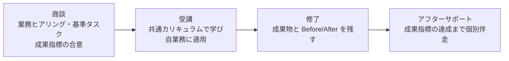

# AI研修カリキュラム（コンセプト）

> 株式会社estra が企業向けに提供する AI研修（社内人材の育成にも用いる）。非エンジニアが Claude Code を使い、自らの業務を AI に委任して実務の成果物を仕上げ、その進め方を再現可能にすることを目指す。

この文書は AI研修カリキュラムの定義（誰に・なぜ・何を・どう学ぶか）であり、その正となる。`OUTLINE.md` が共通カリキュラム（全受講者共通の一本）の具体的な設計を担う。このカリキュラムを、誰に（WHO）、なぜ（WHY）、なぜ私たちか（WHY US）、何を（WHAT）、どうやって（HOW）の問いで定義する。

## ターゲット（WHO）

本研修は企業向け（toB）を主な対象とし、あわせて自社（株式会社estra）の社内人材育成にも用いる。自社は最初の受講企業であり、外部展開のドッグフーディングを兼ねる。

**受講者（主対象）**: AI の進化に焦りを感じ、会社または自分の生産性に課題を感じている非エンジニアのビジネスパーソン。

- 焦りの根には、AI に取り残される不安と、自分の職がなくなるかもしれないという不安がある
- Claude Code や Codex のすごさは見聞きしているが、活用方法も対象業務も分かっていない
- チャット AI（ChatGPT 等）は触った経験があるが、業務の成果物を出す道具にはできていない
- 入口は「話題の AI を学べば業務に何となく活用できそう」という期待。体系を学びたいのではなく、まず目先の業務を効率化してすごさを体感したい
- 自発的な受講だけでなく、会社に言われて受講する人も混ざる

**決裁者（買い手）**: 研修の投資判断をする経営者・人事。受講者とは別人格。

- 人手不足の中で生産性を上げる必要があり、AI 活用で取り残される焦りがある。根には、会社が競争に生き残れないかもしれないという不安がある
- 過去の研修・ツール導入が「使ってみた」で終わった経験から、投資が現場で使われ続けるか、削減時間などの数値で説明できるかを重視する
- 助成金の活用を前提に投資判断することが多い

### 職種別プロファイル

対象は **PC・ブラウザで完結する業務**（現場・製造ライン・物流実務・店頭接客などの非PC業務は対象外。同じ会社でも本社管理部門は対象）。職種は4グループで捉える。同一職種でも業界（SES・受託／士業事務所／不動産／製造（本社）／小売・EC／人材／広告・制作／医療・介護（事務）／SaaS・IT など）で痛みの濃淡が変わるため、教材と成果指標は業界文脈で具体化する。

| グループ | 職種 | 代表的な業務アウトプット |
|---|---|---|
| 経営・事業責任者 | 経営者／役員、事業部長、経営企画、事業開発、新規事業 | 意思決定資料、事業計画、投資判断資料、欲しい業務ツールの自作 |
| 顧客接点 | フィールド営業、インサイドセールス、営業企画／セールスオペ、カスタマーサクセス、カスタマーサポート | 提案書、商談・テレアポ準備、顧客分析、FAQ・回答文、オンボーディング資料 |
| 企画・分析 | マーケター（広告／コンテンツ）、広報・PR、商品企画、データアナリスト、リサーチャー、EC運営・販促 | 市場調査、記事・コンテンツ、データ分析レポート、プレスリリース、商品ページ |
| コーポレート | 人事（労務）、採用、経理・財務、法務・コンプラ、総務、情シス／社内SE | 規程・文書、求人票・スカウト文、月次集計・レポート、契約レビュー、社内ナレッジ、定型業務の自動化 |

情シス・社内SE は「コードを書く」前提を置かず、内製・AI 推進の旗振り役として含める（全社展開の鍵）。士業・専門職（会計・税理士・法律・社労士・不動産・医療事務）は職種ではなく業界軸として扱い、4グループに当てはめて題材を差し替える。職種別の成果指標は提供価値（WHAT）＞成果指標を参照。

### 前提知識

- **PC スキル**: 基本操作（タイピング・ファイル管理・ブラウザ）。ターミナルは未経験でよい
- **AI 経験**: チャット AI の利用経験（仕事で数回使った程度で可）
- **開発**: Part6 で実際に Web アプリを作って公開（デプロイ）するところまで扱う。ただしコードを書く・読むことは前提にしない（AI に書かせ、出力を読み解ける程度でよい）。プログラミング経験は不要

## 課題（WHY）

Claude Code の登場で、資料作成からアプリ開発までの実作業を AI に任せられるようになった。しかし、その任せ方を学べる場は整っていない。

- **既存の AI 研修は浅い**: 多くがプロンプト技法まで、扱ってもコンテキストまでで止まり、ハーネス（AI が確実に働ける環境の設計）に踏み込まない。AI にたたき台を出させるところまでで、リリースできる状態への仕上げや保守・運用は教えない。目先のテクニックに留まるため、研修直後は満足でも数ヶ月で使われなくなる（操作説明止まり・フォロー不在の定着失敗が業界に共通する）
- **既存の AI 研修は受けっぱなし**: 研修後に各自の業務へ接続されず、成果が数値で語れるところまで伴走されない。「使ってみた」で終わり、現場の成果に結びつかない

## 差別化（WHY US）

国内に Claude Code を扱う研修は複数あるが、差別化の柱は次の 3 つ。課題（WHY）の「浅い」に①②が、「受けっぱなし」に③が答える。

1. **ハーネスまで扱う**: AI 活用技術の進化「プロンプト → コンテキスト → ハーネス」（2026年時点）の 3 階層を一気通貫で教え、他のどの AI 研修よりも質の高いカリキュラムを提供する。扱うのは目先のテクニックではなく、修了後も持続的に活用し続けられる知見
2. **たたき台で終わらせない**: AI が出すのは 7〜8 割のたたき台まで。そこからリリースできる状態に仕上げる力と、完成後の保守・運用まで回す力を教える
3. **完全アフターサポート**: 質問対応に留まらず、受講企業ごとに具体的な成果指標を定め、その達成までを支える。共通カリキュラムで土台を固め、各社固有の業務への適用と成果づくりは、このアフターサポートで個別に伴走する

また本研修は資料作成に留まらず、非エンジニアが Claude Code に委任して実際に動く Web アプリを作り・公開する（デプロイ）ところまでを扱う（カリキュラム HOW の Part6「アプリ開発実践」）。チャット AI やアプリ版 Claude／Cowork では到達できないこの体験が、Claude Code を学ぶ意味を具体的に示す。

## 提供価値（WHAT）

導入する企業が得る価値（ベネフィット）と、それを数字で約束する成果指標で定義する。商品の機能は差別化（WHY US）とカリキュラム（HOW）で示すため、ここでは価値と約束に絞る。受講者個人が修了時に身につける能力は カリキュラム（HOW）＞ 必要条件と学習項目 で扱う。

### ベネフィット

- **機能的ベネフィット**: 実利を3つの形で生む（いずれも成果指標で実測でき、投資対効果が数字で見える）。
    - 生産性: 同じ人員で成果の量とスピードが上がる
    - コスト: 外注していた記事・ツール・分析を社内で回せて委託費が下がる
    - 属人化の解消: やり方が仕組み（Skill・CLAUDE.md）として資産化し、退職・異動で止まらず新人も早く立ち上がる
- **情緒的ベネフィット**: AI への不安が手応えに変わる。
    - 焦りの解消: AI に乗り遅れるのではという焦りがなくなる
    - 手応え: 社員が現場で実際に使いこなし、成果が出ているのを確認できる

### 成果指標（ベネフィットを数字で約束する）

成果指標とは、決裁者ベネフィットを数字で言い換えたもの。アフターサポートは、この達成を約束する（差別化③）。受講企業ごとに、次の5分類から対象業務・期間・前提を切って定める（曖昧に約束すると伴走が青天井になるため、責任範囲としてスコープを限定する）。

| 分類 | 指標の例 | 測定単位 |
|---|---|---|
| 時間 | タスク所要時間 Before/After、リードタイム | 時間・分 |
| 量 | 月次産出数（提案書・記事）、処理件数（架電・問い合わせ） | 件・本／月 |
| 品質 | 手戻り回数、受注率、返信率、誤り率 | ％・回 |
| 金額 | 人件費換算の削減、外注費削減、一人あたり売上 | 円 |
| 能力・展開 | 内製ツールの稼働数、AI 活用者比率、再利用 Skill／CLAUDE.md 数 | 件・％ |

**測定**: 研修冒頭で基準タスクを1つ定め、Before を実測 → 修了時に After を実測する（自己申告とツールログで補完）。基準タスクの Before/After 実測は、そのまま最初の数社の事例（社会的証明）資産になる。

職種別の成果指標は、業務ごとの Before/After で具体化する（数値は型を示す例。実値は基準タスクの実測で各社ごとに確定する。職種は WHO 参照）。深掘りの進んだ自社の営業は業務単位で示し、それ以外の職種は代表業務の例を挙げる（深掘りは受注時に各社文脈で）。

**営業①: カウンセラー（スクール・インバウンド/カウンセリング型）**　ツール HubSpot。リーダーはメンバー育成も担う。現状は仮説で、本人ヒアリングで確定する。リードの個人情報を扱うため、AI に渡す範囲と HubSpot 連携の安全設計が前提（セキュリティ項目と整合）。

| 代表業務 | Before | After（Claude Code 委任） | 成果指標（例） |
|---|---|---|---|
| 予約後の事前準備（リード理解） | フォーム回答・属性を見て手で当たりをつける | 回答・履歴から人物像・想定不安・想定問答を要約した当たりシートを生成 | 準備時間／カウンセリング→申込率 |
| 想定問答の用意 | よくある不安・反論への返しを都度用意 | コース別・属性別の想定問答集を Skill 化し出力 | 準備時間／新人の立ち上がり |
| 記録・追客 | 会話メモを HubSpot に手入力、フォロー文を個別作成 | メモ → 構造化記録に整形、個別フォロー文のたたき台 | 記録・フォロー時間／追客カバー率 |
| メンバーへのフィードバック（リーダー業務） | 記録・録画を確認し手でまとめる | 記録・文字起こしを分析し構造化フィードバック案を生成 | 作成時間／カバー人数／メンバー成約率 |

**営業②: エージェント営業（フリーランス・アウトバウンド/テレアポ型）**　ツール スプレッドシート。最大の山は **リストアップ**。

| 代表業務 | Before | After（Claude Code 委任） | 成果指標（例） |
|---|---|---|---|
| 企業リストアップ（最重要） | 言語・技術で企業を手で探しスプシに1社ずつ | 条件を渡し Web 調査で候補を収集・拡充しスプシ形式で出力 | リストアップ ○社/h／件数/日 |
| リスト精査・優先度付け | 各社を個別に調べ当たりをつける | 攻めどころ（技術・採用シグナル）を要約し優先度付け | 精査時間／アポ獲得率 |
| 架電準備 | 企業ごとにトークを都度考える | 企業情報からフック・トークの当たりを生成 | 準備時間／架電数/日 |
| 記録・追客 | 結果をスプシに記録、再アプローチを手で | ログ整形、再アプローチ文のたたき台 | 記録時間／再アプローチ率 |

**マーケター（コンテンツ／SEO記事制作）**　自社 COACHTECH Lab の実運用（`estra-inc/lab-articles`）。Claude Code のサブエージェント3ロール（Planner／Generator／Evaluator）＋ MCP（Ahrefs・SerpAPI・BigQuery 等）＋ skills・hooks・rules でパイプライン化。差別化①「ハーネスまで扱う」と Claude Code 製の自己実証の実例。

| 代表業務 | Before | After（Claude Code 委任） | 成果指標（例） |
|---|---|---|---|
| 上流調査（KW採掘・競合・検索意図） | 手で KW を探し、上位記事を読んで要点化 | /harvest-keywords が Ahrefs で上位KWを抽出・スコアし台帳化、competitor-analyst（SerpAPI）が SERP・PAA・競合構成・ギャップ・独自論点を digest に集約 | 調査時間／候補KW数 |
| 設計（仕様・ペルソナ・構成） | 経験で構成を組む | spec-writer が主張・ペルソナ・CV 動線を spec.md（SSoT）に、outline-writer が構成を生成 | 設計時間 |
| 執筆（ドラフト→改稿） | ゼロから手作業で数日 | article-writer がブランド・文体・禁則ルールでドラフト→改稿、人は確認 | 1本 16h→6h／月間本数 |
| 多観点レビュー（品質ゲート） | 自分で見直す（属人・抜け） | SEO／LLMO／ファクト／CV の4サブエージェントが並列レビュー＋ skills・hooks で検証、review-log に記録 | 手戻り／公開後品質 |
| 効果測定 | 記事と CV の接続が曖昧 | BigQuery（GA4／Search Console）で計測 | 本体サイトへの問い合わせ・無料カウンセリング数 |

その他の職種（代表業務の例）:

| 職種 | 代表業務 | Before | After | 成果指標（例） |
|---|---|---|---|---|
| CS・サポート | FAQ・問い合わせ対応 | 過去対応を探して個別に返信文を作成 | ナレッジから回答案を自動生成、人は確認 | 1件 12分→4分 |
| 経理 | 月次の定型集計・レポート | 手作業で集計・整形（数時間） | 手順を Skill 化し定型実行 | 月次 6h→1.5h／自作ツール稼働 1件 |
| 採用 | 求人票・スカウト文作成 | テンプレを都度書き換え | 要件から複数案を生成、人は選定・調整 | 1件 60分→15分 |
| 経営企画 | 意思決定資料・市場調査 | 資料を集めて手で要約・作図 | 調査と要約を委任、人は論点判断 | 1本 8h→3h |
| 管理（SES 等） | 日程調整・メール対応 | 個別にカレンダーを確認して候補出し | カレンダー MCP 連携で候補3つを自動提示 | 1件 10分→2分 |

骨子では、痛みの大きさ・頻度、数字化のしやすさ、決裁者への近さから優先職種（営業／マーケ・コンテンツ／経理・人事の定型／経営企画／CS・サポート）を先に深掘りし、残りは枠を置いて受注時に各社文脈で埋める。

## カリキュラム（HOW）

カリキュラムを、サービス設計（商品・体験）とコンテンツ設計（教材の中身）の 2 層で定義する。

### サービス設計

本カリキュラムは AI 研修事業のメインサービス。教材単体ではなく、受講体験の全体を設計する。

#### 商品構成

- **共通カリキュラム**: 全受講者共通の一本の教材として提供する（売り切り型。設計は `OUTLINE.md`、本体は `curriculums/`）。受講企業ごとに教材を作り分けることはせず、共通カリキュラムで土台を固める。各社固有の業務への適用・成果づくりはアフターサポートで個別に伴走する。
- **アフターサポート**: 受講企業ごとに定めた成果指標の達成までを支える（質問対応・月次レビュー等）。デフォルトで付帯し、教材外で各社の業務に個別対応する中心的な価値となる
- **研修総量**: 最短の時間で最高の満足度に到達することを方針とする（下限は助成金要件の 10 時間、上限の目安は 100 時間）。現行 `OUTLINE.md`（全6 Part・22 Chapter・74 Section）の想定学習時間は本編（Part1-5）**約55時間**＋Part6「アプリ開発実践」**約14時間**＝**約69時間**。概算は概念 約45分／ハンズオン 約75分（Part6 の開発ハンズオンは環境構築・デプロイ・つまずきを含むため 約90〜120分）／本。動画は 1 Section 1 本で合計 **約20時間**を上限の目安とする（実値は執筆時に確定）

#### 体験フロー



### コンテンツ設計

コンテンツの骨子（何を・どの到達点まで教えるか）は、この HOW で定義し、具体的なカリキュラム設計は `OUTLINE.md`（全6 Part・74 Section）が担う。骨子は固定の背骨であり、教材は全受講者共通の一本とする。最終 Part6「アプリ開発実践」では、全受講者が同一のアプリ（AI 議事録アプリ）を Claude Code に委任して作り・公開し、必要条件 A〜E を統合的に実践する。各社固有の業務への適用（自社の実務での成果づくり）は、共通カリキュラム修了後のアフターサポートで個別に伴走する。階層構造は 3層（Part > Chapter > Section）。

#### 必要条件と学習項目

修了時に「何ができるか」（提案書を作れる・データ分析を回せる等の業務アウトプット）はターゲットによって変わるため、各受講企業の文脈で定める。骨子で固定するのは、どのターゲットでも共通して必要な能力＝必要条件である。必要条件は、業務を AI に委任して成果を出し、再現する流れに沿って定義する。

1. **課題を定める**: A-1 解くべき課題を特定できる／A-2 課題を要件・仕様として言語化できる（完了条件を含む）
2. **AI に実行させる**: B-1 AIエージェントを安全に操作し実行させられる／B-2 必要な情報を調査・収集させられる
3. **確かめて仕上げる**: C-1 出力が要件・仕様を満たすか検証できる／C-2 修正を指示して目的に収束させられる
4. **残し・共有する**: D-1 成果物をバージョン管理しリモートで保全できる／D-2 成果物をチームで共有し協働できる
5. **仕組みにする**: E-1 一度の仕事を再現可能な仕組みにできる

各必要条件の下に、それを満たす学習項目（スキル・機能・知識）を置く。複数で使う汎用スキル（※）は初出に置き、以降は参照する。

| 必要条件 | 学習項目 |
|---|---|
| A-1 | 論点思考／仮説思考／構造化・MECE※／事実と解釈の切り分け※ |
| A-2 | 業務の可視化／要求の整理／要件・仕様化（完了条件・受け入れ基準・制約。SDD の考え方）／ロジカルライティング※ |
| B-1 | セットアップ／基本操作／承認・権限による安全な実行／AIツールの使い分け |
| B-2 | リサーチの設計と指示 |
| C-1 | 完了条件との照合／AIの長文出力を速く正確に読む※／事実・出典の確認（一次情報） |
| C-2 | 軌道修正の指示／つまずき時の切り分けと伝え方／タスクを刻み段階的に検証しながら進める（検証ゲート） |
| D-1 | Git の基本（記録・履歴・リモート保全） |
| D-2 | GitHub での共有・公開／変更のレビューと取り込み（PR） |
| E-1 | プロンプト／コンテキスト（CLAUDE.md・rules）／ハーネス（Skill・hooks・MCP・サブエージェント・settings・プラグイン・並列）／仕組みの品質・コスト・ガバナンス |

- ハーネスには Skills・hooks・MCP・サブエージェント・並列運用に加え、権限・自動化等を束ねる設定（settings.json）、CLAUDE.md を分割する rules、既製の仕組みを導入・配布するプラグインなどの Claude Code 拡張機能群を含む（AI 活用技術の 3 階層「プロンプト → コンテキスト → ハーネス」に対応。差別化を参照）
- SDD は、開発で生まれた方法論を業務全般の委任に使える形に汎化して教える（概念は Part4、実ツールでの具現化は Part6 のアプリ開発で国産 cc-sdd を用いる。資料づくりにもアプリ開発にも効く両輪で扱う）

#### 土台（横断）

必要条件すべてを支える前提。

- **知識（座学・概念理解）**: ①コンピュータと環境 ②ネットワークと Web（HTTP・API） ③データ（データベース・テーブル設計と正規化） ④アプリケーション（Web アプリの構成・デプロイ／クラウド実行基盤） ⑤AI・LLM ⑥セキュリティと情報の扱い（認証・認可を含む） ⑦プログラミングの基礎概念（変数・分岐・繰り返し・関数・テスト/TDD）。IT パスポート〜基本情報技術の粒度で概念を広く扱う（コードを書く・読むことは前提とせず、AI の出力を読み解ける程度）。アプリケーションの基礎は社内ツール・アプリの自作・公開・運用に必要な主要概念を含む
- **態度（心構え）**: 当事者意識・知的誠実さ・やり切る・素早いたたき台・時間あたり価値
- セキュリティは「機密を AI に渡さない判断ができる」として、必要条件 1・2（課題を定める／AI に実行させる）の能力にも織り込む

#### 教材構成（学習順序）

必要条件と土台を、最短で Claude Code を業務活用できるようになる体験順に並べる。座学を前半に積み上げるのでなく、早く動かして手応えを得て、必要な概念をその都度差し込む。概念とハンズオンは Chapter 単位で分け（概念がメイン、ハンズオンは各実践 Part の末尾 Chapter に束ねる。アプリ開発実践の Part6 は、開発を手で覚えるためハンズオン主体の例外。Git・GitHub の Part5 は概念メインで、セットアップと公開のみ混合）、混合は導入のセットアップ等とする。

全6 Part:
1. **導入** ← 動機づけ＋ブログ記事の丸投げで「うまくいかない」を体感（題材アークの伏線）＋その教訓として必要条件 A（論点・仮説・構造化・完成条件）
2. **IT・生成AI基礎** ← 土台（動かすのに要る前提知識。IT基礎と生成AI基礎を統合。プログラムの基本部品・テスト/TDD・テーブル設計と正規化・HTTP・認証と認可・公開のしくみまで、骨格となる概念をコードは書かずに押さえる）
3. **Claude Code 基礎** ← 必要条件 B・C（操作・調査・検証）＋主要機能（CLAUDE.md・Skills・MCP・サブエージェント・hooks）を知って使う
4. **Claude Code 応用** ← 必要条件 E（ハーネス・仕組み化・SDD・運用）。1-3-1 で丸投げして物足りず 3-5 で第1章とスキルを作った同じ書籍を、仕様駆動（requirements/design/tasks）と自前ハーネス（CLAUDE.md・rules・サブエージェント・settings）で書き切る伏線回収（cc-sdd は使わず手で仕様を固め、その形を Part6 で cc-sdd が自動生成）
5. **Git・GitHub** ← 必要条件 D（残し・共有。コミットしてはいけないもの＝.gitignore・秘密情報を含む）
6. **アプリ開発実践** ← 必要条件 A〜E を実アプリ開発で統合（DB・Next.js・MCP・Cloudflare デプロイを cc-sdd で通す。サーバ処理は Next.js の Route Handler に集約。Part1-5 の機能をハーネスとして総動員）

全6 Part・22 Chapter・74 Section の具体的な構成（各 Section のゴール・種類・前提・参考資料）は `OUTLINE.md` に定義する。CLAUDE.md は骨子（設計思想）を、`OUTLINE.md` は具体的なカリキュラム設計を担う。執筆上の判断（題材の選択・構成のアレンジ・外部調査）は OUTLINE.md の設計に従いつつ、臨機応変に行う。

## 制作と運用（MAP）

執筆ルールは `.claude/rules/writing.md` を参照。

### 教材の形式と制作

- 各セクションは文章・画像・動画で構成する。動画は Remotion によるプログラム生成
- 教材と動画は Claude Code のパイプラインで制作し、その事実を「教える働き方の実証」として訴求に使う
- 受講は新規構築する LMS 上で行う。教材リポジトリが正、LMS は配信面

### 参考資料

- **技術面の正**: Anthropic 公式日本語ドキュメント（https://code.claude.com/docs/ja/ ）。機能・手順・ベストプラクティスは必ず公式で裏取りする。Part6 のアプリ開発で用いる技術（Next.js〔Cloudflare 配置は @opennextjs/cloudflare〕・Cloudflare Workers/D1/Workers AI・cc-sdd）は各公式ドキュメント／context7 で裏取りし、版変動が速いため手順・コマンドは執筆時に実機で確認して「○○時点」を明記する
- **ビジネス・思考系の正**: 確立した書籍（論点思考・仮説思考＝内田和成、思考・論理・分析＝波頭亮、ピラミッド原則＝バーバラ・ミント 等）
- **概念の参照**: プロンプト → コンテキスト → ハーネスの進化整理（ハーネスエンジニアリング関連の公開記事）、SDD（仕様駆動開発）の方法論（汎用は GitHub Spec Kit／Kiro、Part6 の実装は国産 cc-sdd＝gotalab/cc-sdd）

### Skills

| Skill | 用途 |
|---|---|
| `/setup` | 初期設定（CLAUDE.md・OUTLINE.md・writing.md の作成） |
| `/write` | 執筆（任意の階層単位） |
| `/review` | レビュー（品質・整合性チェック） |
| `/check-updates` | 公式ドキュメントとの鮮度チェック |
| `/illustrate` | Gemini による教材概念図の生成・挿入 |
| `/animate` | Remotion による Section 解説動画の生成・挿入 |
| `/github-pages` | MkDocs Material + GitHub Actions で教材を GitHub Pages に公開 |

`/setup` は骨子・事業設計（CLAUDE.md・OUTLINE.md・writing.md）を扱う。各執筆系 Skill は Part・Chapter・Section いずれの階層単位でも対象を指定できる。

### フォルダ構造・命名規則

```
project-root/                # 事業リポジトリ
├── CLAUDE.md                # 事業の哲学＋骨子＝設計思想（WHO/WHY/WHY US/WHAT/HOW/MAP）
├── OUTLINE.md               # 共通カリキュラムの設計（目次。全6 Part・74 Section）
├── curriculums/             # 共通カリキュラムの本体
├── video/                   # 解説動画の生成ワークスペース（Remotion）
├── .claude/
│   ├── rules/writing.md     # 執筆ルール
│   ├── skills/              # Skill 定義
│   └── settings.json
└── archive/                 # 過去の検討資料（旧 pjX 由来。現行と異なる想定を含むため参照しない）
```

ルート直下に置く正のドキュメントは、`CLAUDE.md`（事業哲学＋骨子＝設計思想）と `OUTLINE.md`（共通カリキュラムの設計）。共通カリキュラムの本体は `curriculums/`、解説動画の生成ワークスペースは `video/` に置く。`archive/` は過去の検討資料で、現行方針と異なる想定（オーダーメイド前提・旧 pjX 等）を含むため参照しない。

**3層のパス**（Part > Chapter > Section）: `curriculums/part-XX_タイトル/chapter-XX_タイトル/X-X-X_タイトル.md`

**命名規則**:
- ディレクトリ名はゼロパディング（01始まり）
- ファイル名のセクション番号はゼロパディングなし
- ディレクトリ・ファイル名のタイトル部分は OUTLINE.md の見出しをそのまま使用する（日英混在可。スペースはハイフンに置換）
- 画像は内容がわかる英語名
