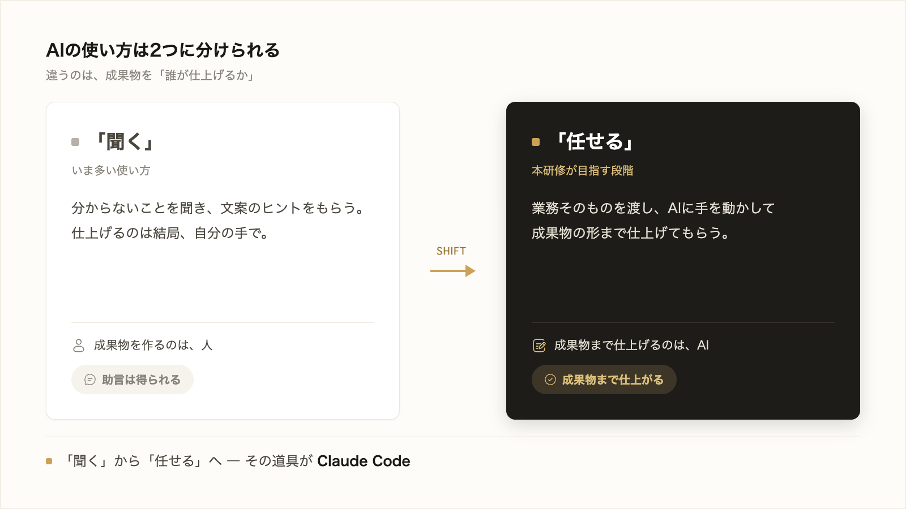

# 1-1-1 なぜ今AIに業務を任せるのか

この研修は、あなたが Claude Code というツールを使って、自分の業務を AI に任せ、実際の成果物（資料・分析・記事、そして動くアプリまで）を仕上げ、その進め方を再現できるようになることを目指します。最初の Chapter では、その出発点として「AI に業務を任せる」とはどういうことかを、2つのセクションで押さえます。

| セクション | テーマ | 種類 |
|---|---|---|
| 1-1-1 | なぜ今AIに業務を任せるのか | 概念 |
| 1-1-2 | チャットAIとAIエージェントの違い | 概念 |

**この Chapter の進め方**: まず 1-1-1 で、AI に「聞く」のではなく業務を「任せて」成果物を仕上げるという本研修の立場と、その力がなぜ今必要かを確認します。続く 1-1-2 で、その任せる相手であるチャットAIとAIエージェントの違いを押さえ、次の Chapter のセットアップにつなげます。どちらも読んで理解する概念セクションで、実際に手を動かすのは 1-2 からです。

<video controls preload="metadata" playsinline width="100%">
  <source src="https://github.com/coachtech-material/pj_X/releases/download/videos/1-1-1.mp4" type="video/mp4">
</video>

## このセクションで学ぶこと

- 生成AIが、文章・データ・コードを新しく作り出せること
- AIに「聞く」ことと、業務そのものを「任せて」成果物を仕上げることの違い
- なぜ今、その「任せる力」が必要なのか

生成AIで何ができるようになったかを確認し、本研修が目指す「業務を任せる」という AI の使い方と、それが必要とされる理由を押さえます。

---

## 導入: 「聞く」だけで止まっているAI活用

チャットAI（ChatGPT など）を仕事で何度か使ったことがある人は多いはずです。分からないことを聞き、文案のヒントをもらう。便利ではあるものの、最後に資料や分析を仕上げるのは結局自分の手で、業務そのものが大きく変わった実感はない。そんな使い方で止まっているなら、生成AIで本来できることの一部しか使えていない状態です。本研修は、AI に「聞く」段階から、業務を「任せて」成果物まで仕上げてもらう段階へ進むためのものです。

---

## 生成AIが作り出すもの: 文章・データ・コード

これまでのコンピュータは、人があらかじめ決めた手順どおりにしか動けませんでした。検索エンジンも、すでにある情報を探して並べるだけです。

これに対して **生成AI** は、学習した大量のデータをもとに、その場で新しいものを **作り出す** AI です。作り出せるものは、大きく次の3つに分かれます。

- **文章**: メール・議事録・提案書の下書き、長い資料の要約、文章の言い換え
- **データ**: 表の集計や分類、アンケートの傾向の整理、条件に合う情報の収集
- **コード**: 業務を自動化する小さなプログラムや、Web アプリそのもの

「探して見つける」のではなく「求めに応じて新しく作る」点が、これまでの道具との決定的な違いです。文章もデータもコードも作れるということは、私たちがパソコンで行う仕事の多くが、生成AIに任せられる対象になったということです。

## 「聞く」AIから「任せる」AIへ

生成AIの使い方は、大きく2つに分けて考えると整理しやすくなります。

一つは、AIに **聞く** 使い方です。チャットで質問し、アイデアや文案をもらう。参考にはなりますが、それを自分の資料に落とし込み、体裁を整え、確かめて仕上げる作業は人が担います。AIは助言役で、最後の成果物は自分で作ります。

もう一つが、本研修で身につける、AIに業務を **任せる** 使い方です。「この情報を集めて表にまとめて」「この資料をこの観点で要約して、報告用の文章にして」のように、業務そのものを渡し、AI に手を動かして成果物の形まで仕上げてもらいます。人は、何をどう仕上げてほしいかを伝え、出てきたものを確かめ、直しを指示する役に回ります。

この「任せる」使い方を実際に担う道具が、本研修で使う **Claude Code** です。Claude Code が聞くだけのチャットAIと何が違うのかは、次の 1-1-2 で詳しく見ていきます。

!!! note "補足"
    「任せる」といっても、丸投げして放っておけば完璧な成果物が出てくる、という意味ではありません。何を求めているかを的確に伝え、出てきたものを確かめて直しを重ねる関わりは必要です。その関わり方こそが本研修で身につける技術であり、Part1 の後半（1-3）でその土台を扱います。

## なぜ今、その力が必要なのか

AIに業務を任せる力が今これほど重視されるのは、次のような変化が起きているからです。

- **成果のスピードと量が変わる**: これまで数時間かけていた資料づくりや集計を、任せ方を身につけた人は短時間で何本も仕上げられます。同じ人数のまま、生み出せる成果の量とスピードが上がります。
- **やり方を仕組みとして残せる**: 一度うまくいった任せ方は、手順や前提として保存し、繰り返し呼び出せます。仕事のやり方が個人の頭の中だけにある状態から、誰でも再現できる資産へと変わります（この仕組み化は Part4 で扱います）。
- **「任せられる人」との差が開く**: AI を聞くだけで使う人と、業務を任せて成果物まで仕上げられる人とでは、同じ時間で出せる成果に差が出ます。この差は、AI が仕事に広く入り込むほど大きくなっていきます。

AI に取り残されるのではないか、という不安をやわらげる確実な方法は、最新情報を追い続けることではなく、AI に業務を任せて成果を出す具体的な力を、自分の手で身につけることです。本研修は、その力を順を追って身につけるために組まれています。

---

## まとめ

- 生成AIは、文章・データ・コードを新しく作り出せる。私たちがパソコンで行う仕事の多くが、AIに任せられる対象になった
- AIの使い方には、助言をもらう「聞く」使い方と、業務そのものを渡して成果物まで仕上げてもらう「任せる」使い方がある。本研修が扱うのは後者で、その道具が Claude Code
- 任せる力を身につけると、成果のスピードと量が上がり、やり方を仕組みとして残せる。AIが仕事に広がるほど、この力の有無による差は大きくなる

---

次のセクションでは、その「任せる」相手をはっきりさせます。質問に回答を返すチャットAIと、自分でファイルを読み・調べ・成果物を作り・確認を求めて実行するAIエージェント（Claude Code）の違いを押さえ、相談したいのか成果物を作りたいのかで使い分ける見当をつけます。AIエージェントが資料だけでなく動くアプリまで作れることも、あわせて確認します。
