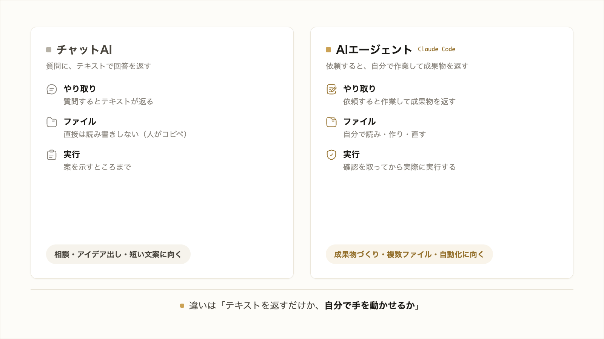

# 1-1-2 チャットAIとAIエージェントの違い

!!! note "前提知識"
    このセクションは 1-1-1「なぜ今AIに業務を任せるのか」の内容を前提としています。

<video controls preload="metadata" playsinline width="100%">
  <source src="https://github.com/coachtech-material/pj_X/releases/download/videos/1-1-2.mp4" type="video/mp4">
</video>

## このセクションで学ぶこと

- 質問に回答を返すチャットAIの働き方
- ファイルを読み・調べ・成果物を作り・確認を求めて実行するAIエージェント（Claude Code）の働き方
- 相談したいのか、成果物を作りたいのかでの使い分け、そしてAIエージェントが動くアプリまで作れること

同じ「AI」でも、回答を返すチャットAIと、自分で手を動かすAIエージェントは働き方が違います。その違いと使い分けを押さえ、本研修で使う Claude Code の立ち位置をはっきりさせます。

---

## 導入: たたき台はもらえるのに、成果物にならない

チャットAIに「提案書のたたき台を作って」と頼むと、それらしい文章が返ってきます。けれど、それを実際の提案書ファイルに貼り付け、体裁を整え、関連資料の数字と突き合わせて仕上げる作業は、結局すべて自分の手元に残ります。1-1-1 で見た「聞く」使い方の限界が、ここにあります。この壁を越えるのが、自分で手を動かすAIエージェントです。

!!! quote "現場での考え方"
    自分も以前は、チャットAIにメール文や企画の文案を出してもらい、それを毎回コピーして自分のファイルに貼り、整え直していました。文章はもらえても、ファイルを開く・直す・別の資料と照らす作業は全部こちらの仕事で、思ったほど楽になりませんでした。AIエージェントを使い始めて変わったのは、その「貼って整える」部分ごと任せられるようになったことです。

---

## 回答を返すチャットAI

**チャットAI** は、こちらが入力した質問やお願いに対して、テキストで回答を返すAIです。アイデアを相談する、文章の案をもらう、分からない言葉の意味を聞く、といった用途に向いています。

便利な一方で、できることはあくまで「テキストを返す」ところまでです。あなたのパソコンの中にあるファイルを直接開いて直すことはできませんし、最新の情報を自分で調べに行くわけでもありません（学習した範囲の知識から答えます）。返ってきた文章を実際の業務に落とし込むのは、人の作業として残ります。

## 自分で手を動かすAIエージェント（Claude Code）

**AIエージェント** は、依頼を受けると、目的を達成するために自分でいくつもの作業を進めるAIです。本研修で使う Claude Code は、その代表的な道具です。

Claude Code は、依頼を受けると次のように動きます。

- **ファイルを読む・作る・直す**: あなたのフォルダにある資料を自分で開いて読み、新しいファイルを作り、既存のファイルを書き換えます
- **自分で調べる**: 必要なら Web を検索して最新の情報を集め、内容を確かめながら進めます
- **確認を求めて実行する**: ファイルを書き換えるなどの操作の前に「これを実行してよいか」と確認を取り、許可を得てから実際に手を動かします

公式ドキュメントは、Claude Code を「質問に答えて待つチャットボットとは異なり、ファイルを読み取り、コマンドを実行し、変更を加えながら、自律的に問題を解決できる」ものだと説明しています（2026年6月時点）。やりたいことを伝えると、どう進めるかを自分で考え、調べ、作り、確かめる。これが「任せる」相手としてのAIエージェントです。

2つの違いを整理すると、次のようになります。

| 観点 | チャットAI | AIエージェント（Claude Code） |
|---|---|---|
| やり取り | 質問するとテキストで回答が返る | 依頼すると自分で作業して成果物を返す |
| ファイル | 直接は読み書きしない（人がコピペする） | 自分でファイルを読み・作り・直す |
| 調べもの | 学習済みの知識から答える | 必要なら自分で調べて確かめる |
| 実行 | 案を示すところまで | 確認を取ってから実際に実行する |
| 向くこと | 相談・アイデア出し・短い文案 | 成果物づくり・複数ファイルの作業・自動化 |

!!! note "補足"
    チャットAIとAIエージェントは、どちらが優れているという関係ではありません。中身の AI（モデル）には同じものが使われていることも多く、違いは「テキストを返すだけか、自分で手を動かせるか」という働き方の差です。

## 相談か、成果物づくりか

この違いから、使い分けの見当がつきます。

ちょっとした相談や、言葉の意味の確認、短い文案がほしいだけなら、チャットAIで十分です。手軽に開けて、すぐ答えが返ります。

一方、実際の成果物（資料・分析・記事・ツール）を仕上げたい、複数のファイルにまたがる作業を任せたい、繰り返す作業を自動化したい、というときは、AIエージェントの出番です。本研修が目指す「業務を任せて成果物まで仕上げる」使い方は、こちらにあたります。

## 資料だけでなく、動くアプリまで

AIエージェントに任せられるのは、文章や表だけではありません。Claude Code は、実際に動く Web アプリやツールを作り、誰でも使える形でインターネットに公開するところまで担えます。

本研修の最後の Part6「アプリ開発実践」では、あなた自身が Claude Code に委任して、AI で議事録を整理するアプリを実際に作り、公開します。コードを自分で書く必要はありません。いまは「資料づくりだけでなく、動くものまで作れるのだ」と知っておけば十分です。チャットAIでは到達できないこの体験が、Claude Code を学ぶ意味を具体的に示します。

---

## まとめ

- チャットAIは質問にテキストで回答を返すAI。相談・アイデア出し・短い文案に向く
- AIエージェント（Claude Code）は、ファイルを読み・調べ・成果物を作り・確認を求めて実行するAI。成果物づくりや複数ファイルの作業、自動化に向く
- 相談したいときはチャットAI、成果物を仕上げたいときはAIエージェント、と使い分ける
- AIエージェントは資料だけでなく動くアプリまで作れる。Part6 で実際に作って公開する

---

次のセクションからは、いよいよ手を動かします。まず自分の契約プラン（本研修はまず Pro を推奨）を確認し、自分の OS に合わせて、推奨のターミナルから Claude Code をインストールして認証し、起動した状態を作ります。ターミナルやコマンドをまだ知らなくても、記載どおりに進めれば大丈夫です。
