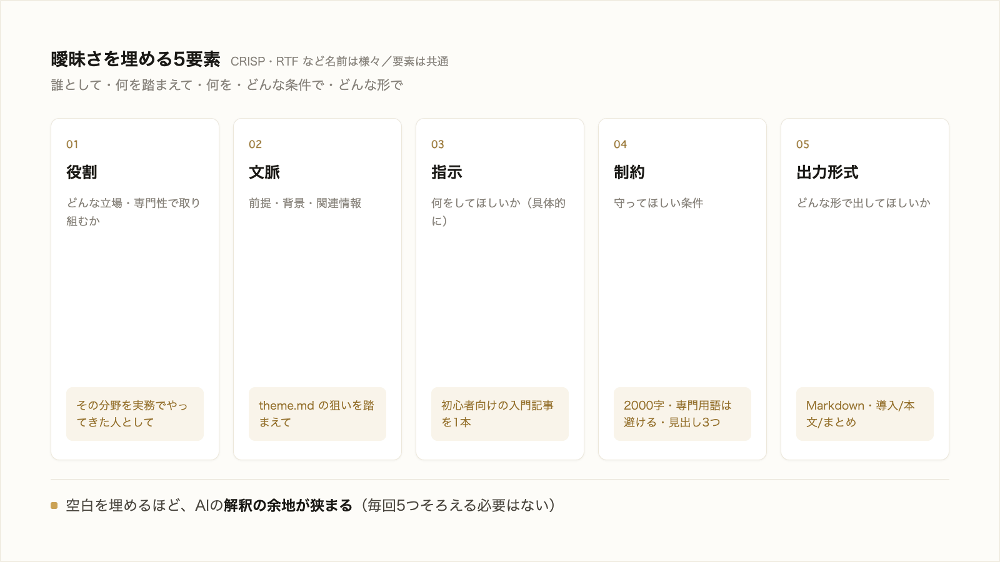

# 1-3-2 プロンプトのフレームワークとAIに任せるリスク

!!! note "前提知識"
    このセクションは 1-3-1「ブログ記事を丸投げする」の内容を前提としています。

## このセクションで学ぶこと

- 指示が曖昧だと、AIが解釈で埋めて的を外すこと
- 曖昧さを埋めて狙いを伝えるプロンプトのフレームワーク（役割・文脈・指示・制約・出力形式）
- AIに任せること自体のリスク（誤りを自信ありげに返す・確認なしに進む・過信）

1-3-1 の丸投げが外れた理由を「曖昧さの解釈」という観点で掘り下げ、それを埋めるプロンプトの型と、任せるときに持っておくべきリスクの感覚を押さえます。

!!! note "補足"
    このセクションに出てくる指示文は、考え方を理解するための例です（読みながら打つ必要はありません）。学んだ型を実際に使って記事を作り直すのは、Part3 の 3-5（記事を作る）や、以降の各ハンズオンです。

---

## 導入: AIは曖昧さを「解釈」で埋める

1-3-1 で記事がずれたのは、AIの能力不足ではなく、指示の曖昧さが原因でした。「ちゃんとした記事を書いて」という指示には、決まっていない部分が大量にあります。AIはその空白を、自分の解釈で埋めて書き進めます。埋め方があなたの狙いと一致すればよいのですが、指定していない以上、一致するかどうかは運次第です。

!!! quote "現場での考え方"
    自分が怖いと感じたのは、AIの出力が、いかにも正しそうな顔をしている点でした。ある集計を曖昧に頼んだとき、それらしい数字の並んだ表が返ってきて、見た目には完璧でした。よく確かめると、こちらが想定していたのと違う条件で集計されていたのです。曖昧に頼むと、AIは「たぶんこういうことだろう」と解釈し、その解釈を自信たっぷりに仕上げてきます。だから、何を求めているかは、こちらが具体的に渡す必要があります。



---

## なぜ曖昧な指示は的を外すのか

人どうしなら、曖昧な依頼でも「これはこういう意図だろう」と空気を読み、必要なら聞き返してくれます。AIも意図を推測しますが、あなたの頭の中までは読めません。指定がなければ、最もありがちな無難な答えに寄せます。その結果が、1-3-1 で見た「どこかで読んだような一般論」です。

裏を返せば、決まっていない部分を減らし、狙いを具体的に渡せば渡すほど、AIの解釈の余地は狭まり、出力は狙いに近づきます。これが、上手な任せ方の核心です。

## 曖昧さを埋めるプロンプトの型

何を渡せばよいかには、整理された型（フレームワーク）があります。世の中には CRISP 法・RTF など名前のついた型がいくつもありますが、要素はおおむね共通しています。本研修では、次の5つの要素で押さえます。

| 要素 | 渡すこと | 記事の例 |
|---|---|---|
| 役割 | どんな立場・専門性で取り組んでほしいか | その分野を実務でやってきた人として |
| 文脈 | 前提・背景・関連情報 | `theme.md` に整理した狙いを踏まえて |
| 指示 | 何をしてほしいか（具体的に） | 初心者向けの入門記事を1本書く |
| 制約 | 守ってほしい条件 | 2000字程度、専門用語は避ける、見出しは3つ |
| 出力形式 | どんな形で出してほしいか | Markdown で、導入・本文・まとめの構成 |

5つすべてを毎回そろえる必要はありません。タスクに応じて、効きそうな要素を渡します。要するに「誰として・何を踏まえて・何を・どんな条件で・どんな形で」を、空白のまま放置せず、こちらから埋めるということです。

Claude Code の公式ガイドも、良い結果を得るコツとして「指示は具体的にする」「対象（どのファイル・どの範囲）を絞る」「望む形の例を示す」ことを勧めています（Anthropic「ベストプラクティス」2026年6月時点）。名前のついた型は、この当たり前を忘れず実行するための覚え書きだと考えてください。

## 丸投げと、型に沿った指示の違い

同じテーマでも、渡す情報の量でこれだけ変わります。

丸投げ（1-3-1）:

```text
「（テーマ）」について、ちゃんとした記事を1本書いて。
```

型に沿った指示:

```text
あなたはその分野を実務で経験してきた書き手です。
claude-practice/theme.md に整理した狙いを踏まえて、
これからその分野を学ぶ初心者に向けた入門記事を1本書いてください。
2000字程度、専門用語にはひとこと説明を添え、見出しは3つ。
Markdown で、導入・本文・まとめの構成にしてください。
```

下の指示なら、AIが勝手に解釈で埋める余地はぐっと減ります。出力は、あなたの狙いに近いところから始まります。あとは、出てきたものを確かめて直していけばよいのです。

!!! note "補足"
    では、渡すべき「狙い」や「条件」は、どうやって筋よく決めればよいのでしょうか。やみくもに条件を並べても、的外れだと意味がありません。その「何を渡すかを決める考え方」が、このあとの 1-3-3（仮説で当てる）と 1-3-4（構造化と完成条件）のテーマです。

## AIに任せること自体のリスク

任せ方が上手くなっても、忘れてはいけないことがあります。AIに任せるという行為自体に、いくつかのリスクがあります。

- **誤りを自信ありげに返す**: AIは、事実と違うことを、いかにも正しそうな体裁で返すことがあります（この現象を後で「ハルシネーション」として扱います）。見た目のもっともらしさは、正しさの保証にはなりません。
- **確認なしに、解釈のまま進む**: AIは「たぶんこうだろう」という自分の解釈に立ち止まって疑うことをせず、そのまま作業を進めがちです。前提を取り違えたまま、最後まで突き進んでしまうことがあります。
- **人がAIを過信する**: いちばんのリスクは、出力が立派に見えるあまり、人が確かめずに鵜呑みにしてしまうことです。

これらのリスクは、任せることをやめる理由にはなりません。対処法は、出てきたものを必ず確かめることです。何をもって「正しい・完成」とするかを先に決めておき（1-3-4）、出力をそれと照らし合わせて検証する（Part3 の 3-1-6）。この「決めて、確かめる」関わりこそが、AIに安心して任せるための土台です。生成AIがなぜ誤るのか、その仕組みと限界は Part2（2-5-2）で扱います。いまは「立派に見えても、確かめる前提で受け取る」という感覚を持っておけば十分です。

---

## まとめ

- 指示の曖昧な部分は、AIが自分の解釈で埋める。だから丸投げは狙いから外れやすい
- 役割・文脈・指示・制約・出力形式の5要素で空白を埋めると、AIの解釈の余地が狭まり、出力が狙いに近づく
- 名前のついた型（CRISP・RTF など）も要素は共通。要は「誰として・何を踏まえて・何を・どんな条件で・どんな形で」を具体的に渡すこと
- AIには、誤りを自信ありげに返す・確認なしに進む・人が過信する、というリスクがある。先に完成の基準を決め、出力を確かめる関わりで対処する

---

次のセクションでは、では何を「文脈」や「狙い」として渡せばよいかを決める考え方の一つ、仮説で当てる進め方を扱います。情報を集めきってから決めるのではなく、先に「こう進めたい」という仮説を置き、AIに懸念を洗わせて、検証で精度を上げていく進め方を押さえます。
