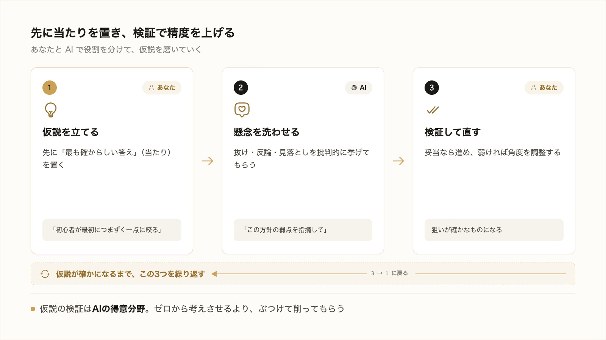
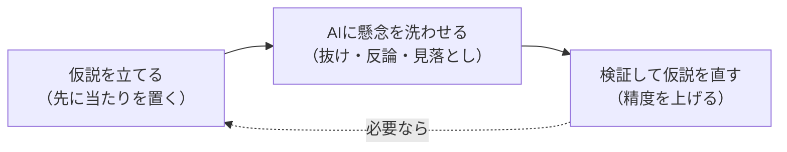

# 1-3-3 仮説で当てる

!!! note "前提知識"
    このセクションは 1-3-2「プロンプトのフレームワークとAIに任せるリスク」の内容を前提としています。

## このセクションで学ぶこと

- 情報を集めきってから決めるのではなく、先に暫定の答え（仮説）を置く進め方
- なぜ仮説を置く進め方がAIと相性がよいのか
- 仮説をAIに渡し、懸念を洗わせ、検証で精度を上げるやり方

1-3-2 で見た「AIに渡す狙い」を、どう筋よく決めるか。その一つの考え方として、仮説を先に立てて検証で精度を上げる進め方を押さえます。

!!! note "補足"
    このセクションの指示文は、考え方を理解するための例です。学んだ進め方を実際に使うのは、Part3 の 3-5（記事を作る）や、以降の各ハンズオンです。

---

## 導入: 情報を集めきってからでは遅い

何かを始めるとき、「まず関連情報をぜんぶ集めてから方針を決めよう」と考えがちです。一見ていねいですが、情報は集めようと思えばいくらでもあり、いつまでも決まりません。AIに任せる場面でも同じで、何を頼むか決めかねて手が止まってしまいます。これを抜ける考え方が、仮説思考です。



---

## 仮説思考とは: 先に暫定の答えを置く

**仮説思考** は、限られた情報の段階でも、先に「最も確からしい答え」（仮説）を立て、それを検証しながら進める考え方です（内田和成『仮説思考』に詳しく述べられています）。情報をすべて集めてから結論に向かうのではなく、結論の当たりを先につけて、そこから逆に必要な確認を絞り込みます。

たとえば記事づくりなら、あらゆる切り口を調べ尽くしてから方向を決めるのではなく、先にこう置きます。

> この記事は、「これから自分の分野を学ぶ初心者が、最初につまずく一点」を取り上げて解きほぐす、という角度で書くのがいちばん刺さるはずだ。

これはまだ確証のない暫定の答えです。けれど、当たりが定まると、確認すべきことが「その一点は本当に多くの初心者がつまずくのか」「解きほぐし方は妥当か」に絞られます。やみくもに調べるより、ずっと速く前に進めます。

!!! info "ポイント"
    仮説は、当たっていることが目的ではありません。間違っていたら捨てて立て直せばよいのです。大事なのは、先に当たりを置くことで、検証すべき点が絞られ、判断と作業が前に進むことです。外れを恐れて仮説を立てない方が、かえって時間を失います。

## なぜ仮説がAIと相性がよいのか

仮説を立てる進め方は、AIに任せるときに特に効きます。理由は、仮説の検証が、AIの得意なことだからです。

こちらが「こう進めたい」という仮説を渡すと、AIはそれを起点に、抜けている論点・反対意見・見落としやすい点を洗い出してくれます。1-3-2 で見た「AIは確認なしに解釈で進みがち」という弱点も、自分から「この方針の弱点を挙げて」と頼めば、逆に弱点を突く役として使えます。

つまり、流れはこうなります。



ゼロから「いい角度を考えて」と丸投げするより、自分の仮説をぶつけて削ってもらう方が、議論が具体的になり、出力も鋭くなります。

## 仮説を立て、AIに検証させる

実際の渡し方は、たとえば次のようになります。記事の角度について仮説を置き、その弱点をAIに洗わせる例です。

```text
この記事は「初心者が最初につまずく一点」に絞って解説する角度で書こうと思います。
この方針で進めるとして、
・本当にその一点が多くの初心者の悩みか、ほかに有力な切り口はないか
・この角度で書くと、抜け落ちる重要な論点はないか
を、批判的な視点で指摘してください。
```

返ってきた指摘を見て、仮説が妥当ならそのまま進め、弱ければ角度を調整します。これを何度か繰り返すと、最初は曖昧だった「狙い」が、検証を経た確かなものになっていきます。その確かな狙いを、1-3-2 の型に乗せてAIに渡せば、出力は格段に狙いへ近づきます。

このとき、AIが挙げた指摘や事実をそのまま信じきらないことも大切です（1-3-2 のリスク）。重要な点は、必要に応じて一次情報で裏を取ります。その確かめ方は Part3（3-1-6）で扱います。

---

## まとめ

- 仮説思考は、情報を集めきる前に「最も確からしい答え」を先に置き、検証しながら精度を上げる進め方
- 仮説は当てることが目的ではない。先に当たりを置くことで、確認すべき点が絞られ、判断と作業が前に進む
- 仮説の検証はAIの得意分野。自分の仮説を渡して懸念・抜け・反論を洗わせると、出力が鋭くなる
- AIの指摘も鵜呑みにせず、重要な点は一次情報で裏を取る（確かめ方は Part3）

---

次のセクションでは、もう一つの「AIに渡す思考」を扱います。大きな仕事を、AIに振れる小さな単位へ漏れなくダブりなく分ける構造化と、成果の先にあるアウトカムから逆算して「何ができたら完成か」を先に決める完成条件です。これがそろうと、出力が狙いにいっそう収束しやすくなります。
