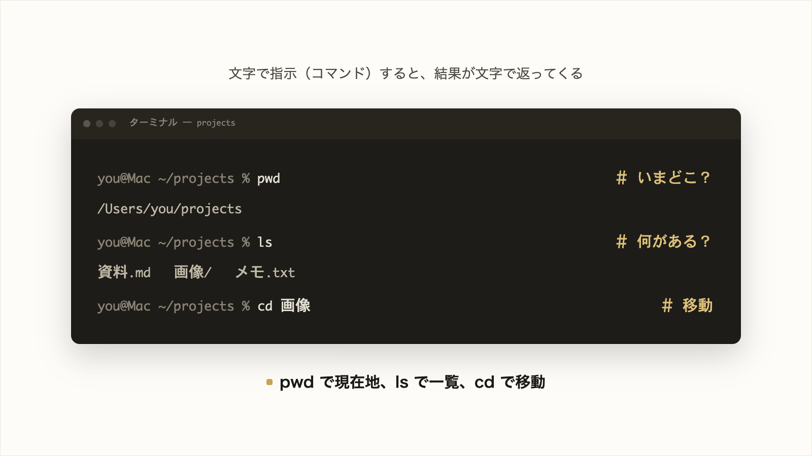

# 2-1-1 コマンドラインの基本

!!! note "前提知識"
    このセクションは 1-2-1「Claude Code のインストールと認証」の内容を前提としています。

この Chapter では、Claude Code を使うのに必要な「コンピュータとコマンドライン」の基本を、3つのセクションで学びます。Claude Code に文字で指示するコマンドライン、ファイルの場所を表すパス、ファイルの種類を表す拡張子を、順に扱います。

| セクション | テーマ | 種類 |
|---|---|---|
| 2-1-1 | コマンドラインの基本 | 概念 |
| 2-1-2 | ファイル・フォルダ・パス | 概念 |
| 2-1-3 | 拡張子とプレーンテキスト | 概念 |

**この Chapter の進め方**: まず 2-1-1 でコマンドラインと「いまどこにいるか」を押さえ、2-1-2 でファイルの置き場所を示すパス、2-1-3 でファイルの種別を示す拡張子へと進みます。すべて概念セクションですが、各セクションの末尾に小さな「やってみよう」を用意しているので、読んだあとに少しだけ手を動かせます。

<video controls preload="metadata" playsinline width="100%">
  <source src="https://github.com/coachtech-material/pj_X/releases/download/videos/2-1-1.mp4" type="video/mp4">
</video>

## このセクションで学ぶこと

- コマンドラインが、文字で指示すると結果が文字で返る仕組みであり、Claude Code を動かす基本の方法であること
- 「いまどのフォルダにいるか」を示すカレントディレクトリと、それを扱う pwd・ls・cd の3つのコマンド
- Claude Code をどのフォルダで起動するかで、AI が扱う対象が変わること

コマンドラインとは何か、そして Claude Code をコマンドラインで動かす理由を確認し、現在地を確かめて移動する基本コマンドまで身につけます。

!!! note "補足"
    このセクションの本文に出てくるコマンドは、まず読んで仕組みをつかむための例です（読みながら打つ必要はありません）。実際に手を動かすのは、セクション末尾の「やってみよう」です。そこでターミナルを開くところから一緒に操作します（さらに本格的な操作は Part3、アプリ開発は Part6 で扱います）。

---

## 導入: 黒い画面の前で手が止まる

1-2 で Claude Code をインストールして起動したとき、文字だけが並ぶ画面が現れたはずです。この画面（ターミナル）にどう向き合えばよいか分からないと、Claude Code をどこで・どう動かせばよいかが見えないまま止まってしまいます。Claude Code は、このコマンドラインから起動して操作します。ここを押さえておくと、この先 Claude Code をどこで起動し、何を扱わせるかを自分で判断できるようになります。

!!! quote "現場での考え方"
    ターミナルがはじめての人がつまずくのは、操作そのものより「いま自分がどのフォルダにいるか」が見えていないことです。自分も、デスクトップで Claude Code を起動したまま「先週の資料を直して」と頼んで、「そのファイルが見つかりません」と返ってきたことがあります。資料は別のフォルダに置いてあったのです。コマンドラインで最初に押さえたいのは、いまどこにいて、そこに何があるかを AI と共有することです。



---

## コマンドラインとは何か

普段パソコンを使うときは、マウスでアイコンをクリックしたり、ボタンを押したりして操作します。画面に表示されるアイコンやボタン（グラフィック）を見ながら操作するこのやり方を **GUI** （グラフィカル・ユーザー・インターフェース）と呼びます。

これに対して **コマンドライン** は、文字で指示（コマンド）を打つと、結果が文字で返ってくる操作方法です。たとえば「いまいる場所を教えて」という意味のコマンドを打つと、その場所が文字で表示されます。マウスは使わず、キーボードで言葉のように指示します。

この文字のやり取りをする画面が **ターミナル** です。コマンドラインが「文字で指示するやり方」、ターミナルが「そのやり取りを実際に行うアプリ」だと考えてください。

!!! note "補足"
    ターミナルの中で実際にコマンドを解釈して動かしている部分を「シェル」と呼びます（macOS の標準は zsh、Windows の標準は PowerShell）。違いを意識する場面は Part6 まで多くないので、いまは「ターミナルに文字を打つと動く」と捉えれば十分です。

文字で正確に指示できるコマンドラインは、手順を自動化したり、同じ操作を繰り返したりするのが得意です。そして、テキストで動く AI とも相性がよい操作方法です。

## Claude Code がコマンドラインで動く理由

Claude Code は、テキストで完全に動くツールです。やりたいことを文章で書いて送り、AI からの応答も文字で返ってきます。だから、Claude Code は、文字でやり取りするコマンドラインで動かすのが基本です。

1-2 で VS Code を用意したように、Claude Code は VS Code の中で開く統合ターミナルからも動かせます（統合ターミナルも、ここで説明しているふつうのターミナルと同じものです）。ほかに VS Code 拡張・デスクトップ版・Web 版で使う方法もありますが、どの方法でも考え方は共通なので、本研修ではコマンドライン（`claude` コマンド）を基本に進めます。

ここで一つ、とても大切な点があります。Claude Code は、起動したフォルダを **作業場所** として扱い、そこにあるファイルを読み書きします。デスクトップで起動すればデスクトップが作業場所になり、ある資料のフォルダで起動すればそのフォルダが作業場所になります。

つまり、**どのフォルダで起動するか** によって、AI が扱える対象そのものが変わります。導入で触れた「資料が見つからない」も、これが理由でした。だからこそ、いま自分がどのフォルダにいるかを読めることが、Claude Code を使ううえでの基本になります。

## いまどこにいるか（カレントディレクトリ）

コマンドラインでは、つねに「いま自分がどのフォルダにいるか」という現在地があります。この現在地のフォルダを **カレントディレクトリ** （現在の作業フォルダ）と呼びます。「ディレクトリ」はフォルダの別名です。

多くのターミナルは、現在地を入力待ちの目印（プロンプト）のあたりに表示します。たとえば次のように見えます。

macOS（標準の Terminal）の例:

```text
yourname@MacBook ~ %
```

Windows（PowerShell）の例:

```text
PS C:\Users\yourname>
```

末尾の記号（macOS は `%` 、Windows は `>` ）の手前に、いまいる場所が表示されています（macOS の `~` はホームフォルダを表します）。表示の形はターミナルや設定で変わりますが、「いまどこにいるか」が手がかりとして出ている、と捉えてください。

## 場所を扱う3つの基本コマンド: pwd・ls・cd

現在地を確かめたり移動したりするコマンドは、まずこの3つを覚えれば十分です。

| コマンド | 由来 | 何をするか |
|---|---|---|
| `pwd` | print working directory | いまいるフォルダのパス（場所）を表示する＝現在地の確認 |
| `ls` | list | いまいるフォルダの中のファイル・フォルダの一覧を表示する |
| `cd` | change directory | 別のフォルダへ移動する |

`pwd` と打って Enter を押すと、現在地が文字で返ってきます。

```bash
pwd
```

```text
/Users/yourname
```

`ls` と打つと、そのフォルダの中身の名前が並びます。

```bash
ls
```

```text
Desktop   Documents   Downloads   projects
```

`cd` は、行き先を後ろに付けて使います。

```bash
cd projects      # projects という名前のフォルダの中へ移動する
cd ..            # 一つ上のフォルダへ戻る
cd ~             # ホームフォルダへ移動する
```

!!! note "補足"
    `cd ..` の「..」は「一つ上のフォルダ」を表す書き方です。この「..」や「.」を使った場所の示し方（パス）は、次の 2-1-2 で詳しく扱います。ここでは「cd で移動できる」ことだけ押さえれば十分です。

この3つを使えば、Claude Code を目的のフォルダで起動する準備が整います。`pwd` で現在地を確かめ、`ls` で目的のファイルがそこにあるか確認し、なければ `cd` で移動してから claude を起動する、という流れになります。

## macOS と Windows でのコマンドの違い

pwd・ls・cd は、macOS（zsh）でも Windows（PowerShell）でも **同じ綴りで打てます** 。PowerShell では、ls・pwd・cd が本来のコマンドの別名（エイリアス）として用意されているため、同じ感覚で使えます。ただし OS によって次の違いがあるので、初出のここで一度だけ示します（以降も同様です）。

- **パスの区切り文字**: フォルダの階層を区切る記号が、macOS／Linux は `/` （スラッシュ）、Windows は `\` （バックスラッシュ）です。
- **一部のコマンドの綴り**: Windows では一覧表示に古くからの `dir` も使えます。一方 macOS／Linux では `dir` ではなく `ls` を使います。

!!! warning "注意"
    Windows には、見た目の似た「PowerShell」と「CMD（コマンドプロンプト）」の2つがあります。本研修は、Claude Code 公式が新規ユーザーに推奨する PowerShell に統一して進めます。行の先頭に `PS` が付いていれば PowerShell です（例: `PS C:\Users\yourname>` ）。`PS` が付いていない場合は CMD なので、PowerShell を開き直してください。

文法を覚えたり、複数のコマンドをつなげたスクリプトを書いたりすることは、本研修では扱いません。ここで押さえるのは、pwd・ls・cd で「現在地を読み、確かめ、移動できる」ことです。

## やってみよう: pwd・ls・cd を打ってみる

ここまでで見た pwd・ls・cd を、実際にターミナルで打ってみましょう。どれも何かを書き換えるコマンドではないので、表示が思ったものと違っても、こわれる心配はありません。

**1. ターミナル（VS Code の統合ターミナル）を開く**

1-2-2 で用意した VS Code を開き、その統合ターミナルを開きます（上部メニューの「ターミナル」→「新しいターミナル」、または `` Command+` ``〔macOS〕／`` Control+` ``〔Windows〕）。本研修は、この統合ターミナルを作業環境として使います（統合ターミナルの中身は、先ほど触れた OS のシェルそのものなので、ここで打つコマンドはそのまま通用します）。ウィンドウの中で点滅している縦棒（カーソル）が、文字の入力位置です。マウスでクリックして操作するのではなく、キーボードで文字を打ち、最後に Enter キーを押して実行します。

**2. 現在地を表示する（pwd）**

`pwd` と打って、Enter キーを押します。いまいるフォルダのパス（場所）が1行で表示されます。

```text
/Users/yourname
```

macOS なら `/Users/...` 、Windows なら `C:\Users\...` のような表示です（内容はあなたの環境で変わります）。これが「いまどこにいるか」です。

**3. 中身の一覧を表示する（ls）**

続けて `ls` と打って、Enter キーを押します。いまいるフォルダの中にあるファイルやフォルダの名前が並びます。

```text
Desktop   Documents   Downloads   Pictures
```

Documents（書類）や Downloads（ダウンロード）など、見覚えのある名前が並んでいるはずです（Windows の PowerShell では、名前が表の形〔Name 列〕で縦に並びます。見た目は違っても、中身を一覧できる点は同じです）。

**4. フォルダを移動して、戻る（cd）**

手順3で表示された名前から、フォルダを一つ選んで、その中に入ってみます。たとえば `Documents` に入るなら、次のように打って Enter を押します。

```bash
cd Documents
```

もう一度 `pwd` を打つと、現在地が一つ深くなり、末尾に `Documents` が足されているのが分かります。確認できたら `cd ..` と打って Enter を押すと、元のフォルダに戻れます。

!!! warning "注意"
    `cd` で入れるのは、フォルダ（ディレクトリ）だけです。`ls` の一覧に出てきても、ファイル（`report.txt` のような書類そのもの）には `cd` できません。ファイル名を指定すると「ディレクトリではありません」という内容のエラーが出ます。迷ったら、見覚えのある `Documents` や `Downloads` を選べば確実です。

!!! success "確認"
    `pwd` で現在地が表示され、`ls` で名前が並び、`cd` で移動して `cd ..` で戻れれば成功です。表示される中身は人それぞれで構いません。大事なのは「現在地が読めて、コマンドで一覧・移動ができる」ことです。

---

## まとめ

- コマンドラインは、文字で指示すると結果が文字で返る操作方法。ターミナルはそのやり取りを行うアプリで、Claude Code も基本これで動かす
- pwd で現在地、ls で一覧、cd で移動。いま自分がどのフォルダにいるか（カレントディレクトリ）を意識することが基本
- Claude Code は起動したフォルダを作業場所にするため、どこで起動するかで AI が扱う対象が変わる
- cd・ls・pwd は macOS でも Windows でも同じ綴りで使えるが、パス区切り（`/` と `\` ）など OS による細かな違いがある

---

次のセクションでは、ファイルとフォルダの階層構造と、置き場所を一意に示すパスを扱います。カレントディレクトリを基点に決まる相対パスと、ルートからたどる絶対パス（表記は OS で異なります）の違いを押さえ、AI にどのファイルを扱うかをパスで指す意味を理解します。
