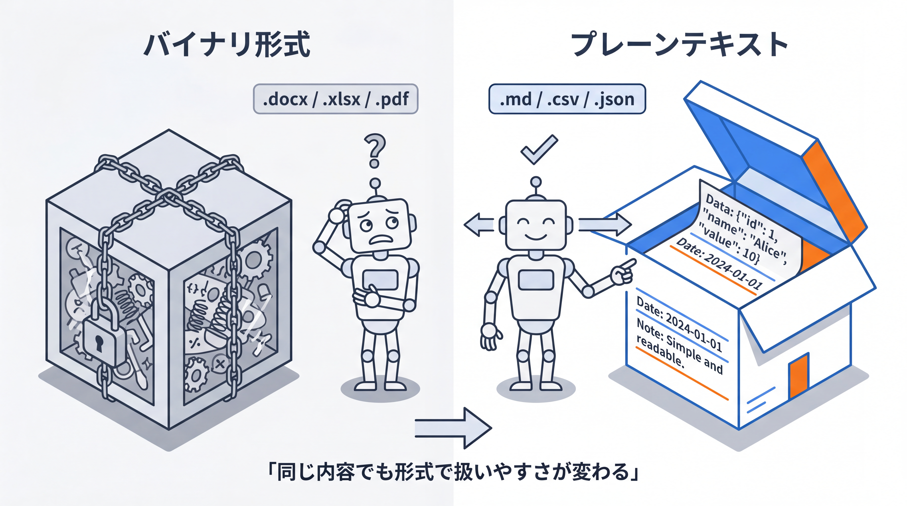

# 2-1-3 拡張子とプレーンテキスト

!!! note "前提知識"
    このセクションは 2-1-2「ファイル・フォルダ・パス」の内容を前提としています。

<video controls preload="metadata" playsinline width="100%">
  <source src="https://github.com/coachtech-material/pj_X/releases/download/videos/2-1-3.mp4" type="video/mp4">
</video>

## このセクションで学ぶこと

- 拡張子がファイルの中身の種別を示すこと
- AI と相性のよいプレーンテキスト系の .md・.csv・.json が、それぞれ何を入れる形式か
- AI が主にこれらの形式を扱う理由

拡張子とは何かを押さえ、プレーンテキストとそうでない形式の違いと、AI が扱いやすい代表的な3つの形式まで見ていきます。

!!! note "補足"
    このセクションに出てくるファイルの中身は、形式の違いを読んで理解するための例です。実際に手を動かすのは、セクション末尾の「やってみよう」です。

---

## 導入: 形式を間違えると AI はうまく扱えない

同じ内容でも、どの形式のファイルに入れるかで、AI の扱いやすさは大きく変わります。形式を意識せずに渡すと、AI がうまく読めなかったり、編集がかみ合わなかったりします。このセクションでは、ファイルの種別を示す拡張子と、AI と相性のよい形式を押さえます。

!!! quote "現場での考え方"
    Word で作ったきれいな企画書を AI に渡して「これを下敷きに5案作って」と頼んだら、やり取りがかみ合わなかったことがあります。原因は、Word ファイルの中身が、見た目どおりの文字の並びではなく、専用の形式で複雑に詰め込まれていたからでした。同じ内容を改めてプレーンテキスト（.md など）で渡したら、今度はそのまま読み書きしてくれました。渡す前にどの形式にするかで、AI の読み書きのしやすさは変わります。



---

## 拡張子: ファイルの中身の種別を示す札

**拡張子** は、ファイル名の末尾に付く「.〜」の部分です。前のセクションで見た `draft.md` の `.md` や、`2026.csv` の `.csv` がそれにあたります。拡張子は、そのファイルの中身がどんな種別かを示す札のような役割を持ちます。

パソコンは、この札を見て「どのアプリで開くか」「どう扱うか」を判断します。`.docx` なら文書アプリ、`.xlsx` なら表計算アプリ、といった具合です。

!!! warning "注意"
    拡張子はあくまで種別を示す札です。札（拡張子）を書き換えても、中身そのものが別の形式に変わるわけではありません。中身と札が食い違うと、正しく開けなくなることがあります。

## プレーンテキストと、そうでないファイル

ファイルの形式は、大きく2種類に分けて捉えると分かりやすいです。

**プレーンテキスト** は、文字だけで構成された、どの環境でも素直に読める形式です。`.txt` のほか、この後で見る `.md`・`.csv`・`.json` などが含まれます。テキストエディタで開けば、中身がそのまま文字として読めます。

もう一方は、**プレーンテキストではない形式** （バイナリ形式）です。`.docx`（Word）・`.xlsx`（Excel）・`.pdf`・`.png`（画像）などが該当します。見た目は文書や表でも、中身は専用の形式で複雑に圧縮・構造化されていて、文字としてそのまま読むことはできません。

見分け方は単純で、テキストエディタで開いて中身が文字として読めればプレーンテキスト、文字化けして読めなければそうではない、と考えればおおむね合っています。

## AI と相性のよい3つの形式: .md・.csv・.json

プレーンテキストの中でも、業務や AI 活用でよく出会うのが次の3つです。

| 拡張子 | 形式名 | 何を入れるか |
|---|---|---|
| `.md` | Markdown（マークダウン） | 文章を、見出し・箇条書き・リンクなどの簡単な記号で構造化したテキスト |
| `.csv` | Comma-Separated Values | 表（行と列）のデータを、カンマ区切りで並べたテキスト |
| `.json` | JavaScript Object Notation | 設定や構造化データを、名前と値の組で表したテキスト |

それぞれ、中身は次のようになっています。どれも、開けば人が読める文字の並びです（細かい記号の意味を覚える必要はありません。「こういう見た目のテキスト」とつかめれば十分です）。

Markdown（.md）の例:

```text
# 買い物リスト

## 今週
- 牛乳
- パン
- りんご
```

CSV（.csv）の例:

```text
名前,数量,メモ
牛乳,1,低脂肪
パン,2,
りんご,3,赤いもの
```

JSON（.json）の例:

```text
{
  "name": "牛乳",
  "quantity": 1,
  "note": "低脂肪"
}
```

この教材自体も Markdown で書かれています。Markdown は文章向き、CSV は表データ向き、JSON は設定や構造化データ向き、と用途で使い分けます。

## AI がプレーンテキストを扱いやすい理由

AI（Claude Code）は、テキストを読み書きするのが基本です。プレーンテキストは中身がそのまま文字なので、AI が正確に読み取り、狙った箇所だけを書き換えられます。変更した箇所も「どこが変わったか」が文字の差分として分かるため、人が確認しやすいという利点もあります（この差分や履歴をきちんと管理する仕組みは、Part5 の Git で扱います）。

一方、Word や Excel のようなプレーンテキストでない形式は、中身が複雑で不透明なため、AI が部分的に編集するのが難しくなります。

このため、Claude Code は主にプレーンテキスト系の形式を扱います。Word や Excel をまったく扱えないわけではありませんが、まずはテキストで考え、テキストで渡して受け取るほうが、AI は正確に読み書きできます。

## やってみよう

ファイルの拡張子を実際に見て、プレーンテキストかどうかを見分けてみましょう。

**1. ターミナルでファイル名の末尾（拡張子）を見る**

ターミナルを開き（2-1-1 の「やってみよう」と同じ手順。macOS: `command`（⌘）+ スペースで `terminal`／Windows: `Windows`（⊞）+ `X` から「ターミナル」）、まずファイルが入っていそうなフォルダへ移動します。たとえばダウンロードフォルダなら `cd Downloads` と打って Enter。続けて `ls` と打って Enter を押すと、そのフォルダの中のファイル名が並びます。名前の末尾の `.〜` が拡張子です。`.txt`・`.md`・`.csv` はプレーンテキスト、`.docx`・`.xlsx`・`.pdf`・`.png` はそうではない形式、と見分けてみましょう。

**2. ファイルの一覧画面でも拡張子を表示する**

ふだんファイルを見る画面（Windows のエクスプローラー、Mac の Finder）でも、拡張子を表示できます。初期設定では隠れていることが多いので、表示する設定に変えてみましょう。

=== "macOS"
    Finder を開き、画面上部のメニューから「Finder」→「設定」（環境設定）→「詳細」タブを開き、「すべてのファイル名拡張子を表示」にチェックを入れます。

=== "Windows"
    フォルダ（エクスプローラー）を開き、上部の「表示」→「表示」→「ファイル名拡張子」をクリックしてチェックを入れます（Windows 10 では「表示」タブの中の「ファイル名拡張子」にチェック）。各ファイル名の末尾に拡張子が表示されます。

表示された拡張子を見て、どのファイルがプレーンテキストか（`.txt`・`.md`・`.csv` など）、どれがそうでない形式か（`.docx`・`.pdf` など）を確かめてみましょう。

!!! success "確認"
    ファイル名の末尾の拡張子から、そのファイルがプレーンテキストかどうかを見分けられれば十分です。

---

## まとめ

- 拡張子はファイル名末尾の「.〜」で、中身の種別を示す札。パソコンはこれを見て扱い方を決める
- プレーンテキスト（.txt・.md・.csv・.json など）は文字だけで読める形式、Word・Excel・PDF・画像などはそうではない形式
- .md は文章、.csv は表データ、.json は設定や構造化データを入れる形式
- AI は中身がそのまま文字のプレーンテキストを正確に読み書きでき、差分も追いやすいため、Claude Code は主にこれらを扱う

---

この Chapter では、Claude Code を動かす土台として、コマンドラインと現在地の考え方、ファイルの置き場所を示すパス、ファイルの種別を示す拡張子を順に押さえました。AI が読み書きする対象が、どこにあり、どんな形式かを言葉にできる状態になりました。

次の Chapter では、その AI が書くコードを読み解く土台に進みます。プログラムがコンピュータへの手順の指示であることを出発点に、変数・条件分岐・繰り返し・関数という基本部品が何をするものかを、AI が出したコードを読んで追える程度に一つずつ理解していきます。
