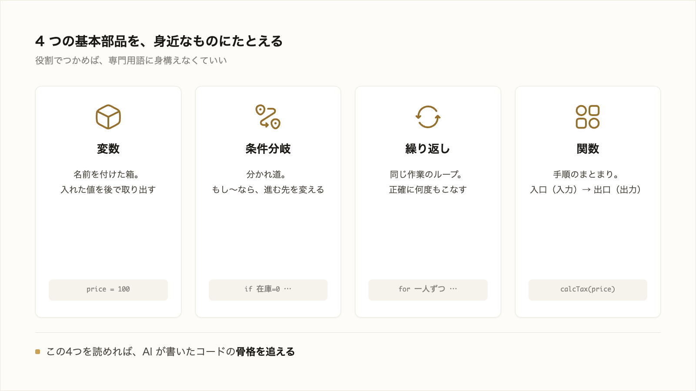

# 2-2-1 プログラムの基本概念

!!! note "前提知識"
    このセクションは 2-1-3「拡張子とプレーンテキスト」の内容を前提としています。

この Chapter では、AI が書くコードを読み解くための土台を、3つのセクションで学びます。プログラムを形づくる基本部品、用途で使い分けるプログラミング言語、書いたコードを自動で確かめるテストと TDD を、順に扱います。

| セクション | テーマ | 種類 |
|---|---|---|
| 2-2-1 | プログラムの基本概念 | 概念 |
| 2-2-2 | プログラミング言語 | 概念 |
| 2-2-3 | テストとTDD | 概念 |

**この Chapter の進め方**: まず 2-2-1 でプログラムの基本部品（変数・条件分岐・繰り返し・関数）を押さえ、2-2-2 でそれを書く言語の種類と使い分け、2-2-3 で書いたコードを自動で検証するテストへと進みます。どのセクションもコードは書かず、AI が出したコードを読んで追える程度を目指します。末尾の「やってみよう」で、実際に Claude Code に小さなコードを出させて確かめます。

<video controls preload="metadata" playsinline width="100%">
  <source src="https://github.com/coachtech-material/pj_X/releases/download/videos/2-2-1.mp4" type="video/mp4">
</video>

## このセクションで学ぶこと

- プログラムが「コンピュータへの手順の指示」であること
- 変数・条件分岐・繰り返し・関数という4つの基本部品が、それぞれ何をするものか
- 自分でコードを書くのではなく、AI が出したコードを読んで筋を追える程度でよいこと

プログラムとは何かを押さえ、どんなコードにも共通して現れる4つの基本部品を、AI の出力を読み解く目的で一つずつ確認します。

!!! note "補足"
    このセクションでは、考え方を伝える日本語の例に加えて、実際のコード例も並べて示します。コードは、広く使われている JavaScript という言語のものです（言語の種類は次の 2-2-2 で扱います）。文法を覚える必要も、書けるようになる必要もなく、日本語の説明と見比べて筋を追えれば十分です。コード中の `//` の右側は、コンピュータが読み飛ばす人向けの注記（コメント）です。実際に手を動かすのは、セクション末尾の「やってみよう」です。

---

## 導入: AI のコードを読めないと、確かめられない

1-3 で、AI への関わり方を「決めて、確かめる」と整理しました。Claude Code に開発を任せると、返ってくる成果物にはコードが含まれます。そのコードがこちらの狙いどおりかを「確かめる」には、中身をある程度読める必要があります。一行も読めないと、AI が出したものをそのまま信じるしかなくなり、検証になりません。とはいえ、自分で書けるようになる必要はありません。ここで目指すのは、AI が書いたコードの骨格を読んで筋を追えることだけです。

!!! quote "現場での考え方"
    自分は長いあいだ「コードは専門家のもの」と身構えていました。実際に Claude Code を使ってみると、書けなくても、読んで「これは全員に1通ずつ送っている」「ここで条件を分けている」と筋が追えれば、十分に仕事を任せて確かめられると分かりました。身構えるのをやめて基本部品だけ読めるようにしたら、AI に任せられる作業の範囲が一気に広がりました。



---

## プログラムとは「コンピュータへの手順の指示」

**プログラム** は、コンピュータにやってほしいことを、手順として順番に書き並べたものです。料理のレシピが「材料を切る → 炒める → 味を付ける」と手順を並べるのに似ています。

人間どうしなら「いい感じにやっておいて」で伝わることも、コンピュータには通じません。やってほしい手順を、曖昧さなく一つずつ示す必要があります。その手順を、コンピュータが理解できる言葉で書いたものがプログラムです（その「言葉」にあたるプログラミング言語は、次の 2-2-2 で扱います）。

そして本研修では、この手順を自分で書くのではなく、AI に書いてもらいます。私たちがやるのは、何をしてほしいかを決めて渡し、出てきた手順が狙いどおりかを読んで確かめることです。

## どんなコードにも現れる4つの基本部品

複雑に見えるプログラムも、いくつかの基本部品の組み合わせでできています。中でも次の4つは、どんなコードにもくり返し現れます。これだけ知っておけば、AI が書いたコードの骨格を追えます。各部品を、まず日本語の考え方でつかみ、続けて実際のコードでどう書かれるかを見ていきます。

### 変数: 値の入れ物

**変数** は、値を入れておく、名前付きの箱です。後でその名前を書けば、入れた値を取り出せます。実際のコードでは、次のように書きます。

```javascript
let price = 100;         // price という箱に 100 を入れる
let tax = price * 0.1;   // price の値で税額を計算し、tax に入れる
```

`let` は「新しい箱を用意する」という合図です。「price」と名前を付けておけば、後から何度でもその値を使えます。値を1か所にまとめておけるので、変更にも強くなります。

### 条件分岐: もし〜なら

**条件分岐** は、条件によって処理を分ける部品です。「もし〜なら A、そうでなければ B」という形をとります。日本語で考え方を書くと、次のようになります。

```text
もし 在庫 が 0 なら
    「売り切れ」と表示する
そうでなければ
    「購入する」ボタンを表示する
```

これを実際のコードにすると、次のようになります。

```javascript
if (stock === 0) {     // もし在庫が 0 なら
  // 「売り切れ」と表示する
} else {               // そうでなければ
  // 「購入する」ボタンを表示する
}
```

`if`（もし）と `else`（そうでなければ）が、日本語の「もし〜なら／そうでなければ」にそのまま対応します。`===` は「左右が等しいか」を調べる書き方です。状況に応じてふるまいを変えるとき、必ずこの形が出てきます。

### 繰り返し: ループ

**繰り返し** （ループ）は、同じ処理を何度もくり返す部品です。日本語で書くと、次のような形です。

```text
顧客リストの一人ひとりについて
    その人あてのお礼メールを1通送る
```

実際のコードでは、次のように書きます。

```javascript
for (const customer of customers) {  // 顧客リストの一人ひとりについて
  // その人あてに、お礼メールを 1 通送る
}
```

`for ... of` が「リストの一人ひとりについて、くり返す」という意味です。100 人いれば 100 回、同じ手順がくり返されます。人手では退屈でミスも出る作業を、コンピュータは正確にこなします。

### 関数: 手順のまとまり

**関数** は、一連の手順にまとめて名前を付け、呼び出して使い回せるようにした部品です。実際のコードでは、次のように書きます。

```javascript
// 「税込価格を計算する」関数（本体価格を受け取り、税込価格を返す）
function calcTax(price) {
  return price * 1.1;
}

let total = calcTax(100);   // 呼び出すと 110 が返る
```

`function` が「手順のまとまりを作る」合図、`return` が「結果を返す」合図です。一度この関数を作っておけば、あちこちで `calcTax(...)` と呼び出すだけで済みます。入力（本体価格）を渡すと出力（税込価格）が返ってくる、という入口と出口で捉えると分かりやすいです。

## 値を計算する・比べる（演算子）

変数に入れた値は、計算したり、比べたりできます。これを行う記号を **演算子** と呼びます。

四則演算（足す・引く・掛ける・割る）は、算数と同じ記号です。

```javascript
let total = price * 3;   // 掛け算（*）
let zei = total * 0.1;   // 税額を計算
let nokori = stock - 1;  // 引き算（-）
```

もう一つよく出るのが、2つの値を比べる **比較演算子** です。比べた結果は「正しい（true）／正しくない（false）」のどちらかになり、これが条件分岐の「もし〜なら」の判断に使われます。

```javascript
count > 10     // count は 10 より大きい？
stock === 0    // stock は 0 と等しい？（=== は「等しい」）
price <= 500   // price は 500 以下？
```

これらも、自分で書けるようになる必要はありません。AI のコードに出てきたとき、「ここで計算している」「ここで大小を比べている」と読めれば十分です。

## 部品が組み合わさって動く

実際のプログラムは、これらの部品の組み合わせです。たとえば「買い物カゴの合計金額を出す」なら、次のように4つが噛み合います。まず、日本語で組み立てを書くと、次のようになります。

```text
合計 を 0 にする                       （変数）
カゴの商品の一つひとつについて          （繰り返し）
    もし 在庫がある なら               （条件分岐）
        「税込価格を計算する」を呼び出す（関数）
        その結果を 合計 に足す          （変数）
合計 を表示する
```

これを実際のコードにすると、次のようになります。先ほどの4つの部品が、そのまま組み合わさっているのが分かります。

```javascript
let total = 0;                     // 合計を 0 にする（変数）
for (const item of cart) {         // カゴの商品ごとに（繰り返し）
  if (item.inStock) {              // もし在庫があるなら（条件分岐）
    // 税込価格を計算して、合計に足す（関数と変数）
    total = total + calcTax(item.price);
  }
}
console.log(total);                // 合計を表示する
```

細かい書き方を覚える必要はありません。「商品ごとにくり返して、在庫を条件で確かめ、関数で計算して、変数に足している」と筋が読めれば十分です。コードの脇にある日本語の注記（コメント）と見比べれば、どの行がどの部品にあたるかを追えます。

## 人は「読んで追える」程度でよい

本研修では、文法の暗記も、自力でコードを書くことも、アルゴリズム（効率のよい手順の工夫）も扱いません。ここで見た `let`・`if`・`for`・`function` や、四則・比較の演算子も、覚える必要はありません。目指すのは、AI が書いたコードを見て「ここは全員にくり返し送っている」「ここで条件を分けている」と骨格を追え、自分の狙いと合っているかを確かめられることです。

この「読んで確かめる」力が、後の検証（3-1-6 で扱う、完成条件との照合）の土台になります。

## やってみよう

ここまでで学んだ基本部品が、実際のアプリの中でどう使われているかを見てみましょう。Claude Code に、ブラウザで遊べるオセロを丸ごと作ってもらい、できあがったコードの中に4つの部品を探します。1行も書く必要はありません。これは Part6 の本格的なアプリ開発に向けた予告編でもあります。Claude Code が1文の依頼から本物の動くアプリを作る様子を、まず体感してください。

**1. Claude Code を起動する**

ターミナルを開き（2-1-1 の「やってみよう」と同じ手順。macOS: `command`（⌘）+ スペースで `terminal`／Windows: `Windows`（⊞）+ `X` から「ターミナル」）、`claude` と打って Enter を押します（Claude Code の起動は 1-2-1 で扱いました）。

**2. オセロを作って、開いてもらう**

入力欄に、次のように頼みます。

```text
HTML・CSS・JavaScript だけで動く、ブラウザで遊べるオセロ（リバーシ）を作ってください。全部を othello.html という1つのファイルにまとめて、作り終わったらブラウザで開いてください。
```

Claude Code がファイルを作り、ブラウザでそのページを開いてくれます（ファイルを作る・開くといった操作の前には、確認を求められることがあります。内容を見て問題なければ許可してください）。

**3. ブラウザで遊んでみる**

開いたページに、オセロの盤が表示されます。実際にマスをクリックして、石が置けるか試してみましょう。これが、たった1文の依頼から Claude Code が作った、本物の動くアプリです。

**4. コードの中に、4つの部品を見つける**

ターミナルの Claude Code に戻り、次のように頼みます。

```text
いま作った othello.html のコードの中で、変数・条件分岐・繰り返し・関数が使われている場所を1つずつ示して、それぞれが何をしているか日本語で説明してください。
```

返ってきた説明と照らして、このセクションで学んだ4つの部品が、実物のアプリの中で確かに働いていることを確かめます。

!!! warning "注意"
    思ったように動かないことや、エラーが出ることもあります。そのときは、どこがどうおかしいか（たとえば「石を置いても色が変わらない」）を Claude Code に伝えて、直してもらいましょう。この「うまくいかない様子を伝えて直してもらう」進め方は、Part3 で詳しく学びます。

**5. 後片付け（任意）**

試し終わったら、Claude Code に「作った othello.html を削除して」と頼めば片付けられます。手元に残して、後で眺めても構いません。

!!! success "確認"
    ブラウザにオセロの盤が表示され、石が置けたら成功です（AI が作るコードは毎回違ってよく、見た目や動きが例と一致する必要はありません）。あわせて、コードの中に変数・条件分岐・繰り返し・関数のどれかを見つけられれば、学んだ部品が実物の中で働いていることを確かめられたことになります。

---

## まとめ

- プログラムは、コンピュータへの手順の指示。曖昧さなく一つずつ示したもので、本研修ではこれを AI に書かせる
- どんなコードにも、変数（値の入れ物）・条件分岐（もし〜なら）・繰り返し（ループ）・関数（手順のまとまり）の4つの基本部品がくり返し現れる
- 自分で書けるようになる必要はなく、AI が出したコードの骨格を読んで筋を追え、狙いと合っているか確かめられればよい

---

本文では JavaScript のコードを例に見ましたが、プログラミング言語は一つではありません。次のセクションでは、この手順を書くための言葉であるプログラミング言語を扱います。用途で複数を使い分けること（Web に強い JavaScript／TypeScript、データ分析の Python など）と、値の種類を表す「型」があり型エラーは AI が直す対象として読めればよいことを押さえ、本研修で AI が書く言語が主に TypeScript／JavaScript であることを把握します。
