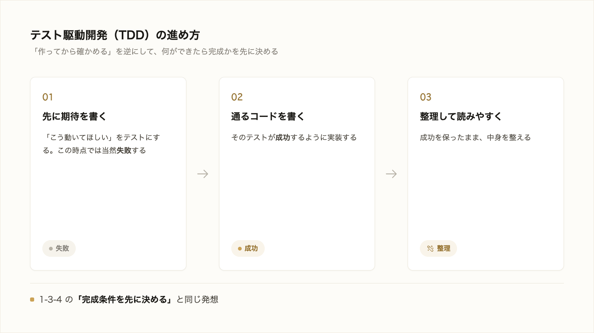

# 2-2-3 テストとTDD

!!! note "前提知識"
    このセクションは 2-2-1「プログラムの基本概念」の内容を前提としています。

## このセクションで学ぶこと

- ソフトウェアが期待どおり動くかを自動で確かめる仕組みがテスト（自動テスト）であること
- 先に「期待する動き」を決めてから実装するテスト駆動開発（TDD）の進め方
- AI がコードを書く時代に、テストが「書いたコードを自動で検証する安全網」として働くこと

テストとは何かを押さえ、TDD という進め方と、AI 活用の時代にテストが果たす役割までを見ていきます。

!!! note "補足"
    このセクションの本文に出てくるテストの例は、読んで考え方をつかむための例です。テストコードを自分で書く必要はありません。実際に AI にテストを書かせて回すのは、Part6 のアプリ開発で扱います。

---

## 導入: AI が書いたコード、本当に正しい?

Claude Code は素早くコードを書きますが、それが常に正しいとは限りません。見た目には動いていても、特定の条件で間違った結果を返すことがあります。すべてのパターンを人が手で確かめるのは大変で、見落としも出ます。この「正しさを毎回くり返し確かめる」役割を、人に代わって自動でこなすのがテストです。

!!! quote "現場での考え方"
    自分が痛い目を見たのは、表計算で作った集計表を一度直したとき、別の月の数字がいつのまにかずれていたことです。直した箇所は確かめても、それ以外まで毎回見直してはいませんでした。テストがある開発では、こうした「直したつもりが別を壊す」を自動でくり返し見張ってくれます。手で全部を確かめ続けるのは無理だと知っているほど、その安心はありがたく感じます。



---

## テスト（自動テスト）とは

**テスト** （自動テスト）は、プログラムが期待どおり動くかを、別のプログラムで自動的に確かめる仕組みです。

たとえば「税込価格を計算する」関数（2-2-1）が正しいかを確かめるなら、こういう確認を用意します。

```text
100 を渡したら 110 が返ってくるはず
0   を渡したら 0   が返ってくるはず
```

このような「入力と、期待する結果」の組をテストとして用意しておくと、ボタン一つで何十・何百の確認を一気に走らせられます。期待どおりなら「成功」、違えば「ここが合っていない」と教えてくれます。

人が毎回すべてを手で確かめる代わりに、テストを一度用意すれば、何度でも同じ確認を正確にくり返せます。

## テスト駆動開発（TDD）: 先に期待を決める

**テスト駆動開発** （TDD）は、コードを書く前に、先にテスト（＝期待する動き）を決めてしまう進め方です。順番は次のようになります。

```text
1. 先に「こう動いてほしい」をテストとして書く（この時点では当然、失敗する）
2. そのテストが成功するように、コードを書く
3. 成功したら、中身を整理して読みやすくする
```

ふつうは「作ってから確かめる」と考えがちですが、TDD はそれを逆にして「何ができたら完成かを先に決めてから作る」進め方です。これは、1-3-4 で学んだ「アウトカムから逆算して完成条件を先に決める」考え方と、よく似ています。先にゴールをはっきりさせるほど、出来上がりが狙いからずれにくくなります。

## AI 時代に、テストが効く理由

AI がコードを書く時代には、テストの価値はむしろ高まります。理由は、テストが「AI の書いたコードが正しいかを自動で検証する安全網」になるからです。

- AI は素早く大量にコードを書きますが、正しさは保証されません。テストがあれば、書いたそばから自動で確かめられます。
- いったん作ったものを後から直したとき、その変更が別のどこかを壊していないかも、テストが自動で見張ってくれます。

ここでの役割分担が大切です。**何を確かめたいか** （どう動けば正しいか）を決めるのは人です。その確認を実際に書いて走らせるテストは、AI に書かせて回せます。人がゴールを定め、AI がそれを検証する仕組みを用意する、という形です。

本研修では、テストコードを自分で書く演習はしません。実際に AI にテストを書かせて回すのは、Part6 のアプリ開発で扱います。ここでは「テストという安全網があり、それは AI に用意させられる」と知っておけば十分です。

---

## まとめ

- テスト（自動テスト）は、プログラムが期待どおり動くかを別のプログラムで自動的に確かめる仕組み。一度用意すれば何度でも正確にくり返せる
- テスト駆動開発（TDD）は、先に「期待する動き」をテストとして決めてから実装する進め方。1-3-4 の「完成条件を先に決める」と同じ発想
- AI 時代はテストが「書いたコードを自動で検証する安全網」になる。何を確かめたいかは人が決め、テストは AI に書かせて回せる

---

この Chapter では、AI が書くコードを読み解く土台として、プログラムの基本部品、用途で使い分ける言語、そして書いたコードを自動で確かめるテストと TDD を学びました。コードを書けなくても、骨格を読み、何を確かめたいかを決められる状態になりました。

次の Chapter では、アプリが扱うデータの土台に進みます。情報を継続的に保存し後から取り出す入れ物であるデータベースと、それを表（テーブル）でどう持つか、データを指示する言葉である SQL を、AI が書くものを読み解く目的で押さえていきます。
