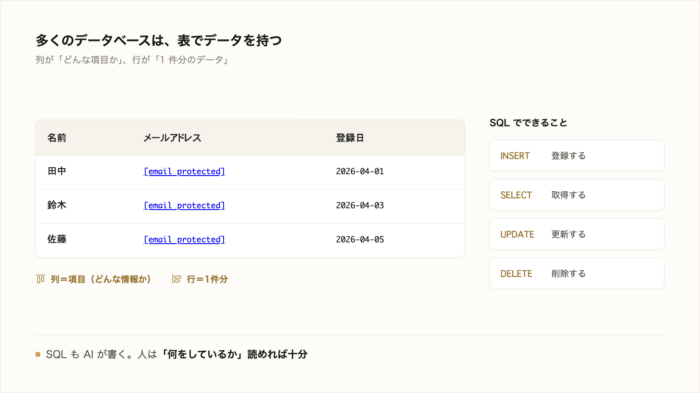

# 2-3-1 データベースとは

!!! note "前提知識"
    このセクションは 2-2-1「プログラムの基本概念」の内容を前提としています。

この Chapter では、アプリのデータを支える土台を、2つのセクションで学びます。情報を保存し取り出すデータベースの基本と、どんなデータをどう持つかを決めるテーブル設計・正規化を、順に押さえます。

| セクション | テーマ | 種類 |
|---|---|---|
| 2-3-1 | データベースとは | 概念 |
| 2-3-2 | テーブル設計と正規化 | 概念 |

**この Chapter の進め方**: まず 2-3-1 でデータベースとは何か、表（テーブル）でデータを持つこと、操作する言葉である SQL を押さえ、2-3-2 でそのテーブルをどう設計し、重複や矛盾を避けるかへと進みます。どちらもコードは書かず、AI が書くものを読み解く目的で概念をつかみます。

## このセクションで学ぶこと

- アプリが情報を継続的に保存し、後から取り出す入れ物がデータベースであること
- 多くのデータベースが、表（テーブル＝行と列）でデータを持つこと
- データを操作する言葉が SQL で、自分で書かず AI が書くものを読める程度でよいこと

データベースとは何かを押さえ、表でデータを持つこと、操作する言葉である SQL までを、AI の出力を読み解く目的で見ていきます。

!!! note "補足"
    このセクションの本文に出てくる表や SQL は、読んで仕組みをつかむための例です（読みながら打つ必要はありません）。実際にデータベースを AI に作らせて使うのは、Part6 のアプリ開発で扱います。

---

## 導入: その情報は、どこに残るのか

チャット AI に頼んだことは、画面を閉じるとやり取りが消えていきます。一方、業務で使うアプリやツールは、入力した情報を「覚えておく」必要があります。会員情報、注文の記録、議事録。こうしたデータを、後から何度でも取り出せる形で保存しておく入れ物が要ります。その入れ物が、これから学ぶデータベースです。Part6 で作るアプリも、貼り付けた議事録をこのデータベースに保存して、後から一覧・検索できるようにします。



---

## データベースとは

**データベース** は、情報を継続的に保存し、後から検索して取り出せるようにした入れ物です。

ただのメモ書きと違うのは、大量のデータを整理して持ち、「東京の会員だけ」「今月の注文だけ」のように条件で素早く取り出せる点です。アプリが情報を「覚えておき」「必要なときに引き出す」役割は、このデータベースが担います。

## 多くは表（テーブル）でデータを持つ

多くのデータベースは、データを **表** （テーブル）の形で持ちます。表は、**行** と **列** でできています。

- **列** は、データの項目（どんな情報を持つか）。たとえば「名前」「メールアドレス」「登録日」。
- **行** は、1件分のデータ。たとえば「田中さんの1件」。

会員を管理するテーブルなら、こんなイメージです。

```text
| 名前 | メールアドレス     | 登録日     |
|------|--------------------|------------|
| 田中 | tanaka@example.com | 2026-04-01 |
| 鈴木 | suzuki@example.com | 2026-04-03 |
```

列で「どんな項目を持つか」を決め、行が1件ずつ積み上がっていきます。表計算ソフトの表に似ていますが、データベースは大量のデータを正確に扱い、複数の人やアプリから同時に使うことを前提にしている点が違います。

## SQL: データへの指示の言葉

データベースに対して「登録して」「取り出して」と指示するための言葉が **SQL** （エスキューエル）です。SQL でできることは、大きく次の4つです。

- 登録する（新しい行を加える）
- 取得する（条件に合う行を取り出す）
- 更新する（既存の行を書き換える）
- 削除する（行を消す）

たとえば「会員テーブルから、登録日が今月の人を取り出す」は、SQL でこう書きます。

```sql
SELECT 名前, メールアドレス FROM 会員 WHERE 登録日 >= '2026-06-01';
```

## SQL は書かず、AI が書く（読めればよい）

本研修では、SQL を自分で書く必要はありません。SQL も AI が書きます。私たちに必要なのは、AI が書いた SQL を見て「何をしようとしているか」を読めることです。

先ほどの例なら、`SELECT` （取り出す）・`FROM 会員` （会員テーブルから）・`WHERE 登録日 >= '2026-06-01'` （登録日が今月以降のものに絞って）と、英単語と条件をつなげて読めば、「会員テーブルから今月登録の人を取り出している」と筋が追えます。これで十分です。

## Part6 で使うデータベース: Cloudflare D1

Part6 で作るアプリでは、データベースとして **Cloudflare D1** を使います（2026年6月時点）。D1 は、Cloudflare というサービスが提供するデータベースで、ここまで見た「表でデータを持ち、SQL で操作する」タイプのものです。

D1 そのものを準備したり SQL を書いたりするのは、Claude Code に任せます。いまは「アプリのデータは D1 のようなデータベースに保存され、操作は AI が書く」とつかめれば十分です（Cloudflare というサービスの位置づけは 2-4-5 で扱います）。

---

## まとめ

- データベースは、情報を継続的に保存し、条件で素早く取り出せるようにした入れ物。アプリが情報を「覚えておく」役割を担う
- 多くのデータベースは表（テーブル＝行と列）でデータを持つ。列が項目、行が1件分のデータ
- データの登録・取得・更新・削除を指示する言葉が SQL。自分では書かず、AI が書いたものを「何をしているか」読めればよい
- Part6 で作るアプリのデータは Cloudflare D1 に保存する（操作は AI が書く）

---

次のセクションでは、そのテーブルをどう設計するかを扱います。どんなデータをどの表・どの列で持つかを決めるテーブル設計がアプリの骨格であり後から変えにくいこと、同じデータの重複や矛盾を避けるために表を適切に分ける正規化の考え方を、AI の設計を読んで良し悪しを判断できる目的で押さえます。
