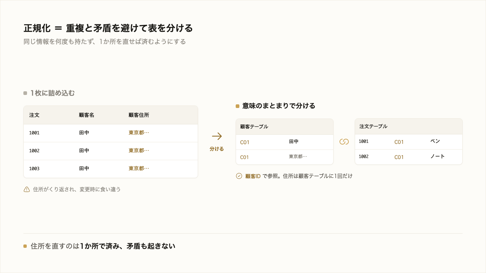
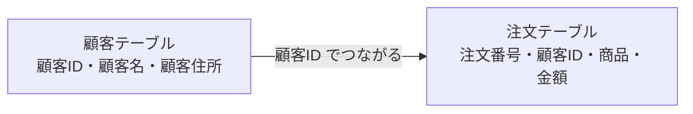

# 2-3-2 テーブル設計と正規化

!!! note "前提知識"
    このセクションは 2-3-1「データベースとは」の内容を前提としています。

## このセクションで学ぶこと

- どんなデータをどの表・どの列で持つかを決めるテーブル設計が、アプリの骨格であること
- 設計は後から変えにくいこと、そして同じデータの重複や矛盾を避ける正規化の考え方
- AI に実装を任せる時代も、「データの持ち方が妥当か」は人が読んで判断できる必要があること

テーブル設計とは何か、なぜ骨格と呼べるのか、重複と矛盾を避ける正規化を、AI の設計を読み解く目的で見ていきます。

!!! note "補足"
    このセクションの本文に出てくる表は、考え方をつかむための例です。設計を自分で完成させる必要はありません。実際に AI に設計させて確認するのは、Part6 のアプリ開発で扱います。

---

## 導入: データの持ち方を間違えると、後で苦しむ

2-3-1 で、データは表（テーブル）で持つと学びました。では、どんな項目をどの表に持たせるか。この決め方しだいで、後の使い勝手が大きく変わります。最初の持ち方を間違えると、データが二重に増えたり、食い違ったりして、後から直すのに苦労します。しかもこの「持ち方」は、アプリができてからでは変えにくい部分です。だからこそ、AI に任せる前提でも、人が「この持ち方で大丈夫か」を読めることが大切になります。

!!! quote "現場での考え方"
    自分が苦労したのは、顧客とのやり取りを1枚の表にどんどん書き足していたときです。注文のたびに顧客名と住所も毎回入力していたので、同じ人の住所が行によって微妙に違う、引っ越したら全部の行を直す羽目になる、ということが起きました。後から「顧客の表」と「注文の表」を分けておけばよかったと痛感しました。最初のデータの持ち方は、後からでは直しにくいのです。



---

## テーブル設計: どんなデータをどの表・どの列で持つか

**テーブル設計** は、扱いたいデータを、どの表に・どの列で持たせるかを決めることです。

たとえば「ネットショップの注文を管理したい」なら、何を表にするかを考えます。顧客の情報、商品の情報、注文の情報。これらを1枚の表に詰め込むのか、いくつかの表に分けるのか。この決め方がテーブル設計です。

## テーブル設計はアプリの骨格

テーブル設計は、建物でいえば骨格にあたります。後から壁紙を変えるのは簡単でも、柱の位置を動かすのは大ごとです。

アプリも同じで、画面の見た目や文言は後から変えやすい一方、データの持ち方（どの表にどの項目があるか）は、いったんデータがたまり、各所の処理がそれを前提に作られると、後から変えるのが難しくなります。だからこそ、作り始める前にデータの持ち方を妥当に決めておくことが効いてきます。

## 正規化: 重複と矛盾を避けて表を分ける

最初の例で、注文を1枚の表に詰め込むと、こうなります。

```text
| 注文番号 | 顧客名 | 顧客住所 | 商品   | 金額 |
|----------|--------|----------|--------|------|
| 1001     | 田中   | 東京都…  | ペン   | 200  |
| 1002     | 田中   | 東京都…  | ノート | 300  |
```

田中さんの住所が、注文のたびにくり返し書かれています。これだと、住所が変わったとき複数の行を直す必要があり、直し漏れると行ごとに食い違いが生まれます（同じ田中さんなのに住所が違う、という矛盾）。

これを避けるため、表を意味のまとまりで分けます。

```text
顧客テーブル                       注文テーブル
| 顧客ID | 顧客名 | 顧客住所 |     | 注文番号 | 顧客ID | 商品   | 金額 |
|--------|--------|----------|     |----------|--------|--------|------|
| C01    | 田中   | 東京都…  |     | 1001     | C01    | ペン   | 200  |
|        |        |          |     | 1002     | C01    | ノート | 300  |
```

顧客の情報は顧客テーブルに1回だけ持ち、注文テーブルからは「顧客ID（C01）」で参照します。こうすれば、住所を直すのは顧客テーブルの1か所で済み、矛盾も起きません。



このように、同じデータの重複や矛盾を避けるために表を適切に分ける考え方を **正規化** と呼びます。

!!! note "補足"
    正規化には細かい段階や理論がありますが、本研修ではそこまで立ち入りません。「同じ情報を何度も持たない」「1か所を直せば済むように分ける」という勘所をつかめれば十分です。

## AI に任せる時代も、人が「妥当か」を確認する

テーブル設計も、Claude Code に任せられます。「こういうデータを扱いたい」と伝えれば、AI が表の分け方を提案してくれます。

ただし、その設計が妥当かを判断するのは人の役割です。AI の提案を見て、「同じ情報がいくつもの表にくり返し出ていないか」「後から変更が必要になったとき、直す箇所が1か所で済むか」を読んで確かめます。骨格にあたる部分だからこそ、ここは人が目を通す価値があります（Part6 のアプリ開発で、実際に AI の設計を確認します）。

---

## まとめ

- テーブル設計は、どんなデータをどの表・どの列で持つかを決めること。アプリの骨格にあたり、後から変えにくい
- 1枚の表に詰め込むと同じ情報がくり返され、変更時に矛盾が生まれる。意味のまとまりで表を分けるのが正規化
- 設計は AI に任せられるが、「同じ情報を持ちすぎていないか」「直す箇所が1か所で済むか」を人が読んで確かめる

---

この Chapter では、アプリのデータを支える土台として、情報を保存・取得するデータベースと、表でデータを持つこと、操作する言葉である SQL、そしてデータの持ち方を決めるテーブル設計と正規化を学びました。AI が書く SQL や設計を、読んで良し悪しを判断できる足場ができました。

次の Chapter では、その保存したデータを Web を通じてやり取りする仕組みに進みます。ブラウザとサーバが要求（リクエスト）と応答（レスポンス）でやり取りすること、その住所である URL、やり取りの種類を表す HTTP メソッド、結果を表すステータスコードを、AI の出力やエラーを読み解ける程度に押さえていきます。
