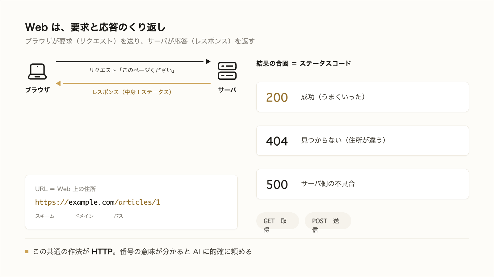

# 2-4-1 インターネットとHTTP

!!! note "前提知識"
    このセクションは 2-2-1「プログラムの基本概念」の内容を前提としています。

この Chapter では、Web アプリがどう通信し・どう守られ・どう世に出るかを、5つのセクションで学びます。インターネットと HTTP、Web アプリの仕組み、API、認証と認可、公開のしくみを順に押さえ、AI に自作アプリを任せ・外部につなぎ・公開する話（Part6）の土台をつくります。

| セクション | テーマ | 種類 |
|---|---|---|
| 2-4-1 | インターネットとHTTP | 概念 |
| 2-4-2 | Webアプリの仕組み | 概念 |
| 2-4-3 | API | 概念 |
| 2-4-4 | 認証と認可 | 概念 |
| 2-4-5 | Webアプリが公開される仕組み | 概念 |

**この Chapter の進め方**: まず 2-4-1 で通信の基本（HTTP）を押さえ、2-4-2 で Web アプリの3要素、2-4-3 でサービス同士をつなぐ API、2-4-4 で本人確認とアクセス制御、2-4-5 で公開のしくみへと進みます。どれも AI の出力やエラーを読み解ける程度を目指します。

<video controls preload="metadata" playsinline width="100%">
  <source src="https://github.com/coachtech-material/pj_X/releases/download/videos/2-4-1.mp4" type="video/mp4">
</video>

## このセクションで学ぶこと

- ブラウザとサーバが、要求（リクエスト）と応答（レスポンス）でやり取りすること
- Web 上の住所である URL の構造（スキーム・ドメイン・パス）
- やり取りの種類を表す HTTP メソッド（GET・POST）と、結果を表すステータスコード（200・404・500）

Web の裏側で交わされる、リクエストとレスポンスという共通の作法を、AI の出力やエラーを読み解ける程度に押さえます。

!!! note "補足"
    このセクションの本文に出てくる URL やコードは、読んで仕組みをつかむための例です（読みながら打つ必要はありません）。実際の通信は、Part3 以降で Claude Code を動かすときに目にします。

---

## 導入: AI が言う「404」「500」とは何か

Claude Code でアプリを動かしていると、「404 が返っています」「500 エラーです」のような言葉が出てくることがあります。この数字の意味が分かると、いま何が起きているのか見当がつき、AI に的確に直してもらえます。Web の裏側は、こうした共通の作法（HTTP）で動いています。普段は見えないその作法を、ここで一度のぞいておきます。

!!! quote "現場での考え方"
    自分は最初、AI が言う「500 が返っています」がただの呪文に見えていました。けれど「500 はサーバ側で何かに失敗している合図」だと分かってからは、「サーバ側のどの処理で失敗していそう?」と一歩踏み込んで聞けるようになりました。番号そのものを覚える必要はなくて、おおよその意味が分かるだけで、AI とのやり取りがぐっと噛み合います。



---

## ブラウザとサーバの会話: リクエストとレスポンス

ブラウザでページを開くとき、裏側では会話が起きています。ブラウザがサーバに「このページをください」と **要求** （リクエスト）を送り、サーバが中身を **応答** （レスポンス）として返す。この往復で、ページが表示されます。

Web で起きていることは、突き詰めればこのリクエストとレスポンスのくり返しです。ボタンを押す、リンクをたどる、検索する。そのたびに、ブラウザは新しいリクエストを送り、サーバがレスポンスを返しています。この一連の作法を決めた約束ごとが **HTTP** です。

## URL: Web 上の住所

リクエストの宛先となる、Web 上の住所が **URL** です。URL はいくつかの部分でできています。

```text
https://example.com/articles/1
└─┬──┘ └────┬────┘ └───┬────┘
スキーム  ドメイン      パス
```

- **スキーム** （`https://`）: やり取りの方式。`https` は通信を暗号化する安全な方式です。
- **ドメイン** （`example.com`）: どのサーバ（相手）か。
- **パス** （`/articles/1`）: そのサーバの中の、どの場所か。

住所をこの精度で書くから、世界中のどのページにも正確にたどり着けます（URL が住所だという話は、ファイルのパスを住所にたとえた 2-1-2 と同じ発想です）。

## HTTP メソッド: やり取りの種類

同じ宛先でも、「中身がほしい」のか「情報を送りたい」のかで、やることが変わります。この **やり取りの種類** を表すのが HTTP メソッドです。代表的なのは次の2つです。

| メソッド | 意味 |
|---|---|
| GET | 取得する（ページやデータをくださいと求める） |
| POST | 送信する（フォームの入力などを送って登録・処理してもらう） |

ページを見るのは GET、問い合わせフォームを送信するのは POST、というイメージです（このほかに更新や削除を表すメソッドもありますが、まずは GET と POST を押さえれば十分です）。

## ステータスコード: 結果の合図

レスポンスには、結果を表す3桁の番号が付いてきます。これが **ステータスコード** です。番号の百の位で、おおよその意味が分かります。

| コード | 意味 |
|---|---|
| 200 | 成功（うまくいった） |
| 404 | 見つからない（その住所に中身がない） |
| 500 | サーバ側の不具合（処理の途中で失敗した） |

ざっくりは、**2 で始まれば成功、4 で始まればこちらの要求側の問題、5 で始まればサーバ側の問題** と捉えれば見当がつきます。導入で触れた「404」「500」も、これで読めます。404 なら宛先（URL）が違うかもしれない、500 ならサーバ側の処理が失敗している。そう当たりをつけて、AI に「ここが原因では」と伝えられます。

---

## まとめ

- ブラウザとサーバは、要求（リクエスト）と応答（レスポンス）の往復でやり取りする。その作法を決めた約束ごとが HTTP
- URL は Web 上の住所で、スキーム（`https://`）・ドメイン・パスでできている
- HTTP メソッドはやり取りの種類（GET は取得、POST は送信）。ステータスコードは結果の合図（200 は成功、404 は見つからない、500 はサーバ側の不具合）

---

次のセクションでは、その通信の上で動く Web アプリの中身に進みます。Web アプリやツールが「画面（フロント）・処理（サーバ）・保存（データ）」の3要素でできていること、業務データの多くがクラウド・SaaS にあることを押さえ、AI に自作アプリを任せる話の土台を理解します。
