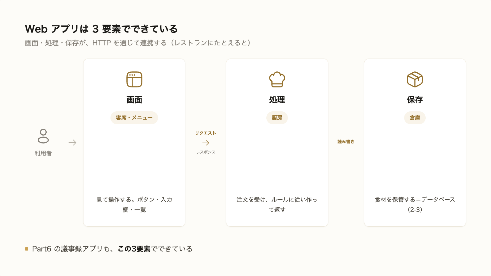
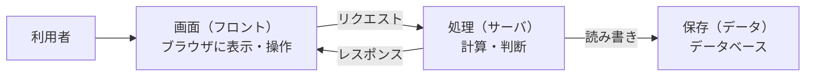

# 2-4-2 Webアプリの仕組み

!!! note "前提知識"
    このセクションは 2-4-1「インターネットとHTTP」の内容を前提としています。

<video controls preload="metadata" playsinline width="100%">
  <source src="https://github.com/coachtech-material/pj_X/releases/download/videos/2-4-2.mp4" type="video/mp4">
</video>

## このセクションで学ぶこと

- Web アプリやツールが「画面（フロント）・処理（サーバ）・保存（データ）」の3要素でできていること
- その3要素が、HTTP（2-4-1）を通じてどう連携するか
- 業務データの多くがクラウド・SaaS にあり、それが AI に自作アプリを任せる話の土台になること

Web アプリを形づくる3要素と、その連携、そして業務データの置き場所までを見ていきます。

!!! note "補足"
    このセクションは、仕組みを図と例で理解する回です。Part6 では、ここで学ぶ3要素（画面・処理・保存）を実際に AI に作らせます。

---

## 導入: 毎日使うあのツールは、何でできているのか

メール、チャット、顧客管理、経費精算。私たちが毎日ブラウザで使っているツールは、Web アプリです。普段は完成した画面しか見えませんが、その裏には共通の組み立てがあります。この組み立てを知っておくと、Part6 で自分のアプリを AI に作らせるとき、「いま AI はどの部分を作っているのか」を追えるようになります。

---

## Web アプリの3要素: 画面・処理・保存

どんな Web アプリも、大きく次の3つの要素でできています。

- **画面（フロント）**: ブラウザに表示され、人が見て操作する部分。ボタン・入力欄・一覧など。
- **処理（サーバ）**: 裏側で計算や判断をする部分。入力を受け取り、ルールに従って処理し、結果を返す。
- **保存（データ）**: 情報を残しておく部分。2-3 で学んだデータベースがここにあたる。

レストランにたとえると、画面は客席とメニュー、処理は注文を受けて作る厨房、保存は食材を保管する倉庫、という役割分担です。

## 3要素は HTTP を通じて連携する

この3つは、2-4-1 で見た HTTP のやり取りを通じてつながります。たとえば「ログインボタンを押す」と、こう流れます。

画面でボタンを押すと、画面がサーバにリクエストを送り、サーバがデータベースに問い合わせて本人かを確かめ、結果をレスポンスとして画面に返す。私たちが何気なく使っている操作の裏で、この3要素が役割を分担しています。

## 業務データの多くはクラウド・SaaS にある

かつては、こうしたアプリやデータを自社のサーバに置くのが当たり前でした。いまは、インターネット越しに使えるサービス（**SaaS**）として提供されるものが増え、業務データの多くがクラウド上にあります。メール、チャット、顧客管理、表計算といったものは、手元のパソコンではなくクラウド側にデータが保存されています。

この「データがクラウドのサービス側にある」という前提は、後で AI を社内外のサービスにつなぐ話（3-4-1 の MCP）の土台になります。データがどこにあるかが分かっていると、AI に何を・どこから扱わせるかを考えやすくなります。

## AI に自作アプリを任せる土台

Part6 で作る AI 議事録アプリも、この3要素でできています。画面（議事録を貼り、結果を見る部分）・処理（AI で要約し、保存する部分）・保存（議事録を残すデータベース）です。

3要素という分け方を知っておくと、AI が「まず画面を作ります」「次に保存する処理を作ります」と進めるのを、地図を見るように追えます。どの部分を作っているのかが分かれば、完成条件と照らして確かめやすくなります。

---

## まとめ

- Web アプリは「画面（フロント）・処理（サーバ）・保存（データ）」の3要素でできている
- 3要素は HTTP のリクエストとレスポンスを通じて連携し、操作のたびに役割を分担して動く
- 業務データの多くはクラウド・SaaS にあり、これは後で AI を外部サービスにつなぐ話の土台になる
- Part6 で作るアプリも3要素でできており、この見方が AI の作業を追う地図になる

---

次のセクションでは、サービス同士がデータをやり取りする仕組みである API を扱います。API が「決まった窓口（要求と応答）でやり取りする仕組み」であることを HTTP の延長として理解し、やり取りに JSON のような決まった形のデータが使われること、外部サービス連携（MCP）や自作アプリの土台になることを押さえます。
