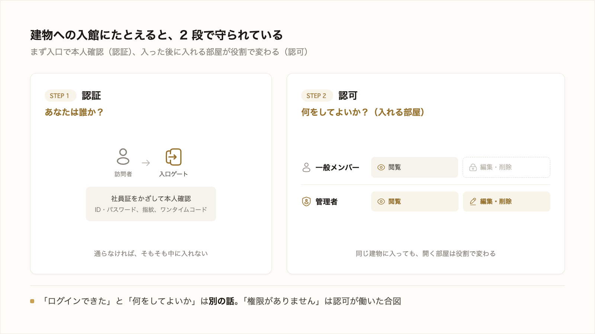

# 2-4-4 認証と認可

!!! note "前提知識"
    このセクションは 2-4-3「API」の内容を前提としています。

## このセクションで学ぶこと

- 「誰であるか」を確かめる認証（ログイン等）と、「何をしてよいか」を決める認可（権限）の違い
- Web アプリやサービス連携で、本人確認とアクセス制御がどう働くか
- 認証情報（API キー等）の扱いが、後のセキュリティ（2-5-3）につながること

認証と認可という、よく似て混同しがちな2つの考え方を、その違いと働きから押さえます。

!!! note "補足"
    このセクションは、仕組みと考え方を理解する回です。具体的な実装やプロトコルの詳細は AI に任せるため扱いません。

---

## 導入: 「ログインできる」と「何をしてよいか」は別の話

社内システムにログインできた。でも、ある資料は開けるのに、別の資料は「権限がありません」と表示される。これは、2つの異なる仕組みが働いているからです。「あなたは誰か」を確かめる仕組みと、「あなたは何をしてよいか」を決める仕組み。この2つを区別して捉えると、Web アプリやサービス連携で何が起きているかが見通せます。

---

## 認証: 誰であるかを確かめる

**認証** は、「あなたは確かに本人ですか」を確かめる仕組みです。もっとも身近なのはログインで、ID とパスワードの組み合わせで本人かを確認します。最近は、指紋や顔、スマートフォンに届くワンタイムコードなど、確かめ方も増えています。

認証の役割は、入口で本人確認をすることです。ここを通らないと、そもそもサービスを使い始められません。

## 認可: 何をしてよいかを決める

**認可** は、本人だと分かったうえで、「その人が何を見てよいか・何を操作してよいか」を決める仕組みです。いわゆる権限です。

たとえば同じサービスでも、一般のメンバーは自分の担当分を閲覧できるだけ、管理者はすべてを編集・削除できる、というように、人によってできることが変わります。これは認可が働いて、役割ごとにアクセスできる範囲を制御しているからです。

認証が「入口での本人確認」なら、認可は「入った後、どこまで立ち入ってよいかの線引き」です。

## 認証と認可はどう働くか

Web アプリでは、この2つが順番に働きます。まずログイン（認証）で本人を確かめ、次にその人の役割に応じた権限（認可）で、見える画面やできる操作が変わります。

2-4-3 で見たサービス連携（API）でも同じです。サービス同士がつながるとき、相手が「誰で（認証）・何をしてよいか（認可）」を確かめてから、データをやり取りします。

実装の細かい仕組み（どんな手順で本人を確かめ、権限を判定するか）には、いくつもの方式があります。それらは AI に任せるので、ここで覚える必要はありません。「本人確認（認証）と、権限の線引き（認可）の2段で守られている」と押さえれば十分です。

## 認証情報（API キー等）の扱いは 2-5-3 へ

API でサービスにつなぐとき、本人であることを証明する鍵として **API キー** を使うことがあります。これは、いわば「その鍵を持っている人＝本人」とみなされる、重要な情報です。

だからこそ、API キーが他人の手に渡ると、なりすまされてしまいます。こうした認証情報を「AI に渡してよいか・どう保管するか」という判断は、横断的に大切なテーマです。詳しくは 2-5-3（セキュリティ）で、コードと分けて持つ扱い方は 2-4-5 で扱います。

---

## まとめ

- 認証は「誰であるか」を確かめる本人確認（ログイン等）、認可は「何をしてよいか」を決める権限の線引き
- Web アプリでもサービス連携（API）でも、まず認証で本人を確かめ、次に認可でできる範囲を制御する
- 実装の詳細は AI に任せてよい。API キーなどの認証情報の扱いは横断的に重要で、2-5-3 につながる

---

次のセクションでは、作ったアプリをインターネットに公開する仕組みを扱います。誰でも使える形で置くことをデプロイ（公開）、その置き場をホスティング（本研修では Cloudflare）と呼ぶことを押さえ、Part6 で使う道具（画面とサーバ処理＝Next.js、データベース＝Cloudflare D1）と、鍵などの秘密の値を環境変数・シークレットとしてコードと分けて扱うことを、コードを書かずに把握します。
