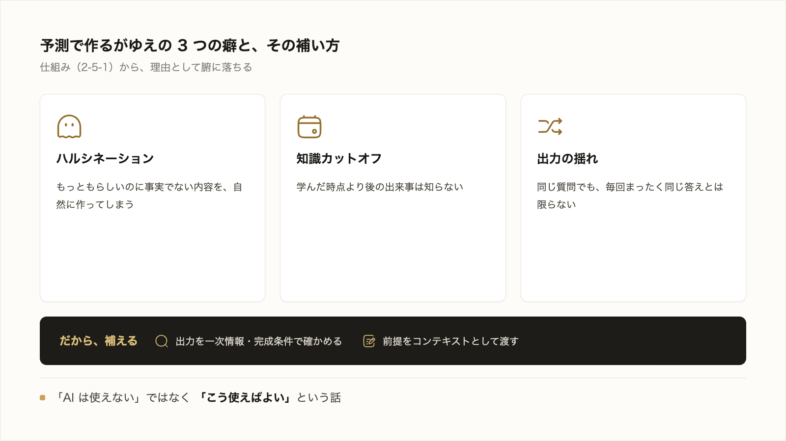

# 2-5-2 生成AIの限界とリスク

!!! note "前提知識"
    このセクションは 2-5-1「生成AIの仕組み」の内容を前提としています。

## このセクションで学ぶこと

- 予測で作る仕組みゆえに、ハルシネーション・知識カットオフ・出力の揺れが起きること
- 誤情報・バイアス・著作権・情報漏えい・過信に注意が要ること
- これらの限界は、一次情報・完成条件での確認と、コンテキストを渡すことで補える前提で扱うこと

生成AI の限界とリスクを、2-5-1 の仕組みと結びつけて理解し、それを補う見通しまで持ちます。

!!! note "補足"
    このセクションは、限界とその補い方を理解する回です。補い方の具体（検証やコンテキストの渡し方）は、Part3・Part4 で実際に手を動かして扱います。

---

## 導入: あの「自信ありげな誤り」の正体

1-3-2 で、AI が「誤りを自信ありげに返す」ことに触れ、その仕組みと限界は Part2 で扱うと約束しました。その正体が、ここで分かります。2-5-1 で見たとおり、生成AI は意味を理解しているのではなく、確率的に「それらしい続き」を作っていました。だから、事実かどうかとは別に、もっともらしい文章を自然に作れてしまいます。立派に見えるのに中身が違う。その根っこは、この仕組みにあります。

!!! quote "現場での考え方"
    自分がひやりとしたのは、ある主張の裏づけになる出典を AI に尋ねたときです。それらしい書名とページ数まで返ってきたので、危うくそのまま資料に載せるところでした。念のため調べたら、その本は存在しませんでした。AI は「出典がありそうな形」を作るのも得意なのだと、このとき肝に銘じました。それ以来、事実と出典は必ず一次情報で確かめるようにしています。

---

## 予測で作るがゆえの3つの癖

2-5-1 の仕組みから、生成AI には次の3つの癖が生まれます。

- **ハルシネーション**: もっともらしいのに事実でない内容を、自然に作ってしまうこと。予測で続きを作るので、知らないことも「それらしく」埋めてしまいます。1-3-2 の「自信ありげな誤り」がこれです。
- **知識カットオフ**: AI が学んだのは、ある時点までのテキストです。それ以降の出来事は知りません。最近の情報については、古い内容を返したり、知らなかったりします。
- **出力の揺れ**: 同じ質問でも、毎回まったく同じ答えになるとは限りません。確率で作っているため、聞くたびに表現や中身が少しずつ変わります。

## だから、注意が要ること

これらの癖から、使ううえで気をつけたい点が出てきます。

- **誤情報**: ハルシネーションによる事実誤認。数字・固有名詞・出典は特に要注意。
- **バイアス**: 学習した大量のテキストに含まれる偏りが、出力に表れることがある。
- **著作権**: 学習元に似た表現が出る可能性があり、そのまま使うと問題になる場合がある。
- **情報漏えい**: AI に何を渡すかには注意が要る（この線引きは次の 2-5-3 で扱う）。
- **過信**: いちばんの落とし穴。立派に見える出力を、確かめずに鵜呑みにしてしまうこと。

## 限界は補える

ここで大切なのは、これらが「AI は使えない」という話ではなく、「こう使えばよい」という話だということです。限界は、次の2つで補えます。

第一に、**出力を確かめる** こと。AI の出力を鵜呑みにせず、事実や出典は一次情報（公式の情報や元データ）で裏を取り、1-3-4 で決めた完成条件と照らして確認します。この確かめ方は、3-1-6 の検証で具体的に扱います。

第二に、**前提をコンテキストとして渡す** こと。**コンテキスト** とは、AI に毎回踏まえてほしい前提・背景・ルールのことです。1-3-2 で学んだプロンプトの5要素のうち「文脈」を、その都度まとめて渡しておくイメージです。状況や決まりごとを前提として渡しておくと、AI の予測がこちらの状況に沿いやすくなり、的外れが減ります。Claude Code では、この前提を CLAUDE.md という形で渡せます（具体的な使い方は Part3・Part4 で扱います）。

いまは、「生成AI には限界があるが、確かめることと、前提をコンテキストとして渡すことで補える」という見通しを持てれば十分です。

---

## まとめ

- 予測で作る仕組みゆえに、ハルシネーション（もっともらしい誤り）・知識カットオフ・出力の揺れが起きる
- 注意点は、誤情報・バイアス・著作権・情報漏えい・過信。とりわけ過信（確かめずに鵜呑み）が落とし穴
- 限界は補える。出力を一次情報・完成条件で確かめ、前提をコンテキスト（CLAUDE.md）として渡す（具体は Part3・Part4）

---

次のセクションでは、その情報漏えいに関わる、機密を AI に渡さない判断を扱います。顧客の個人情報・社外秘の未公開情報・認証情報（API キー等は渡してはいけない代表例）など、「AI に渡してよいもの・いけないもの」の線引きを押さえ、この判断が後半の各実践で繰り返し立ち返る横断の前提であることを理解します。
