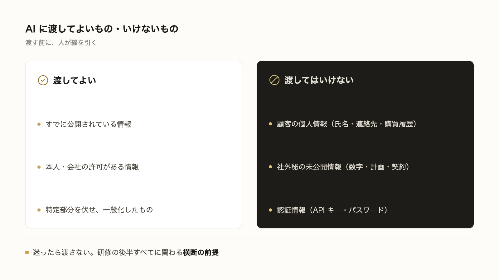

# 2-5-3 セキュリティ

!!! note "前提知識"
    このセクションは 2-5-2「生成AIの限界とリスク」と 2-4-4「認証と認可」の内容を前提としています。

## このセクションで学ぶこと

- 顧客の個人情報・社外秘の未公開情報・認証情報（API キー等）など、「AI に渡してよいもの・いけないもの」の線引き
- この判断が横断的で、後半の各実践（MCP 接続・公開・アプリ開発）で繰り返し立ち返る前提であること
- 渡したあとを守る Claude Code の組み込み保護は、Part3 で操作とともに扱うこと

機密を AI に渡さない判断という、研修全体を支える横断の前提を押さえます。

!!! note "補足"
    このセクションは、渡す前の線引きを判断できるようになる回です。Claude Code 側の組み込み保護（渡したあとを守る仕組み）は、Part3 で操作とともに扱います。

---

## 導入: AI に渡してよいもの・いけないもの

AI に仕事を任せるとき、必要な情報を渡します。ここで一つ、立ち止まって考えたいことがあります。その情報は、AI に渡してよいものでしょうか。顧客の名簿、公表前の数字、サービスの鍵。便利だからと何でも渡すと、思わぬ漏えいにつながりかねません。渡したあとを守る仕組み以前に、まず「渡す前」に人が線を引くこと。これが、研修の後半すべてに関わる横断の前提です。

!!! quote "現場での考え方"
    自分は一度、顧客リストをそのまま貼り付けて「傾向を分析して」と頼もうとして、送信の直前で手が止まりました。これは会社が預かっている個人情報で、安易に外へ出してよいものではない、と気づいたのです。結局、名前や連絡先は伏せて、分析に要る属性だけを渡しました。便利さに引っぱられると、つい何でも渡したくなります。送る前のひと呼吸が、いちばんの安全装置だと思っています。

---

## 渡してはいけない情報

AI に渡してはいけない情報には、代表的に次の3種類があります。

- **顧客の個人情報**: 氏名・連絡先・購買履歴など、本人を特定できる情報。会社が預かっているもので、外部に出すには本来の利用目的の範囲や同意の確認が要ります。
- **社外秘の未公開情報**: まだ公表していない数字・計画・契約内容など。漏れれば事業に影響します。
- **認証情報**: API キー・パスワードなど。2-4-4 で見たとおり、これらは「持っている人＝本人」とみなされる鍵そのものです。渡してはいけないものの、最も分かりやすい代表例です。

## 線引きの考え方

迷ったときは、次の問いで線を引けます。

- それは、すでに公開されている情報か（公開済みなら基本的に渡してよい）。
- 本人や会社の許可がある情報か。
- もし漏れたら、どれだけの影響があるか。

判断に迷うなら、渡さない。あるいは、特定できる部分を伏せ、必要な部分だけを一般化して渡す（先ほどの「名前を伏せて属性だけ渡す」がこれです）。迷ったら立ち止まる、を基本にします。

!!! note "補足"
    Claude Code を含む Anthropic の製品には、預かったデータの扱いに関する保護の仕組みがあります。ただし、それは「渡したあと」の話です。何を渡すかを決めて線を引くのは、まず使う人の役割です。承認の前に、渡す中身を自分で確かめる。この姿勢が前提になります。

## この判断は横断的

機密を渡さない判断は、このセクションで終わる話ではありません。研修の後半で、繰り返し立ち返ります。

- **外部サービスへの接続（MCP）**: AI を社内外のサービスにつなぐとき（3-4-1）、どのデータを扱わせるかをこの線引きで判断します。
- **共有・公開（Part5）**: 成果物を共有・公開するとき、秘密の情報を含めないよう確かめます。
- **アプリ開発（Part6）**: アプリで秘密の値を扱うとき、2-4-5 で触れた環境変数・シークレットとして、コードと分けて持ちます。

「課題を定める」「AI に実行させる」といった一連の流れのどこでも、この判断は顔を出します。だからこそ、横断の前提としてここで押さえておきます。

## 渡したあとを守る仕組みは Part3 へ

なお、Claude Code には、渡したあとの安全を支える組み込みの保護もあります。たとえば、既定では勝手にファイルを書き換えず読み取りを基本とし、変更を加える操作の前には承認を求めます。こうした保護は「渡したあと」を守る仕組みで、実際の操作とあわせて Part3（3-1）で扱います。このセクションで押さえるのは、その手前にある「渡す前の線引き」です。

---

## まとめ

- AI に渡してはいけない代表は、顧客の個人情報・社外秘の未公開情報・認証情報（API キー等）
- 線引きは「公開済みか・許可があるか・漏れたときの影響」で判断し、迷ったら渡さない（または一般化して渡す）
- この判断は横断的で、MCP 接続・公開・アプリ開発で繰り返し立ち返る。渡したあとを守る組み込み保護は Part3 で扱う

---

この Chapter では、生成AI が文章を作る仕組み、そこから生まれる限界とリスク、そして機密を AI に渡さない判断を学びました。AI の得意・不得意を理解したうえで、安全に任せるための線引きを持てました。

この Part2 では、Claude Code に業務を任せ、最後に実アプリを作るための前提知識を、コードを書かずに概念として一通り押さえました。コマンドラインとファイル（2-1）、プログラムと言語とテスト（2-2）、データベース（2-3）、Web の仕組み（2-4）、生成AI とセキュリティ（2-5）。AI に安全に任せ・つなぎ・公開するための土台がそろいました。

次の Part3 では、いよいよ Claude Code を実際に動かして成果物を出す基本操作を身につけます。依頼を投げると AI が自分でファイルを読み・調べ・編集まで進める一連の流れを実例で確かめるところから始め、ファイル編集と差分の確認、モデルや権限の選択、中断と巻き戻し、そして出力の検証と軌道修正までを、手を動かしながら一通り扱っていきます。
