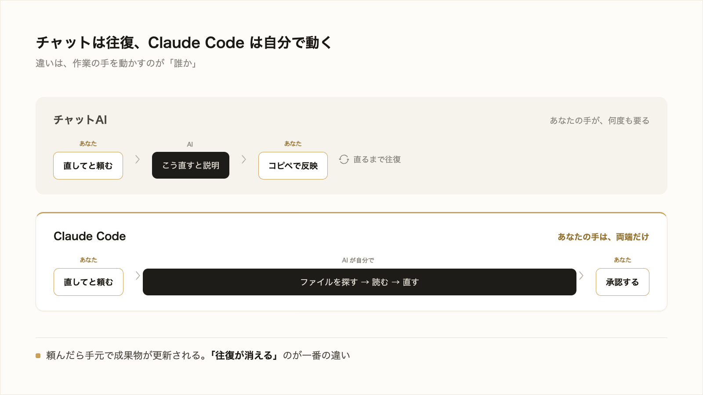

# 3-1-1 依頼して実行する

!!! note "前提知識"
    このセクションは 1-2-2「小さなタスクで最初の成果物を出す」の内容を前提としています。

ここから Chapter 3-1「基本操作」です。Claude Code を実際に動かし、依頼してから成果物が手元に残るまでの一連の操作を扱います。

| セクション | テーマ | 種類 |
|---|---|---|
| 3-1-1 | 依頼して実行する | 概念 |
| 3-1-2 | ファイル編集と差分の確認 | 概念 |
| 3-1-3 | モデル・effort・コスト | 概念 |
| 3-1-4 | 権限と Plan モードで自律度を選ぶ | 概念 |
| 3-1-5 | 中断・巻き戻し・再開 | 概念 |
| 3-1-6 | 出力の検証と軌道修正 | 概念 |

**この Chapter の進め方**: 依頼を投げて Claude Code が自分で動く流れ（3-1-1）とファイル編集・差分確認（3-1-2）で土台を作り、モデルやコスト（3-1-3）・権限と Plan モード（3-1-4）・止める／戻す／再開（3-1-5）で作業を制御し、最後に出力を検証して軌道修正する（3-1-6）まで進みます。

<video controls preload="metadata" playsinline width="100%">
  <source src="https://github.com/coachtech-material/pj_X/releases/download/videos/3-1-1.mp4" type="video/mp4">
</video>

## このセクションで学ぶこと

- 依頼を投げると、Claude Code が自分でファイルを探し・読み・編集まで進める流れ
- 関係するファイルは自動で読み込まれ、`@` で手当てする必要がないこと
- 依頼に画像やスクリーンショットも渡せること

1-1-2 で対比した「回答を返すチャット AI」と「自分で動く AI エージェント」の違いを、Claude Code の実際の動きで確かめます。

!!! note "補足"
    本文の依頼文や画面は、流れを理解するための例です（読みながら打つ必要はありません）。実際に手を動かすのは、セクション末尾の「やってみよう」です。そこで Claude Code に一文でページを作らせ、自分で動く様子を体感します（本格的に成果物を作り切るのは、この Chapter 末尾の 3-5-1 や以降のハンズオン）。

---

## 導入: チャットAIとの違い

チャット AI に「このファイルのバグを直して」と頼むと、返ってくるのは直し方の説明や、直したコードの断片です。それを開いて貼り付けるのは自分の仕事です。Claude Code は違います。同じ依頼で、関係するファイルを自分で探し、中身を読み、書き換えまで進めます。コピー＆ペーストの往復がありません。

1-1-2 で学んだエージェントの性質が、ここで具体的な操作になります。自分の役割は、文章やコードを一字ずつ書くことから、何をしてほしいかを伝えて出てきたものを確かめることへ移ります。

!!! quote "現場での考え方"
    最初に驚いたのは、ファイルの場所を一つも教えていないのに、関係するファイルを Claude Code が自分で見つけてきたことでした。チャット AI のころは、該当コードをこちらでコピーして貼り、直った結果をまた貼り戻していました。その往復がまるごと消えたのが、いちばん大きな違いでした。



---

## 依頼から編集までの流れ

依頼は、やりたいことを普通の文章で書くだけです。

```text
ログインフォームで、入力が空でも送信できてしまうバグがあります。直してください。
```

この依頼を受け取ると、Claude Code は次の順で動きます（[Anthropic「クイックスタート」](https://code.claude.com/docs/ja/quickstart)、2026年6月時点）。

1. 適切なファイルを見つける
2. 提案された変更を表示する
3. 承認を求める
4. 編集を行う


公式ガイドも「Claude Code はファイルを変更する前に常に許可を求めます」と明記しています（Anthropic「クイックスタート」2026年6月時点）。3 番目の承認は、1-2-2 で最初の成果物を作ったときに体験した、あの確認です。勝手に書き換えず、変更の前に必ず止まります。確認の頻度は場面に応じて変えられますが、その仕組みは 3-1-4 で扱います。ここでは、依頼すると Claude Code が自分で動き、編集の前に確認が入る流れをつかめれば十分です。

## 関係するファイルは自分で見つける

上の流れの 1 番目、ファイルを見つけるところを Claude Code が自分でやる点に注目してください。「このファイルを見て」と一つずつ指定しなくても、依頼の内容から関係しそうなファイルを判断し、必要なものを読み込みます。公式ガイドは「Claude Code は必要に応じてプロジェクトファイルを読み込みます。コンテキストを手動で追加する必要はありません」と説明しています（Anthropic「クイックスタート」2026年6月時点）。

ここで出てきた **コンテキスト** は、AI に踏まえてほしい前提や情報のことです。これを毎回そろえて渡す手間が省けます。自分から特定のファイルを指す `@` の使い方は次の 3-1-2 で、コンテキストの仕組みと整え方は Chapter 3-2 で扱います。

## 画像・スクリーンショットを渡す

依頼は文章だけとは限りません。画像も一緒に渡せます。言葉で説明しづらいものは、見せたほうが速いです。

- エラー画面のスクリーンショットを見せて、原因を尋ねる
- 手書きの構成案やワイヤーフレームの写真を渡して、その形で作らせる
- デザイン案（モック）を見せて、近い見た目にさせる

渡し方は 3 通りです（[Anthropic「一般的なワークフロー」](https://code.claude.com/docs/ja/common-workflows)、2026年6月時点）。

1. 画像ファイルを、Claude Code のウィンドウにドラッグ＆ドロップする
2. 画像をコピーして、`Ctrl+V` で貼り付ける
3. 画像のパスを文章で伝える（例: `この画像を見て: /Users/you/Desktop/error.png`）

2 番目の貼り付けには注意があります。公式ドキュメントは「画像をコピーして、CLI に ctrl+v で貼り付ける（cmd+v は使用しないでください）」と明記しています。macOS でも、文字の貼り付けの `Cmd+V` ではなく `Ctrl+V` です。

!!! warning "注意"
    macOS で画像を貼り付けるときは `Cmd+V` ではなく `Ctrl+V` を使います。`Cmd+V` では貼り付かないことがあります。うまくいかないときは `Ctrl+V` を試すか、ドラッグ＆ドロップやパス指定に切り替えてください。

3 番目のパス（ファイルの置き場所を示す住所）は、2-1-2 で学んだものです。

## やってみよう: HTML で LP を作らせる

ここからは、学んだことを実際に Claude Code で動かしてみます。1文の依頼から、Claude Code が自分でファイルを作り・見つけ・直す様子を体感しましょう。題材は、ブラウザで表示できる紹介ページ（LP。ランディングページ）です。1行もコードを書く必要はありません。

!!! note "補足"
    プログラミング教材と違い、AI（Claude Code）の出力は人によって・実行のたびに変わります。下の手順や依頼文はあくまで一例で、画面に出てくるものが例と違っても問題ありません。自分のページの状態を見ながら、足りない要素を頼む・気になる所を直すなど、臨機応変に読み替えて進めてください。

**1. 練習用のフォルダを作って Claude Code を起動する**

ターミナルを開きます（2-1-1 の「やってみよう」と同じ手順。macOS: `command`（⌘）+ スペースで Spotlight を開き `terminal` と入力して Enter／Windows: `Windows`（⊞）+ `X` のメニューから「ターミナル」または「Windows PowerShell」）。続けて、練習用のフォルダを1つ作り、その中へ入ります。

```bash
mkdir cc-practice
cd cc-practice
```

`mkdir` は「新しいフォルダを作る」コマンドです（macOS・Windows 共通）。`cc-practice` という空のフォルダができ、`cd` でその中へ移動します。ここを Part3 の練習場所にすると、作ったファイルが散らかりません（節をまたいで中身を引き継ぐ必要はありません）。最後に `claude` と打って Enter を押し、このフォルダを作業場所として Claude Code を起動します。

**2. 一文で紹介ページを作ってもらう**

入力欄に、次のように頼みます。

```text
架空のカフェ「ひだまり珈琲」の紹介ページ（ランディングページ）を作ってください。キャッチコピー・こだわり・メニュー・営業時間・お問い合わせボタンを、見栄えよく1つのファイル lp.html にまとめて、作り終わったらブラウザで開いてください。
```

Claude Code が `lp.html` を作り、ブラウザで開いてくれます（ファイルを作る・開く前に確認を求められたら、内容を見て問題なければ許可します。編集の前に確認が入る流れは、この節の本文で見たとおりです）。もしうまく開かないときは、その様子をそのまま Claude Code に伝えて、「どうすれば開ける？」とやり取りしながら一緒に方法を探っていきましょう。1文の依頼から、見栄えのする1枚のページができあがります。

**3. ファイル名を言わずに直してもらう**

今度は、ファイル名を一切伝えずに、追加の修正を頼みます。いま表示されているページを眺めて、まだ載っていない要素を1つ選び、それを足してもらいましょう（例: アクセス地図、よくある質問、季節のおすすめ など。何が載っているかは人それぞれなので、自分のページにまだ無いものを選びます）。

```text
さっきのページに、アクセス地図のセクションを追加してください。
```

`lp.html` という名前を伝えていないのに、Claude Code が自分でそのファイルを見つけて直します。これが、このセクションで学んだ「関係するファイルを自分で見つける」動きです。変更案が示されたら、内容を確認して許可します。

**4. 画像を渡して見た目を変えてもらう**

言葉で説明しづらい「雰囲気」は、画像で渡すと速く伝わります。好きな写真やスクリーンショット（気に入った配色のサイトの画面など）を1枚用意し、Claude Code のウィンドウにドラッグ＆ドロップして、次のように頼みます。

```text
この画像の雰囲気・配色に近づけてください。
```

画像の渡し方は、ドラッグ＆ドロップのほか、`Ctrl+V`（macOS でも `Cmd+V` ではなく `Ctrl+V`）や、画像のパスを文章で伝える方法も使えます。Claude Code が画像を読み取り、ページの見た目を寄せてくれます。

!!! warning "注意"
    思ったように表示されない・レイアウトが崩れることもあります。そのときは、どこがどうおかしいか（例:「メニューが縦に潰れて読みにくい」）を具体的に Claude Code に伝えて、直してもらいましょう。期待した状態と実際の様子を言葉で伝えるのがコツです（この直し方は 3-1-6 で詳しく扱います）。

!!! success "確認"
    ブラウザに紹介ページが表示され、ファイル名を伝えていないのに追加の修正ができ、画像を渡すと見た目に反映されれば成功です。Claude Code が作るページは毎回違ってよく、見た目や文言が例と一致する必要はありません。大事なのは、1文の依頼から Claude Code が自分でファイルを作り・見つけ・直す流れを、自分の手で起こせたことです。

---

## まとめ

- Claude Code は、依頼を受けると自分でファイルを探し・読み・変更案を示し・承認後に編集する。チャット AI のような貼り付けの往復が要らない
- 関係するファイルは自動で読み込まれ、`@` で手当てする必要はない（`@` の指定は 3-1-2、コンテキストの仕組みは 3-2）
- 編集の前には必ず承認が入る。確認の頻度は場面に応じて変えられる（3-1-4）
- 依頼には画像も渡せる。ドラッグ＆ドロップ・`Ctrl+V`・パス指定の 3 通り（macOS の貼り付けは `Ctrl+V`）

---

次のセクションでは、ファイルを読む・新しく作る・直すという編集の基本パターンと、`@` でファイルやフォルダを文脈に渡す方法、そして変更を差分（diff）で確かめてから承認する流れを扱います。
