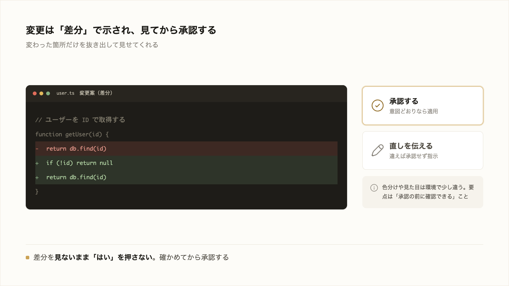

# 3-1-2 ファイル編集と差分の確認

!!! note "前提知識"
    このセクションは 3-1-1「依頼して実行する」の内容を前提としています。

<video controls preload="metadata" playsinline width="100%">
  <source src="https://github.com/coachtech-material/pj_X/releases/download/videos/3-1-2.mp4" type="video/mp4">
</video>

## このセクションで学ぶこと

- ファイルを読む・新しく作る・直すという編集の3パターン
- `@` でファイルやフォルダを文脈に渡す方法
- 変更を差分（diff）で確かめてから承認する流れ

3-1-1 の「依頼すると編集まで進む」流れを、ファイルを扱う具体的な操作として見ます。

!!! note "補足"
    本文の依頼文や変更の例は、流れを理解するための例です（読みながら打つ必要はありません）。実際に手を動かすのは、セクション末尾の「やってみよう」です（本格的な執筆は 3-5-1 以降のハンズオン）。

---

## 導入: 見ないまま承認する危うさ

AI に編集を任せると速く進みますが、頼んだとおりに直っているとは限りません。2-5-2 で見たとおり、AI は意図とずれたことをもっともらしく返すことがあります。関係ない箇所まで書き換えたり、直したつもりが別の不具合を生んだりもします。

だから Claude Code は、編集をいきなり適用せず、変更案を示してから承認を求めます。あなたは、その案を読んでから承認するかどうかを決められます。



---

## 読む・作る・直す

Claude Code にファイルを扱わせる操作は、3つに分かれます。

- **読む**: いまあるファイルの中身を読み、説明させたり問題点を洗わせたりする
- **作る**: 新しいファイルをゼロから作らせる（1-2-2 で `theme.md` を作ったのがこれです）
- **直す**: いまあるファイルの一部を書き換えさせる

実際はこれらを組み合わせて進みます。変更の前に方針を確かめたいときは、提案と適用を分けると効きます。まず直し方の案だけ出させ（この段階ではファイルは変わりません）、

```text
このエラーの直し方を、いくつか提案してください。
```

納得した案を選んでから、適用させます。

```text
user.ts を更新して、提案してくれた null チェックを追加してください。
```

ひとことで済む小さな修正なら、はじめから「直して」で構いません（[Anthropic「一般的なワークフロー」](https://code.claude.com/docs/ja/common-workflows)、2026年6月時点）。

## @ でファイルやフォルダを渡す

Claude Code は関係するファイルを自分で読み込みますが（3-1-1）、こちらから「これを見て」と渡したいときは `@` を使います。`@` に続けて名前を書くと、その中身や情報が会話に入ります（Anthropic「一般的なワークフロー」2026年6月時点）。

ファイルを指すと、中身がまるごと入ります。

```text
@src/utils/auth.js のロジックを説明してください。
```

フォルダを指すと、中のファイル一覧が入ります（中身ではなくリストです）。

```text
@src/components の構成はどうなっていますか。
```

- パスは相対でも絶対でもよい（2-1-2）
- `@file1.js と @file2.js` のように複数まとめて渡せる
- ファイルは中身、フォルダは一覧、と入るものが違う

「この資料（`@` で指定）を踏まえて提案書を作って」のように、扱ってほしい対象をはっきり示したいときに使います。

## 差分で確かめてから承認する

Claude Code がファイルを直すとき、いきなり書き換えず、どこをどう変えるかを示して承認を求めます。このとき示されるのが **差分（diff）** です。

差分は、変更の前後を比べて、どの行がどう変わったかを表したものです。消す行と足す行が並ぶので、ファイル全体を読み比べなくても、変わった箇所だけを確認できます。


大事なのは、差分を見ないまま承認しないことです。承認は、変更を確かめるための関所です。意図どおりか目を通してから承認し、違えば「ここはこう直して」と伝え直します。

!!! warning "注意"
    差分の色分けや表示の形は、環境やバージョンで少しずつ違います。見た目は気にせず、変更の前後を承認の前に確認できる点を押さえてください。差分が読みづらいときは、「何を変えようとしているのか要点を説明して」と頼むのも手です。

差分で確かめる見方は、この先でも繰り返し出てきます。Part5 の Git でも、過去の変更履歴を差分で確認します。

## やってみよう: @ で渡して差分を見て直す

ファイルを `@` で渡したときに入るものの違いと、変更を差分で確かめてから承認・差し戻しする流れを、実際のページで試します。

**1. Claude Code を起動する**

3-1-1 で作った `cc-practice` で Claude Code を起動します（まだ無ければ、3-1-1 のステップ1の手順で `cc-practice` を作って起動）。

**2. 直す対象のサイトを作る**

これから編集する材料を用意します。次のように頼みます。

```text
自分の自己紹介サイトを作ってください。名前・できること・連絡先・好きなものを載せて、profile というフォルダの中にまとめて作って、できたら開いてください。
```

**3. @ で「一覧」と「中身」の違いを見る**

`@` を使うと、扱ってほしい対象を渡せます。まずフォルダを渡します。

```text
@profile には何が入っていますか。
```

フォルダ（`@profile`）を渡すと、中のファイルの一覧が入ります。次に、一覧に出てきたファイルを1つ選び、その名前で中身を渡します。

```text
@profile/index.html の内容を説明してください。
```

`index.html` の部分は、ひとつ前の手順で表示されたファイル名に置き換えてください（ファイル名は人によって違います）。フォルダを渡すと一覧、ファイルを渡すと中身、と入るものが違うことを確かめます。

**4. 提案だけ先に出させる**

いきなり直させず、案だけ出させます。「このページの改善案を3つ、まだ変えずに提案してください」と頼みます。この段階ではファイルは変わりません。出てきた案から1つ選びます。

**5. 適用して差分を見て、差し戻す**

「では、その案で直してください」と頼むと、変更案が差分（どこをどう変えるか）として示されます。差分に目を通し、意図と違う箇所があれば「ここはこう直して」と伝え直して収束させます。

!!! warning "注意"
    差分の見た目や色分けは環境で違います。読みづらい・崩れて見えるときは、「何を変えようとしているのか要点を説明して」と Claude Code に伝え、やり取りしながら確かめましょう。

!!! success "確認"
    `@profile`（フォルダ＝一覧）と `@profile/ファイル名`（ファイル＝中身）で入る情報が違うこと、提案の段階ではファイルが変わらないこと、差分を見て承認・差し戻しを自分で判断できれば成功です。Claude Code の出力は人により違ってよく、例と一致する必要はありません。

---

## まとめ

- ファイルの操作は読む・作る・直すの3つ。方針を確かめたいときは、提案させてから適用させる2段階が効く
- `@ファイル名` で中身、`@フォルダ名` で一覧を会話に渡せる。相対・絶対どちらのパスでもよく、複数まとめて渡せる
- 編集の前に変更案（差分）が示される。差分は変更の前後で何が変わったかを表したもの
- 差分を見ないまま承認しない。意図どおりか確かめ、違えば直しを伝える（差分は Part5 の Git でも使う）

---

次のセクションでは、依頼に使うモデルの選び方（`/model`）、答える前にどれだけ考えるかを変える努力レベル（effort）の切り替え（`/effort`）、そしてコストの見方（`/usage`）を扱います。タスクの重さに道具を合わせられるようにします。
