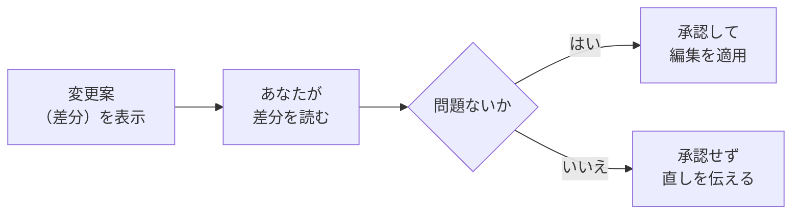

# 3-1-2 ファイル編集と差分の確認

!!! note "前提知識"
    このセクションは 3-1-1「依頼して実行する」の内容を前提としています。

## このセクションで学ぶこと

- ファイルを読ませる・新しく作らせる・直させるという、編集の基本3パターン
- `@` でファイルやフォルダを文脈に渡す方法
- 変更の前後で何がどう変わったか（差分）を確かめてから承認する流れ

3-1-1 でつかんだ「依頼すると AI が編集まで進める」流れを、ファイルを扱う具体的な操作として一段くわしく見ます。

!!! note "補足"
    このセクションに出てくる依頼文や変更の例は、流れを理解するための例です（読みながら打つ必要はありません）。実際にファイルを読ませ・作らせ・直させる操作をまとめて行うのは、この Chapter の 3-5（記事を作る）の 3-5-1 や、以降の各ハンズオンです。

---

## 導入: AIに任せた変更を、見ないまま受け入れない

AI にファイルの編集を任せると、作業は速く進みます。ただし速いぶん、何が変わったかを確かめないまま受け入れてしまう危うさがあります。2-5-2 で見たとおり、AI は事実と違うことや、こちらの意図とずれたことを、もっともらしい形で返すことがあります。編集も同じで、頼んだとおりに直っているとは限りません。関係ない箇所まで書き換えていたり、直したつもりが別の不具合を生んでいたりすることもあります。

だからこそ、Claude Code は編集を「いきなり適用する」のではなく、「変更案を見せて、承認を求める」という形をとります。あなたは、その変更案を読んでから承認するかどうかを決められます。このセクションでは、ファイルを扱う基本の操作と、変更を確かめてから承認する流れを押さえます。

---

## ファイルを読む・作る・直す

Claude Code にファイルを扱わせるときの操作は、大きく3つのパターンに分かれます。

- **既存のファイルを読ませて理解させる**: いまあるファイルの中身を読み、内容を説明させたり、問題点を洗わせたりする
- **新しいファイルを作らせる**: ゼロから新しいファイルを作らせる（1-2-2 で `theme.md` を作ったのがこれです）
- **既存のファイルを直させる**: いまあるファイルの一部を書き換えさせる

実際の作業は、これらを組み合わせて進みます。多くの場合、まず読ませて理解させ、いくつかの案を出させ、納得した案を実際に適用させる、という流れになります。たとえば、バグを直すときは次のように2段階で頼みます（Anthropic「一般的なワークフロー」2026年6月時点）。

まず、直し方の案を出させます（この段階ではまだファイルは変わりません）。

```text
このエラーの直し方を、いくつか提案してください。
```

Claude Code が示した案の中から、よさそうなものを選び、今度はそれを実際に適用させます。

```text
user.ts を更新して、提案してくれた null チェックを追加してください。
```

このように「提案させる」と「適用させる」を分けると、こちらが方針を確かめてから変更に進めます。いきなり「直して」と頼んでもよいのですが、変更の前に一度立ち止まりたいときは、この2段階が効きます。

---

## @ でファイルやフォルダを渡す

Claude Code は必要なファイルを自分で読み込みますが（3-1-1）、「このファイルを見てほしい」とこちらから明示したいときもあります。そのための記号が `@` です。`@` に続けてファイル名やフォルダ名を書くと、その中身や情報を会話に含められます（Anthropic「一般的なワークフロー」2026年6月時点）。

`@` のうしろにファイルのパスを書くと、そのファイルの中身がまるごと会話に含まれます。

```text
@src/utils/auth.js のロジックを説明してください。
```

`@` のうしろにフォルダのパスを書くと、そのフォルダの中にどんなファイルがあるかという一覧が渡されます（中身そのものではなく、ファイルのリストです）。

```text
@src/components の構成はどうなっていますか。
```

`@` の使い方には、押さえておくとよい点がいくつかあります。

- **パスは相対パスでも絶対パスでもよい**: 2-1-2 で学んだとおり、いまいる場所を基点にした相対パスでも、`/` から始まる絶対パスでも指せます
- **複数まとめて渡せる**: 1つの依頼の中で、`@file1.js と @file2.js` のように複数のファイルを参照できます
- **ファイルの中身とフォルダの一覧は別物**: ファイルを指すと中身が入り、フォルダを指すとファイルの一覧が入ります

`@` は、たとえば「この資料（`@`で指定）を踏まえて提案書を作って」「この2つのファイル（`@`で指定）の違いを説明して」のように、扱ってほしい対象をはっきり示したいときに役立ちます。

---

## 変更を差分で確かめてから承認する

Claude Code がファイルを直すとき、いきなり書き換えるのではなく、まず「どこをどう変えるか」を示してから承認を求めます。このとき示されるのが、変更の前後の違い、すなわち **差分（diff）** です。

差分とは、変更する前のファイルと、変更した後のファイルを比べて、どの行がどう変わったかを表したものです。「この行を消して、代わりにこの行を足す」「ここを書き換える」といった差を、変わった箇所だけ抜き出して見せてくれます。ファイル全体を読み比べなくても、変わったところだけに目を向けて確認できます。



ここで大事なのは、差分を見ないまま「はい」を押さないことです。3-1-1 で見たとおり、Claude Code は編集の前に必ず承認を求めます。この承認は、変更を確かめるための機会です。示された差分に目を通し、意図したとおりの変更になっているかを確認してから承認します。もし違っていれば、承認せずに「ここはこう直して」と伝え直せます。

!!! warning "注意"
    差分の見せ方（色分け・表示の形）は、使っている環境やバージョンによって少しずつ違います。細かい見た目は気にせず、「変更の前後で何がどう変わるかを、承認の前に確認できる」という点を押さえてください。表示が読みづらいときは、Claude Code に「何を変えようとしているのか、要点を言葉で説明して」と頼むのも有効です。

差分で変更を確かめる考え方は、この先でも繰り返し出てきます。Part5 で学ぶ Git でも、過去の変更履歴を差分で確認します。「変わった箇所だけを抜き出して確かめる」という見方は、AI に任せた変更を安心して受け入れるための基本になります。

---

## まとめ

- ファイルの操作は「読ませる・作らせる・直させる」の3パターン。多くは、まず提案させてから、納得した案を適用させる2段階で進む
- `@ファイル名` でそのファイルの中身を、`@フォルダ名` でフォルダ内のファイル一覧を会話に渡せる。相対・絶対どちらのパスでもよく、複数まとめて渡せる
- Claude Code は編集の前に変更案（差分）を示して承認を求める。差分は変更の前後で何がどう変わったかを表したもの
- 差分を見ないまま承認しない。意図どおりか確かめてから承認し、違えば直しを伝える（差分の確認は Part5 の Git でも使う）

---

次のセクションでは、依頼に使うモデルや努力レベル（effort）を切り替える方法と、かかるコストの見方を扱います。何をどこで切り替えられるかという地図を持ち、タスクの重さに道具を合わせられるようにします。
