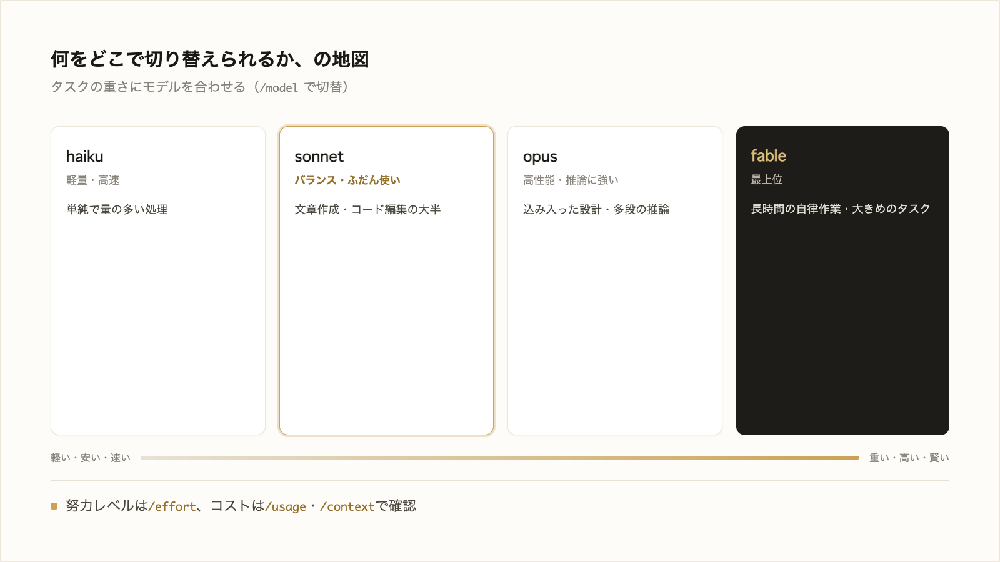

# 3-1-3 モデル・effort・コスト

!!! note "前提知識"
    このセクションは 3-1-2「ファイル編集と差分の確認」の内容を前提としています。

<video controls preload="metadata" playsinline width="100%">
  <source src="https://github.com/coachtech-material/pj_X/releases/download/videos/3-1-3.mp4" type="video/mp4">
</video>

## このセクションで学ぶこと

- 使う AI（モデル）を選び分けられること
- 答える前にどれだけ考えるか（努力レベル＝effort）を切り替えられること
- かかったコストを確認する方法

何をどこで切り替えられるかの地図を持ち、タスクの重さに合わせて選べるようにします。

!!! note "補足"
    本文のスラッシュコマンドは、何をどこで切り替えられるかを理解するための例です（読みながら打つ必要はありません）。実際に切り替えながら作業するのは 3-5-1 や以降のハンズオンです。ここに書くモデル名や既定値は 2026年6月時点のもので、今後変わります。

---

## 導入: タスクに道具を合わせる

軽い文章の整形と、込み入った設計の検討では、ふさわしい力の入れ方が違います。Claude Code では、使うモデルと、どれだけ深く考えさせるか（努力レベル）を自分で選べます。重く深くするほど結果はよくなりえますが、時間とコストが増えます。軽い仕事に重い道具は過剰です。

---

## モデルを選ぶ（/model）

**モデル** は AI の頭脳にあたります。重く賢いモデルほど複雑な仕事に強い一方、コストが高く応答もやや遅くなります。軽いモデルは速くて安いぶん、難しい仕事では力不足になることがあります。

2026年6月時点で、主に次から選べます（[Anthropic「モデル設定」](https://code.claude.com/docs/ja/model-config)、2026年6月時点）。

| 呼び名 | 位置づけ | 向く仕事 |
|---|---|---|
| `opus` | 複雑な推論に強い高性能モデル（Opus 4.8） | 込み入った設計、多段階の推論 |
| `sonnet` | 日常作業をバランスよくこなす（Sonnet 4.6） | ふだんの文章・コード編集の大半 |
| `haiku` | 高速で効率のよい軽量モデル（Haiku 4.5） | 単純で量の多い処理 |
| `fable` | 最上位モデル（Fable 5） | 長時間の自律作業、特に難しい仕事 |

切り替えは `/model` です。`/model` だけ打つと選択肢の一覧（ピッカー）が出ます。`/model sonnet` のように呼び名を続ければ、直接そのモデルに変わります。

最初に使われるモデル（既定）はプランで異なります。2026年6月時点では、Pro プランは Sonnet 4.6、Max プランや API 利用は Opus 4.8 が既定です。

!!! note "補足"
    `opus`・`sonnet` などの呼び名（エイリアス）は、その時点の最新世代を指します。ここに書いた世代名（Opus 4.8 など）やプランごとの既定は、更新で変わります。最新は公式ドキュメント（モデル設定）で確認してください。使い分けの目安について、公式は「Sonnet はほとんどのコーディングタスクをうまく処理し、Opus よりコストが低い」「複雑な推論のために Opus を予約する」としています（[Anthropic「コストを効果的に管理する」](https://code.claude.com/docs/ja/costs)、2026年6月時点）。ふだんは Sonnet、難所で Opus が目安です。

## 努力レベル（effort）を切り替える（/effort）

モデルを選んだうえで、もう一段の調整が **努力レベル（effort）** です。答えを出す前にどれだけ考えるかの度合いで、上げればじっくり考えてから答え、下げれば軽く考えて素早く答えます。

低い順に `low`・`medium`・`high`・`xhigh`・`max` の段階があります（選べる段階はモデルで少し異なり、既定は `high` のことが多いです）。切り替えは `/effort` で、引数なしならスライダーが出て、`/effort high` のように続ければ直接そのレベルになります（Anthropic「モデル設定」2026年6月時点）。

選び方はモデルと同じで、軽い・急ぎの作業は低めに、難しい・正確さの要る作業は高めにします。

## コストの見方（/usage）

Claude Code は **トークン** （AI が読み書きする文章の量を表す単位）でやり取りの量を数え、その量に応じて費用がかかります。長い文章をやり取りするほど、重いモデルを使うほど、消費は増えます。

使った量はスラッシュコマンドで確認できます。

- `/usage`: いまのセッションのトークン使用量と推定コスト、プランの利用枠に対する内訳を表示する
- `/context`: いまコンテキストを何がどれだけ占めているかの内訳を表示する（仕組みは 3-2）

表示される金額の読み方に注意が要ります。Pro や Max などの月額プランでは、使った量はもともと利用枠に含まれています。`/usage` のドル額はトークン量からの推定で、そのぶんが別に請求されるわけではありません。使用量の目安として見ます（Anthropic「コストを効果的に管理する」2026年6月時点）。

!!! info "ポイント"
    モデル・努力レベル・コストは、同じ天秤の上にあります。重く深くするほど結果はよくなりえますが、時間とコストが増えます。ふだんは軽め・速めで回し、難しいところだけ力を入れる。どのタスクにどれを当てるか、コストを仕組みに織り込む運用は、Part4 の 4-3（品質・コスト・ガバナンス）で扱います。

---

## まとめ

- モデルは AI の頭脳。`opus`（高性能）・`sonnet`（バランス）・`haiku`（軽量）・`fable`（最上位）から `/model` で選ぶ。既定はプランで異なる（2026年6月時点で Pro は Sonnet 4.6、Max・API は Opus 4.8）
- 努力レベル（effort）は考える深さ。`/effort` で `low` から `max` を切り替える（既定は `high` のことが多い）。軽い作業は低く、難しい作業は高く
- コストはトークンの量で決まる。`/usage` で使用量・推定コスト・利用枠を、`/context` で内訳を確認できる。月額プランの推定額は請求とは別の目安（運用は 4-3）

---

次のセクションでは、確認なしで実行できる範囲が変わる権限モードを `Shift+Tab` で切り替えて場面に応じた自律度を選ぶ判断軸、編集前に計画を立てさせる Plan モード、既定で備わる組み込みの保護、そして権限などの設定を `settings.json` に保存して再利用する方法を扱います。
