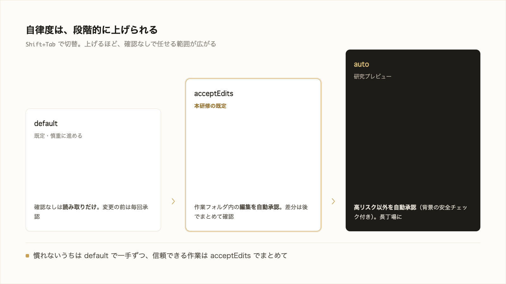

# 3-1-4 権限と Plan モードで自律度を選ぶ

!!! note "前提知識"
    このセクションは 3-1-3「モデル・effort・コスト」の内容を前提としています。

<video controls preload="metadata" playsinline width="100%">
  <source src="https://github.com/coachtech-material/pj_X/releases/download/videos/3-1-4.mp4" type="video/mp4">
</video>

## このセクションで学ぶこと

- 確認なしで実行できる範囲が変わる権限モードを `Shift+Tab` で切り替えられること
- 自律度を `default` → `acceptEdits` → `auto` と段階的に上げられること、対に Plan モードがあること
- 既定で読み取り優先・変更前に承認を求める組み込み保護があり、設定は `settings.json` に残せること

確認の頻度を場面に応じて選ぶ権限モードと、編集前に計画を立てさせる Plan モードを押さえます。

!!! note "補足"
    モード名・キー操作・既定値は 2026年6月時点のものです（変わりうるため、実際の表示はお手元の画面で確認してください）。本文の操作は読んで仕組みをつかむための説明で、実際に手を動かすのは、セクション末尾の「やってみよう」です（本格的な活用は 3-5-1 以降）。

---

## 導入: 確認の頻度を選ぶ

Claude Code は、ファイルを変更したりコマンドを実行したりする前に承認を求めます（3-1-1）。毎回確認するのは安全ですが、作業が長くなると手数が増え、何度目かの承認では中身を見ずに通すだけになりがちです。

この確認の頻度は固定ではありません。慎重に進めたいときは一手ごとに確認し、信頼できる作業はまとめて任せる。場面に応じて自律度（確認なしで任せる範囲）を選べます。



---

## 権限モードで自律度を選ぶ（Shift+Tab）

確認なしで実行できる範囲を決めるのが **権限モード** です。入力欄で **`Shift+Tab`** を押すと切り替わり、いま選んでいるモードは画面下のステータスバーに表示されます（2026年6月時点）。確認を減らす方向に、代表的な3つを挙げます。

| モード | 確認なしで実行されるもの | 向く場面 |
|---|---|---|
| `default`（既定） | 読み取りのみ | 開始時、慎重に進めたい作業 |
| `acceptEdits` | 読み取りに加え、作業フォルダ内のファイル編集と、`mkdir`・`mv`・`cp` などの一般的なファイル操作 | 差分を見ながら反復する作業 |
| `auto` | 上記に加え、高リスク以外の操作（背景の安全チェック付き） | 長時間のタスク、確認疲れの軽減 |

`default` ではファイルの読み取りだけが確認なしで進み、編集やコマンド実行の前には毎回承認を求めます。最初はこのモードで一手ずつ確かめます。`acceptEdits` は作業フォルダ内の編集を自動承認するので、出てきた変更をあとから差分（3-1-2）でまとめて見直せます。本研修のハンズオンは、この `acceptEdits` を既定として進めます。`auto` は背景で動く安全チェックが高リスクな操作だけを止め、それ以外は確認なしで進めます。

`Shift+Tab` を押すと、モードは `default → acceptEdits → plan` の順に循環します（`plan` は次の項目で扱います）。`auto` は利用条件を満たすと `plan` の後に加わります。

!!! warning "注意"
    `auto` モードは、2026年6月時点ではリサーチプレビュー（試験提供の段階）で、公式に「プロンプトを削除しますが、安全性を保証しません」とされています。利用には対応するバージョン（v2.1.83 以降）・モデル・アカウントの条件があり、満たさないと選択肢に現れません。機密に関わる操作の確認を、これに置き換えてはいけません。本研修ではまず `acceptEdits` を使い、`auto` は Part6 で長時間の自律作業とあわせて触れます。

!!! note "補足"
    上の3つのほかに、事前に許可した操作だけを通す `dontAsk`、すべての確認を飛ばす `bypassPermissions` もあります。これらは隔離された環境や自動実行向けで、本研修では扱いません。日常は `default` → `acceptEdits` と、次の Plan モードを覚えておけば十分です。

## Plan モードで先に計画を立てさせる

権限モードと対になるのが **Plan モード** です。編集を始める前に関連ファイルを読んで調べさせ、これからどう進めるかの計画を提示させ、承認するまで変更を加えさせないモードです。

大きめの作業や不慣れな対象では、いきなり作り始めると的外れな方向に進んでしまうことがあります。先に計画を見て、ずれていれば直してから実行に移せば、作り直すより手戻りが小さくて済みます。Plan モードにも `Shift+Tab` で入れます。計画が出たら、承認して実行に移すか、フィードバックを返して練り直させるかを選べます。

逆に、ひとことで済む小さな修正では、計画の段は手間が増えるだけです。アプローチに迷う・複数ファイルにまたがる・対象に不慣れ、というときに Plan モードが効きます。この「作る前に段取りを固める」進め方は、Part4 の仕様駆動（SDD）で体系立てて扱います。

## 既定の組み込み保護

2-5-3 で「渡したあとを守る組み込み保護は Part3 で扱う」と予告しました。それがこの仕組みです。Claude Code は既定で次の保護を備えています（2026年6月時点）。

- **読み取りを基本とし、変更前に承認を求める**: `default` では勝手に書き換えず、変更を伴う操作の前に必ず承認を求めます。これが権限モードの土台です。
- **保護されたパスは自動承認しない**: `.git` フォルダや `.claude`、`.mcp.json` のような設定ファイルなど、壊れると影響の大きい場所への書き込みは、`acceptEdits` でも自動承認されず、確認を挟みます（`bypassPermissions` を除く）。

2-5-3 で押さえたのは「何を AI に渡すか」という、渡す前の線引きでした。この組み込み保護は「渡したあと、AI が手元で何をしてよいか」を守る仕組みです。渡す中身は人が線を引き、渡したあとは組み込み保護が守る。両方そろって、安全に任せられます。

## 設定を settings.json に残す

権限モードのような設定は、毎回選び直さなくても **`settings.json`** に書いておけば、次回から効きます。たとえば「このプロジェクトは `acceptEdits` で始める」を、こう残せます。

```jsonc
// .claude/settings.json
{
  "permissions": {
    "defaultMode": "acceptEdits"
  }
}
```

設定ファイルは、効かせたい範囲で置き場所を選べます（2026年6月時点）。

- **自分用**: `~/.claude/settings.json` に置くと、どのプロジェクトでも効く
- **チーム共有**: `.claude/settings.json` に置くと、プロジェクトと一緒に共有でき、チームの標準になる
- **自分用かつこのプロジェクトだけ**: `.claude/settings.local.json` に置くと、共有されず自分の手元だけで効く

!!! note "補足"
    `settings.json` には権限のほか、既定モデル（`model`）や、後の Part で学ぶフックなど、さまざまな設定をまとめられます。組織として標準ルールを全員に被せるガバナンスの仕組みは 4-3 で扱います。いまは「設定はファイルに残して再利用でき、自分用とチーム共有用で置き場所が分かれる」と押さえれば十分です。

## やってみよう: Plan モードで Web アプリを設計させる

権限モードを切り替え、Plan モードで「作る前に計画を立てさせる」流れを試し、設定を `settings.json` に残して次回に効かせます。

**1. Claude Code を起動する**

3-1-1 で作った `cc-practice` で起動します（無ければ 3-1-1 のステップ1で作成）。

**2. 権限モードを切り替えてみる**

入力欄で `Shift+Tab` を押すと、画面下のステータスバーのモード表示が `default → acceptEdits → plan` と循環します。何度か押して、表示が変わるのを確かめます。

**3. Plan モードで計画を立てさせる**

`Shift+Tab` で `plan` にして、やや大きめの依頼を出します。

```text
問い合わせフォーム（名前・メール・内容の入力欄と送信ボタン、送信したらお礼メッセージが出る）付きのページを作る計画を立ててください。まだ作り始めないでください。
```

ファイルを変更せずに、これからの段取り（計画）が示されます。計画に足りない点があれば「〇〇も入れて」と伝えて練り直させ、納得したら承認して実行に移します。

**4. 設定を settings.json に残す**

毎回モードを選び直さなくて済むよう、設定を書いてもらいます。

```text
このフォルダを acceptEdits モードで始める設定を .claude/settings.json に書いてください。
```

書けたら一度 Claude Code を終了し、もう一度 `cc-practice` で起動します。起動直後のモード表示（画面下のステータスバー）が `acceptEdits` になっていることを確かめます。

!!! warning "注意"
    モードの並びや `auto` の有無は、バージョン・プラン・時点で変わります（2026年6月時点で `auto` は条件を満たすときだけ現れます）。一覧に無いモードは気にせず、`default`・`acceptEdits`・`plan` を切り替えられれば十分です。うまくいかないときは、その様子を Claude Code に伝えて一緒に確かめましょう。

!!! success "確認"
    `Shift+Tab` でモード表示が循環すること、Plan モードで（変更されずに）計画が示され練り直せること、`settings.json` を書いて再起動すると起動時のモードが変わることを確認できれば成功です。

---

## まとめ

- 確認なしで実行できる範囲を決めるのが権限モード。`Shift+Tab` で切り替え、現在のモードはステータスバーに表示される。標準の循環は `default → acceptEdits → plan`
- 自律度は `default`（読み取りのみ）→ `acceptEdits`（作業フォルダ内の編集を自動承認）→ `auto`（高リスク以外を自動承認・リサーチプレビュー）と上げられる。ハンズオンは `acceptEdits` を既定とする
- 対になる Plan モードは、編集前に計画を立てさせ、承認まで変更させない。大きめ・不慣れな作業の手戻りを防ぐ（体系化は Part4 の仕様駆動）
- 既定で読み取り優先・変更前に承認・保護パスは自動承認しない組み込み保護がある。2-5-3 の「渡す前の線引き」と、この「渡したあとの保護」は別の層
- 権限などの設定は `settings.json` に残せる。自分用は `~/.claude/settings.json`、チーム共有は `.claude/settings.json`

---

次のセクションでは、実行を途中で止める方法、チェックポイント（`/rewind`）で前の状態に巻き戻す方法、中断した作業をセッション再開（`--continue`／`--resume`）で続ける方法を扱います。これらは手元の取り消しで、永続的な記録は Part5 の Git です。
