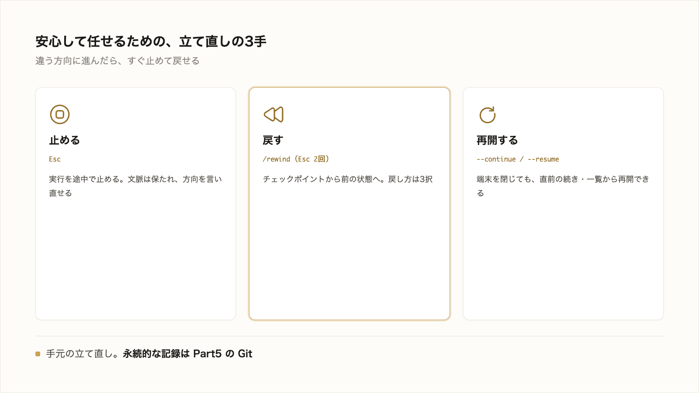

# 3-1-5 中断・巻き戻し・再開

!!! note "前提知識"
    このセクションは 3-1-4「権限と Plan モードで自律度を選ぶ」の内容を前提としています。

<video controls preload="metadata" playsinline width="100%">
  <source src="https://github.com/coachtech-material/pj_X/releases/download/videos/3-1-5.mp4" type="video/mp4">
</video>

## このセクションで学ぶこと

- 実行を途中で止めて、方向を言い直す方法
- チェックポイント（`/rewind`）で前の状態に巻き戻す方法と、その限界
- 端末を閉じても、中断した作業をセッション再開で続ける方法

途中で止める・戻す・再開するという、安心して任せるための立て直しの手段を押さえます。

!!! note "補足"
    コマンド名・キー操作は 2026年6月時点のものです（変わりうるため、実際の表示はお手元の画面で確認してください）。本文の操作は読んで仕組みをつかむための説明で、実際に手を動かすのは 3-5-1 や以降のハンズオンです。

---

## 導入: 方向が違うときに止めて戻す

AI に任せていると、途中で「これは思っていた方向と違う」と気づくことがあります。そのまま最後まで進ませると、できあがってからやり直すことになります。ずれた時点で止めて前の状態に戻せれば、危なそうな作業も気軽に任せて、だめなら戻せます。実行を止める・状態を巻き戻す・中断したところから再開する、の3つを押さえます。



---

## 実行を途中で止める（Esc）

AI が動いている最中に止めたいときは、**`Esc`** キーを押します。実行中の動作がそこで止まり、それまでのやり取り（文脈）は保たれます。だから、止めてから「そっちじゃなくて、こうしてほしい」と方向を言い直せます。最初からやり直すのではなく、途中で軌道を変えられます。違う方向に進み始めたら、進みきるのを待たずに `Esc` で止めて言い直す、という小さな立て直しをこまめに使ってください。

入力欄で `Ctrl+C` を押しても実行を止められます（入力中の文字を消すときにも使います）。

## /rewind でチェックポイントに巻き戻す

止めるだけでなく、加えられた変更そのものを前の状態に戻したいこともあります。そのための仕組みが **チェックポイント** です。

チェックポイントは、Claude Code がファイルを編集する前に自動でとっておく、その時点の状態（スナップショット）です。依頼を送るたびに記録されるので、「あの依頼を出す前」に後から戻れます。自分で操作しなくても、裏で積み重なります。

巻き戻すには、**`/rewind`** と入力するか、入力欄が空のときに **`Esc` を2回** 押してメニューを開きます。それまでに送った依頼の一覧が出るので、戻りたい時点を選び、何を戻すかを次から選びます（2026年6月時点）。

- **コードと会話を両方戻す**: ファイルの変更も、やり取りの履歴も、その時点に戻す
- **会話だけ戻す**: 今のファイルの状態は残し、やり取りだけを戻す
- **コードだけ戻す**: やり取りは残し、ファイルの変更だけを取り消す

「ファイルは戻したいが、そこに至った相談の流れは残したい」といった戻し方も選べます。

!!! warning "注意"
    巻き戻せるのは、AI が **ファイル編集ツールで行った変更** だけです。次のものは戻せません。

    - AI がターミナルのコマンドで行った変更（`rm` でのファイル削除、`mv` での名前変更など）
    - Claude Code の外であなたが手で行った変更や、別のセッションからの変更

    コマンドで消したファイルは巻き戻しでは戻りません。チェックポイントは「AI の編集を手元で取り消す」機能で、すべての変更を記録しているわけではありません。

## 中断した作業を再開する（--continue / --resume）

端末（ターミナル）を閉じても、やり取りは保存されているので、続きから再開できます。方法は2つです（2026年6月時点）。

```bash
# 直前のセッションをそのまま再開する
claude --continue

# 過去のセッション一覧から選んで再開する
claude --resume
```

`claude --continue` は、いちばん最近のセッションをそのまま続けます（「さっきの続きをやろう」というとき）。`claude --resume` は、過去のセッションの一覧（または ID・名前の指定）から選んで再開します（複数の作業を並行していて、特定のものに戻りたいとき）。再開すると、それまでの文脈を説明し直さずに続けられます。チェックポイントもセッションをまたいで保たれます。

## 手元の取り消しと、記録としての Git（Part5）

ここまでの中断・巻き戻し・再開は、いずれもセッション中の手元の立て直しです。便利ですが境目があります。チェックポイントは手元で素早く取り消すための仕組みで、「いつ・何を・なぜ変えたか」を意味のあるまとまりで永続的に残し、他の人と共有する用途には向きません。公式も、チェックポイントを「ローカル取り消し」、Git を「永続履歴」と位置づけ、バージョン管理の代わりではないとしています（2026年6月時点）。

その永続的に記録して共有する仕組みが **Git** です。変更を履歴として積み重ね、いつでも過去に戻れて、チームで共有しながら作業できます。本研修では Part5 で扱います。手元の立て直し（チェックポイント）と永続的な記録（Git）は、別のものとして分けておきます。

---

## まとめ

- 実行中の動作は `Esc` で止められる。文脈は保たれるので、止めてから方向を言い直せる
- チェックポイントは、AI がファイルを編集する前に自動でとる状態。`/rewind`（または入力欄が空のときに `Esc` を2回）でメニューを開き、コードと会話・会話だけ・コードだけ、から戻し方を選べる
- 巻き戻せるのは AI のファイル編集だけ。ターミナルのコマンドによる変更や、セッション外で手で変えた分は戻せない
- 端末を閉じても、`claude --continue` で直前のセッションを、`claude --resume` で一覧から選んで再開できる
- チェックポイントは手元の取り消しで、バージョン管理の代わりではない。永続的に記録して共有する Git は Part5

---

これで作業の足場が整いました。最後は、出てきたものが狙いどおりかを確かめる工程です。次のセクションでは、AI の出力が完成条件（1-3-4）を満たすかを一項目ずつ照合し、数字や出典を一次情報で裏取りし、ずれたら軌道修正を指示し、タスクを小さく刻んで一段ずつ照合する検証ゲートを扱います。
