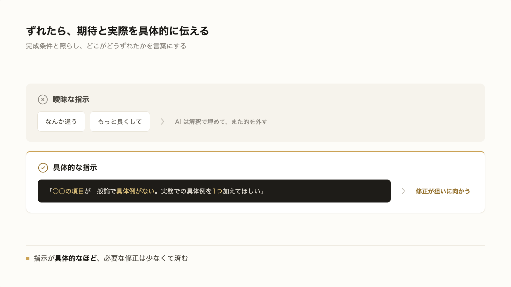

# 3-1-6 出力の検証と軌道修正

!!! note "前提知識"
    このセクションは 3-1-5「中断・巻き戻し・再開」と 1-3-4「構造化とアウトカムから決める完成条件」の内容を前提としています。

<video controls preload="metadata" playsinline width="100%">
  <source src="https://github.com/coachtech-material/pj_X/releases/download/videos/3-1-6.mp4" type="video/mp4">
</video>

## このセクションで学ぶこと

- AI の出力を、完成条件と一項目ずつ照らして確かめること
- 数字・固有名詞・出典は、一次情報で裏取りすること
- ずれたら軌道修正を指示し、タスクを小さく刻んで一段ずつ確かめる検証ゲート

立派に見える出力を鵜呑みにせず、完成条件で確かめて狙いに収束させる工程を押さえます。

!!! note "補足"
    本文の進め方は、検証の考え方を理解するための説明です。実際に手を動かすのは、セクション末尾の「やってみよう」です（この検証を回して本の第1章を仕上げるのは Part3 の本づくり、AI に自動テストを書かせて回すのは Part6）。

---

## 導入: 立派に見える出力ほど確かめる

1-3-2 と 2-5-2 で、生成AI が誤りを自信ありげに返すこと、もっともらしいのに中身が違う出力を自然に作れることを見ました。仕組み上避けられない癖です。だから受け取る側が確かめます。出力が立派に見えるほど、見た目に引っぱられて確認を省きたくなりますが、そこが落とし穴です。出力を検証してずれを直し、狙いに収束させる工程を、ここで身につけます。



---

## 完成条件と一項目ずつ照合する

確かめる拠りどころが、1-3-4 でアウトカムから逆算した **完成条件** です。「なんとなく良さそう」という感想ではなく、点検できる条件と照らして「できているか」を一項目ずつ見ます。

1-3-4 では、ある本の完成条件をこう決めました。

- 想定した初心者がつまずく一点が、具体例つきで解説されている
- どこかで読んだ一般論ではなく、実務に踏み込んだ中身がある
- 読み終えた読者が、次に何をすればよいか分かる
- 2000字程度で、専門用語にはひとこと説明がある

出てきた本を、この4項目に一つずつ当てます。曖昧な印象で全体をまとめて評価せず、点検できる条件に分けて見るから、どこが足りないかが具体的に分かります。完成条件を先に決めておく意味が、この段で効いてきます。

## 一次情報で裏取りさせる

完成条件との照合に加えて、出力に含まれる事実は別に確かめます。2-5-2 のハルシネーション（もっともらしい誤り）への対策です。とくに **数字・固有名詞・出典** は、そのまま信じてはいけません。AI は出典がありそうな形を作るのも得意で、実在しない書名やページ数をそれらしく返すことがあります。

!!! warning "注意"
    AI が示した出典や数字を、確認せずに資料へ載せないでください。「その主張の根拠となる一次情報を示して」と調べさせ、示された出典を自分で開いて、本当にその内容が書かれているかを確かめます。出典そのものが実在しない、内容が違う、ということが起こりえます。調べさせること（リサーチ）と、裏を取ること（一次情報の確認）はセットです。

## ずれを軌道修正で伝える

照合や裏取りでずれが見つかったら、軌道修正を指示します。効くのは、**期待した結果と、実際にどうだったかを具体的に伝える** ことです。「なんか違う」「もっと良くして」では、AI は何をどう直すか分からず、解釈で埋めてまた的を外します。「○○の項目が一般論で終わっていて具体例がない。実務での具体例を1つ加えてほしい」のように、どの完成条件のどこがどうずれているかを伝えると、修正が狙いに向かいます。公式も「指示がより正確であるほど、必要な修正が少なくなる」としています（[Anthropic「ベストプラクティス」](https://code.claude.com/docs/ja/best-practices)、2026年6月時点）。

軌道修正の手段は、3-1-5 で見たものがそのまま使えます。動いている最中なら `Esc` で止めて言い直し、加えた変更ごと戻したいなら `/rewind`、直前の変更だけなら「いまの変更を元に戻して」と頼みます。

!!! info "ポイント"
    同じ箇所を2回直しても収束しないときは、やり取りを重ねるより仕切り直すほうが速いことがあります。長いやり取りには、うまくいかなかった試みが積もって、かえって AI を迷わせます。公式も「同じ問題で2回以上修正したら `/clear` で会話をリセットし、学んだことを盛り込んだ具体的な指示で新しく始める」ことを勧めています（2026年6月時点）。会話を整える手段は次の Chapter 3-2 で扱います。

## タスクを刻んで一段ずつ検証する（検証ゲート）

照合・裏取り・軌道修正を、いつ行うかが大切です。大きく一気に作らせて最後にまとめて確かめると、ずれが累積して、どこから直せばよいか分からなくなります。そこで、大きな仕事を小さく刻み、一段ごとに完成条件と照らして、合格してから次へ進みます。この一段ごとの確認を **検証ゲート** と呼びます。1-3-4 で学んだ構造化（小さな単位に分ける）の、分けた区切りごとに確認の関所を置くイメージです。一段ずつ確かめれば、ずれは小さいうちに見つかり、立て直しも軽くて済みます。

2-2-3 で学んだ自動テストとは区別します。自動テストは機械が自動で確かめる仕組みでした。ここで扱う検証ゲートは、本の内容が狙いに合っているかなどを **人が完成条件で確かめる** 検証です（AI に自動テストを書かせて回すのは、コードを扱う Part6 です）。

!!! tip "ヒント"
    人が確かめるとはいえ、AI に **検証の手段** を出させると確認が楽になります。公式も、AI が合否を読めるシグナル（テスト結果・スクリプトの実行結果・画面のスクリーンショットなど）を与えると、AI 自身がそれで確かめながら反復できるとし、「成功を主張させるのではなく、証拠を示すよう指示する」ことを勧めています（2026年6月時点）。

この「完成条件を先に決めて、小さく刻んで一段ずつ照らす」進め方は、本研修の背骨です。Part4 では、大きな仕事を破綻なく仕上げる仕様駆動（4-2）として体系立てて扱います。

## やってみよう: 完成条件で検証して裏を取る

出力を「完成条件」と一項目ずつ照らし、示された出典を自分で開いて裏を取り、ずれを具体的に伝えて直す、という検証の一連を、小さな調べ物で試します。

**1. Claude Code を起動する**

3-1-1 で作った `cc-practice` で起動します（無ければ 3-1-1 のステップ1で作成）。

**2. 満たしてほしい条件を決める**

気になる事実のテーマを1つ選びます（例: 自分の業界の制度・数字、関心のある分野のトピック）。そのうえで、出力に満たしてほしい条件を2〜3個決めます。たとえば「200字程度」「具体的な数字を入れる」「出典は公的な情報源」。この条件は頭の中だけに置かず、次のステップでそのまま依頼に書いて Claude Code に伝えます。

**3. 条件を入れて書かせる**

ステップ2で決めた条件を、そのまま依頼に書き込んで頼みます。

```text
（選んだテーマ）について、200字程度で説明してください。具体的な数字を入れ、根拠となる出典（できれば公的な情報源）を示してください。
```

条件を最初から伝えても、本当に満たせているとは限りません（とくに出典は、AI がそれらしい形を作ってしまうことがあります）。だから、次のステップで一つずつ確かめます。

**4. 完成条件と照合し、出典を自分で開いて裏を取る**

出てきた説明を、ステップ2で決めた条件に一項目ずつ当てます。続けて、示された出典を **自分で開いて**、その内容が本当に書かれているかを確かめます（出典が実在しない・内容が違うこともあります）。

**5. ずれを具体的に伝えて直す**

合っていない条件があれば、「〇〇の条件が満たされていない。ここをこう直して」と、どの条件のどこがどうずれているかを具体的に伝えて収束させます。何度直しても収束しないときは `/clear` で仕切り直します（会話を整える手段は 3-2 で扱います）。

!!! warning "注意"
    AI は、出典がありそうな形（実在しない書名やページ数）をそれらしく作ることがあります。示された出典や数字は、自分で確かめるまで資料に載せないでください。調べさせることと、裏を取ることはセットです。

!!! success "確認"
    「なんとなく良い」ではなく完成条件で合否を判断できたこと、示された出典を自分で開いて裏を取れたこと（実在しない出典を見抜けたらなお良い）が確認できれば成功です。この検証を回して本の第1章を仕上げるのは Part3 の本づくりです。

---

## まとめ

- 立派に見える出力ほど鵜呑みにせず、1-3-4 の完成条件と一項目ずつ照らす
- 数字・固有名詞・出典は、AI に調べさせたうえで一次情報にあたって裏を取る（2-5-2 のハルシネーション対策）
- ずれたら、期待した結果と実際の様子を具体的に伝えて直す。軌道修正には `Esc`・`/rewind`・「元に戻して」が使え、収束しなければ `/clear` で仕切り直す
- 大きく一気に作らせず、小さく刻んで一段ごとに完成条件と照らす（検証ゲート）。AI に合否を読める検証手段を出させると確かめやすい
- ここで扱うのは人が完成条件で確かめる検証。自動テスト（2-2-3）を AI に書かせて回すのは Part6

---

これで Chapter 3-1 は終わりです。依頼を投げると AI が自分で動くこと（3-1-1）、ファイルの編集と差分の確認（3-1-2）、モデルや努力レベル・コスト（3-1-3）、権限と Plan モードで自律度を選ぶこと（3-1-4）、止める・巻き戻す・再開すること（3-1-5）、出力を完成条件で検証して軌道修正すること（本セクション）まで、基本操作が一通りつながりました。

これらの操作には共通の土台があります。AI が一度に保持できる文脈の量です。やり取りが長くなって文脈が膨らむと、AI は前の指示を取りこぼし、精度が落ちます。次の Chapter 3-2 では、この文脈を **コンテキスト** として正面から扱います。最初の 3-2-1 で、AI が一度に読める範囲（コンテキストウィンドウ）には限りがあり、作業を続けると埋まっていくこと、文脈が膨らむと精度・速度・コストに影響することを押さえ、何を入れて何を入れないかが成果を左右することを理解します。
