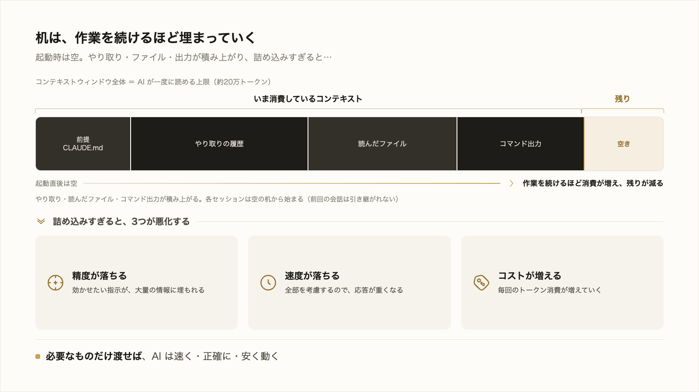
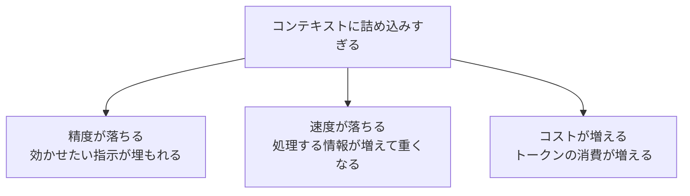

# 3-2-1 コンテキストの仕組みと重要性

!!! note "前提知識"
    このセクションは 3-1-6「出力の検証と軌道修正」の内容を前提としています。

この Chapter では、AI が一度に保持できる情報のまとまり、コンテキストを扱います。3-2-1 で仕組みと、それが成果を左右する理由を押さえ、3-2-2 で整える手段に進みます。

| セクション | テーマ | 種類 |
|---|---|---|
| 3-2-1 | コンテキストの仕組みと重要性 | 概念 |
| 3-2-2 | コンテキストを整える | 概念 |

**この Chapter の進め方**: 3-2-1 でコンテキストウィンドウの仕組みと、精度・速度・コストへの効き方を理解し、3-2-2 で整える手段（`/context`・`/clear`・`/compact`）と、必要な情報だけを渡す進め方を押さえます。

<video controls preload="metadata" playsinline width="100%">
  <source src="https://github.com/coachtech-material/pj_X/releases/download/videos/3-2-1.mp4" type="video/mp4">
</video>

## このセクションで学ぶこと

- AI が一度に読める範囲（コンテキストウィンドウ）には限りがあり、作業を続けると埋まっていくこと
- ウィンドウに何が入っているか
- 詰め込みすぎが精度・速度・コストを悪くすること

何を入れて何を入れないかが成果を左右する、Claude Code 活用の要を押さえます。

!!! note "補足"
    本文の `/context` などのコマンドは、仕組みを理解するための例です（読みながら打つ必要はありません）。整える手段は次の 3-2-2 で扱い、実際に使うのは 3-5-1 や以降のハンズオンです。数値や挙動は 2026年6月時点のものです。

---

## 導入: 一度に読める量には限りがある

2-5-2 で、生成AI の限界はコンテキストとして前提を渡すことで補えると触れ、その使い方は Part3 で扱うと約束しました。3-1-6 でも、やり取りが長くなると AI が前の指示を取りこぼすことに触れました。その正体がコンテキストです。

コンテキストとは、AI がいま考慮できる情報のまとまりです。AI は、この範囲に入っている情報だけを手がかりに、次の応答を作ります。範囲の外にある情報は、無いのと同じです。この一度に読める範囲を **コンテキストウィンドウ** と呼びます。

## コンテキストウィンドウに入っているもの

コンテキストウィンドウには、会話だけでなく、作業に必要なものがまとめて載っています。Claude Code では主に次が入ります（2026年6月時点）。

- **システムの指示**: Claude Code が AI に与える振る舞いの基本指示（普段は目に見えません）
- **CLAUDE.md の内容**: プロジェクトに置いた前提・ルール（次の Chapter 3-3 で扱います）
- **あなたと AI のやり取り**: これまでの依頼と応答の履歴
- **読み込んだファイルの中身**: AI が作業のために読んだファイル
- **コマンドの出力**: AI が実行したコマンドの結果
- **呼び出したスキルの手順**: 使ったスキル（3-3 で扱います）の中身

ウィンドウに入っているこれらすべてを見ながら、AI は応答を組み立てます。だから、何が載っているかが仕事の質を決めます。

!!! info "ポイント"
    ウィンドウの大きさは **トークン** （AI が文章を扱う最小のかたまり。2-5-1 で触れました）で測ります。2026年6月時点では、おおよそ20万トークンが標準で、モデルによっては100万トークン規模のものもあります。具体的な数値はモデルや時期で変わるので、目安として捉えてください。

## 作業を続けると埋まっていく

やり取りを重ねるほど、過去の依頼と応答が積み上がります。ファイルを読ませればその中身が、コマンドを実行させればその出力が入ります。一つひとつは小さくても、長い作業のうちにウィンドウは埋まっていきます。大きなファイルを何個も読ませたり、長い調べ物をさせたりすると、一気に埋まります。

押さえておきたいのが、**各セッションは新しいコンテキストウィンドウで始まる** ことです。Claude Code を起動するたびに、ウィンドウは空からスタートし、前回の会話は引き継がれません（前提を毎回渡し直す手間を減らす CLAUDE.md は 3-3 で扱います）。

ウィンドウが上限に近づくと、Claude Code は古いやり取りを自動で要約して空きを作ります。これを自動コンパクションと呼びます。いっぱいになって作業が止まらないようにする仕組みで、自分から整える手段とあわせて次の 3-2-2 で扱います。

## 詰め込みすぎの弊害（精度・速度・コスト）

コンテキストは、ただ広ければよいというものではありません。入れる情報の量は、AI の仕事に3方向で効いてきます。

**精度**: ウィンドウに情報を詰め込みすぎると、本当に効かせたい指示が大量の情報に埋もれ、取りこぼされやすくなります。3-1-6 で見た「やり取りが長くなると前の指示を取りこぼす」のは、これが理由です。

**速度**: AI はウィンドウの情報をすべて考慮して応答します。情報が多いほど処理が増え、応答が返るまで重くなります。

**コスト**: コストはトークンの量で決まります（3-1-3）。ウィンドウに多くを入れるほど、毎回の消費が増えます。古い無関係なやり取りを残したまま続けると、それが以後ずっとコストを生みます。

逆に言えば、必要なものだけを渡せば、AI は速く・正確に・安く動きます。だから Claude Code を使ううえでは、何を入れて何を入れないかを選ぶことが要になります。次のセクションで、その整える手段を扱います。

---

## まとめ

- コンテキストウィンドウは、AI が一度に読み込んで考慮できる情報の範囲。システムの指示・CLAUDE.md・やり取りの履歴・読んだファイル・コマンド出力・呼び出したスキルなどが入る
- 大きさはトークンで測り、2026年6月時点で標準は約20万トークン（モデルにより100万規模も）。作業を続けると埋まり、各セッションは空から始まる
- 上限が近づくと、古いやり取りを自動で要約する自動コンパクションが働く
- 詰め込みすぎると、指示が埋もれて精度が落ち、処理が重くなって速度が落ち、トークンが増えてコストも上がる。必要なものだけを渡すのが要

---

次のセクションでは、このコンテキストを意図的に整える手段を扱います。いま何にどれだけ使っているかを見る `/context`、無関係な作業に切り替えるとき会話を空にする `/clear`、これまでの会話を要約して圧縮する `/compact`、そして必要な情報だけを絞って渡す進め方を押さえます。
