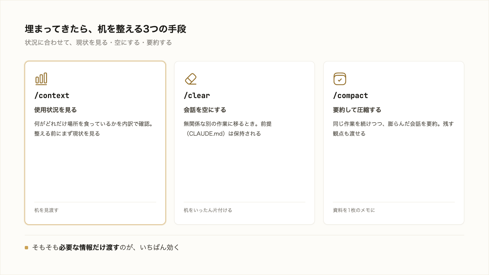

# 3-2-2 コンテキストを整える

!!! note "前提知識"
    このセクションは 3-2-1「コンテキストの仕組みと重要性」の内容を前提としています。

<video controls preload="metadata" playsinline width="100%">
  <source src="https://github.com/coachtech-material/pj_X/releases/download/videos/3-2-2.mp4" type="video/mp4">
</video>

## このセクションで学ぶこと

- いま何にどれだけ使っているかを見る `/context`
- 無関係な作業に切り替えるとき会話を空にする `/clear`
- これまでの会話を要約して圧縮する `/compact`
- 必要な情報だけを絞って渡す進め方

埋まっていくコンテキストを整える手段と、そもそも無駄に埋めない渡し方を押さえます。

!!! note "補足"
    本文のコマンド（`/context`・`/clear`・`/compact`）は、何ができるかを理解するための例です（読みながら打つ必要はありません）。実際に手を動かすのは、セクション末尾の「やってみよう」です（作業の中で使いこなすのは 3-5-1 以降）。表記や挙動は 2026年6月時点のものとして読んでください。

---

## 導入: 作業の切れ目で整える

3-2-1 で、コンテキストウィンドウには限りがあり、作業を続けると埋まること、詰め込みすぎると精度・速度・コストが悪化することを見ました。では、埋まってきたとき、作業を切り替えるとき、どうするか。Claude Code には、現状を見る・空にする・要約して圧縮する、という手段がそろっています。



## /context で使用状況を見る

整える前に、現状を見たいことがあります。`/context` を実行すると、いまのコンテキストの使用状況が、カテゴリ別の内訳と最適化の提案として表示されます。会話の履歴・読み込んだファイル・CLAUDE.md・呼び出したスキルなどが、それぞれどれだけ占めているかが分かります。

これは整える判断のための道具です。特定のファイル読み込みが大きいなら整理する、会話が膨らんでいるなら `/compact`、別の作業なら `/clear`、と現状を見てから手を打てます。

## /clear で新しい作業に切り替える

いま進めていた作業と無関係な、別の作業に移るとき。たとえば提案書を作り終え、次に求人票へ取りかかるとき。このとき使うのが `/clear` です。それまでの会話を空にして、新しく始めます。前の作業の文脈がウィンドウから消え、新しい作業のスペースが空きます。

ここで大切なのは、**会話は空になるが、プロジェクトの前提は保持される** 点です。CLAUDE.md に書いた前提（用語・ルール・進め方。3-3 で扱います）は `/clear` しても効き続けます。消えるのは、その作業でのやり取りの履歴だけです。

前の作業の古い文脈を残したまま次を続けると、それが以後ずっとウィンドウに居座り、トークンを浪費します（3-2-1）。無関係な作業に移るときは、`/clear` で区切るのが基本です。

!!! tip "ヒント"
    `/clear` で会話を空にすると、それまでのやり取りは消えます。後でその作業に戻る備えとして、巻き戻し・再開の手段は 3-1-5 で扱いました。やり取りを記録として永続的に残すのは、Part5 の Git の役割です。

## /compact で会話を要約して圧縮する

同じ作業を続けたいが、会話が膨らんできたとき。長い記事を何度も直すうちに履歴が積み上がってウィンドウを圧迫してきた、という場面です。このとき使うのが `/compact` です。これまでの会話を要約して圧縮し、空きを作ります。作業の文脈は要約として引き継がれるので、同じ作業を続けながら、占めていた場所を解放できます。

残してほしい観点を添えることもできます。

```text
/compact 認証まわりの修正点に注目してまとめて
```

何も指定しなければ AI が重要そうな箇所を推測して要約しますが、観点を渡せば、あなたが大事だと思う部分を確実に残せます。3-2-1 で触れた自動コンパクションは、この `/compact` がウィンドウの上限手前で自動で働くものです。自分から打つのは、長い新しいタスクに入る前など、自分の選んだ観点で整えたいときです。

!!! warning "注意"
    要約は万能ではありません。主要なやり取りは残っても、初期に出した細かい指示やニュアンスは、要約の過程で失われることがあります。毎回踏まえてほしい大事な前提は、会話の中だけに置かず **CLAUDE.md に書いておく** のが安全です。CLAUDE.md の前提は、圧縮されてもディスクから読み直されて効き続けます（3-3 で扱います）。一時的な文脈と、常に効かせたい前提を分けて持つ、という考え方です。

## 必要な情報だけを渡す

ここまでは埋まったものを整える手段でした。いちばん効くのは、そもそも無駄に埋めないことです。

無駄に埋まる原因のひとつが、曖昧な依頼です。「このプロジェクトをいい感じにして」のような頼み方をすると、AI は当たりをつけるために広い範囲のファイルを次々読み込み、その中身がすべてウィンドウに入ります。1-3-2 の「曖昧な指示は AI が解釈で埋める」が、コンテキストの面でも効いてきます。対象を絞って具体的に渡せば、AI は必要なファイルだけを読めばよく、無駄に埋めずに済みます。「`proposal.md` の結論部分だけを、もっと具体的に直して」のように、どこを・何のために扱うかを絞ります。

もうひとつは、重い調べ物を切り出すことです。長い Web 調査や大量のログ確認をメインの会話でやらせると、その中身がすべてウィンドウに入ります。これをサブエージェントという別の文脈に切り出すと、調べ物の中身はそちらに留まり、メインには結果だけが返ります。この方法は 3-4-2 で扱います。いまは、重い作業は別の文脈に逃がせると把握すれば十分です。

## やってみよう: コンテキストを見て整える

会話を少し埋めてから、`/context` で現状を見て、`/compact` で圧縮し、`/clear` で空にする、という整える一連を試します。

**1. Claude Code を起動する**

3-1-1 で作った `cc-practice` で起動します（無ければ 3-1-1 のステップ1で作成）。

**2. 会話を少し埋める**

興味のあるテーマを1つ選び、長めに調べさせて会話を膨らませます。

```text
（興味のあるテーマ）について、Web で詳しく調べて、長めにまとめてください。
```

**3. /context で現状を見る**

`/context` と打つと、いまのコンテキストを何がどれだけ占めているか（会話の履歴・読み込んだ内容など）が内訳で表示されます。どのカテゴリが大きいかを見ます。

**4. /compact で圧縮する**

会話が膨らんできたので、残したい観点を添えて圧縮します。

```text
/compact （いま大事にしたい点）に注目してまとめて
```

要約されて空きができます。もう一度 `/context` を打つと、占有が減っているのが分かります。

**5. /clear で切り替える**

別の作業に移るとして `/clear` を打ちます。会話が空になり、もう一度 `/context` を打つと、会話履歴の占有がリセットされているのを確認できます（CLAUDE.md などの前提を入れていれば、それは残ります。3-3 で扱います）。

!!! warning "注意"
    `/compact` の要約では、最初のほうの細かい指示やニュアンスが落ちることがあります。残したい点は観点として渡し、それでも抜けたら改めて伝え直します。毎回踏まえてほしい前提は、会話に置かず CLAUDE.md に書くのが安全です（3-3）。

!!! success "確認"
    `/context` で内訳が見えること、`/compact` のあとに占有が減ること、`/clear` のあとに会話履歴がリセットされることを観察できれば成功です。表示の数値や見た目は環境で異なります。

---

## まとめ

- `/context`: いま何にどれだけ使っているかを内訳と最適化提案で見る。整える前に現状を確認する道具
- `/clear`: 無関係な作業に切り替えるとき、会話を空にする。CLAUDE.md などプロジェクトの前提は保持される。作業の区切りで使う
- `/compact`: 同じ作業を続けつつ、膨らんだ会話を要約して圧縮する。`/compact ○○に注目して` で残す観点を渡せる。上限手前では自動でも働く（自動コンパクション）
- 要約では初期の細かい指示が失われうるので、大事な前提は CLAUDE.md に置く
- そもそも無駄に埋めないのが最も効く。曖昧な依頼は広い読み込みを誘発する。対象を絞って渡し、重い調べ物はサブエージェント（3-4-2）に逃がす

---

これで Chapter 3-2 は終わりです。コンテキストウィンドウには限りがあり、作業を続けると埋まること、詰め込みすぎると精度・速度・コストが悪化すること（3-2-1）、それを整える `/context`・`/clear`・`/compact` と、必要な情報だけを渡す進め方（本セクション）を押さえました。何を入れて何を入れないかを意識して扱えることが、活用の土台になります。

このなかで繰り返し顔を出したのが CLAUDE.md でした。要約で失われたくない前提を置く場所として、`/clear` しても効き続ける前提として、何度も登場しました。次の Chapter 3-3 では、この CLAUDE.md を正面から扱います。最初の 3-3-1 で、毎回説明していた前提（用語・ルール・進め方）を CLAUDE.md に書いて渡すと AI がそれを踏まえて動くこと、`/init` で雛形を生成できることを押さえます。
