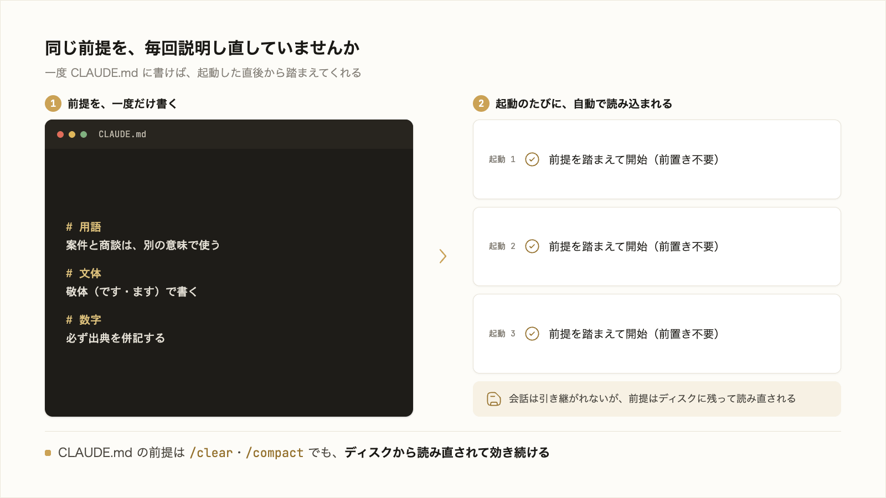

# 3-3-1 CLAUDE.md で前提を渡す

!!! note "前提知識"
    このセクションは 3-2-2「コンテキストを整える」の内容を前提としています。

この Chapter では、繰り返しを効率化する2つの主要機能を扱います。毎回踏まえてほしい前提を渡す CLAUDE.md と、繰り返す作業手順を再利用するスキルです。どちらも、一度きりの指示を次回からも効くものに変えます。

| セクション | テーマ | 種類 |
|---|---|---|
| 3-3-1 | CLAUDE.md で前提を渡す | 概念 |
| 3-3-2 | Skills で手順を再利用する | 概念 |

**この Chapter の進め方**: 3-3-1 で、毎回説明していた前提を CLAUDE.md に書いて渡す方法を押さえ、3-3-2 で、繰り返す作業手順をスキルとして保存し呼び出す方法へ進みます。これらを束ねて仕組みとして固める設計は Part4 です。

<video controls preload="metadata" playsinline width="100%">
  <source src="https://github.com/coachtech-material/pj_X/releases/download/videos/3-3-1.mp4" type="video/mp4">
</video>

## このセクションで学ぶこと

- 毎回説明していた前提（用語・ルール・進め方）を CLAUDE.md に書いて渡すと、AI が踏まえて動くこと
- `/init` で CLAUDE.md の雛形を生成できること
- 大きくなったら `@import` で rules ファイルに分割できること

毎回同じ説明を繰り返す手間を、CLAUDE.md という前提の置き場でなくす方法を押さえます。

!!! note "補足"
    本文の CLAUDE.md の記述例やコマンド（`/init` など）は、仕組みを理解するための例です（読みながら書く・打つ必要はありません）。実際に CLAUDE.md を書いて作業に効かせるのは 3-5-1 で、仕組みとして固めるのは Part4 です。記法は 2026年6月時点のものとして読んでください。

---

## 導入: 毎回同じ前提を説明している

3-2-1 で、各セッションは新しいコンテキストウィンドウで始まり、前のセッションの会話は引き継がれないと学びました。裏を返すと、毎回まっさらな状態から始まるということです。

昨日、AI に「うちの会社では『案件』と『商談』は別の意味で使う」「文章は敬体で書く」「数字には必ず出典を付ける」と伝えて、ようやく狙いどおりに動いた。ところが今日また起動すると、AI はそれを覚えていないので、同じ説明を最初からやり直すことになります。3-2-2 で見たように、`/compact` の要約でも、こうした細かい前提は失われがちでした。

この前提を、会話の中ではなく、AI が毎回必ず読む場所に置いておければ、説明は一度きりで済みます。その置き場が CLAUDE.md です。

!!! quote "現場での考え方"
    CLAUDE.md を書く前は、新しいセッションのたびに「結論から書いて」「箇条書きを多用しないで」と同じ注文を毎回付けていました。前提を CLAUDE.md にまとめてからは、起動した直後から狙いどおりの文体で返ってくるようになり、毎回の前置きが要らなくなりました。



---

## CLAUDE.md に前提を書く

**CLAUDE.md** は、プロジェクトに置く、AI への永続的な前提・指示を書いた Markdown ファイルです。Claude Code は各セッションの開始時にこれを読み込みます。ここに書いておけば、起動するたびに AI がその内容を踏まえた状態で始まります。

書くのは、毎回 AI に説明し直していたことです。

- **用語の定義**: 自分の会社やチームで特有の意味を持つ言葉（「案件」と「商談」の違いなど）
- **守ってほしいルール**: 文体（敬体で書く）、表記の決まり、出典の付け方
- **進め方**: どういう順序で作業してほしいか、何を確認してから進めてほしいか

一度書けば、毎回伝えなくても AI が踏まえて動きます。3-2-2 で「要約で失われたくない前提は CLAUDE.md に置く」と触れたのは、このことです。CLAUDE.md の前提は、`/clear` で会話を空にしても、`/compact` で圧縮しても、ディスクから読み直されて効き続けます。

ひとつ大事な性質があります。CLAUDE.md の内容は AI が踏まえる前提として渡されますが、機械的に強制されるルールではありません。公式ドキュメント（[メモリ](https://code.claude.com/docs/ja/memory)）も「強制的な設定ではなくコンテキストとして扱われる」と説明しています（2026年6月時点）。AI は読んで従おうとしますが、書き方が曖昧だと、解釈の余地が生まれて従いきれないことがあります。

だから CLAUDE.md は **具体的に書く** ほど効きます。1-3-2 の「曖昧な指示は AI が解釈で埋める」と同じです。

| 曖昧な書き方 | 具体的な書き方 |
|---|---|
| 丁寧に書く | 敬体（です・ます調）で書く |
| 簡潔にする | 1文は60字を目安にする |
| 数字を大事にする | 数字には必ず出典を併記する |

左では AI が「丁寧とは何か」を自分の解釈で埋めます。右のように検証できるくらい具体的に書くと、解釈の余地が狭まり、狙いどおりに効きます。

## /init で雛形を作る

CLAUDE.md は、ゼロから手で書く必要はありません。`/init` を実行すると、AI がいまのプロジェクトを分析して、CLAUDE.md の雛形を作ります。どんなプロジェクトか・どういう構成か・どんな決まりがありそうかを読み取り、その内容を盛り込みます。まず雛形を作らせ、そこに自分の前提（AI が自力では分からない用語やルール）を書き足すのが、現実的な始め方です。

すでに CLAUDE.md がある場合、`/init` は上書きせず、改善を提案します。なお、読み込まれている CLAUDE.md を確認・編集したいときは `/memory` が使えます。

## 大きくなったら @import で分ける

使い込むうちに、CLAUDE.md に書きたいことが増えます。用語・文体・各業務の進め方と前提が積み上がると、1つのファイルが長くなって見通しが悪くなります。そこで `@import` で別のファイルを取り込めます。CLAUDE.md の中に `@パス` と書くと、その場所のファイルの内容が読み込まれます。

```text
# 文体のルールは別ファイルにまとめる
@.claude/rules/writing-style.md

# 各業務の進め方も分けておく
@.claude/rules/sales-workflow.md
```

役割ごとに分けた別ファイルが、CLAUDE.md と一緒に読み込まれます。役割別のルールを置く場所として `.claude/rules/` フォルダがよく使われます（このカリキュラムの執筆ルールも `.claude/rules/` に分けて置かれています）。

!!! note "補足"
    `@import` のパスは、それを書いたファイルの場所を基点に解釈されます（コマンドを実行する場所ではありません）。取り込んだファイルがさらに別を取り込む入れ子は、最大4段までです（2026年6月時点）。最初は1つの CLAUDE.md で十分で、増えてきたら分けます。

CLAUDE.md を置く場所は、主に2つです。

- **プロジェクト直下の `./CLAUDE.md`**: そのプロジェクトでの前提。チームで共有したいものはここに置きます
- **自分専用の `~/.claude/CLAUDE.md`**: どのプロジェクトでも効かせたい、自分個人の好み

その前提を「このプロジェクトだけにしたいか」「自分のすべての作業で効かせたいか」で決めます。

最後に、効かせるコツをひとつ。CLAUDE.md は長く書けば効くものではありません。内容は毎回コンテキストウィンドウに読み込まれ、それ自体がトークンを消費します（3-2-1）。長すぎると肝心の指示が埋もれて従われにくくなります。公式も、1ファイル **200行以下** を目安に、本当に必要なものだけを書くことを勧めています（2026年6月時点）。簡潔さが効きやすさにつながります。

一度うまくいった仕事を CLAUDE.md やスキル・設定として書き出し、ゼロ指示で再現できる仕組みに固める設計は、Part4（4-1-2）で扱います。

---

## まとめ

- CLAUDE.md は、プロジェクトに置く AI への永続的な前提・指示。各セッションの開始時に読まれるので、毎回説明し直さなくても AI が踏まえて動く（`/clear`・`/compact` でも効き続ける）
- 内容はコンテキストとして渡され、機械的に強制はされない。「丁寧に」ではなく「敬体で書く」のように、検証できるくらい具体的に書くと効きやすい
- `/init` で、いまのプロジェクトを分析した雛形を生成できる（既にあれば改善を提案）。`/memory` で読み込み中の内容を確認・編集できる
- 増えてきたら `@パス` で別ファイルを取り込み、`.claude/rules/` に役割ごとに分けられる。配置はプロジェクト直下 `./CLAUDE.md`、自分専用 `~/.claude/CLAUDE.md`。200行以下を目安に簡潔に保つ

---

次のセクションでは、もうひとつの繰り返しを効率化する機能、スキルを扱います。CLAUDE.md が常に踏まえてほしい前提を渡すのに対し、繰り返す作業手順そのものをスキルとして保存し、次回から呼び出して再利用する方法を押さえます。
