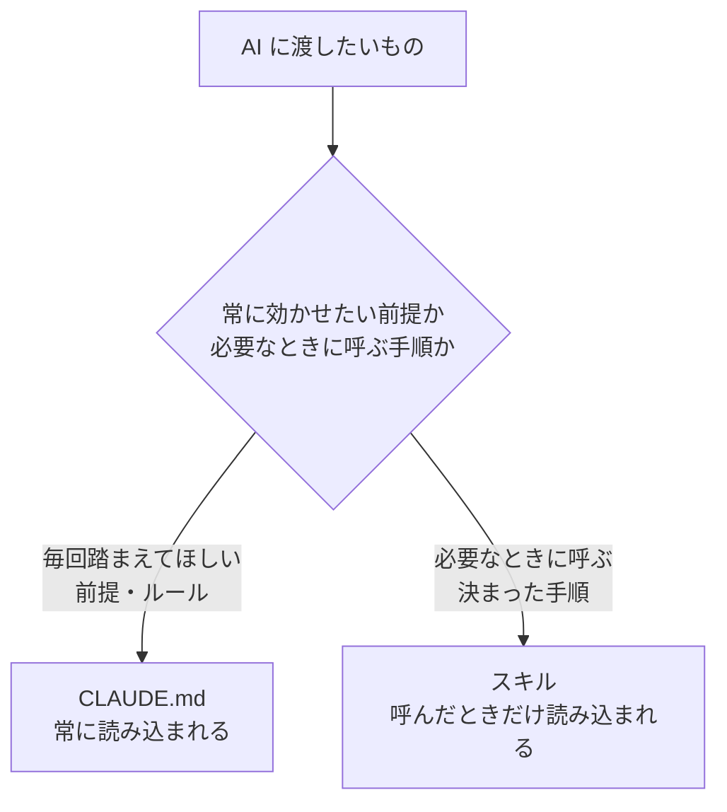

# 3-3-2 Skills で手順を再利用する

!!! note "前提知識"
    このセクションは 3-3-1「CLAUDE.md で前提を渡す」の内容を前提としています。

## このセクションで学ぶこと

- 繰り返す作業手順を、スキルとして保存して再利用できること
- スキルの呼び出し方は2通り（AI が自動で呼ぶ／自分から `/スキル名` で呼ぶ）あること
- CLAUDE.md（常に効かせたい前提）とスキル（必要なときに呼ぶ手順）の使い分け

毎回同じ手順を貼り付け直す手間を、スキルという手順の置き場でなくす方法を押さえます。

!!! note "補足"
    本文に出てくる SKILL.md の記述例やスキルの呼び出し方は、何ができるかを理解するための例です（読みながら書く・打つ必要はありません）。実際にスキルを作って業務に使い、仕組みとして固めるのは Part4 です。スキルの記法・配置は変わりうるため、2026年6月時点のものとして読んでください。

---

## 導入: 同じ手順を、毎回貼り付けていないか

3-3-1 で、毎回説明していた前提を CLAUDE.md に置く方法を学びました。前提と並んで、もうひとつ繰り返しがちなものがあります。決まった作業手順です。

たとえば、議事録を整える作業。毎回「まず発言者ごとに整理して、次に決定事項を箇条書きで抜き出して、最後に未決事項とアクションを表にまとめて」という同じ手順を、AI に指示しているとします。あるいは、競合を調べる作業で、毎回「この観点とこの観点で調べて、この形式の表にまとめて」と、同じ段取りを書いて渡しているとします。

この手順を、毎回チャットに貼り付け直すのは無駄です。CLAUDE.md は「常に効かせたい前提」を置く場所でしたが、こうした手順は、その作業をするときだけ必要で、常に効かせたいわけではありません。必要なときに呼び出せる形で、手順そのものを保存しておきたい。それを実現するのがスキルです。

---

## Skill とは

**スキル** とは、繰り返す作業手順を保存して、再利用できるようにする仕組みです。`SKILL.md` というファイルに、いつ使うスキルかの説明と、AI に従ってほしい手順を書いておきます。一度作っておけば、次回からはその手順を呼び出すだけで、AI が同じ段取りで作業してくれます。

SKILL.md は、おおまかに次の2つの部分でできています。

```text
---
（ここに、いつ使うスキルかの説明を書く）
---

（ここに、AI に従ってほしい手順を書く）
```

上の `---` で囲まれた部分に、このスキルが何をするもので、どんなときに使うかの説明（description）を書きます。AI はこの説明を見て、いまの場面で使うべきスキルかどうかを判断します。下の部分に、実際の作業手順を書きます。

3-3-1 の CLAUDE.md と並べると、役割の違いがはっきりします。CLAUDE.md が「常に効かせたい前提」を渡すものだったのに対し、**スキルは「必要なときに呼び出す手順」** をまとめるものです。前提はいつも効いていてほしいので毎回読み込みますが、手順はその作業のときだけあればよいので、呼び出したときだけ読み込みます。

---

## スキルの呼び出し方

スキルの呼び出し方は、2通りあります。

第一に、**AI が自動で呼び出す** 方法です。SKILL.md に書いた「いつ使うか」の説明を、AI が見ています。あなたが「議事録をまとめて」と頼んだとき、その場面に合うスキルがあれば、AI が自分で気づいて呼び出します。あなたがスキルの存在を意識しなくても、関連する場面で勝手に使ってくれる、というわけです。

第二に、**自分から明示的に呼び出す** 方法です。`/スキル名` と打つと、そのスキルを直接呼び出せます。たとえば議事録整形のスキルを `minutes` という名前で作っておけば、`/minutes` と打つだけで、その手順が呼び出されます。確実にそのスキルを使いたいときや、副作用のある手順を自分のタイミングで実行したいときに使います。

ここで、3-2 で学んだコンテキストの観点から、スキルの大きな利点があります。**スキルの手順の本体は、呼び出したときだけ読み込まれます**。普段は「どんなスキルがあるか」の短い説明だけがコンテキストに置かれ、長い手順の中身は、実際に使うまで読み込まれません。

これは効率の面で重要です。3-3-1 で見たとおり、CLAUDE.md に書いたことは毎回コンテキストに読み込まれ、トークンを消費しました。もし長い作業手順をすべて CLAUDE.md に書くと、その作業をしない日でも、ずっとウィンドウを圧迫します。手順をスキルにしておけば、使うときだけ読み込まれるので、長い手順をいくつ持っていても、普段のコンテキストはほとんど消費しません。3-2 で学んだ「必要なものだけを渡す」を、仕組みとして実現してくれるわけです。

スキルを置く場所は、CLAUDE.md と同じ考え方で2つあります。

- **自分専用の `~/.claude/skills/`**: どのプロジェクトでも使いたい、自分のスキル
- **プロジェクトの `.claude/skills/`**: そのプロジェクトで共有したいスキル

どちらも、スキルごとにフォルダを作り、その中に `SKILL.md` を置きます（たとえば `~/.claude/skills/minutes/SKILL.md`）。

---

## CLAUDE.md とスキルの使い分け

この Chapter で、前提を渡す CLAUDE.md と、手順を再利用するスキルを学びました。最後に、2つの使い分けを整理します。



- **CLAUDE.md**: 毎回踏まえてほしい前提・ルール。用語の定義、文体、進め方など、どの作業でも効いていてほしいもの。常にコンテキストに読み込まれる
- **スキル**: 必要なときに呼ぶ、決まった手順。議事録整形、競合調査のように、その作業のときだけ呼び出したい段取り。呼んだときだけ読み込まれる

判断の目安は、それが「事実・前提」なのか「やり方の手順」なのかです。Claude Code の公式ドキュメントも、**CLAUDE.md のある部分が「事実」ではなく「手順」に育ってきたら、スキルに移すとよい** としています（2026年6月時点）。たとえば CLAUDE.md に「議事録はこういう順序でまとめる」という長い手順を書き込んでいたら、それはスキルに移したほうが、CLAUDE.md は簡潔に保て（3-3-1 の200行の目安）、手順は使うときだけ読み込まれて効率的です。

このセクションで押さえるのは、「スキルでこういうことができる」と知って、使えるところまでです。一度うまくいった仕事の手順をスキルとして書き出し、ゼロ指示で再現できる仕組みとして固め、チームに配布して属人化を解消する設計は、Part4 で扱います。

---

## まとめ

- スキルは、繰り返す作業手順を保存して再利用する仕組み。`SKILL.md` に、いつ使うかの説明と、従ってほしい手順を書く
- 呼び出し方は2通り。AI が説明を見て関連する場面で自動的に呼ぶか、`/スキル名` で自分から明示的に呼ぶ
- 手順の本体は呼び出したときだけ読み込まれるので、長い手順をいくつ持っていても普段のコンテキストはほとんど消費しない（3-2 の「必要なものだけ渡す」を仕組みで実現）
- 配置は自分専用の `~/.claude/skills/`、プロジェクトの `.claude/skills/`。スキルごとにフォルダを作り `SKILL.md` を置く
- CLAUDE.md は常に効かせたい前提、スキルは必要なときに呼ぶ手順。CLAUDE.md のある部分が「事実」でなく「手順」に育ってきたら、スキルに移すと整理できる

---

これで Chapter 3-3 は終わりです。この Chapter では、繰り返しを効率化する2つの主要機能を扱いました。毎回説明していた前提を渡す CLAUDE.md（3-3-1）と、繰り返す作業手順を再利用するスキル（本セクション）です。一度きりの指示を、次回からも効く前提や手順に変えることで、毎回の手間を減らせます。

ここまでは、Claude Code の中だけで完結する機能でした。次の Chapter 3-4 では、Claude Code を外に広げる機能を扱います。最初のセクション 3-4-1 では、MCP という仕組みで AI を社内外のサービス（カレンダー・スプレッドシート・各種SaaS など）につなぎ、その場でデータを読み書きさせられることを押さえます。あわせて、外部サービスのデータを扱うときは、2-5-3 で学んだ「AI に渡してよいもの・いけないもの」の機密の線引きを前提に持つことを確認します。
