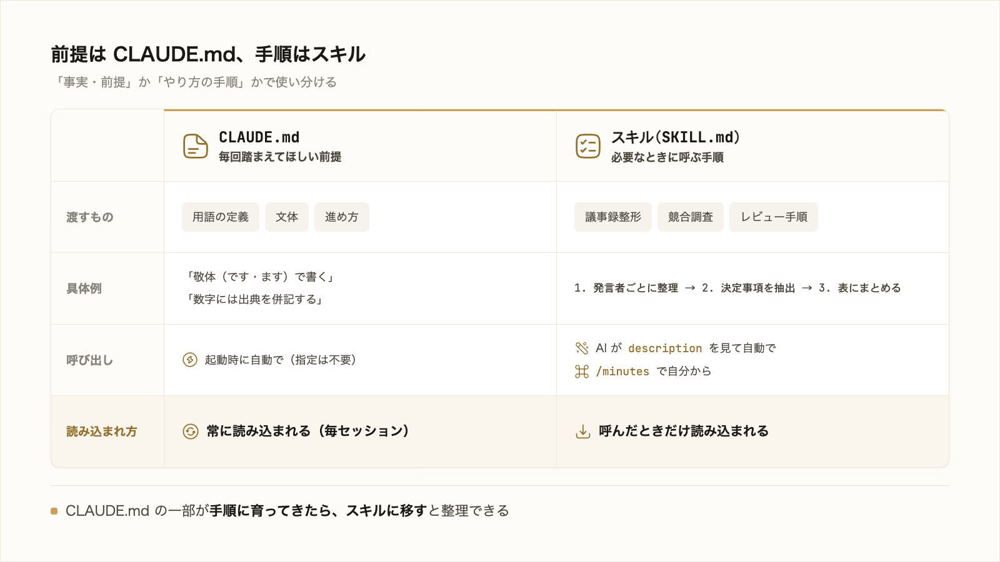
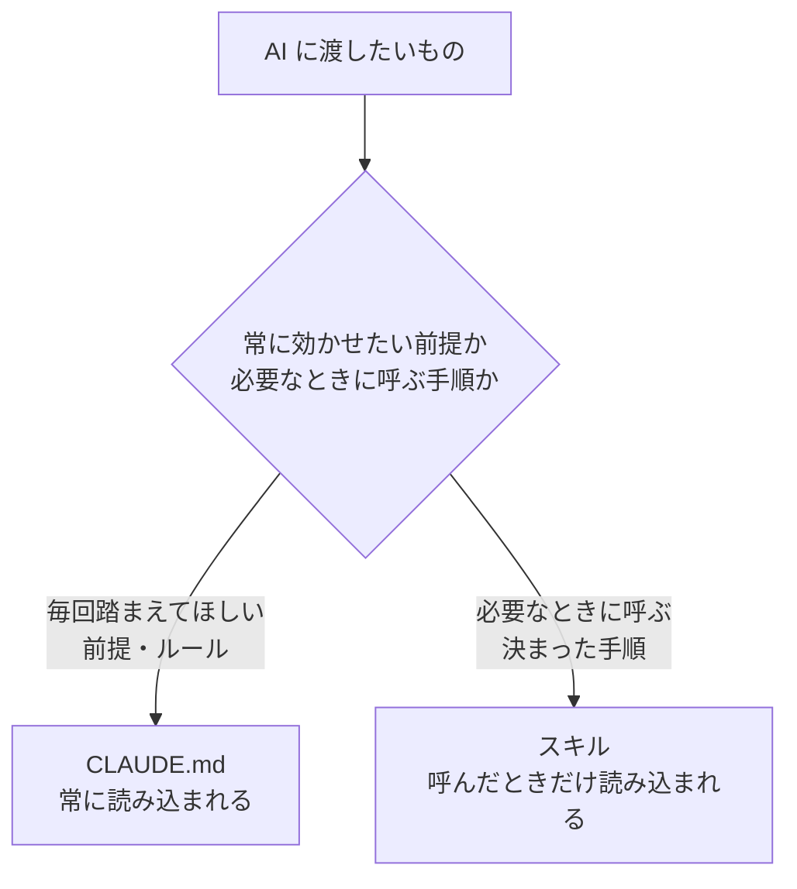

# 3-3-2 Skills で手順を再利用する

!!! note "前提知識"
    このセクションは 3-3-1「CLAUDE.md で前提を渡す」の内容を前提としています。

<video controls preload="metadata" playsinline width="100%">
  <source src="https://github.com/coachtech-material/pj_X/releases/download/videos/3-3-2.mp4" type="video/mp4">
</video>

## このセクションで学ぶこと

- 繰り返す作業手順を、スキルとして保存して再利用できること
- スキルは AI が自動で呼ぶか、`/スキル名` で自分から呼ぶこと
- CLAUDE.md（常に効かせたい前提）とスキル（必要なときに呼ぶ手順）の使い分け

毎回同じ手順を貼り付け直す手間を、スキルという手順の置き場でなくす方法を押さえます。

!!! note "補足"
    本文の SKILL.md の記述例や呼び出し方は、仕組みを理解するための例です（読みながら書く・打つ必要はありません）。実際にスキルを作って業務に使い、仕組みとして固めるのは Part4 です。記法・配置は 2026年6月時点のものとして読んでください。

---

## 導入: 同じ手順を毎回説明し直している

3-3-1 で、毎回説明していた前提を CLAUDE.md に置く方法を学びました。前提と並んで繰り返しがちなものが、決まった作業手順です。

たとえば議事録を整える作業で、毎回「発言者ごとに整理して、決定事項を箇条書きで抜き出して、未決事項とアクションを表にまとめて」と同じ手順を指示している。あるいは競合調査で、毎回「この観点とこの観点で調べて、この形式の表にまとめて」と同じ段取りを渡している。

この手順を毎回貼り付け直すのは無駄です。CLAUDE.md は常に効かせたい前提の置き場でしたが、こうした手順は、その作業のときだけ必要で、常に効かせたいわけではありません。必要なときに呼び出せる形で手順そのものを保存する。それがスキルです。



---

## スキルの正体（SKILL.md という手順書）

**スキル** は、繰り返す作業手順を保存して再利用する仕組みです。実体は `SKILL.md` という1枚の Markdown ファイルで、YAML の設定（フロントマター）と、AI に従ってほしい手順からなります。たとえば議事録整形のスキルは、`~/.claude/skills/minutes/SKILL.md` に次のように書きます（読んで形をつかむ例）。

```markdown
---
name: minutes
description: 会議メモを議事録に整える。発言者ごとに整理し、決定事項とアクションを表にまとめる。議事録づくりを頼まれたら使う。
---

会議メモを次の順でまとめてください。

1. 発言者ごとに発言を整理する
2. 決定事項を箇条書きで抜き出す
3. 未決事項とアクションを「担当・期限」付きの表にする
```

`---` で囲んだ部分が設定で、`name`（スキルの名前）と `description`（何をするスキルで、いつ使うか）を書きます。その下に実際の手順を書きます。一度作れば、次回からは呼び出すだけで、AI が同じ段取りで作業します。

この教材自身も、執筆やレビューの手順をスキルにまとめて作られています。手順を一度スキルにしておけば、同じ品質の作業を何度でも再現できます。

## description で自動的に呼ばれる

スキルの呼び出し方は2通りです。

ひとつは **AI が自動で呼ぶ** 方法です。AI は各スキルの `description` を見ています。「議事録をまとめて」と頼んだとき、その場面に合うスキルがあれば、AI が自分で気づいて呼び出します。だから `description` の「いつ使うか」を具体的に書くことが、自動で正しく呼ばれる鍵になります。

!!! warning "注意"
    スキルが増えてくると、`description` が曖昧だったり、複数のスキルで似通っていたりすると、AI がどれを使うべきか判断できず、別のスキルを呼んでしまうことがあります（スキル同士が競合する状態です）。自動で正しく呼ばせるには、各スキルの `description` に「どんなときに使うか」を具体的に書き、スキルどうしで役割が重ならないよう境目をはっきりさせます。

もうひとつは **自分から呼ぶ** 方法です。`/スキル名` と打つと直接呼び出せます。上の例なら `/minutes` です。確実にそのスキルを使いたいときや、自分のタイミングで実行したいときに使います。

ここで、3-2 のコンテキストの観点から大きな利点があります。**スキルの手順の本体は、呼び出したときだけ読み込まれます**。普段はどんなスキルがあるかの短い説明（`description`）だけがコンテキストに置かれ、長い手順の中身は使うまで読み込まれません。もし長い手順をすべて CLAUDE.md に書くと、その作業をしない日でもずっとウィンドウを圧迫します。スキルにしておけば、長い手順をいくつ持っていても、普段のコンテキストはほとんど消費しません。3-2 の「必要なものだけを渡す」を、仕組みで実現してくれます。

スキルを置く場所は、CLAUDE.md と同じ考え方で2つです。スキルごとにフォルダを作り、その中に `SKILL.md` を置きます。

- **自分専用の `~/.claude/skills/`**: どのプロジェクトでも使いたい、自分のスキル
- **プロジェクトの `.claude/skills/`**: そのプロジェクトで共有したいスキル

## CLAUDE.md とスキルの使い分け

この Chapter で、前提を渡す CLAUDE.md と、手順を再利用するスキルを学びました。2つの使い分けを整理します。



- **CLAUDE.md**: 毎回踏まえてほしい前提・ルール。用語の定義、文体、進め方。常に読み込まれる
- **スキル**: 必要なときに呼ぶ決まった手順。議事録整形、競合調査のような段取り。呼んだときだけ読み込まれる

目安は、それが「事実・前提」なのか「やり方の手順」なのかです。公式ドキュメント（[スキル](https://code.claude.com/docs/ja/skills)）も、CLAUDE.md のある部分が事実ではなく手順に育ってきたら **スキルに移すとよい** としています（2026年6月時点）。CLAUDE.md に長い手順を書き込んでいたら、スキルに移すと、CLAUDE.md は簡潔に保て（3-3-1 の200行の目安）、手順は使うときだけ読み込まれて効率的です。

ここで押さえるのは、スキルでこういうことができると知って使えるところまでです。手順をスキルとして書き出し、ゼロ指示で再現できる仕組みに固め、チームに配布して属人化を解消する設計は、Part4 で扱います。

---

## まとめ

- スキルは、繰り返す作業手順を保存して再利用する仕組み。`SKILL.md` に、`name`・`description` と、従ってほしい手順を書く
- 呼び出し方は2通り。AI が `description` を見て自動で呼ぶか、`/スキル名` で自分から呼ぶ
- 手順の本体は呼び出したときだけ読み込まれるので、長い手順をいくつ持っても普段のコンテキストはほとんど消費しない（3-2 の「必要なものだけ渡す」を仕組みで実現）
- 配置は自分専用 `~/.claude/skills/`、プロジェクト `.claude/skills/`。スキルごとにフォルダを作り `SKILL.md` を置く
- CLAUDE.md は常に効かせたい前提、スキルは必要なときに呼ぶ手順。CLAUDE.md のある部分が手順に育ってきたら、スキルに移すと整理できる

---

これで Chapter 3-3 は終わりです。毎回説明していた前提を渡す CLAUDE.md（3-3-1）と、繰り返す作業手順を再利用するスキル（本セクション）で、一度きりの指示を次回からも効く前提や手順に変えられます。

ここまでは Claude Code の中で完結する機能でした。次の Chapter 3-4 では、Claude Code を外に広げる機能を扱います。最初の 3-4-1 で、MCP という仕組みで AI を社内外のサービス（カレンダー・スプレッドシート・各種SaaS など）につなぎ、その場でデータを読み書きさせられることを押さえます。あわせて、外部サービスのデータを扱うときは、2-5-3 で学んだ「AI に渡してよいもの・いけないもの」の線引きを前提に持つことを確認します。
