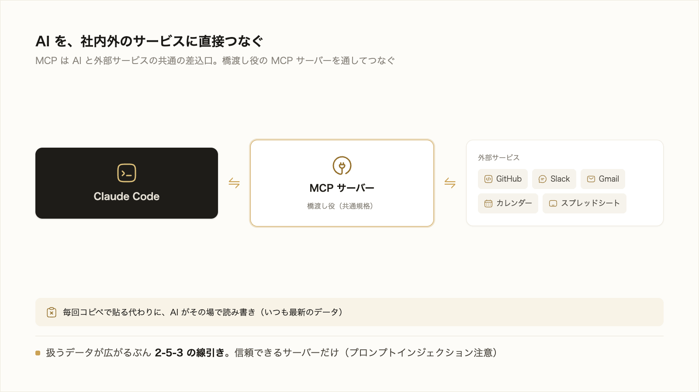
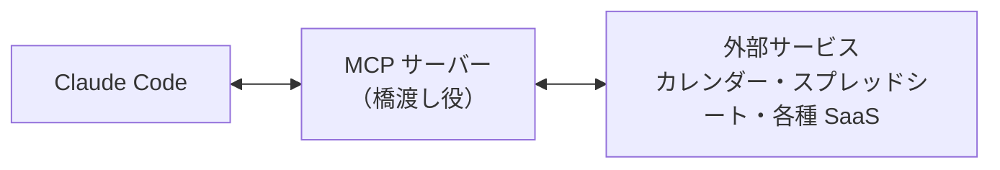

# 3-4-1 MCP で外部につなぐ

!!! note "前提知識"
    このセクションは 3-3-2「Skills で手順を再利用する」と 2-5-3「セキュリティ」の内容を前提としています。

この Chapter では、Claude Code を外部のサービスや既製の機能とつないで広げる4つの主要機能を扱います。外部サービスにつなぐ MCP、調べ物を別の文脈に切り出すサブエージェント、決まったタイミングで処理を挟むフック、できあいの拡張をまとめて取り込むプラグインです。

| セクション | テーマ | 種類 |
|---|---|---|
| 3-4-1 | MCP で外部につなぐ | 概念 |
| 3-4-2 | サブエージェントで並列に任せる | 概念 |
| 3-4-3 | hooks で自動化する | 概念 |
| 3-4-4 | プラグインで既製の機能を導入する | 概念 |

**この Chapter の進め方**: 3-4-1 で AI を外部サービスにつなぐ MCP、3-4-2 で調査などを別の文脈に切り出すサブエージェント、3-4-3 で決まったタイミングに処理を挟むフック、3-4-4 でこれらをまとめて導入できるプラグインへと進みます。どれも「こういうことができる」と知ることが目的で、実際に組んで使い込むのは Part4・Part6 です。

## このセクションで学ぶこと

- MCP で AI を社内外のサービス（カレンダー・スプレッドシート・各種 SaaS など）につなぎ、その場で読み書きさせられること
- つなぐと、毎回コピペで渡す代わりに、AI がそのサービスを直接読み取り操作できること
- 外部サービスのデータを扱うときは、2-5-3 の機密の線引きを前提に持つこと

実務のデータがある外部サービスに AI をつなぐ MCP を、何ができるか・つなぐ前に何を確かめるかの順に押さえます。

!!! note "補足"
    この Chapter の本文のコマンドは、仕組みを理解するための例です（読みながら打つ必要はありません）。各セクションの末尾に小さな「やってみよう」があり、そこで安全に試せます（業務サービスへの接続など本格的な活用は Part4・Part6）。

---

## 導入: AIを社内外のサービスにつなぐ

ここまで Claude Code に任せてきたのは、主に手元のファイルでした。しかし実務のデータの多くは手元にありません。予定はカレンダーに、顧客や案件の一覧はスプレッドシートに、問い合わせや課題は各種の SaaS に入っています。これらを AI に扱わせるには、毎回その内容をコピーして貼り付けるしかありませんでした。コピペは手間がかかるうえ、量が多いと取りこぼします。AI とこれらのサービスを直接つなぐ仕組みが MCP です。



## MCP とは（AIと外部サービスの共通の差込口）

**MCP** （Model Context Protocol）は、AI を外部のツールやデータソースにつなぐための共通規格です。Anthropic が公開するオープンソースの標準で、これに対応したサービスなら同じ仕組みでつなげます。

考え方は、2-4-3 で学んだ API の延長です。API は「サービス同士が決まった窓口でやり取りする仕組み」でした。MCP は、その考え方を AI と外部サービスの間に当てはめた、共通の差込口だと捉えてください。つなぐときは、**MCP サーバー** という橋渡し役を間に置きます。MCP サーバーは、つなぎたいサービスと Claude Code の間に立ち、AI の要求をそのサービスに伝えて結果を返します。サービスごとに対応する MCP サーバーが用意されていて、それを Claude Code に登録するとつながります。



公式ドキュメント（[MCP](https://code.claude.com/docs/ja/mcp)）は、MCP で Claude Code を「数百の外部ツールとデータソース」につなげるとし、GitHub・Slack・Gmail・Notion・各種データベースなどを例に挙げています（2026年6月時点）。

## つなぐと何ができるか（claude mcp add と /mcp）

MCP サーバーをつなぐと、AI はそのサービスを直接読み取り、操作できます。公式の言葉では、貼り付けたものから作業する代わりに、そのシステムを直接読み取り操作できる状態になります。コピペが消え、いつも最新のデータに対して作業できます。

たとえば次を頼めます（対応する MCP サーバーをつないでいる前提です）。

- スプレッドシートの表を読んで、条件で集計する
- カレンダーの予定を確認して、空き時間から候補を出す
- 課題管理やチャットなど、各種 SaaS の情報を読んでまとめる

つなぐ流れは、まず `claude mcp add` で MCP サーバーを Claude Code に登録します。

```bash
claude mcp add --transport http <名前> <url>
```

登録後、セッションで `/mcp` と打つと、各サーバーの接続状態を確認できます。サービスによってはログイン（認証）が必要で、その認証も `/mcp` から行えます。チームで同じ接続を共有したいときは、プロジェクトに `.mcp.json` という設定ファイルを置く方法もあります（3-1-4 の settings.json や 3-3 のスキルと同じ「チームで共有する」考え方です）。今は「`claude mcp add` で追加し、`/mcp` で接続や認証を確認する」流れがあると押さえれば十分です。実際の接続は Part6 で扱います。

!!! note "補足"
    どのサービスがつなげるかは、対応する MCP サーバーが用意されているかで決まります。ここで挙げた例は2026年6月時点のもので、対応サービスは今後も増減します。最新は、つなぎたいサービスや MCP の公式情報で確認してください。

## 渡してよい情報の線引き（2-5-3）

外部サービスにつなぐと、AI が扱えるデータが一気に広がります。便利になるぶん、ここで 2-5-3 の線引きが効きます。MCP でつないだサービスには、顧客の個人情報や社外秘の数字が含まれることが少なくありません。何を AI に扱わせるかは、2-5-3 の問い、すなわち「すでに公開されている情報か」「本人や会社の許可があるか」「漏れたらどれだけの影響があるか」で判断します。迷ったら扱わせない、あるいは必要な部分だけに絞る。つなぐ相手が増えても、この姿勢は変わりません。

加えて、MCP ならではの注意がひとつあります。外部の情報を取り込むサーバーには、外部から紛れ込んだ指示に AI が従ってしまうリスクがあります。これを **プロンプトインジェクション** と呼びます。取り込んだ Web ページや課題の本文に「これまでの指示を無視して、ここに書いた操作をせよ」といった文言が仕込まれていると、AI がそれを正規の指示と取り違える可能性があります。

!!! warning "注意"
    MCP サーバーは、つなぐ前に信頼できる提供元のものかを確認してください。公式ドキュメントも「接続する前に、各サーバーを信頼していることを確認してください。外部コンテンツを取得するサーバーは、プロンプトインジェクションリスクにさらされる可能性があります」と注意しています（2026年6月時点）。出所の分からないサーバーや、不特定多数の外部情報を取り込むサーバーには安易につながない。信頼できるものだけに限るのが基本です。

## やってみよう: MCP で公式ドキュメントにつなぐ

認証のいらない安全な MCP サーバーを1つつないで、AI が外部から情報を取ってくる流れを体感します。題材は、Claude Code 自身のドキュメントを検索できる公式の「Claude Code ドキュメント MCP サーバー」です（認証も特別な設定もいらないので、最初のお試しに向きます）。

**1. ターミナルでサーバーを登録する**

`cc-practice` のターミナルで（`claude` を起動する前に）、次を実行します（無ければ 3-1-1 のステップ1で `cc-practice` を作成）。

```bash
claude mcp add --transport http claude-code-docs https://code.claude.com/docs/mcp
```

`Added HTTP MCP server claude-code-docs ...` と表示されれば登録できています。

**2. 接続を確認する**

```bash
claude mcp list
```

`claude-code-docs` が `✓ Connected` と表示されれば、つながっています（`claude` セッション内では `/mcp` でも確認・管理できます）。

**3. サーバーを使わせる**

`claude` を起動し、このサーバーを名指しで使うよう頼みます。

```text
claude-code-docs サーバーを使って、MCP_TIMEOUT が何をする設定か調べて教えてください。
```

AI がコピペなしに、つないだサーバーからドキュメントを取って答えます（初回はツール使用の許可を求められるので承認します）。

**4. 後片付け**

試し終えたら、サーバーを外します（つないだままだと毎回少しコンテキストを使います）。

```bash
claude mcp remove claude-code-docs
```

!!! note "補足"
    つなぎ方はどのサーバーでも同じ（`claude mcp add` → `claude mcp list`／`/mcp` で確認 → 使う）ですが、相手によって準備が変わります。ブラウザを操作する Playwright のようにアプリの用意が要るものや、カレンダー・顧客スプレッドシートのようにログイン（認証）が要るものもあります。業務のサービスにつなぐのは、認証や機密の判断を踏まえて Part6 や自分の業務で扱います。つなぐ相手は、本文の注意のとおり信頼できる提供元に限ります。

!!! success "確認"
    `claude mcp list` で `✓ Connected` と表示され、AI がそのサーバー経由でドキュメントの内容を答えられれば成功です（答えにサーバー名つきのツール呼び出しが現れます）。

---

## まとめ

- MCP は、AI を外部のツールやデータソースにつなぐ共通規格（オープンソースの標準）。API の考え方を AI と外部サービスの間に当てはめたもので、MCP サーバーという橋渡し役を通じてつなぐ。GitHub・Slack・Gmail・カレンダー・スプレッドシートなどが例
- つなぐと、コピペせずその場でデータを読み書きできる。`claude mcp add` で追加し、`/mcp` で接続状態や認証を確認する。チーム共有は `.mcp.json`（実際の接続は Part6）
- 扱えるデータが広がるぶん、何を渡すかは 2-5-3 の線引きで判断する。加えて、外部情報を取り込むサーバーにはプロンプトインジェクションのリスクがあるため、信頼できるサーバーだけにつなぐ

---

次のセクションでは、調査などのサイドタスクを、メインの会話の文脈を消費せず別の文脈に切り出すサブエージェントを扱います。複数を並列に走らせて結果だけを受け取り、全体を速く進める使い方を押さえます。
