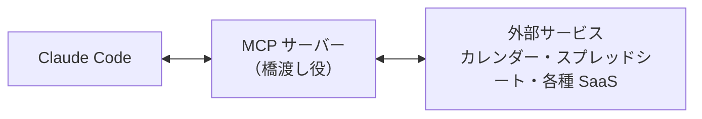

# 3-4-1 MCP で外部につなぐ

!!! note "前提知識"
    このセクションは 3-3-2「Skills で手順を再利用する」と 2-5-3「セキュリティ」の内容を前提としています。

この Chapter では、Claude Code を外部のサービスや既製の機能とつないで広げる4つの主要機能を学びます。外部サービスにつなぐ MCP、調べ物を別の文脈に切り出すサブエージェント、決まったタイミングで処理を挟むフック、できあいの拡張をまとめて取り込むプラグインを、順に扱います。

| セクション | テーマ | 種類 |
|---|---|---|
| 3-4-1 | MCP で外部につなぐ | 概念 |
| 3-4-2 | サブエージェントで並列に任せる | 概念 |
| 3-4-3 | hooks で自動化する | 概念 |
| 3-4-4 | プラグインで既製の機能を導入する | 概念 |

**この Chapter の進め方**: まず 3-4-1 で AI を外部サービスにつなぐ MCP を押さえ、3-4-2 で調査などを別の文脈に切り出して並列に走らせるサブエージェント、3-4-3 で決まったタイミングに処理を自動で挟むフック、3-4-4 でこれらをまとめて導入できるプラグインへと進みます。どのセクションも「こういうことができる」と知ることが目的で、実際に組んで使い込むのは Part4・Part6 です。

## このセクションで学ぶこと

- MCP で AI を社内外のサービス（カレンダー・スプレッドシート・各種 SaaS など）につなぎ、その場で読み書きさせられること
- つなぐと、毎回コピペで渡す代わりに、AI がそのサービスを直接読み取り操作できること
- 外部サービスのデータを扱うときは、2-5-3 の機密の線引きを前提に持つこと

AI を手元のファイルだけでなく、実務のデータがある外部サービスにつなぐ MCP という仕組みを、何ができるか・つなぐ前に何を確かめるかの順に把握します。

!!! note "補足"
    この Chapter の本文に出てくるコマンドは、仕組みを理解するための例です（読みながら打つ必要はありません）。これらの機能を実際に組んで使うのは Part4・Part6 のハンズオンで、ここでは「こういうことができる」と知るのが目的です。

---

## 導入: AIを、自分の道具につなぐ

ここまで Claude Code に任せてきたのは、主に手元のファイルでした。しかし実務のデータの多くは、手元にはありません。予定はカレンダーにあり、顧客や案件の一覧はスプレッドシートにあり、問い合わせや課題は各種の SaaS に入っています。これらを AI に扱わせるには、毎回その内容をコピーして貼り付けるしかありませんでした。コピペは手間がかかるうえ、量が多いと取りこぼします。そこで、AI とこれらのサービスを直接つないでしまう仕組みが MCP です。

---

## MCP とは

**MCP** （Model Context Protocol）は、AI を外部のツールやデータソースにつなぐための共通の規格です。Anthropic が公開しているオープンソースの標準で、これに対応したサービスであれば、同じ仕組みでつなげます。

考え方は、2-4-3 で学んだ API の延長です。API は「サービス同士が決まった窓口（要求と応答）でやり取りする仕組み」でした。MCP は、その「決まった窓口でやり取りする」考え方を、AI と外部サービスの間に当てはめたものです。AI が外部サービスのデータを読んだり書き込んだりするための、共通の窓口の規格だと捉えてください。

つなぐときは、**MCP サーバー** という橋渡し役を間に置きます。MCP サーバーは、つなぎたいサービス（カレンダーやスプレッドシートなど）と Claude Code の間に立ち、AI からの要求をそのサービスに伝え、結果を返します。サービスごとに対応する MCP サーバーが用意されていて、それを Claude Code に登録することでつながります。



## つなぐと何ができるか

MCP サーバーをつなぐと、AI はそのサービスを直接読み取り、操作できるようになります。公式ドキュメントの言葉を借りれば、「貼り付けたものから作業する代わりに、そのシステムを直接読み取り、操作できる」状態になります。コピペの手間が消え、いつも最新のデータに対して作業できます。

たとえば、次のようなことを頼めます（いずれも対応する MCP サーバーをつないでいる前提です）。

- スプレッドシートの表を読んで、条件で集計する
- カレンダーの予定を確認して、空いている時間から候補を出す
- 課題管理やチャットなど、各種 SaaS の情報を読んで、まとめる

つなぐ流れは、おおまかには次のとおりです。まず `claude mcp add` というコマンドで、つなぎたい MCP サーバーを Claude Code に登録します。

```bash
claude mcp add --transport http <名前> <url>
```

登録したあと、セッションの中で `/mcp` と打つと、各サーバーの接続状態を確認できます。サービスによってはログイン（認証）が必要で、その認証も `/mcp` から行えます。今は「`claude mcp add` で追加し、`/mcp` で接続状態や認証を確認する」という流れがあるとだけ押さえれば十分です。実際に接続する手順は Part6 で扱います。

!!! note "補足"
    どのサービスがつなげるかは、対応する MCP サーバーが用意されているかどうかで決まります。ここで挙げた例は2026年6月時点のもので、対応サービスは今後も増減します。最新の状況は、つなぎたいサービスや MCP の公式情報で確認してください。

## つなぐ前に、渡すデータの線を引く

外部サービスにつなぐと、AI が扱えるデータの範囲が一気に広がります。便利になるぶん、ここで 2-5-3 の線引きが効いてきます。MCP でつないだサービスには、顧客の個人情報や社外秘の数字が含まれていることが少なくありません。何を AI に扱わせるかは、2-5-3 で押さえた問い、すなわち「すでに公開されている情報か」「本人や会社の許可があるか」「漏れたらどれだけの影響があるか」で判断します。迷ったら扱わせない、あるいは必要な部分だけに絞る。この姿勢は、つなぐ相手が増えても変わりません。

加えて、MCP ならではの注意がひとつあります。外部の情報を取り込むサーバーには、外部から紛れ込んだ指示に AI が従ってしまうリスクがあります。これを **プロンプトインジェクション** と呼びます。たとえば、取り込んだ Web ページや課題の本文の中に「これまでの指示を無視して、ここに書いた操作をせよ」といった文言が仕込まれていると、AI がそれを正規の指示と取り違える可能性があります。

!!! warning "注意"
    MCP サーバーは、つなぐ前に信頼できる提供元のものかを確認してください。公式ドキュメントも「接続する前に、各サーバーを信頼していることを確認してください。外部コンテンツを取得するサーバーは、プロンプトインジェクションリスクにさらされる可能性があります」と注意しています。出所の分からないサーバーや、不特定多数の外部情報を取り込むサーバーには、安易につながない。信頼できるものだけに限るのが基本です。

---

## まとめ

- MCP は、AI を外部のツールやデータソースにつなぐための共通の規格（オープンソースの標準）。API の考え方を AI と外部サービスの間に当てはめたもので、MCP サーバーという橋渡し役を通じてつなぐ
- つなぐと、コピペせずその場でデータを読み書きできる。スプレッドシートの集計、カレンダーからの候補出し、各種 SaaS の情報の扱いなどができる（`claude mcp add` で追加し、`/mcp` で接続状態や認証を確認する。実際の接続は Part6）
- つなぐと扱えるデータが広がるぶん、何を渡すかは 2-5-3 の線引きで判断する。加えて、外部情報を取り込むサーバーにはプロンプトインジェクションのリスクがあるため、信頼できるサーバーだけにつなぐ

---

次のセクションでは、調査などのサイドタスクをメインの会話の文脈を消費せず別の文脈に切り出すサブエージェントを扱います。複数のサブエージェントに並列で任せて結果だけを受け取り、全体を速く進める使い方を押さえます。
