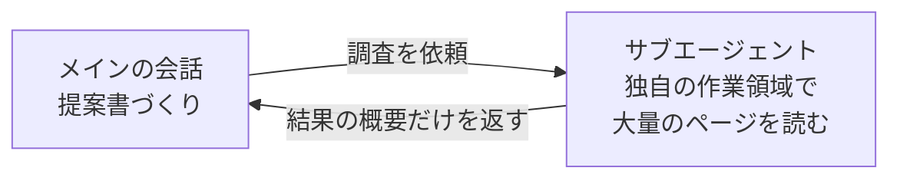

# 3-4-2 サブエージェントで並列に任せる

!!! note "前提知識"
    このセクションは 3-4-1「MCP で外部につなぐ」の内容を前提としています。

## このセクションで学ぶこと

- 調査などのサイドタスクを、メインの会話の文脈を消費せず、別の文脈に切り出せること
- 切り出した先（サブエージェント）は独自の作業領域で動き、結果の概要だけをメインに返すこと
- 複数のサブエージェントに並列で任せ、結果だけを受け取って全体を速くできること

調べ物などを別働きの AI に任せて本筋の文脈を守り、複数を同時に走らせて速く仕上げるサブエージェントという仕組みを把握します。

!!! note "補足"
    このセクションの本文に出てくる依頼の例は、仕組みを理解するための例です（読みながら打つ必要はありません）。サブエージェントを実際に使い込むのは Part4・Part6 で、ここでは「こういうことができる」と知るのが目的です。

---

## 導入: 調べ物で、本筋の文脈を汚さない

3-2 で見たとおり、AI が一度に読める範囲（コンテキスト）には限りがあります。作業を続けるほど、そこは埋まっていきます。ここで困るのが、本筋の合間に挟まる調べ物です。たとえば提案書を書いている途中で、競合の動向を調べたいとします。大量のページや資料を本筋の会話の中で読み込むと、その中身でコンテキストが埋まってしまいます。調査が終わるころには、肝心の提案書づくりに使える余地が痩せています。本筋の作業のために空けておきたい場所が、調べ物で食い潰されるわけです。

---

## サブエージェントとは

**サブエージェント** は、特定のタスク用に切り出す、別働きの AI です。メインの会話とは別に、独自のコンテキストウィンドウ（作業領域）を持って働きます。調べ物のような重い作業をサブエージェントに任せると、その作業はサブエージェント側の作業領域で進み、終わったら結果の概要だけがメインの会話に返ってきます。

ここがサブエージェントの要点です。読み込んだ大量のページや、途中の細かいやり取りは、サブエージェント側にとどまります。メインの会話に戻ってくるのは、要約された結論だけです。だから、メインの会話は調査の中身で埋まらず、必要な要点だけを受け取れます。先ほどの提案書の例で言えば、競合調査はサブエージェントに任せ、メインには「競合 A・B の動向はこうだった」という要点だけが返る、という形になります。

サブエージェントは、メインとは独立した作業領域を持つだけでなく、使える道具（ツール）や権限も独自に設定できます。本研修では、まず「重い作業を別の文脈に切り出し、要点だけを受け取れる」という性質を押さえれば十分です。自分専用のサブエージェントを定義して仕組みに組み込む話は、Part4 で扱います。

## 並列に任せて、全体を速くする

サブエージェントのもう一つの利点は、複数を同時に走らせられることです。互いに独立した調査であれば、一つずつ順番に片付けるのではなく、並列で進められます。

たとえば、ある製品について「市場規模」「競合の状況」「想定される顧客の声」の3つの観点で調べたいとします。これらは互いに依存しないので、「この3つの観点で別々に調べて」と任せると、それぞれが別のサブエージェントとして並行して動きます。3つの調査が同時に進み、それぞれの要点がメインに返ってきて、最後に統合されます。一つずつ順にやれば3回ぶんの時間がかかるところを、まとめて短くできます。

調査のように、独立していて時間のかかる作業ほど、この並列の効果が出ます。本筋の文脈を守りながら、全体の所要時間も縮められる。これがサブエージェントを使う狙いです。

---

## まとめ

- サブエージェントは、特定のタスク用に切り出す別働きの AI。独自のコンテキストウィンドウ（作業領域）で動き、結果の概要だけをメインに返す。だから調べ物の中身でメインの会話が埋まらず、要点だけを受け取れる
- 互いに独立した複数の作業は、サブエージェントに並列で任せられる。3つの観点を別々に調べさせるといった形で、一つずつ順にやるより全体を速くできる
- ここでは「文脈を分ける」「並列で速く」を知って使えれば十分。自分専用のサブエージェントを定義して仕組みに組み込むのは Part4

---

次のセクションでは、特定のタイミング（実行前・完了時など）に決めた処理を自動で挟み込む hooks を扱います。毎回手でやっていた確認や整形を、決まったタイミングで自動化する仕組みを押さえます。
