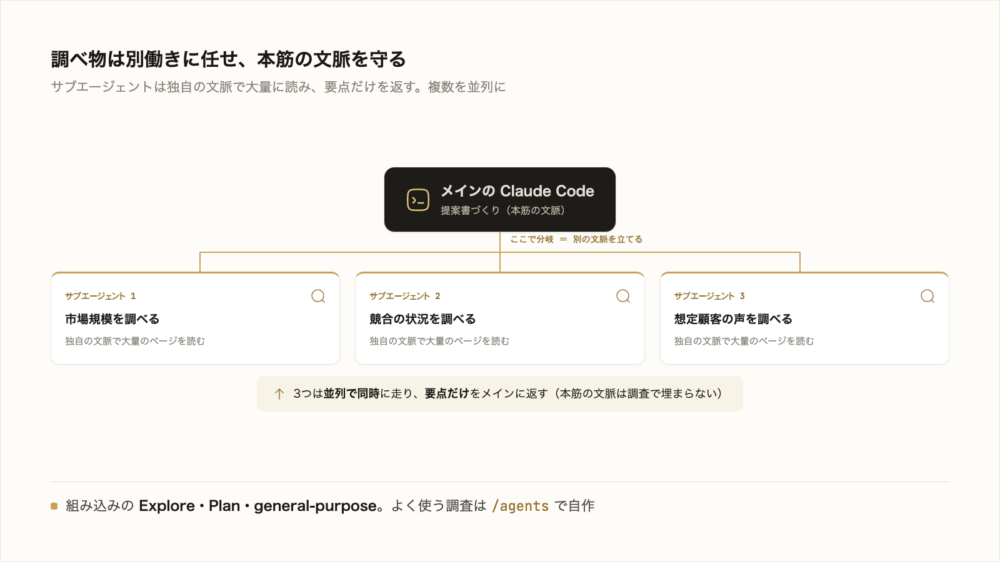
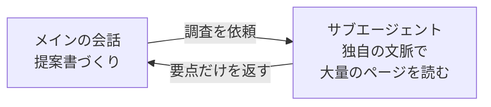

# 3-4-2 サブエージェントで並列に任せる

!!! note "前提知識"
    このセクションは 3-4-1「MCP で外部につなぐ」の内容を前提としています。

## このセクションで学ぶこと

- 調査などのサイドタスクを、メインの会話の文脈を消費せず別の文脈に切り出せること
- Claude Code に組み込みのサブエージェント（Explore・Plan・general-purpose）があること
- 複数のサブエージェントに並列で任せ、結果だけを受け取って全体を速くできること

調べ物などを別働きの AI に任せて本筋の文脈を守り、複数を同時に走らせて速く仕上げるサブエージェントを把握します。

!!! note "補足"
    本文の依頼例やファイル例は、仕組みを理解するための例です（読みながら打つ必要はありません）。実際に手を動かすのは、セクション末尾の「やってみよう」です（自分専用のサブエージェントを作り込んで仕組みに組み込むのは Part4）。

---

## 導入: 調べ物で本筋の文脈を埋めない

3-2 で見たとおり、AI が一度に読める範囲（コンテキスト）には限りがあり、作業を続けるほど埋まっていきます。ここで困るのが、本筋の合間に挟まる調べ物です。提案書を書いている途中で競合の動向を調べたいとき、大量のページを本筋の会話で読み込むと、その中身でコンテキストが埋まります。調査が終わるころには、肝心の提案書づくりに使える余地が痩せています。



## 組み込みサブエージェント（Explore／Plan／general-purpose）

**サブエージェント** は、特定のタスク用に切り出す別働きの AI です。メインの会話とは別に、独自のコンテキストウィンドウ・ツール・権限を持って働き、終わったら結果の要約だけをメインに返します。だから、読み込んだ大量のページや途中のやり取りはサブエージェント側にとどまり、メインの会話は調査の中身で埋まりません。

Claude Code には、依頼内容に応じて自動で使われる組み込みのサブエージェントがあります（2026年6月時点）。

| サブエージェント | モデル | 役割 |
|---|---|---|
| Explore | Haiku（高速・低コスト） | コードや資料の検索・把握（読み取り専用） |
| Plan | メインと同じ | Plan モード（3-1-4）での下調べ（読み取り専用） |
| general-purpose | メインと同じ | 調査と作業の両方を伴う、複数手順のタスク |

たとえば「競合 A・B・C を調べて要点を返して」と頼むと、Claude はこの調査を Explore などのサブエージェントに委譲します。大量のページはサブエージェント側で読まれ、メインに返るのは要約だけです。先ほどの提案書の例なら、競合調査はサブエージェントに任せ、メインには「競合 A・B の動向はこうだった」という要点だけが返ります。



## 並列に任せる

サブエージェントの利点は、本筋の文脈を守れること（調べ物の中身でメインの会話を埋めないこと）だけではありません。もう一つ、複数を同時に走らせられるという利点があります。互いに独立した調査なら、一つずつ片付けるのではなく並列で進められます。

ある製品について「市場規模」「競合の状況」「想定顧客の声」の3観点で調べたいとき、これらは互いに依存しないので、まとめて任せると、それぞれが別のサブエージェントとして並行して動きます。3つの調査が同時に進み、要点がメインに返って統合されます。一つずつ順にやれば3回ぶんの時間がかかるところを、まとめて短くできます。調査のように独立して時間のかかる作業ほど、並列の効果が出ます。

!!! note "サブエージェントとの違い: 複数セッションを並べる"
    ここまでは、1つのセッションの中で AI が下請け（サブエージェント）を並列に動かす話でした。これとは別に、**あなた自身が複数の Claude Code セッションを同時に動かす** やり方もあります。両者は別物で、サブエージェントは AI が自分で並列化するもの、複数セッションは人が複数の仕事を並べるものです。

    - **やり方**: VS Code の統合ターミナルを横に分割し（操作は 1-2-2）、左右のペインでそれぞれ `claude` を起動します。片方で本の執筆、もう片方で別の調べ物、のように独立した仕事を同時に進められます。
    - **衝突に注意**: 同じプロジェクトの同じファイルを2つのセッションで同時に編集すると、変更がぶつかります。まずは独立した作業に分けるのが基本です。公式には、各セッションを独立した作業場所に切り分ける `claude --worktree （名前）` という起動オプションもあります（その土台になる Git・ブランチは Part5 で学びます）。
    - **tmux（さらに進めたい人向け）**: ターミナルにこだわるなら、`tmux` という道具でも画面を分割できます。VS Code を使わなくても分割でき、ウィンドウを閉じてもセッションが残る（永続する）のが tmux ならではの利点です。本研修では使いませんが、こういう選択肢もあると知っておくと役立ちます。
    - **コスト**: 複数を同時に走らせると、トークンの消費もその分増えます。Pro の利用枠との兼ね合いに気をつけてください。

## よく使う調査を自分のサブエージェントにする（/agents）

同じ調査を繰り返すなら、手順を決めたサブエージェントを自分で用意できます。`/agents` コマンドを実行すると、サブエージェントを管理するタブ付きの画面（Agents・Running・Library）が開きます（2026年6月時点）。**Library** タブから新規作成（Create new agent）を選ぶと、保存先・ツール・モデルなどを対話形式で設定でき、Claude に下書きを生成させることもできます。

サブエージェントの正体は、YAML の設定と指示文からなる Markdown ファイル1枚です。`/agents` で作ると、たとえば `~/.claude/agents/competitor-research.md` に次の形で保存されます（読んで形をつかむ例）。

```markdown
---
name: competitor-research
description: 競合企業を調べ、強み・弱み・価格を要約する。競合調査を頼まれたら使う。
tools: WebSearch, WebFetch, Read
model: haiku
---

あなたは競合調査の担当です。指定された企業について、強み・弱み・価格を調べ、要点だけを箇条書きで返してください。
```

- `description` … どんなときに使うか（Claude はこれを見て自動で振り分けます）
- `tools` … 使ってよい道具（ここでは Web 検索と読み取りだけ。書き換えはさせません）
- `model` … 使うモデル（調査は安価な Haiku で十分）

置き場所は、スキルや settings.json と同じ「自分用／チーム共有」の考え方です。自分用は `~/.claude/agents/`、チーム共有はプロジェクトの `.claude/agents/`（リポジトリに入れて共有）。重い作業を別の文脈に切り出して要点だけ受け取れること、よく使う調査はサブエージェントにできること。この2つをつかめれば前に進めます。自分の調査用に作り込んで仕組みへ組み込むのは Part4 です。

!!! note "補足"
    スキル（3-3-2）とサブエージェントは、どちらも `name` と `description` を持つ Markdown ファイルで、AI が `description` を見て自動で呼べる点が似ています。違いは、動く場所です。スキルは **いまの会話の中** に手順を読み込み、メインの AI がそれに従います。サブエージェントは **別の文脈** （独自のコンテキストウィンドウ）で動き、結果の要約だけを返します。決まった手順を足したいときはスキル、文脈を分けて重い作業を任せたいときはサブエージェント、と使い分けます。

## やってみよう: 並列に調べさせる

互いに独立した複数の調べ物を1回の依頼でまとめて任せ、組み込みのサブエージェントが並列で動いて要点だけ返すこと、本筋のコンテキストが調べ物で埋まらないことを確かめます。

**1. Claude Code を起動する**

3-1-1 で作った `cc-practice` で起動します（無ければ 3-1-1 のステップ1で作成）。

**2. 3つの観点をまとめて調べさせる**

興味のある業界や製品を1つ選び、独立した3観点を1回の依頼でまとめて頼みます。

```text
（興味のある業界・製品）について、「市場規模」「主要なプレイヤー」「最近の話題」の3つを、それぞれ並行して調べて、要点だけ返してください。
```

互いに依存しない調べ物なので、組み込みのサブエージェントが別々に動き、大量のページはそちら側で読まれ、メインには要点だけが返ってきます。

**3. 本筋のコンテキストが温存されているか見る**

`/context`（3-2）と打って、内訳を見ます。大量のページを調べたはずなのに、その中身でメインのコンテキストが埋まっていない（要点だけが返っている）ことを確認します。

!!! warning "注意"
    調べ物がうまく分かれて進まないと感じたら、3観点が互いに独立しているか、1回の依頼にまとめているかを見直します。詰まったら、その様子を Claude Code に伝えて一緒に調整しましょう。

!!! success "確認"
    3観点の要点がまとめて返ること、`/context` で本筋のコンテキストが調べ物の中身で埋まっていないことを確認できれば成功です。よく使う調査を自分専用のサブエージェント（`/agents`）にするのは Part4 で扱います。

---

## まとめ

- サブエージェントは、特定のタスク用に切り出す別働きの AI。独自のコンテキスト・ツール・権限で動き、結果の要約だけをメインに返す。だから調べ物の中身でメインの会話が埋まらない
- Claude Code には組み込みのサブエージェント（Explore・Plan・general-purpose）があり、依頼に応じて自動で使われる
- 互いに独立した複数の作業は、並列で任せられる。3観点を別々に調べさせるなど、一つずつより全体を速くできる
- よく使う調査は `/agents` で自分のサブエージェントにできる（正体は `name`・`description`・`tools`・`model` を書いた Markdown 1枚）。配置は自分用 `~/.claude/agents/`、チーム共有 `.claude/agents/`。作り込みは Part4

---

次のセクションでは、特定のタイミング（実行前・完了時など）に決めた処理を自動で挟み込むフックを扱います。毎回手でやっていた確認や整形を、決まったタイミングで自動化する仕組みを押さえます。
