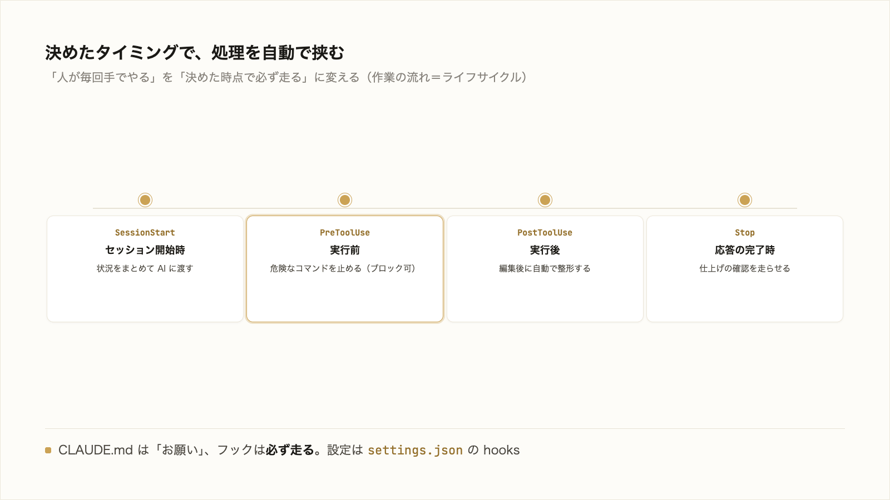

# 3-4-3 hooks で自動化する

!!! note "前提知識"
    このセクションは 3-4-2「サブエージェントで並列に任せる」の内容を前提としています。

## このセクションで学ぶこと

- フックで、特定のタイミング（実行前・完了時など）に決めた処理を自動で挟み込めること
- 「人が毎回覚えて手でやる」を「決めたタイミングで自動で挟む」に変えられること
- どんなタイミングがあり、設定をどこにどう書くか

毎回くり返す確認や整形を、決まったタイミングで自動実行するフックを把握します。

!!! note "補足"
    本文の設定例やイベント名は、仕組みを理解するための例です（読みながら打つ必要はありません）。実際に手を動かすのは、セクション末尾の「やってみよう」です（本格的な自動化を組み込むのは Part4）。イベント名・記法は 2026年6月時点のものです。

---

## 導入: 毎回手でやる確認・整形を自動にする

AI に作業を任せていると、毎回きまって手でやる処理が出てきます。ファイルを直してもらったあとに体裁を整える、あるコマンドの前に念のため内容を確かめる、といったことです。一つひとつは小さくても、毎回となると手間ですし、人がやる以上は忘れることもあります。「ファイルを直したら整形する」と決めているのに、整形を忘れて先に進む、というたぐいです。決まりきった処理なら、人が覚えるのではなく、決めたタイミングで自動的に挟まってほしい。これを実現するのがフックです。



## フックとは（決めたタイミングで動く処理）

**フック** は、Claude Code の作業の流れの特定の時点で、あらかじめ決めた処理を自動で実行する仕組みです。公式ドキュメント（[フック](https://code.claude.com/docs/ja/hooks)）の言葉では「ライフサイクル内の特定のポイントで自動的に実行されるユーザー定義の処理」です。ライフサイクルとは、Claude Code が依頼を受けて作業を進める一連の流れのことです。その流れの決まった地点に、自分が決めた処理を仕込んでおけます。

CLAUDE.md（3-3-1）が「こうしてほしい」とお願いする前提なのに対し、フックは決めた処理を必ず走らせます。一度仕込めば、その地点を通るたびに、忘れずに・人によるばらつきなく実行されます。

## どのタイミングで挟めるか（実行前・実行後・完了時）

処理を挟めるタイミング（イベント）は何種類もあります。代表的なものは次のとおりです。

- **ツールの実行前** （`PreToolUse`）: AI がファイル編集やコマンド実行をする直前
- **ツールの実行後** （`PostToolUse`）: その操作が終わった直後
- **応答の完了時** （`Stop`）: AI が一連の応答を終えたとき
- **セッション開始時** （`SessionStart`）: Claude Code を起動・再開したとき

このほかにも多くのタイミングが用意されています（種類は今後も増減します）。これらを使うと、たとえば次の自動化ができます。

- ファイルを編集した後（`PostToolUse`）に、自動で体裁を整える
- 危険なコマンドの前（`PreToolUse`）に、実行を止めて確認させる
- セッション開始時（`SessionStart`）に、いまの状況をまとめて AI に渡す

とくに `PreToolUse` のフックは、操作を実行前に止める（ブロックする）こともできます。たとえば、ファイルを削除するコマンドを検知したら自動で止める、という安全策を仕込めます。

## 設定の形と例（settings.json）

設定は、3-1-4 で触れた `settings.json` に書きます。`hooks` という項目に、「どのタイミングで」「どの操作に対して」「どの処理を」走らせるかを書きます。たとえば、ファイルの編集後（`Write` か `Edit`）に整形スクリプトを走らせる設定はこうなります（読んで形をつかむ例）。

```jsonc
// .claude/settings.json
{
  "hooks": {
    "PostToolUse": [
      {
        "matcher": "Write|Edit",
        "hooks": [
          { "type": "command", "command": "整形スクリプトのパス" }
        ]
      }
    ]
  }
}
```

`matcher` は、どの操作のときに動かすかの絞り込みです（ここではファイルを書く `Write` と `Edit`）。その操作のたびに、指定したコマンドが自動で走ります。

!!! note "補足"
    ここで挙げたイベント名（`PreToolUse`・`PostToolUse`・`Stop`・`SessionStart` など）は2026年6月時点のもので、種類は増減します。実際に使うときは、最新の公式ドキュメントで確認してください。

フックは「決まったタイミングで決まった処理を自動で挟む」仕組みだと押さえれば、ここでは十分です。どんな自動化をどう組み込むと業務が楽になるか、という設計は Part4 で扱います。

## やってみよう: 完了を通知させる

Claude が応答を終えたら通知が来るフックを設定し、決めたタイミングで処理が自動で走ることを体感します。長い作業の間、画面を見ていなくても終わりに気づけます。

**1. Claude Code を起動する**

3-1-1 で作った `cc-practice` で起動します（無ければ 3-1-1 のステップ1で作成）。

**2. 通知フックを書かせる**

設定ファイルは手で書かず、Claude に書いてもらいます。

```text
あなたが応答を終えたとき（Stop のタイミング）に、デスクトップ通知で知らせるフックを .claude/settings.json に書いてください。私の OS に合った通知コマンドでお願いします。
```

Claude が `settings.json` の `hooks` に Stop イベントの設定を書きます（macOS なら通知センター、Windows ならトースト通知など、OS に合った通知コマンドを使います）。`.claude` は保護された場所なので、書き込みの前に確認を求められます。内容を読んで問題なければ許可します。

**3. 通知を出してみる**

少し時間のかかる依頼（例:「さっき調べた内容を300字でまとめて」）を出し、画面から目を離します。応答が終わると、設定した通知（または音）が出ます。

**4. 残すか、片付ける**

便利だと感じたら、そのまま残してかまいません。消すなら「さっき足した通知フックを削除して」と頼みます。

!!! warning "注意"
    フックは、settings.json に書いた処理を毎回必ず実行します。書かせる処理は内容を読んで確認し、意味の分からないコマンドや危険な操作をそのまま許可しないでください。通知が出ないときは、その様子（OS・期待した動き）を Claude に伝えて、設定や OS の通知許可を一緒に確かめます。

!!! success "確認"
    応答が終わったときに通知（または音）が出れば成功です。settings.json に書いた処理が、決めたタイミングで自動で走ることを体感できます。

---

## まとめ

- フックは、Claude Code の作業の流れの特定の時点で、決めた処理を自動で実行する仕組み。CLAUDE.md のお願いと違い、決めた処理を必ず走らせる
- 挟めるタイミングには、ツールの実行前（`PreToolUse`）・実行後（`PostToolUse`）・応答の完了時（`Stop`）・セッション開始時（`SessionStart`）などがある（ほかにも多数）。`PreToolUse` は危険な操作を実行前に止めることもできる
- 設定は `settings.json` の `hooks` に、タイミング・対象（`matcher`）・処理を書く。自動化を組み込む設計は Part4

---

次のセクションでは、ここまで見たスキル・スラッシュコマンド・MCP・サブエージェント・フックといった拡張を、まとめて導入できるプラグインを扱います。自分で一から作らなくても、既製のものをマーケットプレイスから取り入れて能力を増やせることを押さえます。
