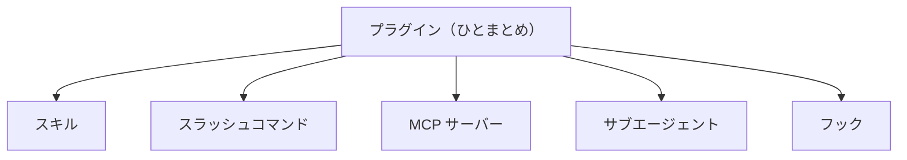

# 3-4-4 プラグインで既製の機能を導入する

!!! note "前提知識"
    このセクションは 3-4-3「hooks で自動化する」の内容を前提としています。

## このセクションで学ぶこと

- スキル・スラッシュコマンド・MCP・サブエージェント・フックといった拡張を、ひとまとめにしたものがプラグインであること
- プラグインを導入すると、その中身の機能が一度に使えるようになること
- マーケットプレイスから、自分で作らずに既製のプラグインを導入して能力を増やせること

できあいの拡張をまとめて取り込むプラグインと、その配布元であるマーケットプレイスからの導入の流れを把握します。

!!! note "補足"
    このセクションの本文に出てくるコマンドは、仕組みを理解するための例です（読みながら打つ必要はありません）。実際にプラグインを導入して使うのは Part4・Part6 で、ここでは「既製を導入して能力を増やせる」と知るのが目的です。

---

## 導入: 一から作らず、できあいを取り入れる

ここまでの Chapter で、Claude Code を広げる部品をいくつも見てきました。前提を渡す CLAUDE.md（3-3-1）、手順を再利用するスキル（3-3-2）、外部につなぐ MCP（3-4-1）、別働きで調べるサブエージェント（3-4-2）、自動で処理を挟むフック（3-4-3）。これらは自分で用意できます。一方で、よくある用途のものは、すでに誰かが作って公開している場合が少なくありません。それなら、自分で一から作らず、できあいを取り入れたほうが速い。その取り入れ口になるのが、プラグインです。

---

## プラグインとは

**プラグイン** は、スキル・スラッシュコマンド・MCP・サブエージェント・フックといった拡張を、ひとまとめにしたものです。これまで一つずつ見てきた部品を、用途に合わせて束ねてパッケージにした、と捉えてください。

プラグインを導入すると、その中に含まれている機能が一度にまとめて使えるようになります。たとえば、ある作業を支えるスキルと、それが使う MCP サーバー、関連する自動化のフックが一つのプラグインにまとまっていれば、そのプラグインを入れるだけで、これらがそろって手に入ります。部品を一つずつ自分で設定する手間が省けます。



## マーケットプレイスから導入する

プラグインは、**マーケットプレイス** から導入します。マーケットプレイスは、プラグインの配布元です。アプリのストアのようなもので、そこに並んでいるプラグインを選んで取り込みます。

導入の流れは、おおまかには2段階です。まず、配布元（マーケットプレイス）を登録します。

```bash
/plugin marketplace add <配布元>
```

次に、その配布元にあるプラグインを指定して導入します。

```bash
/plugin install <名前>@<配布元>
```

マーケットプレイスには、Anthropic が管理する公式のものと、コミュニティのものがあります。2026年6月時点では、公式のマーケットプレイスは `claude-plugins-official`、コミュニティのものは `claude-community` という名前で提供されています。たとえば公式マーケットプレイスを登録するなら `/plugin marketplace add anthropics/claude-plugins-official` のように指定します。

!!! note "補足"
    ここで挙げたコマンドやマーケットプレイスの名前は2026年6月時点のもので、仕様は変わりえます。実際に導入するときは、最新の公式情報で確認してください。なお、配布元のプラグインは外部から取り込むものなので、信頼できる提供元のものかを確かめてから導入してください（MCP サーバーと同じ考え方です。3-4-1 参照）。

!!! tip "ヒント"
    `/plugin` というコマンドが出てこない場合は、お使いの Claude Code が古い可能性があります。Claude Code を最新版に更新してから、もう一度試してください。

ここでは「既製のプラグインを導入して、自分で作らずに能力を増やせる」と知れば十分です。自分で作った仕組みを、逆にプラグインとしてまとめてチームへ配布する側の話は Part4（4-1-3）で、共有・公開そのものの操作は Part5 で扱います。

---

## まとめ

- プラグインは、スキル・スラッシュコマンド・MCP・サブエージェント・フックといった拡張をひとまとめにしたもの。導入すると、その中身の機能が一度に使えるようになる
- プラグインはマーケットプレイス（配布元）から導入する。`/plugin marketplace add <配布元>` で配布元を登録し、`/plugin install <名前>@<配布元>` で導入する。公式（`claude-plugins-official`）とコミュニティ（`claude-community`）のものがある（2026年6月時点。`/plugin` が出ないときは Claude Code を最新版に更新）
- ここでは「既製を導入して能力を増やす」と知れば十分。自作の仕組みをプラグインとして配布する側は Part4、共有・公開の操作は Part5

---

この Chapter では、Claude Code を外部とつなぎ拡張する4つの主要機能を「こういうことができる」と把握しました。AI を社内外のサービスにつなぐ MCP、調べ物を別の文脈に切り出して並列に走らせるサブエージェント、決まったタイミングで処理を自動で挟むフック、そして既製の拡張をまとめて取り込むプラグイン。前の Chapter で学んだ CLAUDE.md・スキルとあわせ、Claude Code を広げる主要機能の地図がそろいました。これらを一つの「仕組み」として束ね、自分の業務に合わせて作り込んでいく話は Part4 で扱います。

次の Chapter からは、ここまで Part3 で学んだ基本操作と主要機能を、実際に使い切るハンズオンに入ります。最初の 3-5-1 では、仮説と、アウトカムから逆算した完成条件を1枚に書いてから、共通題材の記事を1本作り切ります。Web 調査と裏取りでたたき台を出し、完成条件と照らし合わせて確かめ、ずれたら軌道修正する。この一筆書きを通して、Part3 で身につけた基本操作と主要機能を一通り使えることを確認します。これは、1-3-1 で段取りせず丸投げして失敗した、あの記事題材を、今度は手順立てて作り直すものです。
