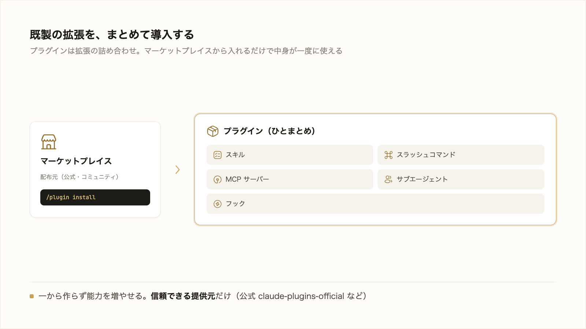
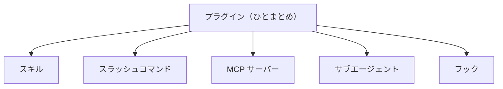

# 3-4-4 プラグインで既製の機能を導入する

!!! note "前提知識"
    このセクションは 3-4-3「hooks で自動化する」の内容を前提としています。

## このセクションで学ぶこと

- スキル・スラッシュコマンド・MCP・サブエージェント・フックをひとまとめにしたものがプラグインであること
- プラグインを導入すると、その中身の機能が一度に使えるようになること
- マーケットプレイスから、自分で作らずに既製のプラグインを導入して能力を増やせること

できあいの拡張をまとめて取り込むプラグインと、その配布元のマーケットプレイスからの導入を把握します。

!!! note "補足"
    本文のコマンドは、仕組みを理解するための例です（読みながら打つ必要はありません）。実際にプラグインを導入して使うのは Part4・Part6 で、ここでは「既製を導入して能力を増やせる」と知るのが目的です。コマンド・名称は 2026年6月時点のものです。

---

## 導入: 一から作らず、できあいを取り入れる

この Chapter で、Claude Code を広げる部品をいくつも見てきました。前提を渡す CLAUDE.md（3-3-1）、手順を再利用するスキル（3-3-2）、外部につなぐ MCP（3-4-1）、別働きで調べるサブエージェント（3-4-2）、自動で処理を挟むフック（3-4-3）。これらは自分で用意できます。一方、よくある用途のものは、すでに誰かが作って公開している場合が少なくありません。それなら、一から作らず取り入れたほうが速い。その取り入れ口がプラグインです。



## プラグインとは（拡張機能の詰め合わせ）

**プラグイン** は、スキル・スラッシュコマンド・MCP・サブエージェント・フックといった拡張を、ひとまとめにしたものです。これまで一つずつ見てきた部品を、用途に合わせて束ねたパッケージだと捉えてください。

導入すると、その中の機能が一度にまとめて使えます。ある作業を支えるスキルと、それが使う MCP サーバーと、関連する自動化のフックが1つのプラグインにまとまっていれば、入れるだけでこれらがそろいます。部品を一つずつ設定する手間が省けます。



## マーケットプレイスから入れる（/plugin）

プラグインは、**マーケットプレイス** から導入します。マーケットプレイスは配布元で、アプリのストアのようなものです。`/plugin` と打つと、一覧から探して入れられるメニューが開きます。コマンドで直接行うこともできます。まず配布元を登録し、

```bash
/plugin marketplace add <配布元>
```

その配布元のプラグインを指定して導入します。

```bash
/plugin install <名前>@<配布元>
```

マーケットプレイスには、Anthropic 管理の公式（`claude-plugins-official`）とコミュニティのものがあります。たとえば公式を登録するなら `/plugin marketplace add anthropics/claude-plugins-official` です。導入したプラグインのコマンドは、ぶつからないようプラグイン名で前置きされます（たとえば `commit-commands` プラグインのコミットコマンドは `/commit-commands:commit`）。

!!! note "補足"
    ここで挙げたコマンドやマーケットプレイス名は2026年6月時点のもので、仕様は変わりえます。実際に導入するときは最新の公式情報で確認してください。配布元のプラグインは外部から取り込むものなので、信頼できる提供元かを確かめてから導入してください（MCP サーバーと同じ考え方です。3-4-1）。

!!! tip "ヒント"
    `/plugin` が出てこない場合は、お使いの Claude Code が古い可能性があります。最新版に更新してから試してください。

ここでは「既製のプラグインを導入して、自分で作らずに能力を増やせる」と知れば十分です。自分で作った仕組みを、逆にプラグインとしてまとめてチームへ配布する側は Part4（4-1-3）で、共有・公開の操作は Part5 で扱います。

---

## まとめ

- プラグインは、スキル・スラッシュコマンド・MCP・サブエージェント・フックをひとまとめにしたもの。導入すると中身の機能が一度に使える
- マーケットプレイス（配布元）から導入する。`/plugin` のメニュー、または `/plugin marketplace add <配布元>` で配布元を登録し `/plugin install <名前>@<配布元>` で導入する。公式（`claude-plugins-official`）とコミュニティがある（2026年6月時点。`/plugin` が出ないときは更新）
- ここでは「既製を導入して能力を増やす」と知れば十分。自作の配布側は Part4、共有・公開の操作は Part5

---

この Chapter では、Claude Code を外部とつなぎ拡張する4つの主要機能を「こういうことができる」と押さえました。AI を社内外のサービスにつなぐ MCP、調べ物を別の文脈に切り出して並列に走らせるサブエージェント、決まったタイミングで処理を自動で挟むフック、既製の拡張をまとめて取り込むプラグイン。前の Chapter の CLAUDE.md・スキルとあわせ、Claude Code を広げる主要機能の地図がそろいました。これらを一つの仕組みとして束ね、業務に合わせて作り込む話は Part4 です。

次の Chapter からは、Part3 で学んだ基本操作と主要機能を実際に使い切るハンズオンに入ります。最初の 3-5-1 では、仮説と、アウトカムから逆算した完成条件を1枚に書いてから、共通題材の記事を1本作り切ります。Web 調査と裏取りでたたき台を出し、完成条件と照らして確かめ、ずれたら軌道修正する。この一筆書きで、Part3 で身につけた基本操作と主要機能を一通り使えることを確認します。これは、1-3-1 で段取りせず丸投げして失敗した記事題材を、今度は手順立てて作り直すものです。
