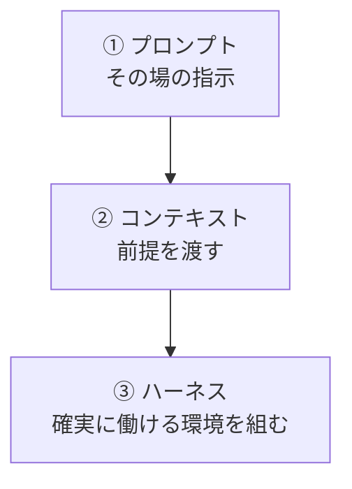
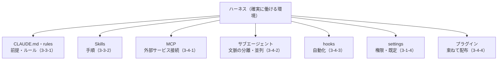

# 4-1-1 プロンプト・コンテキスト・ハーネスの3階層

!!! note "前提知識"
    このセクションは 1-3-2「プロンプトのフレームワークとAIに任せるリスク」と 3-4-4「プラグインで既製の機能を導入する」の内容を前提としています。

この Chapter では、Part3 で個別に学んだ機能を、AI を確実に働かせる一つの仕組み（ハーネス）として束ね、再利用できる資産にするところまでを扱います。

| セクション | テーマ | 種類 |
|---|---|---|
| 4-1-1 | プロンプト・コンテキスト・ハーネスの3階層 | 概念 |
| 4-1-2 | Skill・CLAUDE.md・設定に残す | 概念 |
| 4-1-3 | 資産化して属人化を解消する | 概念 |

**この Chapter の進め方**: 4-1-1 で、AI への働きかけが「プロンプト → コンテキスト → ハーネス」の3階層で深まることを地図として俯瞰し、Part3 の機能が最上層のハーネスを成すことを位置づけます。4-1-2 で、うまくいった仕事を Skill・CLAUDE.md・設定として残す方法、4-1-3 で、それを共有して資産化し属人化を解消する考え方へ進みます。

## このセクションで学ぶこと

- AI への働きかけが「プロンプト → コンテキスト → ハーネス」の3階層で深まること
- 1-3-2 のプロンプトが最下層、3-3-1 の CLAUDE.md が中間層に当たること
- Part3 で学んだ各機能が、最上層のハーネスを成すこと

Part3 までに学んだ道具を、一枚の地図の上に並べ直します。

!!! note "補足"
    このセクションは、Part3 で学んだ各機能（CLAUDE.md・Skills・MCP・サブエージェント・hooks・設定・プラグイン）の位置づけを俯瞰するもので、各機能の使い方そのものは再掲しません（それぞれ 3-3・3-4 を参照）。

---

## 導入: 同じ AI でも成果に差が出る

同じ Claude Code を使っても、人によって出てくる成果には差が出ます。差を生むのは、AI の賢さではなく、AI への働きかけ方です。その場の指示だけで使う人と、前提を渡し、手順や道具を整えてから使う人とでは、同じモデルでも結果が変わります。

この働きかけ方は、3つの階層で深められます。Part1 から Part3 まで、実はこの3階層を順に登ってきました。ここで一度、全体を地図にして見渡します。

## 3階層: プロンプト → コンテキスト → ハーネス

AI に思いどおり働いてもらう工夫は、次の3階層で深まります。

- **① プロンプト（その場の指示）**: いちばん手前の層。役割・文脈・制約を具体的に書いて、一回の依頼の精度を上げます。1-3-2 で学んだフレームワークがこれです。手軽ですが、毎回書く必要があり、その場限りです。
- **② コンテキスト（前提を渡す）**: 毎回の前提を、会話の外に置いて常に効かせる層。3-3-1 の CLAUDE.md がこれです。一度書けば、毎回説明し直さなくて済みます。
- **③ ハーネス（確実に働ける環境を組む）**: 手順・道具・自動化・権限までをそろえて、AI が安定して働ける環境そのものを組む層。Part3 の後半で学んだ機能群がここに当たります。

下の層ほど手軽でその場限り、上の層ほど作る手間はかかるものの、繰り返し効きます。**ハーネス** は本カリキュラム独自の総称ですが、公式ドキュメントも Claude Code を「Claude の周りの agentic ハーネスとして機能し、言語モデルを有能なエージェントに変えるツール・コンテキスト管理・実行環境を提供する」と説明しています（[Anthropic「Claude Code の仕組み」](https://code.claude.com/docs/ja/how-claude-code-works)、2026年6月時点）。

## ハーネスを成す Part3 の機能

最上層のハーネスは、Part3 で一つずつ学んだ機能の集まりです。地図にすると、こうなります。

公式ドキュメントは、これらの機能が「常時オンのコンテキスト → オンデマンドの機能 → 背景の自動化」という幅で並ぶと整理しています（[Anthropic「Claude Code を拡張する」](https://code.claude.com/docs/ja/features-overview)、2026年6月時点）。CLAUDE.md は常に効き、Skill は呼んだときに働き、hooks は決めた地点で自動で動く。役割の違う機能が組み合わさって、一つの環境を作ります。プラグインは、それらをまとめて配布する包み（3-4-4）です。

## どこから手をつけるか

3階層は、下から順に手をつけるのが基本です。まずプロンプトを具体的に書く。同じ前提を何度も書いていると気づいたら、それを CLAUDE.md に移す。決まった手順を繰り返しているなら Skill にする。外部データが要るなら MCP、確認や整形を自動にしたいなら hooks、という順で、必要に応じて上の層を足していきます。

最初からハーネスを作り込む必要はありません。手軽なプロンプトから始め、繰り返しが見えたところを一段ずつ仕組みに上げる。次のセクションでは、この「上げる」具体、すなわち、うまくいった仕事を Skill・CLAUDE.md・設定として残す方法を扱います。

---

## まとめ

- AI への働きかけは「プロンプト（その場の指示）→ コンテキスト（前提を渡す）→ ハーネス（環境を組む）」の3階層で深まる。下ほど手軽でその場限り、上ほど手間はかかるが繰り返し効く
- 1-3-2 のプロンプトが最下層、3-3-1 の CLAUDE.md が中間層。Part3 後半で学んだ CLAUDE.md・Skills・MCP・サブエージェント・hooks・設定・プラグインが、最上層のハーネスを成す
- 公式も Claude Code を「agentic ハーネス」と説明し、機能を「常時オン → オンデマンド → 背景の自動化」で整理する
- 作るときは下から。プロンプトを具体化し、繰り返しが見えたら一段ずつ仕組みに上げる

---

次のセクションでは、一度うまくいった仕事の手順を Skill に、前提・ルールを CLAUDE.md（必要に応じて rules・settings）に書き出し、次回から同じ指示を貼り直さずゼロ指示で呼び出せる状態を作る考え方を扱います。
