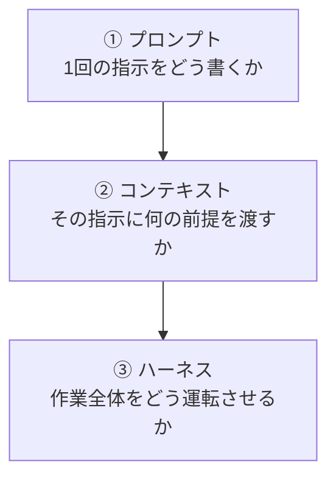
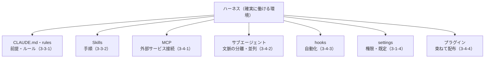

# 4-1-1 プロンプト・コンテキスト・ハーネスの3階層

!!! note "前提知識"
    このセクションは 1-3-2「プロンプトのフレームワークとAIに任せるリスク」と 3-4-4「プラグインで既製の機能を導入する」の内容を前提としています。

この Chapter では、Part3 で個別に学んだ機能を、AI を確実に働かせる一つの仕組み（ハーネス）として束ね、再利用できる資産にするところまでを扱います。

| セクション | テーマ | 種類 |
|---|---|---|
| 4-1-1 | プロンプト・コンテキスト・ハーネスの3階層 | 概念 |
| 4-1-2 | Skill・CLAUDE.md・設定に残す | 概念 |
| 4-1-3 | 資産化して属人化を解消する | 概念 |

**この Chapter の進め方**: 4-1-1 で、AI への働きかけが「プロンプト → コンテキスト → ハーネス」の3階層で深まることを地図として俯瞰し、Part3 の機能が最上層のハーネスを成すことを位置づけます。4-1-2 で、うまくいった仕事を Skill・CLAUDE.md・設定として残す方法、4-1-3 で、それを共有して資産化し属人化を解消する考え方へ進みます。

## このセクションで学ぶこと

- AI への働きかけが「プロンプト → コンテキスト → ハーネス」の3階層で深まること
- ハーネスとは何か（モデルを取り巻く、確実に働ける環境の総体）と、なぜそれが成果を分けるか
- 1-3-2 のプロンプトが最下層、3-3-1 の CLAUDE.md が中間層、Part3 の機能群が最上層のハーネスを成すこと

Part3 までに学んだ道具を一枚の地図に並べ直し、それらが成すハーネスとは何かを押さえます。

!!! note "補足"
    このセクションは、Part3 で学んだ各機能（CLAUDE.md・Skills・MCP・サブエージェント・hooks・設定・プラグイン）の位置づけを俯瞰するもので、各機能の使い方そのものは再掲しません（それぞれ 3-3・3-4 を参照）。

---

## 導入: 同じ AI でも成果に差が出る

同じ Claude Code を使っても、人によって出てくる成果には差が出ます。差を生むのは、AI の賢さではありません。同じモデルを使うのですから、賢さは同じです。差は、AI への働きかけ方、つまり AI を取り巻く環境の作り方から生まれます。その場の指示だけで使う人と、前提を渡し、手順・道具・確認の仕組みまで整えてから使う人とでは、結果が変わります。

しかも、モデルが賢くなるほど、この差は縮まるどころか広がります。賢いモデルほど、整った環境では大きな仕事を任せられ、雑な環境では賢さを持て余すからです。AI 活用の勝負どころは、モデルそのものより、それを働かせる環境のほうに移ってきています。この環境の作り方を、3つの階層で見ていきます。Part1 から Part3 まで、実はこの3階層を順に登ってきました。

## プロンプトからコンテキストへ、そしてハーネスへ

AI に思いどおり働いてもらう工夫は、扱う範囲が広がる順に、3つの階層で深まります。

**① プロンプト** は、いちばん手前の層で、1回の指示の精度を上げる工夫です。役割・文脈・制約を具体的に書く、1-3-2 のフレームワークがこれです。手軽で効果も大きいのですが、限界があります。毎回書き直す必要があり、その場限りで、長い作業の途中では前提が抜け落ちます。

**② コンテキスト** は、毎回の前提を会話の外に置いて常に効かせる層です。3-3-1 の CLAUDE.md がこれです。用語・ルール・進め方を一度書けば、起動するたびに AI が踏まえます。プロンプトが1回の指示の書き方なら、コンテキストはその指示に渡す前提の整え方です。ただしコンテキストも、AI に渡す情報を整える工夫であって、AI が複数の手順をこなし、道具を使い、自分の出力を確かめながら大きな仕事をやり切るところまでは面倒を見ません。

**③ ハーネス** は、作業全体をどう運転させるかを設計する層です。手順（Skill）・外部の道具（MCP）・別働きの調査（サブエージェント）・自動の確認（hooks）・権限（settings）までをそろえ、AI が迷わず進み、ミスを自分で気づいて直せる環境そのものを組みます。Part3 の後半で学んだ機能群が、ここに当たります。

3つは置き換えではなく、入れ子の関係です。ハーネスの中でコンテキストが効き、コンテキストの上でプロンプトが効きます。下の層ほど手軽でその場限り、上の層ほど作る手間はかかるものの、繰り返し効きます。

## ハーネスとは何か

いちばん上の **ハーネス** を、もう少し掘り下げます。ハーネスとは、もともと馬具（手綱や鞍）を指す言葉です。力は強いが放っておけば思わぬ方向へ走る馬を、御して意図した方向へ導く道具です。AI に当てると、強力だが指示が曖昧だと勝手に走り出すモデルを、安定して有用に働かせるための、モデルを取り巻く仕組みの総体を指します。

ハーネスには、AI が読む前提（CLAUDE.md）、繰り返す手順（Skill）、外部データへの接続（MCP）、調べ物を分ける別働き（サブエージェント）、決まった確認の自動化（hooks）、許してよい操作の範囲（settings）などが含まれます。本カリキュラムで Part3 後半に学んだ機能群が、まさにこれです。近年はこうした環境づくりを **ハーネスエンジニアリング** と呼び、AI 活用の中心テーマとして注目されています（2026年時点）。

ここで大事な見方が2つあります。

ひとつは、評価するのはモデル単体ではなく、**モデルとハーネスを合わせた全体だ** という見方です。同じモデルでも、ハーネスが貧弱なら浅い成果しか出ず、ハーネスが整っていれば大きな仕事を任せられます。成果を分けるのは、賢さよりも周りの仕組みです。実際、よく整ったハーネスのもとで、少人数のチームが人手では現実的でない規模の開発を、AI に任せてやり切った事例も報告されています（2026年時点）。

もうひとつは、人の役割が、指示する人から、**環境を設計する人へ移る** という見方です。AI が速く大量に作るほど、今度は人がそれを確認しきれないことが、新しい目詰まりになります。だからハーネスでは、AI 自身が結果を確かめ、ずれたら直す検証ループ（3-1-6）を組み込み、人は見るべき要所だけに集中できるようにします。うまく指示することを超えて、AI が確実に成果を出し続けられる仕事の仕組みを作る。これがハーネスの勘所です。

## ハーネスを成す Part3 の機能

ハーネスを成す機能を一枚の地図にすると、次のようになります。それぞれの使い方は Part3 で学んだとおりで、ここでは再掲しません。

公式ドキュメントも Claude Code を「agentic ハーネス」と呼び、機能を「常時オンのコンテキスト → オンデマンドの機能 → 背景の自動化」という幅で整理しています（[Anthropic「Claude Code を拡張する」](https://code.claude.com/docs/ja/features-overview)、2026年6月時点）。CLAUDE.md は常に効き、Skill は呼んだときに働き、hooks は決めた地点で自動で動く。役割の違う機能が組み合わさって、一つの環境を作ります。プラグインは、それらをまとめて配布する包み（3-4-4）です。

## どこから手をつけるか

3階層は、下から順に手をつけるのが基本です。最初からハーネスを作り込む必要はありません。まずプロンプトを具体的に書く。同じ前提を何度も書いていると気づいたら、それを CLAUDE.md に移す。決まった手順を繰り返しているなら Skill にする、という順で、必要に応じて上の層を足していきます。

手を上げる目安は、**同じことを2回手で説明したら、仕組みにする** くらいで十分です。一度うまくいったやり方を、その場で終わらせずに残していく。そうして育てたハーネスは、繰り返し効きます。ハーネスは一度で「完成」するものではなく、業務が変わるたびに手入れして育て続けるものです。その「残して育てる」具体を、次のセクションで扱います。

---

## まとめ

- AI への働きかけは「プロンプト（1回の指示）→ コンテキスト（渡す前提）→ ハーネス（作業全体の運転）」の3階層で、扱う範囲を広げながら深まる。3つは置き換えでなく入れ子で、下ほど手軽でその場限り、上ほど手間はかかるが繰り返し効く
- ハーネスは、強力だが御しにくいモデルを安定して働かせる、モデルを取り巻く仕組みの総体（馬具が語源）。CLAUDE.md・Skills・MCP・サブエージェント・hooks・設定などが含まれ、近年ハーネスエンジニアリングと呼ばれる
- 成果を分けるのは賢さより周りの仕組み（モデルとハーネスを合わせた全体で評価する）。人の役割は指示する人から環境を設計する人へ移り、検証ループを組み込んで要所だけ人が見る
- 作るときは下から。同じことを2回説明したら仕組みにする。ハーネスは完成せず、育て続ける

---

次のセクションでは、一度うまくいった仕事の手順を Skill に、前提・ルールを CLAUDE.md（必要に応じて rules・settings）に書き出し、次回から同じ指示を貼り直さずゼロ指示で呼び出せる状態を作る考え方を扱います。
