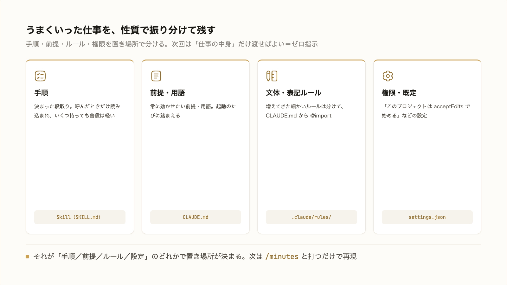

# 4-1-2 Skill・CLAUDE.md・設定に残す

!!! note "前提知識"
    このセクションは 4-1-1「プロンプト・コンテキスト・ハーネスの3階層」の内容を前提としています。

<video controls preload="metadata" playsinline width="100%">
  <source src="https://github.com/coachtech-material/pj_X/releases/download/videos/4-1-2.mp4" type="video/mp4">
</video>

## このセクションで学ぶこと

- うまくいった仕事の手順を Skill、前提・ルールを CLAUDE.md（rules・settings）に書き出すこと
- 次回から同じ指示を貼り直さず、ゼロ指示で呼び出せる状態を作ること
- 何をどこに残すか（手順・前提・ルール・権限）の振り分け

一度の成功を、毎回再現できる形に残す考え方を押さえます。

!!! note "補足"
    Skill・CLAUDE.md・settings の使い方そのものは 3-3・3-1-4 で学びました。ここでは、それらを「仕組みに残す」観点で組み合わせます。実際に自分の業務で組むのは Chapter 4-4 のハンズオンです。

---

## 導入: うまくいった仕事を毎回やり直さない

ある日、試行錯誤の末に、議事録の整形を狙いどおりに仕上げられたとします。発言の整理のしかた、決定事項の抜き出し方、表の形まで、指示を重ねてようやく形になった。問題は次回です。新しいセッションは空から始まる（3-2-1）ので、また同じ指示を一から組み立て直すことになります。

うまくいったときのやり方を、その場のやり取りに埋もれさせず、次回から呼び出せる形に書き出しておく。そうすれば、一度の成功が、毎回の成果になります。書き出す先が、Skill・CLAUDE.md・設定です。

## 手順は Skill、前提は CLAUDE.md

書き出すとき、中身を性質で振り分けます。3-3 で学んだ使い分けが、ここで効きます。

- **手順 → Skill**: 「議事録はこの順でまとめる」のような決まった段取りは、Skill（`SKILL.md`）に書きます。呼んだときだけ読み込まれるので、いくつ持っても普段は軽い（3-3-2）
- **前提・ルール → CLAUDE.md**: 「この会社では『案件』と『商談』は別」「文体は敬体」のような、常に効かせたい前提は CLAUDE.md に書きます（3-3-1）。文体や表記の細かいルールが増えたら、`.claude/rules/` に分けます
- **権限・既定 → settings.json**: 「このプロジェクトは `acceptEdits` で始める」のような設定は `settings.json` に置きます（3-1-4）

ひとつの仕事は、これらの組み合わせで残ります。たとえば競合調査なら、調べる手順は Skill、扱ってよい情報の前提は CLAUDE.md、調査用の道具を絞ったサブエージェント（3-4-2）まで含めて、ひとそろいの仕組みになります。

## ゼロ指示で呼び出せる状態にする

仕組みに残す狙いは、**次回から指示を組み立て直さずに済む** ことです。手順を `minutes` という Skill にしておけば、次からは `/minutes` と打つだけ、あるいは「議事録をまとめて」と言うだけで、AI が同じ段取りで動きます（3-3-2 の自動呼び出し）。毎回、整理のしかたや表の形を説明し直す必要はありません。

この状態を、ここでは **ゼロ指示** と呼びます。厳密に指示がゼロになるわけではなく、「やり方の説明」を毎回ゼロから繰り返さなくてよい、という意味です。仕事の中身（今日の議事録はこれ）だけを渡せば、やり方は仕組みが覚えている。試行錯誤して見つけた良い進め方を、一度きりで終わらせないということです。

!!! tip "ヒント"
    最初から完璧な Skill を作る必要はありません。まず一度、手でうまくいかせる。その手順を Claude Code に「いまの進め方を Skill にして」とまとめさせ、次に使うときに足りない部分を直す。使いながら育てるのが現実的です。

## 何をどこに残すか

迷ったときの振り分けの目安です。

| 残したいもの | 置き場所 |
|---|---|
| 決まった作業手順 | Skill（`.claude/skills/<名前>/SKILL.md`） |
| 常に効かせたい前提・用語 | CLAUDE.md |
| 増えてきた文体・表記ルール | `.claude/rules/`（CLAUDE.md から `@import`） |
| 権限・既定モデルなどの設定 | `settings.json` |

それが「手順」なのか「前提」なのか「ルール」なのか「設定」なのかで置き場所が決まります。どれも、自分用（`~/.claude/`）に置けば全プロジェクトで、プロジェクト内（`.claude/`）に置けばチームで共有できます。この「共有して資産にする」話を、次のセクションで扱います。

---

## まとめ

- うまくいった仕事は、その場のやり取りに埋もれさせず、性質で振り分けて書き出す。手順は Skill、前提・用語は CLAUDE.md、文体ルールは `.claude/rules/`、権限・既定は `settings.json`
- 書き出すと、次回は仕事の中身だけ渡せばよく、やり方の説明を毎回繰り返さずに済む（ゼロ指示）。`/スキル名` や自動呼び出しで再現できる
- 完璧に作ろうとせず、一度うまくいった手順を Claude Code にまとめさせ、使いながら育てる

---

次のセクションでは、こうして残した Skill・CLAUDE.md・設定をプロジェクトに置いて共有すると、やり方が個人の頭から離れて資産になり、退職・異動で止まらず新人も同じ仕組みで立ち上がれること、自作の仕組みをプラグインとしてまとめてチームへ配布できることを扱います。
