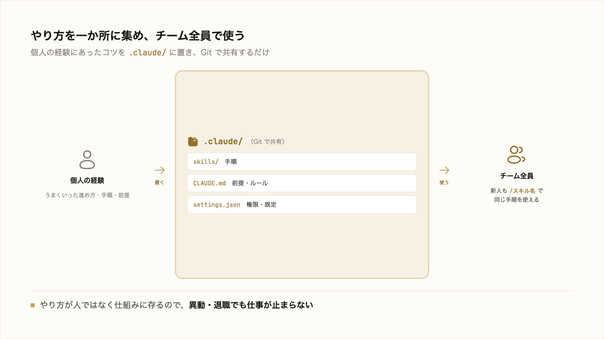

# 4-1-3 資産化して属人化を解消する

!!! note "前提知識"
    このセクションは 4-1-2「Skill・CLAUDE.md・設定に残す」の内容を前提としています。

<video controls preload="metadata" playsinline width="100%">
  <source src="https://github.com/coachtech-material/pj_X/releases/download/videos/4-1-3.mp4" type="video/mp4">
</video>

## このセクションで学ぶこと

- Skill・CLAUDE.md・設定をプロジェクトに置いて共有すると、やり方が個人の頭から離れて資産になること
- 退職・異動で仕事が止まらず、新人も同じ仕組みで立ち上がれること
- 自作の仕組みをプラグインとしてまとめ、チームへ配布できること

仕組みを個人の道具からチームの資産へ広げる考え方を押さえます。

!!! note "補足"
    このセクションは資産化の考え方を扱います。共有・公開の実際の操作（リポジトリへの登録や配布）は Part5（Git・GitHub）で手を動かします。

---

## 導入: やり方が一人の頭の中にある状態

仕事のやり方が、特定の一人の経験の中にしかない状態を **属人化** と呼びます。その人がいるうちは回りますが、休んだり異動・退職したりすると、とたんに仕事が止まります。新しく入った人は、その人の頭の中を再現できないので、一から手探りになります。多くの職場が抱える課題です。

4-1-2 で、うまくいったやり方を Skill・CLAUDE.md・設定として書き出しました。これを個人の手元に置いたままにせず、チームで共有すると、属人化そのものを解消できます。

## プロジェクトに置いて共有する

鍵は置き場所です。3-3 や 3-1-4 で見たとおり、Skill・CLAUDE.md・設定には、自分用（`~/.claude/`）とプロジェクト用（`.claude/`）の2つの置き場所がありました。

- **自分用（`~/.claude/`）**: 自分のすべての作業で効く。個人の道具
- **プロジェクト用（`.claude/`）**: そのプロジェクトの全員に効く。チームの資産

やり方をプロジェクトの `.claude/` に置くと、それは個人の頭の中ではなく、プロジェクトの一部になります。Part5 で学ぶ Git でプロジェクトを共有すれば、チームの誰もが同じ Skill・同じ CLAUDE.md・同じ設定で作業できます。やり方が、人から仕組みへ移る。これが資産化です。

## 退職・異動で止まらない、新人も立ち上がる

資産化されていると、何が変わるか。

担当者が異動・退職しても、やり方は `.claude/` に残っているので、仕事は止まりません。引き継ぎのたびに、暗黙のコツを口頭で伝える手間も減ります。新しく入った人は、`/スキル名` を呼ぶだけで、ベテランが試行錯誤の末に固めた手順をそのまま使えます。立ち上がりが速くなり、品質も人によってばらつきにくくなります。

これは、本研修が掲げる「属人化の解消」そのものです。一度うまくいったやり方を仕組みにして共有することが、個人の効率化を超えて、チームの底上げにつながります。

## 自作の仕組みはプラグインで配布できる

複数の Skill・サブエージェント・hooks がまとまって一つの仕事を支えるようになったら、それらを **プラグイン** にまとめられます。3-4-4 で、既製のプラグインを導入する側を学びました。今度は、自分たちで作った仕組みを、配る側に回れます。

プラグインにまとめると、ひとそろいの仕組みを、他のチームや別のプロジェクトへ一度に渡せます。受け取った側は、`/plugin` で入れるだけで、同じ Skill もサブエージェントも hooks も手に入ります。社内で磨いた進め方を全社へ広げる、といった使い方ができます。

!!! note "補足"
    自作の仕組みをプラグインとしてまとめる作り方や、それを配布・公開する操作（リポジトリの公開など）は、Part5（Git・GitHub）以降で扱います。ここでは「自分の仕組みも配布できる」と押さえれば十分です。

---

## まとめ

- 仕事のやり方が一人の経験の中にしかない状態が属人化。Skill・CLAUDE.md・設定をプロジェクトの `.claude/` に置いて共有すると、やり方が個人の頭からプロジェクトの一部に移る（資産化）
- 資産化されていれば、担当者の異動・退職でも仕事が止まらず、新人も `/スキル名` で同じ仕組みを使って速く立ち上がれる。品質のばらつきも減る
- 複数の仕組みはプラグインにまとめて、他のチームやプロジェクトへ一度に配布できる（作り方・配布の操作は Part5 以降）

---

これで Chapter 4-1 は終わりです。AI への働きかけが「プロンプト → コンテキスト → ハーネス」の3階層で深まること（4-1-1）、うまくいった仕事を Skill・CLAUDE.md・設定として残すこと（4-1-2）、それを共有して資産化し属人化を解消すること（本セクション）を押さえました。Part3 の機能が、再利用できる一つの仕組みとしてつながりました。

ただし、仕組みを整えても、大きな仕事をいきなり丸投げすれば、やはりズレが累積します。次の Chapter 4-2 では、大きい仕事を破綻なく仕上げる進め方、仕様駆動（SDD）を扱います。最初の 4-2-1 では、大きいタスクほど指示が曖昧になり AI が解釈で埋めてズレが累積すること（1-3-1 の再来）、作り始める前に要件 → 設計 → タスク → 実行の順に曖昧さを潰し、固めた仕様を「正（よりどころ）」として進める考え方を押さえます。
