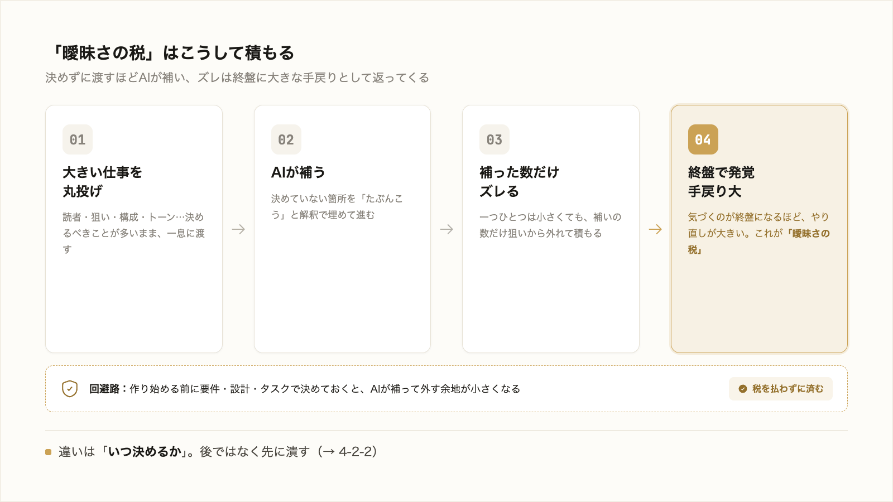

# 4-2-1 仕様駆動の考え方

!!! note "前提知識"
    このセクションは 4-1-1「プロンプト・コンテキスト・ハーネスの3階層」と 1-3-1「ブログ記事を丸投げする」の内容を前提としています。

この Chapter では、大きい仕事を破綻なく仕上げる進め方、仕様駆動（SDD）を扱います。4-2-1 で考え方を、4-2-2 でそれを要件・設計・タスクの3段に落とす方法を押さえます。

| セクション | テーマ | 種類 |
|---|---|---|
| 4-2-1 | 仕様駆動の考え方 | 概念 |
| 4-2-2 | 要件・設計・タスクの3段で固める | 概念 |

**この Chapter の進め方**: 4-2-1 で、大きい仕事を丸投げするとズレが累積する理由と、作り始める前に仕様を固める考え方を押さえ、4-2-2 で、それを「要件 → 設計 → タスク」の3段に翻訳して自分の業務に当てます。実際にこの進め方で学習ドキュメントを設計するのは Chapter 4-4 のハンズオンです。

<video controls preload="metadata" playsinline width="100%">
  <source src="https://github.com/coachtech-material/pj_X/releases/download/videos/4-2-1.mp4" type="video/mp4">
</video>

## このセクションで学ぶこと

- 大きいタスクほど指示が曖昧になり、AI が解釈で埋めてズレが累積すること
- 作り始める前に、要件 → 設計 → タスク → 実行の順で曖昧さを潰すこと
- 固めた仕様を「正（よりどころ）」として進める仕様駆動の考え方

1-3-1 で体感した丸投げの失敗を、進め方の問題として捉え直します。

!!! note "補足"
    仕様駆動は特定のツールに依存しない普遍的な進め方です。これを実際のツール（cc-sdd など）で回す手触りは Part6 で扱います。本文の用語は 2026年6月時点のものです。

---

## 導入: 大きく丸投げするほどズレが累積する

1-3-1 で、「ちゃんとした記事を1本書いて」と段取りせず丸投げして、浅く狙いから外れた結果になるのを体感しました。あれは、たまたま運が悪かったのではありません。大きい仕事を一息に丸投げするほど、起きやすくなる現象です。

3-1-6 では、その対策として、小さく刻んで一段ずつ完成条件と照らす検証ゲートを学びました。仕様駆動は、その「刻む」を、作り始める前の段取りにまで広げた進め方です。

## 曖昧さの税

なぜ大きいほどズレるのか。1-3-2 で学んだとおり、AI は曖昧な指示を解釈で埋めます。指示で決めていなかったことは、AI が「たぶんこうだろう」と補って進みます。

小さなタスクなら、決めていないことも少なく、補われてもズレは小さい。ところが大きいタスクは、決めるべきことが多く、そのぶん補われる箇所も増えます。記事1本でも、読者・狙い・構成・トーン・長さと、決めるべきことは多い。これらを曖昧にしたまま渡すと、AI はそれぞれを勝手に補い、補った数だけ狙いからずれていきます。そして大きい仕事ほど、ずれに気づくのが終盤になり、手戻りが大きくなります。

決めていない箇所のぶんだけ、後から払うことになるこの手戻りを、ここでは **曖昧さの税** と呼びます。大きい仕事ほど、この税は高くつきます。

## 作り始める前に固める

曖昧さの税を避ける方法は、シンプルです。**作り始める前に、曖昧さを潰しておく**。いきなり成果物を作らせず、まず「何を・なぜ・どう作るか」を固めてから実行に移します。

この「先に固めてから作る」進め方を **仕様駆動** （SDD）と呼びます。固める順序は、おおまかに次のとおりです。

要件で「何を・なぜ・何ができたら完成か」を決め、設計で「どの情報を・どの順で・どんな制約で作るか」を決め、タスクで「検証できる小さな単位」に分けてから、実行に移ります。各段で曖昧さを潰しておくので、実行の段で AI が補って外す余地が小さくなります。3-1-4 で触れた Plan モード（編集前に計画を立てさせる）も、この「先に固める」を一手で行う仕組みでした。

## 固めた仕様を「正」として進める

仕様駆動のもう一つの肝は、固めた仕様を、その後の **正（よりどころ）** として扱うことです。

ふつう、作り始めると、最初に立てた段取りは忘れられ、成果物だけが残ります。仕様駆動では逆に、固めた仕様を残し、成果物は仕様から作られる出力物として扱います。だから、途中で方針が変わったら、成果物を直接いじるのではなく、まず仕様を直し、そこから作り直します。狙いの源が一か所（仕様）にまとまるので、ズレに気づいたときも、どこを直せばよいかが明確です。

この考え方は、特定のツールのものではありません。資料づくりでもアプリ開発でも効く、普遍的な進め方です。次のセクションでは、これを「要件 → 設計 → タスク」の3段に分け、自分の業務に当てて具体的に見ます。

---

## まとめ

- 大きい仕事を丸投げするほどズレが累積する（1-3-1 の再来）。AI は曖昧な箇所を解釈で埋めるため、決めるべきことが多い大タスクほど補われる箇所が増え、手戻り（曖昧さの税）が高くつく
- 対策は、作り始める前に曖昧さを潰すこと。要件 → 設計 → タスク → 実行の順に固めてから実行に移る進め方が仕様駆動（SDD）
- 固めた仕様を「正（よりどころ）」として扱い、変更は仕様から反映する。狙いの源が一か所にまとまり、ズレを直しやすい。特定ツールに依存しない普遍的な進め方

---

次のセクションでは、仕様駆動を「要件（何を・なぜ・何ができたら完成か）→ 設計（どの情報を・どの順で・どんな制約で）→ タスク（検証できる小タスクに分解し一つずつ照合）」の3段に翻訳し、提案書づくりなど自分の業務に当てて押さえます。要件の段が 1-3-4 の完成条件の延長、タスクの段が 3-1-6 の検証ゲートそのものであることを確かめます。
