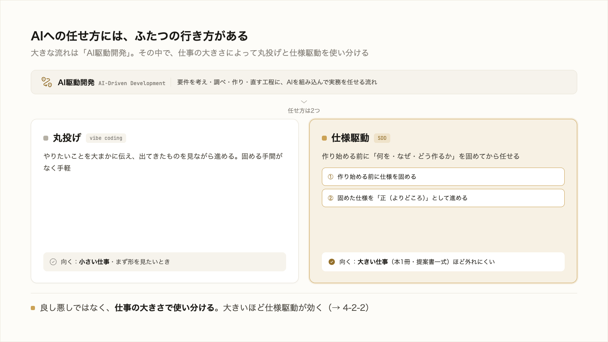

# 4-2-1 仕様駆動開発（SDD）とは

!!! note "前提知識"
    このセクションは 4-1-1「プロンプト・コンテキスト・ハーネスの3階層」と 1-3-1「本をまるごと丸投げする」の内容を前提としています。

この Chapter では、大きい仕事を破綻なく仕上げる進め方、仕様駆動（SDD）を扱います。まず本節で「仕様駆動とは何か」を定義し、4-2-2 でなぜ先に固めると効くのかを、4-2-3 でそれを要件・設計・タスクの3段に落とす方法を押さえます。

| セクション | テーマ | 種類 |
|---|---|---|
| 4-2-1 | 仕様駆動開発（SDD）とは | 概念 |
| 4-2-2 | なぜ先に固めると効くのか | 概念 |
| 4-2-3 | 要件・設計・タスクの3段で固める | 概念 |

**この Chapter の進め方**: 4-2-1 で仕様駆動とは何かを定義し、4-2-2 で大きい仕事を丸投げするとズレが累積する理由と先に固める効用を押さえ、4-2-3 で「要件 → 設計 → タスク」の3段に翻訳して自分の業務に当てます。実際にこの進め方で本を設計するのは Chapter 4-4 のハンズオンです。

<video controls preload="metadata" playsinline width="100%">
  <source src="https://github.com/coachtech-material/pj_X/releases/download/videos/4-2-1.mp4" type="video/mp4">
</video>

## このセクションで学ぶこと

- AI に任せる進め方に「丸投げ」と「仕様駆動」の2つの行き方があること
- 仕様駆動開発（SDD）とは何か（作る前に仕様を固め、それを正として進める）
- SDD がソフトウェア開発で生まれ、いまは業務全般に効く進め方であること

!!! note "補足"
    本文のコマンドや用語は読んで理解するための例です。実際にこの進め方で手を動かすのは Chapter 4-4 のハンズオンです。本文の用語は 2026年6月時点のものです。

---

## 導入: 指示するだけでは思いどおりにならない

1-3-1 で、「○○について本を1冊書いて」と丸ごと指示して、浅く狙いから外れた結果になるのを体感しました。AI は優秀ですが、やりたいことをただ指示するだけで、思いどおりの成果物が返ってくるわけではありません。指示が大まかなほど、AI は足りない部分を自分の解釈で埋め、こちらの狙いから少しずつずれていきます。

ここで効くのが、作り始める前に「何を・なぜ・どう作るか」をはっきりさせてから渡す、という進め方です。やりたいことを構造化して渡すと、AI は迷わず、こちらの狙いどおりに動きやすくなります。この進め方を仕様駆動と呼びます。本節では、それが何かを定義します。

## AI に任せる2つの行き方（丸投げと仕様駆動）

いまは、資料づくりからアプリ開発まで、実際の作業を AI に任せられる時代です。要件を考え、調べ、作り、直すといった工程に AI を組み込んでいく流れを、**AI駆動開発**（AI-Driven Development）と呼びます。本研修で学んできた Claude Code の使い方も、その一部です。

AI への任せ方には、大きく2つの行き方があります。

- **丸投げ**: やりたいことを大まかに伝え、出てきたものを見ながら進める。手軽で、小さい仕事や、まず形を見たいときに向く。1-3-1 で試したのがこれです（雰囲気を伝えて任せるこのやり方は **vibe coding** とも呼ばれます）
- **仕様駆動**: 作り始める前に、何を・なぜ・どう作るかを固めてから任せる。固める手間はかかるが、大きい仕事ほど狙いから外れにくくなる

どちらが良い悪いではなく、仕事の大きさで使い分けます。小さな調べ物を毎回かっちり仕様化するのは大げさですが、本1冊や提案書一式のような大きい仕事を丸投げすると、1-3-1 のように終盤で狙いとのズレに気づき、大きく作り直すことになりがちです。

## 仕様駆動開発（SDD）とは

**仕様駆動**（SDD: Specification-Driven Development）とは、次の2つを軸にした進め方です。

1. **作り始める前に仕様を固める**: いきなり成果物を作らせず、まず「何を・なぜ・どう作るか」を決める
2. **固めた仕様を「正（よりどころ）」として進める**: 成果物は仕様から作られる出力物として扱う。方針が変わったら成果物を直接いじらず、まず仕様を直してから作り直す

この進め方は、もともとソフトウェア開発の世界で生まれました。AI にコードを大量に書かせられるようになった反面、雑に丸投げすると、それらしいが見当違いのコードが大量に出てしまう。その反省から「先に仕様を固めてから AI に作らせる」考え方が広まり、いまでは主要な AI 開発ツールの多くがこの形を備えています（2026年6月時点）。

そして仕様駆動は、コードづくりに限った話ではありません。「作る前に、何を・なぜ・どう作るかを固める」というだけのことなので、提案書・記事・調査レポートなど、業務の成果物づくり全般にそのまま効きます。本研修が非エンジニアを対象にしながらこの考え方を扱うのは、そのためです。

!!! note "補足"
    本研修では、SDD を厳密な開発手法として作り込むことは目指しません。狙いは、AI にただ指示するのではなく「仕様を一枚はさむ」習慣を持ち、やりたいことを構造化して再現性高く AI に任せられるようになることです。厳密な記法は要りません（具体的な書き方は 4-2-3、実際のツールは Part6 で扱います）。

---

## まとめ

- AI に作業を任せる流れ（AI駆動開発）の中で、任せ方には「丸投げ」と「仕様駆動」の2つの行き方がある。小さい仕事は丸投げでよいが、大きい仕事は丸投げると狙いからずれやすい
- 仕様駆動（SDD）とは、①作り始める前に「何を・なぜ・どう作るか」を固め、②固めた仕様を「正（よりどころ）」として進める考え方。もとはソフトウェア開発で生まれ、いまは主要な AI ツールが備える
- 仕様駆動はコードに限らず、提案書・記事など業務の成果物づくり全般に効く。ただ指示するだけでなく仕様を一枚はさむと、AI が迷わず、再現性高く狙いどおりに動く

---

次のセクションでは、なぜ大きい仕事ほど丸投げでズレが累積するのか、その仕組みを 1-3-2（AI は曖昧な指示を解釈で補う）と重ねて掘り下げ、作り始める前に固めること、固めた仕様を「正」として扱うことが、なぜズレを抑えるのかを見ます。
