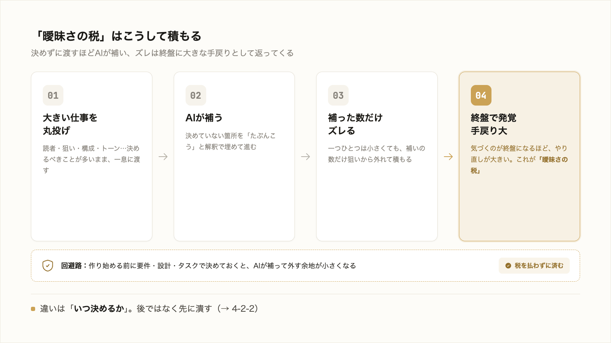

# 4-2-2 なぜ先に固めると効くのか

!!! note "前提知識"
    このセクションは 4-2-1「仕様駆動開発（SDD）とは」と 1-3-2「プロンプトのフレームワークとAIに任せるリスク」の内容を前提としています。

<video controls preload="metadata" playsinline width="100%">
  <source src="https://github.com/coachtech-material/pj_X/releases/download/videos/4-2-2.mp4" type="video/mp4">
</video>

## このセクションで学ぶこと

- 大きい仕事ほど丸投げでズレが積み上がる理由（AI が曖昧な箇所を解釈で補うため）
- 作り始める前に固めると、AI が補って外す余地が小さくなること
- 固めた仕様を「正（よりどころ）」として扱うと、ズレを直しやすいこと

4-2-1 で定義した仕様駆動が、なぜ大きい仕事に効くのかを掘り下げます。

---

## 導入: 大きく任せるほどズレが積み上がる

1-3-1 で本を丸投げして狙いから外れたのは、運が悪かったのではなく、大きい仕事を一息に任せるほど起きやすくなる現象でした。

3-1-6 では、その対策として、小さく刻んで一段ずつ完成条件と照らす検証ゲートを学びました。仕様駆動は、その「刻む」を、作り始める前の段取りにまで広げた進め方です。では、なぜ刻まず大きく任せるとズレるのか。仕組みから見ていきます。

## 大きい仕事ほど「決めていないこと」が増える

なぜ大きいほどズレるのか。1-3-2 で学んだとおり、AI は曖昧な指示を解釈で埋めます。指示で決めていなかったことは、AI が「たぶんこうだろう」と補って進みます。

小さなタスクなら、決めていないことも少なく、補われてもズレは小さい。ところが大きいタスクは、決めるべきことが多く、そのぶん補われる箇所も増えます。本1冊でも、読者・狙い・構成・トーン・長さと、決めるべきことは多い。これらを曖昧にしたまま渡すと、AI はそれぞれを勝手に補い、補った数だけ狙いからずれていきます。

やっかいなのは、ずれに気づくのが遅れることです。大きい仕事ほど、できあがりが見えるのは終盤で、そこで初めて「狙いと違う」と分かる。決めていなかった箇所のぶんだけ、後からまとめて手戻りが発生し、大きい仕事ほどその代償は大きくなります。

## 作り始める前に固める

ずれを抑える方法は、シンプルです。**作り始める前に、曖昧さを潰しておく**。いきなり成果物を作らせず、まず「何を・なぜ・どう作るか」を決めてから実行に移します。決めてあれば、AI が補って外す余地が、その分だけ小さくなります。

4-2-1 で定義した仕様駆動は、まさにこの「先に固める」を徹底する進め方です。固める順序は、おおまかに次のとおりです。

要件で「何を・なぜ・何ができたら完成か」を決め、設計で「どの情報を・どの順で・どんな制約で作るか」を決め、タスクで「検証できる小さな単位」に分けてから、実行に移ります。各段で曖昧さを潰しておくので、実行の段でずれにくくなります。3-1-4 で触れた Plan モード（編集前に計画を立てさせる）も、この「先に固める」を一手で行う仕組みでした。この3段の中身は、次の 4-2-3 で具体的に見ます。

## 固めた仕様を「正」として進める

先に固めることと並ぶ、もう一つの肝が、固めた仕様を、その後の **正（よりどころ）** として扱うことです。

ふつう、作り始めると、最初に立てた段取りは忘れられ、成果物だけが残ります。仕様駆動では逆に、固めた仕様を残し、成果物は仕様から作られる出力物として扱います。だから、途中で方針が変わったら、成果物を直接いじるのではなく、まず仕様を直し、そこから作り直します。狙いの源が一か所（仕様）にまとまるので、ズレに気づいたときも、どこを直せばよいかが明確になります。

先に固めて補う余地を減らし、固めた仕様を正にしてズレを直しやすくする。この2つで、大きい仕事でも狙いから外れにくくなります。

---

## まとめ

- 大きい仕事を丸投げするとズレが積み上がるのは、決めるべきことが多く、決めていない箇所を AI が解釈で補うから。しかも、ずれに気づくのが終盤になり手戻りが大きくなる
- 対策は、作り始める前に曖昧さを潰すこと。決めてあるほど、AI が補って外す余地が小さくなる
- もう一つの肝は、固めた仕様を「正（よりどころ）」として扱い、変更は仕様から反映すること。狙いの源が一か所にまとまり、ズレを直しやすい

---

次のセクションでは、この「先に固める」を、要件（何を・なぜ・何ができたら完成か）→ 設計（どの情報を・どの順で・どんな制約で）→ タスク（検証できる小タスクに分解し一つずつ照合）の3段に翻訳し、提案書づくりなど自分の業務に当てて具体的に見ます。要件の段が 1-3-4 の完成条件の延長、タスクの段が 3-1-6 の検証ゲートそのものであることを確かめます。
