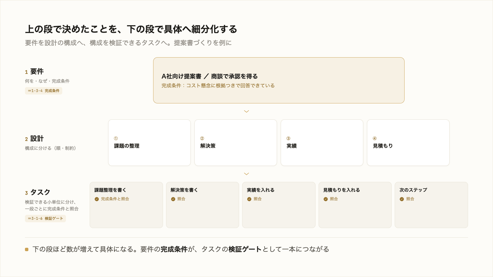

# 4-2-2 要件・設計・タスクの3段で固める

!!! note "前提知識"
    このセクションは 4-2-1「仕様駆動の考え方」と 1-3-4「構造化とアウトカムから決める完成条件」、3-1-6「出力の検証と軌道修正」の内容を前提としています。

<video controls preload="metadata" playsinline width="100%">
  <source src="https://github.com/coachtech-material/pj_X/releases/download/videos/4-2-2.mp4" type="video/mp4">
</video>

## このセクションで学ぶこと

- 仕様駆動を「要件 → 設計 → タスク」の3段に翻訳すること
- 各段で何を決めるかを、自分の業務（提案書づくりなど）に当てて押さえること
- 要件の段が 1-3-4 の完成条件の延長、タスクの段が 3-1-6 の検証ゲートそのものであること

4-2-1 の「先に固める」を、具体的な3段の作業に落とします。

!!! note "補足"
    本文の3段は、これまで学んだ完成条件（1-3-4）と検証ゲート（3-1-6）を、一つの流れにつなげたものです。実際にこの3段で本を設計するのは Chapter 4-4 のハンズオンです。

---

## 導入: 「固める」を3段に分ける

4-2-1 で、作り始める前に曖昧さを潰すと学びました。とはいえ「曖昧さを潰す」だけでは、何をすればよいか分かりません。これを、決める順に3段へ分けます。要件・設計・タスクです。提案書づくりを例に、それぞれの段で何を決めるかを見ます。

## 要件: 何を・なぜ・何ができたら完成か

最初の段は **要件** です。これから作るものについて、次を決めます。

- **何を**: 何を作るのか（例: A 社向けの提案書）
- **なぜ**: その先のアウトカムは何か（例: 次回商談でこのプランの承認を得る）
- **何ができたら完成か**: 完成条件（例: 先方の懸念だったコストに、根拠つきの回答が入っている）

この「何ができたら完成か」は、1-3-4 で学んだ完成条件そのものです。要件の段は、その完成条件を、作る前に明文化する作業だと考えてください。ここが曖昧なまま進むと、後の段すべてがずれます。逆に、ここをアウトカムから逆算して具体的に決めておくと、設計もタスクも、それに沿って素直に決まります。

## 設計: どの情報を・どの順で・どんな制約で

次の段は **設計** です。要件で決めた「何を・完成条件」を、どう組み立てるかを決めます。

- **どの情報を**: 必要な材料（例: 先方の課題、自社の実績、競合との比較、見積もり）
- **どの順で**: 構成・順序（例: 課題の整理 → 解決策 → 実績 → 見積もり → 次のステップ）
- **どんな制約で**: 守るべき条件（例: 10ページ以内、専門用語は避ける、数字には出典を付ける）

設計は、いわば提案書の目次と方針です。ここを先に決めておくと、AI は行き当たりばったりに書かず、決めた構成と制約に沿って組み立てます。

## タスク: 検証できる小タスクに分けて照合する

最後の段は **タスク** です。設計で決めた構成を、検証できる小さな単位に分けます。

- 課題の整理を書く → 完成条件（先方の課題が3点、具体的に挙がっているか）と照らす
- 解決策を書く → 照らす
- 見積もりを入れる → 照らす

一段ごとに「できているか」を完成条件と照らし、合格してから次へ進む。これは 3-1-6 で学んだ検証ゲートそのものです。仕様駆動のタスクの段は、検証ゲートを、設計から導いた単位で並べたものだと言えます。大きな提案書を一気に作らせて最後に見るのではなく、節ごとに刻んで確かめるので、ずれは小さいうちに見つかります。

要件で完成条件を決め、設計で道筋を決め、タスクで刻んで照合する。3段を通すと、1-3 と 3-1-6 で別々に学んだ「完成条件」と「検証ゲート」が、大きい仕事を破綻なく仕上げる一本の流れになります。

!!! note "補足"
    この3段は、仕様駆動の実ツールが生む成果物の形と対応しています。たとえば Kiro や、Part6 で使う cc-sdd は、`requirements.md`（要件）・`design.md`（設計）・`tasks.md`（タスク）という3つのファイルを生成します（2026年6月時点。ツールによりファイル名は異なります）。本カリキュラムでは、まずこの3段を手で固める考え方を押さえ、実ツールでの自動生成は Part6 で扱います。要件を厳密に書くための定型記法もありますが、本研修では「完成条件＝○○のとき△△ができている」という日本語で書けば十分です。

---

## まとめ

- 仕様駆動の「固める」は、要件 → 設計 → タスクの3段に分ける
- 要件: 何を・なぜ・何ができたら完成か。「何ができたら完成か」は 1-3-4 の完成条件そのもの
- 設計: どの情報を・どの順で・どんな制約で。提案書の目次と方針にあたる
- タスク: 設計を検証できる小タスクに分け、一段ごとに完成条件と照らす。3-1-6 の検証ゲートそのもの
- 実ツール（Kiro・cc-sdd 等）は requirements.md・design.md・tasks.md としてこの3段を生む。記法に凝らず「完成条件＝○○のとき△△ができる」で書けばよい（実ツールは Part6）

---

これで Chapter 4-2 は終わりです。大きい仕事を丸投げするとズレが累積すること、それを防ぐ仕様駆動の考え方（4-2-1）と、要件・設計・タスクの3段で固める進め方（本セクション）を押さえました。仕組み（4-1）と仕様駆動（4-2）で、大きい仕事を任せる準備が整いました。

最後に、作った仕組みを安心して使い続けるための運用を見ます。次の Chapter 4-3 では、まず 4-3-1 で、Skill・CLAUDE.md の品質を保つ勘所と、タスクの重さに応じてモデルと努力レベル（effort）を選び分けてコストを最適化する考え方を押さえます。
