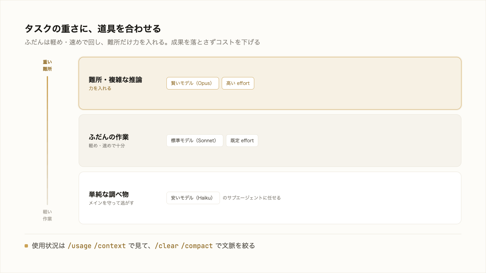

# 4-3-1 品質とコストの最適化

!!! note "前提知識"
    このセクションは 4-1-2「Skill・CLAUDE.md・設定に残す」の内容を前提としています。

この Chapter では、作った仕組みを安心して使い続けるための運用を扱います。4-3-1 で品質とコストの最適化を、4-3-2 で組織で安全に運用するガバナンスを押さえます。

| セクション | テーマ | 種類 |
|---|---|---|
| 4-3-1 | 品質とコストの最適化 | 概念 |
| 4-3-2 | ガバナンス | 概念 |

**この Chapter の進め方**: 4-3-1 で、仕組みの品質を保つ勘所とコストを最適化する考え方を押さえ、4-3-2 で、組織で安全に運用するガバナンス（管理設定・権限・機密の扱い）へ進みます。Part4 の応用を、運用の観点で締めくくります。

<video controls preload="metadata" playsinline width="100%">
  <source src="https://github.com/coachtech-material/pj_X/releases/download/videos/4-3-1.mp4" type="video/mp4">
</video>

## このセクションで学ぶこと

- Skill・CLAUDE.md の品質を保つ勘所（簡潔さと更新）
- タスクの重さに応じてモデルと努力レベル（effort）を選び分けること
- コストを最適化する勘所

作った仕組みを、長く・無駄なく使い続けるための運用を押さえます。

!!! note "補足"
    モデル・努力レベル・コストの操作そのものは 3-1-3、コンテキストの整え方は 3-2 で学びました。ここでは、それらを「仕組みを運用する」観点でまとめ直します。

---

## 導入: 作った仕組みを使い続けるために

4-1 で仕組みを作り、4-2 で大きい仕事の進め方を整えました。あとは使い続けるだけ、と言いたいところですが、仕組みは作って終わりではありません。放っておくと品質が落ち、使い方を誤るとコストがかさみます。長く・無駄なく使い続けるための勘所を、品質とコストの順に押さえます。

## 仕組みの品質を保つ（簡潔さと更新）

Skill や CLAUDE.md の品質は、主に2つで決まります。簡潔さと、更新です。

**簡潔さ**: 3-3-1 で見たとおり、CLAUDE.md は長く書けば効くものではありません。毎回コンテキストに読み込まれ、長すぎると肝心の指示が埋もれます。公式も1ファイル200行以下を目安にしています（2026年6月時点）。Skill も同じで、手順は要点に絞り、長い参考情報は別ファイルに分けて必要なときだけ読ませます。盛り込みすぎないことが、効きやすさを保ちます。

**更新**: 仕組みは、業務が変われば古くなります。使わなくなった手順、変わった前提、実態に合わなくなったルールが残っていると、AI はそれを真に受けて的を外します。うまくいかない場面が出てきたら、プロンプトを足すより先に、仕組みのほうを直せないかを考える。仕組みを直せば、以後ずっと効きます。作りっぱなしにせず、使いながら手入れすることが品質を保ちます。

## タスクの重さでモデルと effort を選ぶ

コストの最適化は、3-1-3 で学んだモデルと努力レベル（effort）の選び分けを、運用として徹底することです。

重く賢いモデルや高い努力レベルは、結果はよくなりえますが、コストが高く応答も遅い。すべての作業に最上位を使うのは無駄です。公式も「Sonnet はほとんどの作業をうまく処理し、Opus よりコストが低い。複雑な推論のために Opus を予約する」としています（[Anthropic「コストを効果的に管理する」](https://code.claude.com/docs/ja/costs)、2026年6月時点）。ふだんの作業は軽め・速めで回し、難所だけ力を入れる。これを習慣にするだけで、成果を落とさずコストを下げられます。

サブエージェント（3-4-2）にも同じ考えが効きます。単純な調べ物は、安く速いモデル（Haiku など）を指定したサブエージェントに任せると、メインを賢いモデルに保ったまま、調査のコストを抑えられます。

## コストを最適化する勘所

3-1-3・3-2 で学んだ手段を、コストの観点でまとめます。

- **使用状況を見る**: `/usage` でセッションの使用量を、`/context` で何がコンテキストを占めているかを確認する。無駄に気づく入り口です
- **コンテキストを絞る**: 無関係な作業に移るとき `/clear`、膨らんだら `/compact`（3-2-2）。古い文脈を残すと、それが毎回トークンを消費し続けます
- **重い作業は逃がす**: 大量のページを読む調査はサブエージェントに切り出し、メインの文脈を守る（3-2-2・3-4-2）
- **モデルと effort を合わせる**: タスクの重さに道具を合わせる

どれも Part3 で学んだ操作です。コストの最適化は、特別なことではなく、これらを意識して運用に織り込むことです。具体的な数値での運用（どのタスクにどのモデルが効率的か）は、各社の業務で実測しながら詰めます。

---

## まとめ

- 仕組みの品質は簡潔さと更新で決まる。CLAUDE.md・Skill は要点に絞り（200行目安）、業務が変わったら作りっぱなしにせず手入れする。うまくいかないときはプロンプトより仕組みを直す
- コスト最適化の基本は、タスクの重さにモデルと努力レベルを合わせること。ふだんは軽め・速め、難所だけ力を入れる。単純な調査は安いモデルのサブエージェントに任せる
- `/usage`・`/context` で使用状況を見て、`/clear`・`/compact` でコンテキストを絞り、重い作業はサブエージェントに逃がす。Part3 の操作を運用に織り込む

---

次のセクションでは、組織で安全に運用するガバナンスを扱います。権限ルールや管理設定で組織標準を効かせること、機密を AI に渡さない判断（2-5-3）と組み込み保護（3-1-4）を仕組みに織り込むことを押さえます。
