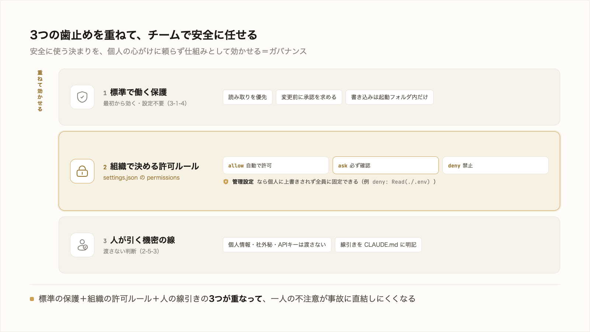

# 4-3-2 ガバナンス

!!! note "前提知識"
    このセクションは 4-3-1「品質とコストの最適化」と 2-5-3「セキュリティ」、3-1-4「権限と Plan モードで自律度を選ぶ」の内容を前提としています。

<video controls preload="metadata" playsinline width="100%">
  <source src="https://github.com/coachtech-material/pj_X/releases/download/videos/4-3-2.mp4" type="video/mp4">
</video>

## このセクションで学ぶこと

- 権限ルールや管理設定で、組織の標準を全員に効かせられること
- 機密を AI に渡さない判断（2-5-3）を、個人の心がけでなく仕組みに織り込むこと
- Claude Code の組み込み保護（3-1-4）を前提に、チームで安全に運用すること

個人の道具を、組織で安全に使い続けるための観点を押さえます。

!!! note "補足"
    本文の設定キーやファイル名は 2026年6月時点のものです。権限の操作は 3-1-4、機密の線引きは 2-5-3 で学びました。ここでは、それらをチーム運用の観点でまとめます。

---

## 導入: 一人で使うのとチームで使うのは違う

自分一人で使うなら、機密の線引きも権限の選択も、自分の判断でこと足ります。チームや組織で使うとなると、話が変わります。全員が同じ判断をできるとは限らず、AI 活用に不慣れな人もいます。個人の心がけに頼ると、誰か一人の不注意で、機密が漏れたり危ない操作が通ったりします。

そこで、安全に使うための決まりを、個人任せにせず仕組みとして効かせます。これが **ガバナンス** です。Part3 までに学んだ権限・設定・機密の判断を、組織の運用に織り込む観点を押さえます。

## 組織標準を効かせる（管理設定・権限ルール）

組織として「ここまでは自動でよい、これは必ず確認、これは禁止」を決め、全員に効かせられます。使うのは、3-1-4 で触れた `settings.json` の権限ルールです。

- `permissions.allow`: 確認なしで許可する操作
- `permissions.ask`: 実行前に必ず確認させる操作
- `permissions.deny`: 禁止する操作（例: `Read(./.env)` で秘密情報ファイルの読み取りを禁じる、`Bash(curl *)` で外部への通信を止める）

これらを各自の設定に委ねず、組織で統一したいときは、**管理設定（managed settings）** を使います。管理設定は、管理者が決めた設定を全員に上から被せる仕組みで、個人の設定では上書きできません（最優先で効きます）。たとえば「全社で `.env` の読み取りは禁止」を管理設定に書けば、誰の環境でもそのルールが外せません。公式ドキュメントも、組織標準の実施に管理設定を使うことを勧めています（[Anthropic「セキュリティ」](https://code.claude.com/docs/ja/security)、2026年6月時点）。

!!! note "補足"
    管理設定のファイルは OS ごとに決まった場所（macOS なら `/Library/Application Support/ClaudeCode/managed-settings.json` など）に置きます。導入は情報システム部門などの管理者が行う領域です。本研修では「組織標準を、個人に上書きされない形で全員に効かせられる」という考え方を押さえれば十分です（具体のパス・手順は変わりうるため、導入時に最新の公式情報で確認してください）。

## 機密を渡さない判断を仕組みに織り込む

2-5-3 で、AI に渡してよいもの・いけないもの（顧客の個人情報、社外秘、APIキー等）の線引きを学びました。これを、個人が毎回判断するだけに頼らず、仕組みでも支えます。

- **CLAUDE.md に方針を書く**: 「顧客の個人情報は伏せ字にしてから渡す」「契約金額は扱わない」など、自社の線引きを CLAUDE.md に明記し、全員の前提にする
- **権限ルールで止める**: 秘密情報を含むファイル（`.env` など）の読み取りを `permissions.deny` で禁じ、誤って渡すこと自体を防ぐ
- **コミット前に確認する**: 秘密情報をうっかり共有しないための `.gitignore` などの扱いは Part5 で学びます

人の判断（2-5-3）と、仕組みによる歯止め（権限・方針）を重ねると、一人の不注意が事故に直結しにくくなります。

## 組み込み保護を前提に運用する

3-1-4 で、Claude Code の組み込み保護を学びました。既定で読み取りを優先し、変更前に承認を求め、保護されたパス（`.git` など）は自動承認しない。書き込みも、起動したフォルダとその中だけに限られ、外は読み取りだけになります（2026年6月時点）。

チームで運用するときは、この組み込み保護を土台として前提に置きます。そのうえで、全員に外させたくない確認は `permissions.ask` で、禁止は `permissions.deny` と管理設定で固定する。既定の安全網（組み込み保護）＋ 組織で足す歯止め（権限ルール）＋ 人の線引き（機密の判断）の3つが重なって、チームで安心して任せられる状態になります。

---

## まとめ

- ガバナンスは、安全に使うための決まりを個人任せにせず仕組みで効かせること。チーム・組織で使うほど重要になる
- 権限ルール（`permissions.allow`／`ask`／`deny`）で「自動でよい・必ず確認・禁止」を決め、管理設定（managed settings）で組織標準を個人に上書きされない形で全員に効かせる
- 機密を渡さない判断（2-5-3）は、CLAUDE.md の方針と権限ルールの歯止めを重ねて仕組みに織り込む
- 既定の組み込み保護（3-1-4）を土台に、権限ルールと人の線引きを重ねて、チームで安全に運用する

---

これで Chapter 4-3 は終わりです。作った仕組みを使い続けるための品質とコストの最適化（4-3-1）、組織で安全に運用するガバナンス（本セクション）を押さえました。Part4 では、Part3 の機能をハーネスとして束ねて仕組み化し（4-1）、大きい仕事を仕様駆動で固め（4-2）、それを安心して使い続ける運用（4-3）まで、応用の一通りを扱いました。

次の Chapter 4-4 では、ここまでの応用をハンズオンで統合します。最初に丸投げして物足りず、Part3 で前提・目次・文体を整えて書き始めた本を、仕様駆動（requirements・design・tasks）で設計し直し、調査・レビューのサブエージェントや設定まで組んだ自前のハーネスで、検証ゲートを通しながら残りの章まで書き切ります。研修前半からの伏線を、ここで回収します。
