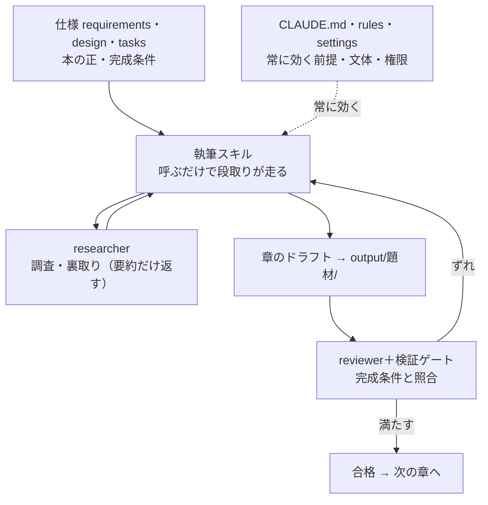

# 4-4-4 検証ゲートで残りの章を書き切る

!!! note "前提知識"
    このセクションは 4-4-3「settings とガバナンスを整える」と 4-1-3「資産化して属人化を解消する」の内容を前提としています。

!!! note "このハンズオンで使う機能"
    検証ゲート（Part3 で学習）と、ここまでに組んだハーネスの全部（仕様＝requirements・design・tasks、CLAUDE.md、rules、執筆スキル、サブエージェント、settings）を総動員します。

## このセクションで学ぶこと

- `tasks.md` の残りの章を、検証ゲートで完成条件と照らしながら量産する
- ゼロ指示（スキルを呼ぶだけ）で次の章が書ける再現性を確かめる
- やり方が `.claude/` に資産化され、属人化が解ける手応えを得る
- 本を1冊書き切る

組んできた仕組みを回して、本を完成させます。

---

## 導入: 仕組みができたら、あとは回すだけ

Part3 では、スキルを呼べば章は書けましたが、それはその場で作った段取りを呼んでいるだけで、本全体を貫く仕様を「正」として持っていませんでした。いまは違います。仕様（requirements・design・tasks）が正としてあり、前提・文体（CLAUDE.md・rules）も、調査役・レビュー役（サブエージェント）も、量産用の設定（settings）もそろっています。

残りは、`tasks.md` の章を1つずつ、同じ回し方で書き切るだけです。各章は、スキルを呼び、調査役が裏を取り、書けたらレビュー役と検証ゲートで完成条件と照らし、ずれたら直す。これを完成条件に合格するまで繰り返し、次の章へ進みます。

---

## 書き切る前の確認

- [ ] `docs/<題材>/tasks.md` に残りの章のタスクがあり、`requirements.md` に各章の完成条件がある
- [ ] 執筆スキル・調査役/レビュー役のサブエージェント・`settings.json` がそろっている
- [ ] `my-book` フォルダで `claude` を起動できる

---

## 実践: tasks.md の残りの章を書き切る

### Step 1: スキル呼び出しで次の章を書く

`tasks.md` から次の章を選び、執筆スキルを呼びます。手順を毎回説明しなくても、スキルが狙い指示 → 調査・裏取り → 仕上げの段取りで動きます。これがゼロ指示（やり方の説明を繰り返さない）です。

```text
/（執筆スキル名） tasks.md の次の章（第2章）
```

調査が要る箇所は調査役のサブエージェントが裏を取り、要約だけを返します。本文の文脈は膨らみません。

### Step 2: 完成条件で検証ゲート → 軌道修正

書けた章を、`requirements.md` のその章の完成条件と照らします（`tasks.md` の検証タスクが、この照合を指しています）。レビュー役のサブエージェントに指摘させ、満たせていない点があれば、期待と実際のズレを具体的に伝えて直させます。合格するまで、小さく区切って直します。これが章ごとの検証ゲートです。

```text
書けた第2章を reviewer で requirements.md の完成条件と照らして、満たせていない点を指摘して。
```

### Step 3: 残りの章を同じ回し方で量産・完遂する

Step 1 と Step 2 を、`tasks.md` の章ぶん繰り返します。各章は「スキルで書く → 検証ゲートで合格させる → 次へ」の同じリズムで進みます。すべての章が完成条件に合格したら、本が1冊そろいます。`output/<題材>/` に章がたまっていくのを確認してください。

### Step 4: 2冊目の入り口を確かめる

仕組みは1冊で終わりません。2冊目を書くときは、新しい題材の `docs/<題材B>/`（要件・設計・タスク）と `output/<題材B>/`（本文）を足すだけで、`.claude/` のハーネス（rules・スキル・サブエージェント・settings）はそのまま再利用できます。やり方が個人の頭ではなくプロジェクトに資産化され、誰が引き継いでも同じ仕組みで書ける、という手応えを確かめてください（Part4 で学んだ資産化・属人化の解消）。

!!! tip "発展: 仕様づくりもスキルにする"
    2冊目の `docs/<題材B>/`（要件・設計・タスク）は、この章のはじめと同じ手順で作ります。じつは、この「要件 → 設計 → タスクに落とす」流れ自体も、執筆をスキルにしたのと同じ要領でスキルにできます。題材を渡すと requirements・design・tasks の下書きまで一気に整う自分専用のスキルを作れないか、工夫してみてください。仕様づくりから量産まで丸ごと再現可能になります（この「仕様を自動で生成する」発想は、Part6 で国産ツール cc-sdd が実際に担います）。

---

## 完成チェックリスト

- [ ] `output/<題材>/` に、残りの章までそろっている（本が1冊できた）
- [ ] 各章が `requirements.md` の完成条件を満たしている
- [ ] スキルを呼ぶだけ（ゼロ指示）で次の章が書けた
- [ ] 2冊目は `docs/<題材B>/`＋`output/<題材B>/` を足せば、同じ `.claude/` で書けると確認できた

---

## おさらい: 本を生むハーネスの全体像

この章で、Part3 までに知った機能を、本を1冊書くための一つの仕組み（ハーネス）として組み上げました。各部品の役割と置き場所を整理します。

| 部品 | 役割 | 置き場所 |
|---|---|---|
| 仕様（requirements・design・tasks） | 本の「正」。主張・読者・完成条件と、章立て・順序 | `docs/<題材>/` |
| CLAUDE.md・rules | 常に効く前提・文体・禁則 | ルート・`.claude/rules/` |
| 執筆スキル | 章を書く段取り（呼ぶだけで走る） | `.claude/skills/` |
| サブエージェント（researcher・reviewer） | 調査・裏取りと、完成条件との照合を別文脈で分担 | `.claude/agents/` |
| settings.json | 量産用の権限（acceptEdits）・機密の `deny`・コストの選び分け | `.claude/settings.json` |
| 検証ゲート | 完成条件と照らし、合格まで小さく直す回し方 | 運用の習慣 |

章を1つ書くとき、これらは次のように連携します。



部品が組み合わさることで、章を1つ書くたびに同じ手順・同じ品質が再現され、本が1冊仕上がります。やり方は個人の頭ではなく `.claude/` に残るので、誰が引き継いでも同じ仕組みで書けます。

---

## まとめ

- 仕様・前提・文体・サブエージェント・設定がそろえば、残りの章は「スキルで書く → 検証ゲートで合格 → 次へ」の同じリズムで書き切れる
- ゼロ指示で次の章が書ける。やり方は `.claude/` に資産化され、属人化が解ける
- 2冊目は題材フォルダを足すだけ。同じハーネスを使い回せる

---

この Chapter では、Part3 で素朴に育てた本のプロジェクトを、仕様駆動とハーネスで本格化し、検証ゲートで残りの章まで書き切りました。最初に丸投げして物足りなかった本が、前提・目次・文体・仕様・スキル・サブエージェント・設定という仕組みの上で、破綻なく1冊に仕上がりました。研修前半からの伏線がここで回収されています。

Part4 全体では、Part3 の機能をハーネスとして束ね、仕様駆動で大きな仕事を固め、品質・コスト・ガバナンスを整える、応用の一通りを身につけました。ここまでの成果物（本と、それを生む仕組み）は、まだ自分の手元にあるだけです。次の Part5 では、これを Git でバージョン管理し、GitHub で共有して、書き上げた本を公開するところまで進めます。
