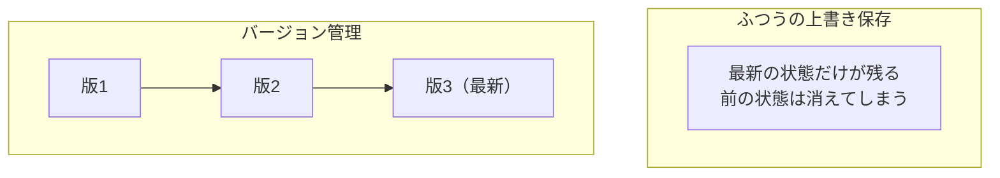

# 5-1-1 バージョン管理と Git

この Chapter では、手元（自分のパソコンの中）で変更の履歴を管理する Git を扱います。まず Git の考え方を押さえて手元で使える状態を作り、続いて記録の単位（リポジトリ・コミット・履歴）と、変更を枝分かれさせて試すブランチとマージを学びます。

| セクション | テーマ | 種類 |
|---|---|---|
| 5-1-1 | バージョン管理と Git | 混合 |
| 5-1-2 | リポジトリ・コミット・履歴 | 概念 |
| 5-1-3 | ブランチとマージ | 概念 |

**この Chapter の進め方**: 5-1-1 でバージョン管理と Git の考え方を学び、手元に Git を用意します。5-1-2 で変更を記録する単位（リポジトリ・コミット・履歴）、5-1-3 で変更を試す枝分かれ（ブランチとマージ）を押さえます。手を動かすのは 5-1-1 の Git のセットアップで、記録や共有を実際に GitHub 上で行うのは次の Chapter 5-2 です。Git の操作の多くは Claude Code が代行してくれるので、ここでは「何が起きているか」を読み解けることを目指します。

!!! note "前提知識"
    このセクションは 4-4-4「検証ゲートで残りの章を書き切る」の内容を前提としています。

## このセクションで学ぶこと

- バージョン管理とは何か（変更の履歴を残し、過去に戻れて、安全に試せる仕組み）
- Git とは何か（バージョン管理の事実上の標準ツール）
- 自分の OS に合わせて Git を手元に用意し、初回の設定（名前・メールアドレス）を済ませる手順

バージョン管理と Git の考え方を押さえ、自分のパソコンで Git が動く状態を作ります。

---

## 導入: 上書き保存では、変更の歴史が残らない

Part4 までで、AI に委任して成果物を作り込む流れを一通り身につけました。ただ、できあがったものは、いまはパソコンの中に置いてあるだけです。

ふだんファイルを上書き保存していくと、前の状態は消えていきます。「先週の状態に戻したい」「どこを、なぜ変えたのか思い出せない」「他の人に渡して一緒に直したい」。こうした場面で、ふだんの保存だけでは立ち行かなくなります。変更の一つひとつを履歴として残し、いつでも過去に戻れて、安心して変更を試せる仕組みが必要です。それがバージョン管理であり、それを担うのが Git です。

!!! quote "現場での考え方"
    自分が Git を使う前は、大事なファイルを「企画書_v2」「企画書_最終」「企画書_最終_修正版」のようにコピーして版を分けていました。ところが数日経つと、どれが本当に最新なのか分からなくなり、古い版をうっかり上書きして書き直したこともあります。Git を使い始めてからは、こうしたコピーをやめました。変更の履歴はすべて Git が覚えていてくれるので、ファイルは1つに保てます。

---

## バージョン管理とは

バージョン管理とは、ファイルへの変更を一つひとつ履歴として記録し、いつでも過去の状態に戻せて、変更を安全に試せるようにする仕組みです。先ほどの「ファイルをコピーして版を分ける」素朴なやり方は、これを手作業でやろうとして破綻したものだと言えます。バージョン管理を使えば、ファイルは1つのまま、その変遷だけが履歴として積み重なります。あとから「いつ・何を・なぜ変えたか」をたどれ、必要なら過去の状態に戻せます。



上書き保存では最新の1点しか残りませんが、バージョン管理では変更のたびに版が積み重なり、どの版にも戻れます。

この「過去に戻す」は、3-1-5 で扱ったチェックポイント（`/rewind`）と似ています。ただし両者は役割が違います。3-1-5 では、チェックポイントを手元の素早い取り消し、Git を永続的な記録と位置づけ、Git を Part5 で扱うと予告しました。チェックポイントは作業中のセッションの中だけで効く一時的な立て直しで、「いつ・何を・なぜ変えたか」を意味のあるまとまりで永続的に残したり、他の人と共有したりする用途には向きません。その永続的な記録と共有を担うのがバージョン管理であり、ここからが本題です。

## Git とは

Git は、バージョン管理を担う事実上の標準ツールです。GitHub 公式ドキュメント（[Git について](https://docs.github.com/ja/get-started/using-git/about-git)）は、Git を「ファイルの変更をインテリジェントに追跡するバージョンコントロールシステム」と説明しています。世界中のソフトウェア開発で広く使われており、AI が書いたコードや、あなたが Claude Code に作らせた成果物を管理するのにもそのまま使えます。

Git の特徴は、変更の履歴のすべてを自分のパソコンの中（手元）に持つことです。そのため、インターネットにつながっていなくても、手元で記録を積み重ねられます。この手元の記録を、あとでインターネット上に共有・公開するために使うのが、次の Chapter 5-2 で扱う GitHub です。

!!! info "ポイント"
    **Git** と **GitHub** は別物です。Git は手元（自分のパソコン）で動くバージョン管理ツール、GitHub はその Git の記録をインターネット上に置いて共有・公開できるサービスです。Part5 は、まず 5-1 で手元の Git を押さえ、5-2 でそれを GitHub につなぎます。

Git の実際の操作（記録する、過去に戻す、履歴を見るなど）は、Claude Code に「変更を記録して」「さっきの変更を取り消して」のように頼んで代行させられます。人がコマンドを一つひとつ覚える必要はなく、何が起きているかを読み解ければ十分です。ただし、Git そのものを手元に用意し、最初の設定を済ませることだけは、これから自分の手で行います。

---

## 実践: 手元で Git を使えるようにする

ここから手を動かします。Git が自分のパソコンで動く状態を作ります。多くのパソコンには Git が最初から入っているので、まず入っているかを確認し、入っていなければ導入します。最後に、記録に残る名前とメールアドレスを設定します。

### Step 1: ターミナルを開く

ターミナルの開き方は 1-2-1 と同じです。お使いの OS に合わせて開きます。

=== "macOS"
    `command`（⌘）キーを押しながらスペースキーを押し、表示された検索ボックスに `terminal` と入力して `return`（Enter）キーを押します。ターミナルのウィンドウが開きます。

=== "Windows"
    `Windows`（⊞）キーを押しながら `X` キーを押し、表示されたメニューから「ターミナル」または「Windows PowerShell」をクリックします。`PS` で始まる行が表示されるウィンドウが開きます。

### Step 2: Git が入っているか確認する

ターミナルに次のコマンドを打って、Enter キーを押します。

```bash
git --version
```

`git version 2.x.x`（数字は環境によって変わります。2026年6月時点では 2.50 前後）のようにバージョン番号が表示されれば、Git は導入済みです。この場合は Step 3 を飛ばして、Step 4 に進んでください。

OS によって、まだ入っていないときの反応が異なります。

- **macOS**: Git が未導入だと、開発ツール（Command Line Tools）の導入をうながすダイアログが表示されることがあります。その場合は次の Step 3 に従ってください。
- **Windows**: Git が未導入だと、`'git' は…認識されません` のような意味のメッセージが表示されます。この場合も Step 3 に進みます。

### Step 3: Git を導入する（入っていなかった場合）

すでにバージョン番号が表示された人は、この Step は不要です。

=== "macOS"
    Step 2 で開発ツールの導入をうながすダイアログが出た場合は、そのまま画面の案内に従ってインストールします（Command Line Tools が入り、その中に Git が含まれます）。ダイアログが出ない場合は、ターミナルで次のコマンドを実行すると、同じ開発ツール（Command Line Tools）を導入できます（2026年6月時点）。

    ```bash
    xcode-select --install
    ```

=== "Windows"
    Windows には Git が標準で同梱されないため、ここで導入します。PowerShell で次のコマンドを実行するのが簡単です（`winget` は Windows 10／11 に標準で備わっています。2026年6月時点）。

    ```powershell
    winget install --id Git.Git -e --source winget
    ```

    コマンドを使わず画面で入れたい場合は、Git 公式サイト（git-scm.com）の Windows 向けインストールページを開き、表示される「Click here to download」をクリックしてインストーラを入手して実行します（選択肢は既定のまま「Next」で進めて構いません）。

導入が終わったら、ターミナルをいったん閉じて開き直し、もう一度 `git --version` を実行して、バージョン番号が表示されることを確認します。

### Step 4: 名前とメールアドレスを設定する

最後に、変更を記録するときに「誰が変更したか」として残る、名前とメールアドレスを設定します。初回に一度だけ行えば、以降はずっと使われます。次の2つのコマンドを、自分の情報に置き換えて実行します。

```bash
git config --global user.name "Mona Lisa"
git config --global user.email "mona@example.com"
```

`Mona Lisa` は自分の名前（ローマ字でも構いません）に、メールアドレスは自分のものに置き換えます。`--global` は「このパソコンのすべての記録で共通して使う」という指定です。設定できたかは、次のコマンドで確認できます。

```bash
git config --global user.name
```

設定した名前がそのまま表示されれば完了です（GitHub 公式ドキュメントの[Git のセットアップ](https://docs.github.com/ja/get-started/getting-started-with-git/set-up-git)も同じ手順を案内しています）。

!!! tip "ヒント"
    次の Chapter 5-2 で GitHub を使うときは、ここで設定するメールアドレスを、GitHub に登録するメールアドレスにそろえておくと、記録があなたのアカウントと正しく結びつき、後の手順がスムーズです。まだ GitHub のアカウントが無くても、ふだん使うメールアドレスを入れておけば問題ありません。

---

## 完成チェックリスト

次の状態になっていれば、このセクションは完了です。

- [ ] ターミナルで `git --version` を実行すると、バージョン番号が表示される
- [ ] `git config --global user.name` を実行すると、設定した名前が表示される
- [ ] 名前とメールアドレスの両方を設定した

---

## まとめ

- バージョン管理は、変更を一つひとつ履歴として残し、過去に戻れて、安全に試せる仕組み。ファイルをコピーして版を分ける素朴なやり方の問題（どれが最新か・何を変えたか分からなくなる）を解決する
- Git はバージョン管理の事実上の標準ツールで、変更の履歴のすべてを手元に持つ。3-1-5 のチェックポイント（手元の素早い取り消し）に対し、Git は永続的な記録と共有を担う
- Git（手元の版管理ツール）と GitHub（その記録をネット上で共有・公開するサービス）は別物。Part5 は 5-1 で Git、5-2 で GitHub を扱う
- 多くのパソコンに Git は入っている。`git --version` で確認し、無ければ OS ごとの方法で導入する。初回だけ `git config --global` で名前とメールアドレスを設定する
- Git の操作は Claude Code に代行させられるが、本体の導入と初期設定は自分で行う

---

次のセクションでは、Git で変更を記録する単位を見ていきます。成果物一式を管理するリポジトリ、変更を意味のあるまとまりで記録するコミット、それが積み重なってできる履歴を押さえ、変更内容を差分で確認できること、永続的な履歴だからこそ過去のコミットの状態に戻したり「さっきの変更を取り消して」と Claude Code に頼めたりすることを理解します。
