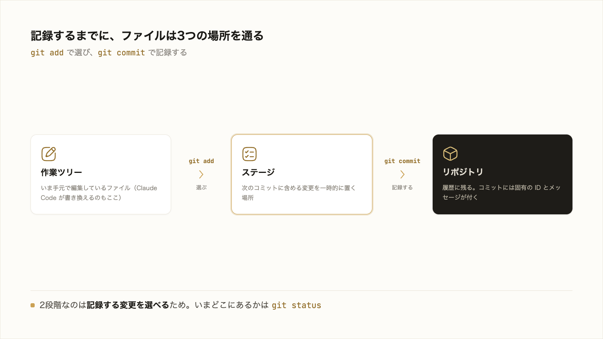
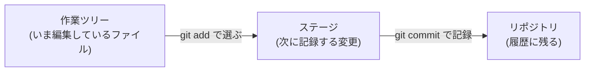
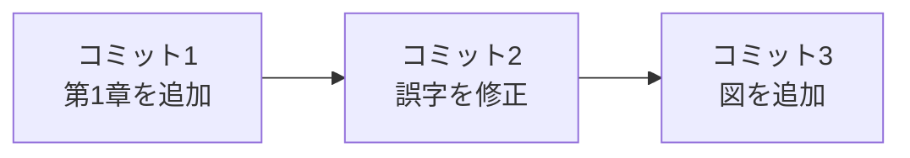

# 5-1-2 リポジトリ・コミット・履歴

!!! note "前提知識"
    このセクションは 5-1-1「バージョン管理と Git」の内容を前提としています。

<video controls preload="metadata" playsinline width="100%">
  <source src="https://github.com/coachtech-material/pj_X/releases/download/videos/5-1-2.mp4" type="video/mp4">
</video>

## このセクションで学ぶこと

- リポジトリとは何か（成果物一式をまとめて管理する単位）
- 変更を記録する2段階（`git add` で選び、`git commit` で記録する）と、その途中の「3つの場所」
- 状態を確認する `git status`、履歴を見る `git log`、変更を見る差分（diff）

Git が変更をどう記録するのか、その単位（リポジトリとコミット）と、記録までの流れ、積み重なる履歴を押さえます。

!!! note "補足"
    本文に出てくる `git` コマンドは、仕組みを理解するための例です。実務では多くを Claude Code が代行します。ただし、このセクションは末尾に「やってみよう」を置きました。一度だけ自分の手で打って、画面の変化を見ると、`add` と `commit` の意味が腹に落ちます。

---

## 導入: 「保存」と「記録」は違う

ふだんの「上書き保存」は、最新の状態を1つだけ手元に残す操作です。保存するたびに前の状態は上書きされ、消えていきます。

Git の「記録」は、これとは別の考え方です。ある時点の状態に名前（メッセージ）を付けて、履歴として積み重ねていきます。最新の状態を1つ持つのではなく、節目ごとのスナップショット（その時点の写し）が順番に残ります。だから後から「先週のあの状態」に戻れますし、「いつ・何を・なぜ変えたか」をたどれます。この記録を支えるのが、リポジトリ・コミット・履歴という3つの言葉です。



---

## リポジトリ: 成果物一式をまとめて管理する

リポジトリは、Git で管理する成果物一式（フォルダと、その中のファイル群）をまとめた単位です。「このフォルダを Git で管理する」と宣言すると、そのフォルダがリポジトリになります。

ふつうのフォルダをリポジトリにするには、そのフォルダで `git init` という操作を行います。

```bash
# このフォルダを Git のリポジトリにする
git init
```

`git init` を行うと、フォルダの中に `.git` という隠しフォルダができます。ここに、これから記録する変更の履歴がすべて保存されます。あなたが直接触ることはほとんどありませんが、「リポジトリの実体はこの `.git` の中にある」とだけ知っておけば十分です。1つの成果物（たとえばこれまで作ってきた制作物のフォルダ）を、1つのリポジトリとして管理するのが基本です。

## ステージングとコミット: 記録する変更を選んで記録する

ここが Git のいちばんの肝です。Git では、変更を記録するまでにファイルが**3つの場所**を通ります。



- **作業ツリー**: いま手元で編集しているファイルそのもの。Claude Code が書き換えるのもここです。
- **ステージ**: 「次のコミットに含める変更」を一時的に置く場所。`git add` で、作業ツリーの変更のうち記録したいものをここへ載せます。
- **リポジトリ**: `git commit` で、ステージに載せた変更を履歴として正式に記録する場所。

つまり、変更を記録する操作は、`git add`（選ぶ）と `git commit`（記録する）の2段階に分かれています。

```bash
# 1. 記録したい変更をステージに載せる（選ぶ）
git add （ファイル名）

# 2. ステージの内容を、メッセージを付けて記録する
git commit -m "第1章の導入を追加"
```

2段階に分かれているのは、**記録する変更を選べるようにするため**です。写真にたとえると、`git add` は撮りたいものをファインダーに収める操作、`git commit` はシャッターを切ってその瞬間を1枚に残す操作です。ファインダーに入れたもの（add した変更）だけが写真（コミット）に写ります。これにより、たくさん変更した中から「今回記録したいぶんだけ」を選び、意味のまとまりごとに記録できます。

`git commit` には、変更の内容を簡潔に説明する**コミットメッセージ**を必ず添えます。「第1章の導入を追加」「誤字を修正」のように、後から見て何をしたか分かる一文です。記録されると、Git はそのコミットに固有の番号（ID）を割り当て、「いつ・誰が・何を変えたか」をひとまとめにして残します。誰がの部分には、5-1-1 で設定した名前とメールアドレスが使われます。

いま自分がどの状態にいるか（どのファイルが作業ツリーにあり、どれをステージに載せたか）は、`git status` で確認できます。

```bash
# 今どのファイルがどの場所にあるかを確認する
git status
```

!!! tip "ヒント"
    実務では、この `add`・`commit`・`status` の操作は Claude Code に「いまの変更を『○○』というメッセージで記録して」と頼めば代行してくれます。Claude Code はコミットメッセージのたたき台も提案するので、人は中身と合っているかを確認すればよいだけです。仕組みを知っておくと、Claude Code が「何をしているか」を読み解け、差分を確認するときにも役立ちます。

## 履歴と差分: いつ・何を・なぜ変えたか

コミットが時系列で積み重なったものが**履歴**です。コミットは消えずに残り、新しいコミットがその上に積まれていきます。



`git log` で、これまでのコミットの一覧（いつ・誰が・どんなメッセージで記録したか）を見られます。

```bash
# これまでのコミットの履歴を見る
git log
```

それぞれのコミットで「具体的に何がどう変わったか」を見たいときは、**差分（diff）** で確認します。差分は、変更の前と後を見比べて、増えた行・減った行・書き換わった行を示す表示です。3-1-2 で、Claude Code がファイルを編集したときに差分で変更内容を確かめました。Git の履歴でも、同じ見方で過去の変更をたどれます。

履歴があることで、変更は「上書きして消えるもの」ではなく「積み重なって残るもの」になります。これが、ふだんの保存との一番の違いです。

## 過去に戻る・取り消す

永続的な履歴が残っているということは、いつでも過去のコミットの状態に戻れるということです。「2つ前の状態に戻したい」「さっき加えた変更をなかったことにしたい」というとき、その時点のコミットを起点に元の状態を取り戻せます。

この操作も、Claude Code に自然な言葉で頼めます。

```text
さっきの変更を取り消して、1つ前のコミットの状態に戻して
```

3-1-5 のチェックポイント（`/rewind`）と似ていますが、戻れる範囲が違います。チェックポイントは作業中のセッションの中だけで効く一時的な取り消しでした。コミットは永続的な記録なので、パソコンを再起動しても、何日経っても、その状態に戻れます。意味のある節目でこまめにコミットしておくほど、戻れる地点が増え、安心して変更を試せます。

---

## やってみよう: 手元で Git の流れを試す

「作業ツリー → ステージ → リポジトリ」の流れを、実際に自分の手で動かして確かめます。実務では Claude Code が代行しますが、一度自分で打つと、`add` と `commit` の意味が腹に落ちます。練習用の小さなフォルダで試すので、これまでの成果物には触れません。

**1. ターミナルを開き、練習用フォルダを作って移動する**

ターミナルを開きます（開き方は 5-1-1 と同じ。macOS は ⌘+スペースで `terminal`、Windows は ⊞+X で「ターミナル」）。次のコマンドで練習用フォルダを作り、その中に移動します。

```bash
mkdir git-practice
cd git-practice
```

**2. リポジトリにする**

```bash
git init
```

`Initialized empty Git repository ...` のような表示が出れば、このフォルダが Git の管理下に入りました。

**3. まだ何もない状態を確認する**

```bash
git status
```

`No commits yet`（まだコミットがない）、`nothing to commit`（記録するものがない）といった表示が出ます。

**4. ファイルを作って、状態の変化を見る**

メモを1つ作って、もう一度状態を見ます。

```bash
echo "最初のメモ" > memo.txt
git status
```

今度は `memo.txt` が `Untracked files`（まだ追跡していないファイル）として表示されます。作業ツリーに新しいファイルがある状態です。

**5. ステージに載せて、状態の変化を見る**

```bash
git add memo.txt
git status
```

`memo.txt` が `Changes to be committed`（次に記録する変更）に変わります。ステージに載った状態です。`add` で「場所が変わった」のが画面で分かります。

**6. コミットして、履歴を見る**

```bash
git commit -m "最初のメモを追加"
git log
```

`git log` に、いま記録したコミット（メッセージ・日時・あなたの名前）が1件表示されれば成功です。

!!! success "確認"
    `git status` の表示が「Untracked（作業ツリー）→ Changes to be committed（ステージ）」と変わるのを目で見られたこと、`git commit` のあと `git log` に1件残ったことを確認できれば成功です。「`add` で選び、`commit` で記録する」2段階が、画面の変化として腹に落ちたはずです。練習用フォルダ `git-practice` は、不要なら削除してかまいません（これまでの成果物を GitHub に上げる手順は 5-2-3 で扱います）。

---

## まとめ

- リポジトリは、Git で管理する成果物一式（フォルダとファイル群）の単位。`git init` でフォルダをリポジトリにすると、履歴が `.git` に保存される
- 変更は「作業ツリー → ステージ → リポジトリ」の3つの場所を通って記録される。`git add` で記録したい変更をステージに選び、`git commit` でメッセージを付けて記録する。2段階なのは記録する変更を選べるようにするため
- `git status` で今どのファイルがどの場所にあるかを確認できる
- コミットが積み重なって履歴になる。`git log` で一覧を、差分（diff）で各変更の中身を見られる（差分の見方は 3-1-2 と同じ）
- 永続的な履歴があるので過去のコミットの状態に戻せる。これらの操作は実務では Claude Code が代行する

---

次のセクションでは、変更を試すための枝分かれを扱います。本体に影響を与えずに変更を試すブランチと、その変更を本体に取り込むマージを押さえ、ブランチを切って作業しレビューを経て統合するという、次の Chapter で扱うプルリクエストのもとになる流れを理解します。
