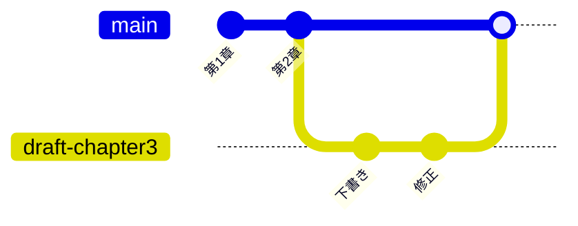

# 5-1-3 ブランチとマージ

!!! note "前提知識"
    このセクションは 5-1-2「リポジトリ・コミット・履歴」の内容を前提としています。

## このセクションで学ぶこと

- ブランチとは何か（本体に影響を与えずに変更を試す枝）
- マージとは何か（試した変更を本体に取り込むこと）
- ブランチを切って作業し、統合するという流れ（次の Chapter で扱うプルリクエストの土台）

完成した状態を保ったまま新しい変更を試すための枝分かれと、その合流を押さえます。

!!! note "補足"
    このセクションに出てくる `git` コマンドは、仕組みを理解するための例です。読みながら打つ必要はありません。ブランチとマージを実際に使うのは、次の Chapter の GitHub 上での作業（5-2-4・5-2-6）と Part6 の開発です（操作の多くは Claude Code が代行します）。

---

## 導入: 完成した状態を保ったまま、変更を試したい

ひとまず仕上がった成果物に、さらに手を加えたい場面があります。新しい部分を書き足したい、大きく作り直してみたい。でも、もし試した変更がうまくいかなかったら、せっかく仕上がった状態を壊したくありません。

「完成した状態はそのまま安全に残し、変更は別の場所で試す。うまくいったら本体に取り込み、だめなら捨てる」。これを実現するのがブランチとマージです。

---

## ブランチ: 本体に影響しない作業の枝

ブランチは、本体に影響を与えずに変更を試すための、独立した作業の枝です。GitHub 公式ドキュメント（[ブランチについて](https://docs.github.com/ja/pull-requests/collaborating-with-pull-requests/proposing-changes-to-your-work-with-pull-requests/about-branches)）は、ブランチを「開発作業を他のブランチに影響することなく分離する」ものと説明しています。

リポジトリを作って最初にコミットすると、変更は **main** という名前の既定のブランチに記録されます。これが本体です。ここから枝を伸ばすように新しいブランチを作ると、そのブランチでの変更は main には影響しません。枝の上で自由にコミットを重ね、うまくいかなければその枝ごと捨てられます。main はその間ずっと、仕上がった状態のまま安全に保たれます。



上の図では、main（本体）から `draft-chapter3` という作業ブランチを枝分かれさせ、その上でコミットを重ね、最後にマージで main に戻しています。枝の上で何をしても、マージするまで main は影響を受けません。

```bash
# 新しいブランチを作って、そこに移る（例）
git switch -c draft-chapter3
```

たとえば、仕上がった成果物に新しい部分を加えるとき、`draft-chapter3` のような作業用のブランチを作ってそこで書き進めれば、完成済みの main を触らずに試せます。Claude Code には「新しいブランチを作って、そこで第3章を書いて」のように頼めます。

!!! info "ポイント"
    ブランチを使うと、1つのリポジトリの中で「安定した本体（main）」と「試している途中の変更」を同時に持てます。AI に大きめの変更を任せるときも、作業ブランチの上でやらせれば、main が安全なので安心して試せます。

## マージ: 試した変更を本体に取り込む

ブランチで試した変更が良ければ、それを本体（main）に取り込みます。これが**マージ**です。マージすると、作業ブランチで重ねたコミットが main に合流し、本体が新しい状態に進みます。

```bash
# main に戻ってから、作業ブランチの変更を取り込む（例）
git switch main
git merge draft-chapter3
```

変更を取り込む先（ここでは main）を**ベースブランチ**、取り込む内容を持つ側（`draft-chapter3`）を**ヘッドブランチ**と呼びます。マージが終われば、役目を終えた作業ブランチは削除できます。うまくいかなかったブランチは、マージせずに捨てるだけです。main には何の影響も残りません。

同じ箇所を本体と作業ブランチの両方で別々に変更していると、マージのとき Git がどちらを採るべきか決められないことがあります。これを**コンフリクト**（衝突）と呼びます。起きても慌てる必要はなく、どこがぶつかったのかを Claude Code に伝えれば、どう解消するかを手伝ってくれます。コンフリクトは「2人が同じ行を別々に直した」ようなときに起こるものだと知っておけば、5-2-6 の協働で出くわしても落ち着いて対処できます。

## ブランチからプルリクエストへ

一人で作業するなら、ブランチを切って、よければ自分でマージする、という流れで完結します。

チームで進める場合は、もう一段はさみます。作業ブランチの変更をいきなり main に取り込むのではなく、「この変更を取り込んでよいか」を提案し、他の人に確認（レビュー）してもらってから統合します。この「提案してレビューしてもらう」仕組みが**プルリクエスト**です。プルリクエストは GitHub 上の機能で、次の Chapter で扱います。

ブランチを切って作業し、プルリクエストで提案・レビューを経て、マージで本体に取り込む。この流れは、Claude Code が出した変更を人が確認してから取り込む、という協働の形にもそのまま使えます（5-2-6）。ブランチとマージは、その基礎になる考え方です。

---

## まとめ

- ブランチは、本体（main）に影響を与えずに変更を試す独立した枝。リポジトリの最初のコミットは既定のブランチ main に記録される
- 作業ブランチの上で自由にコミットを重ね、うまくいかなければ枝ごと捨てられる。その間 main は仕上がった状態のまま安全に保たれる
- マージは、ブランチで試した変更を本体に取り込むこと。取り込む先がベースブランチ、取り込む内容を持つ側がヘッドブランチ
- ブランチを切って作業し、提案・レビューを経て統合する流れは、次の Chapter のプルリクエストのもとになる。これらの操作も Claude Code が代行する

---

この Chapter では、手元での版管理ツールである Git を扱いました。変更の履歴を残すバージョン管理の考え方から始め、成果物一式をまとめるリポジトリ、変更を記録するコミット、積み重なる履歴と差分、そして変更を試すブランチとマージまでを押さえ、手元に Git が動く状態を作りました。ただ、ここまではすべて自分のパソコンの中だけの話です。作ったものを失わないよう保全し、他の人と共有し、世に公開するには、もう一つの仕組みが要ります。次の Chapter では、手元の Git をインターネット上に載せるプラットフォームである GitHub とは何かを、Git との違い、手元のローカルリポジトリと GitHub 上のリモートリポジトリの関係、そして GitHub が提供する主要機能の全体像から押さえていきます。
